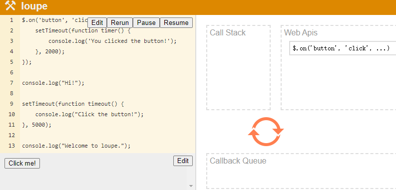

# JS社区 JS Community

- 海外的几个很大的技术大会: TSConf, JSConf, dotJS

## JSconf 
- 什么是 JSconf ?
    > JSConf 是一场以技术开发者为中心的非营利国际性技术大会，重点关注 JavaScript 方面的技术。大会举办的两天内，来自国内外的 JS 社区的著名开发者、业界意见领袖将分享他们的个人知识储备及历经的项目历程。无论资深或新入圈程序员，开发团队管理者还是首席科技官，这将是一场你不想错过的大会。
    - [jsconfchina.com](https://2019.jsconfchina.com/cn/)

## 往届视频
- [JSConf 视频大全 【YouTube】](https://www.youtube.com/channel/UCzoVCacndDCfGDf41P-z0iA)

- [What the heck is the event loop anyway? 到底什么是Event Loop呢？ | 【欧洲 JSConf 2014】 | 菲利普·罗伯茨 Philip Roberts](https://www.youtube.com/watch?time_continue=114&v=8aGhZQkoFbQ&feature=emb_logo)
    - JS 执行过程可视化
    - JavaScript可视化运行工具推荐
        - [JavaScript Visualizer 9000](https://www.jsv9000.app/)
            - 这个宏任务、微任务，自带例子，也可以自己编辑，不过超过5s的例子就不行
            
        - How does the js work ? JS是如何工作的？[latentflip.com](http://latentflip.com/loupe/?code=JC5vbignYnV0dG9uJywgJ2NsaWNrJywgZnVuY3Rpb24gb25DbGljaygpIHsKICAgIHNldFRpbWVvdXQoZnVuY3Rpb24gdGltZXIoKSB7CiAgICAgICAgY29uc29sZS5sb2coJ1lvdSBjbGlja2VkIHRoZSBidXR0b24hJyk7ICAgIAogICAgfSwgMjAwMCk7Cn0pOwoKY29uc29sZS5sb2coIkhpISIpOwoKc2V0VGltZW91dChmdW5jdGlvbiB0aW1lb3V0KCkgewogICAgY29uc29sZS5sb2coIkNsaWNrIHRoZSBidXR0b24hIik7Cn0sIDUwMDApOwoKY29uc29sZS5sb2coIldlbGNvbWUgdG8gbG91cGUuIik7!!!PGJ1dHRvbj5DbGljayBtZSE8L2J1dHRvbj4%3D)
            - 这个是Philip Roberts在JS大会上讲Event Loop时做演示的网站（大佬自己开发的，React还是0.12版本）
        
        - [JavaScript Visualizer](https://ui.dev/javascript-visualizer/)
            - Tyler Mcginnis大佬的Advanced JS课程配套的可视化工具，只能用ES5语法。

- ## 事件循环 Event Loop
    - [深入事件环(In The Loop)Jake Archibald 【JSconf 2018】 【BiliBili 中英字幕】](https://www.bilibili.com/video/BV1K4411D7Jb)

        - [通杀Event Loop 面试题! 【BiliBili 中文讲解 丰橙学院】](https://www.bilibili.com/video/BV1W4411Q7XA)
        - [通杀 Event Loop 面试题 【文档 PPT】](https://juejin.im/post/5d50d2e3e51d4561ea1a941f)
            - [线程和进程的区别是什么？](https://www.zhihu.com/question/25532384/answer/411179772)
                - **"进程是资源分配的最小单位，线程是CPU调度的最小单位"** 这样的回答感觉太抽象，都不太容易让人理解。
                - 做个简单的比喻：**进程=火车，线程=车厢**
                <br><br>
                - 线程在进程下行进（单纯的车厢无法运行）
                - 一个进程可以包含多个线程（一辆火车可以有多个车厢）
                - 不同进程间数据很难共享（一辆火车上的乘客很难换到另外一辆火车，比如站点换乘）
                - 同一进程下不同线程间数据很易共享（A车厢换到B车厢很容易）
                - 进程要比线程消耗更多的计算机资源（采用多列火车相比多个车厢更耗资源）
                - 进程间不会相互影响，一个线程挂掉将导致整个进程挂掉（一列火车不会影响到另外一列火车，但是如果一列火车上中间的一节车厢着火了，将影响到所有车厢）
                <br>
                ...
            - ### 单线程的含义
                - 浏览器是 multi-process
                - 一个浏览器只有一个 Browser Process，负责管理 Tabs、协调其他 process 和 Renderer process 存至 memory 内的 Bitmap 绘制到页面上的（pixel）
                - 在 Chrome中，一个 Tab 对应一个 Renderer Process, Renderer process 是 multi-thread
                - Renderer Process 里有一个叫 main thread (主进程)
                ```
                main thread
                |-  GUI render engine (负责页面渲染)
                |-  JS engine         (执行 JS)
                |-  event loop
                ```
                - 最后 还有一个 network component 可以开2~6个 I/O threads 平行去处理
            
