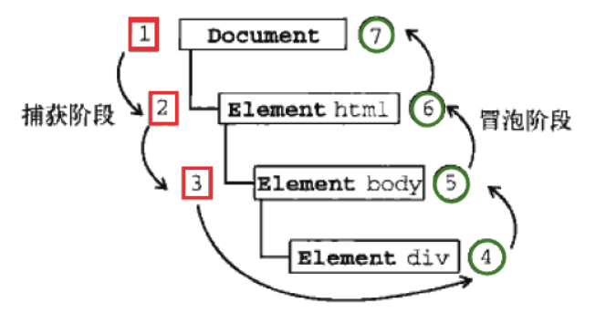
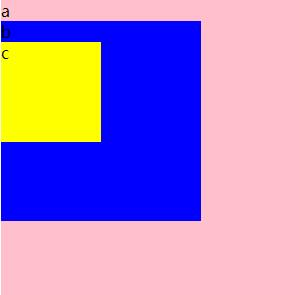
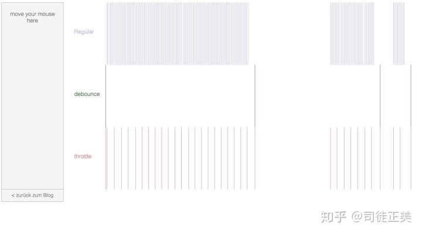

# 快速搞定前端初级 JavaScript 面试
- 慕课网 ( 双越 老师 )

<br><br>

# 高效学习三步曲
    - 1.找准知识体系
    - 2.刻意练习
    - 3.及时反馈

- 知识体系：结构化的知识范围
- 涵盖所有知识点；结构化、有组织、易扩展

> 要进一线互联网公司，js基础知识 一定要 一定要 扎实

----

- [JavaScript基础面试题受益匪浅（转）](https://zhuanlan.zhihu.com/p/79547341)
- [JS基础知识（覆盖JS基础面试题）](https://juejin.im/post/6844903625618096141)

----
目录
- [第01章 课程介绍【说说面试的那些事儿】](#第01章-课程介绍【说说面试的那些事儿】)
    - [1 课程介绍](#1-课程介绍)
    - [1-3 几个面试题](#1-3-几个面试题)
    - [1-5 知识体系](#1-5-知识体系)
    - [知识体系 细分](#-知识体系-细分)
- [第02章 JS基础-变量类型和计算【不会变量，别说你会JS】](#第02章-JS基础-变量类型和计算【不会变量，别说你会JS】)
    - [2-1 值类型 和 引用类型](#2-1-值类型-和-引用类型)
    - [2-2 typeof 和 深拷贝](#2-2-typeof-和-深拷贝)
        - [typeof 运算符](#typeof-运算符)
        - [null 是对象吗？](#null-是对象吗？)
        - [判断数据类型](#判断数据类型)
        - [NaN === NaN false?](#NaN-===-NaN-false?)
        - [深拷贝](#深拷贝)
    - [2-3 变量计算 - 隐式类型转换](#2-3-变量计算---隐式类型转换)
        - [字符串拼接](#字符串拼接)
        - [== 运算符](#==-运算符)
        - [truly 变量 和 falsely 变量](#truly-变量-和-falsely-变量)
        - [if 语句](#if-语句)
        - [逻辑运算](#逻辑运算)
- [第03章 JS基础-原型和原型链【三座大山之一，必考！！！】](#第03章-JS基础-原型和原型链【三座大山之一，必考！！！】)
    - [3-1 题目和知识点](#3-1-题目和知识点)
    - [3-2 class和继承](#3-2-class和继承)
        - [Class](#Class)
        - [继承](#继承)
    - [3-3 原型](#3-3-原型)
        - [原型指向](#原型指向)
    - [3-4 原型链 和 instanceof](#3-4-原型链-和-instanceof)
    - [3-5 问题解答和总](#3-5-问题解答和总)
- [第04章 JS基础-作用域和闭包【三座大山之二，不会闭包，基本不会通过】](#第04章-JS基础-作用域和闭包【三座大山之二，不会闭包，基本不会通过】)
    - [4-1 作用域和自由变量](#4-1-作用域和自由变量)
        - [创建 10 个 a 标签，点击的时候 弹出对应的序号](#创建-10-个-a-标签，点击的时候-弹出对应的序号)
        - [作用域](#作用域)
        - [自由变量](#自由变量)
    - [4-2 闭包 closure](#4-2-闭包-closure)
        - [什么是闭包？](#什么是闭包？)
        - [闭包 的 主要应用](#闭包-的-主要应用)
            - [1.隐藏数据](#1.隐藏数据)
            - [2.模块模式](#2.模块模式)
            - [3.for循环](#3.for循环)
            - [4.函数柯里化](#4.函数柯里化)
    - [4-3 this 指向问题](#4-3-this-指向问题)
    - [4-4 问题解答](#4-4-问题解答)
        - [手写 bind 函数](#手写-bind-函数)
        - [JavaScript 中 call()、apply()、bind() 的用法](#javascript-中-callapplybind-的用法)

- [第05章 JS基础-异步【三座大山之三，必考！！！】](#第05章-JS基础-异步【三座大山之三，必考！！！】)
    - [5-1 同步和异步的区别](#5-1-同步和异步的区别)
    - [5-2 应用场景](#5-2-应用场景)
    - [5-3 promise](#5-3-promise)
    - [5-4 问题解答和总结](#5-4-问题解答和总结)
    - [5-5 JS基本知识-总结](#5-5-JS基本知识-总结)
- [第06章 JS-Web-API-DOM【学会DOM，才能具备网页开发的基础】](#第06章-JS-Web-API-DOM【学会DOM，才能具备网页开发的基础】)
    - [6-1 从JS基础到JS-Web-API](#6-1-从JS基础到JS-Web-API)
    - [6-2 DOM的本质](#6-2-DOM的本质)
        - [HTML 是什么？](#HTML-是什么？)
        - [HTML 和 DOM 的区别](#HTML-和-DOM-的区别)
    - [6-3 DOM节点操作](#6-3-DOM节点操作)
        - [获取 DOM 节点](#获取-DOM-节点)
        - [attribute](#attribute)
        - [property](#property)
    - [6-4 DOM结构操作](#6-4-DOM结构操作)
        - [新增/插入节点](#新增/插入节点)
        - [获取子元素列表，获取父元素](#获取子元素列表，获取父元素)
        - [删除子元素](#删除子元素)
    - [6-5 DOM性能](#6-5-DOM性能)
        - [对 DOM 查询做缓存](#对-DOM-查询做缓存)
        - [将频繁 DOM操作 改为一次性操作 `document.createDocumentFragment()`](#将频繁-DOM操作-改为一次性操作)
    - [6-6 问题解答和小结](#6-6-问题解答和小结)

- [第07章 JS-Web-API-BOM【内容虽然不多，但是你不能不会】](#第07章-JS-Web-API-BOM【内容虽然不多，但是你不能不会】)
    - [navigator](#navigator)
    - [screen](#screen)
    - [location](#location)
    - [history](#history)
- [第08章 JS-Web-API-事件【事件不会，基本等于半残废，必考！必考！】](#第08章-JS-Web-API-事件【事件不会，基本等于半残废，必考！必考！】)
    - [通用事件监听函数 优化版](#通用事件监听函数-优化版)
    - [8-1 事件绑定和事件冒泡](#8-1-事件绑定和事件冒泡)
        - [事件绑定](#事件绑定)
        - [事件冒泡](#事件冒泡)
        - [DOM 事件流](#DOM-事件流)
    - [8-2 事件代理](#8-2-事件代理)
        - [事件代理 的优点](#事件代理-的优点)
    - [8-3 问题答疑和小结](#8-3-问题答疑和小结)
- [第09章 JS-Web-API-Ajax【每个工程师必须熟练掌握的技能】](#第09章-JS-Web-API-Ajax【每个工程师必须熟练掌握的技能】)
    - [9-1 XMLHttpRequest](#9-1-XMLHttpRequest)
        - [xhr.readyState](#xhrreadyState)
        - [xhr.status / HTTP状态码](#xhrstatus-/-HTTP状态码)
    - [9-2 同源策略和跨域](#9-2-同源策略和跨域)
    - [9-3 jsonp和cors](#9-3-jsonp和cors)
        - [JSONP 跨域](#JSONP-跨域)
        - [CORS](#CORS)
    - [9-4 问题解答](#9-4-问题解答)
        - [手写一个简易的 ajax](#手写一个简易的-ajax)
    - [9-6 ajax的常用插件](#9-6-ajax的常用插件)

- [第10章 JS-Web-API-存储【内容虽然不多，但不可不会】](#第10章-JS-Web-API-存储【内容虽然不多，但不可不会】)
    - [10-1 cookie](#10-1-cookie)
    - [10-2 html5存储](#10-2-html5存储)

- [第11章 开发环境【不会这些，你就会被认定是菜鸟小白，没做过项目】](#第11章-开发环境【不会这些，你就会被认定是菜鸟小白，没做过项目】)
    - [11-1 关于开发环境](#11-1-关于开发环境)
    - [11-2 git介绍](#11-2-git介绍)
    - [11-3 git命令介绍](#11-3-git命令介绍)
    - [11-4 git命令演示](#11-4-git命令演示)
    - [11-5 chrome调试工具](#11-5-chrome调试工具)
    - [11-6 抓包](#11-6-抓包)
    - [11-7 webpack-搭建环境](#11-7-webpack-搭建环境)
    - [11-8 webpack-babel](#11-8-webpack-babel)
    - [11-9 webpack-ES6-Module](#11-9-webpack-ES6-Module)
        - [1.单个导出](#1.单个导出)
        - [2.批量导出](#2.批量导出)
        - [3.默认导出`export default`](#3.默认导出`export-default`)
    - [11-10 webpack-配置生产环境](#11-10-webpack-配置生产环境)
    - [11-11 linux常用命令](#11-11-linux常用命令)
        -[常用命令](#常用命令)
        -[vim vi 命令](#vim-vi-命令)


- [第12章 运行环境【这些会了，你就可以飞了】](#第12章-运行环境【这些会了，你就可以飞了】)
    - [12-1 运行环境介绍](#12-1-运行环境介绍)
    - [12-2 页面加载和渲染过程](#12-2-页面加载和渲染过程)
    - [12-3 页面加载和渲染-示例](#12-3-页面加载和渲染-示例)
    - [12-4 页面加载和渲染-问题解答](#12-4-页面加载和渲染-问题解答)
    - [12-5 性能优化-原则和方向](#12-5-性能优化-原则和方向)
    - [12-6 性能优化-示例](#12-6-性能优化-示例)
        - [资源合并](#资源合并)
        - [缓存](#缓存)
        - [使用 CDN](#使用-CDN)
        - [SSR 服务端渲染](#SSR-服务端渲染)
        - [懒加载 LazyLoad](#懒加载-LazyLoad)
    - [12-7 性能优化： 防抖debounce 和 节流throttle](#12-7-防抖debounce-和-节流throttle)
        - [通用 debounce 防抖函数](#封装通用-debounce-防抖函数)
        - [通用 throttle 节流函数](#封装通用-throttle-节流函数)
    - [12-9 安全 XSS 跨站脚本攻击](#XSS-跨站脚本攻击)
        - [XSS攻 击的危害](#2.XSS攻-击的危害)
        - [如何 防御 XSS 攻击？](#3.如何-防御-XSS-攻击？)
    - [12-10 安全-XSRF/CSRF](#12-10-安全-xsrfcsrf)
        - [CSRF 的危害？](#2.CSRF-的危害？)
        - [防御 CSRF 攻击的方法](#6.防御-CSRF-攻击的方法)
    - [12-11 运行环境总结](#12-11-运行环境总结)
        - []()


- [第13章 课程总结【很有必要带你避免面试犯低级错误】](#第13章-课程总结【很有必要带你避免面试犯低级错误】)
    - [13-1 课程总结](#13-1-课程总结)
    - [13-2 面试技巧](#13-2-面试技巧)


- [第14章 真题模拟【我是来告诉你答案是什么】](#第14章-真题模拟【我是来告诉你答案是什么】)
    - [14-1 章节介绍](#14-1-章节介绍)


    - [14-1 章节介绍](#14-1-章节介绍)
    - [14-2 题目讲解-1：何为变量提升？](#14-2-题目讲解-1：何为变量提升？)
        - [var 和 let , const 的区别](#var-和-let-,-const-的区别)
        - [typeof 返回哪些类型？](#typeof-返回哪些类型？)
        - [列举强制类型转换 和 隐式类型转换](#列举强制类型转换-和-隐式类型转换)
    - [14-3 题目讲解-2：手写深度比较 isEqual](#14-3-题目讲解-2：手写深度比较-isEqual)
        - [手写深度比较，模拟 lodash isEqual](#手写深度比较，模拟-lodash-isEqual)

        - [split() 和 join() 的区别](#split-和-join-的区别)

        - [数组的 pop , push , unshift , shift 分别做什么](#数组的-pop-,-push-,-unshift-,-shift-分别做什么)
    - [14-4 题目讲解-3：你是否真的会用数组 map](#14-4-题目讲解-3：你是否真的会用数组-map)
    - [14-5 题目讲解-4：再学闭包](#14-5-题目讲解-4：再学闭包)
    - [14-6 面试讲解-5：回顾 DOM 操作和优化](#14-6-面试讲解-5：回顾-DOM-操作和优化)
    - [14-7 面试讲解-6：jsonp 本质是 ajax 吗](#14-7-面试讲解-6：jsonp-本质是-ajax-吗)
    - [14-8 面试讲解-7：是否用过 Object.create()](#14-8-面试讲解-7：是否用过-Object.create)
    - [14-9 面试讲解-8：常见的正则表达式](#14-9-面试讲解-8：常见的正则表达式)
    - [14-10 面试讲解-9：如何获取最大值](#14-10-面试讲解-9：如何获取最大值)
    - [14-11 面试讲解-10：解析 url 参数](#14-11-面试讲解-10：解析-url-参数)
    - [14-12 面试讲解-11：数组去重有几种方式？](#14-12-面试讲解-11：数组去重有几种方式？)
    - [14-13 面试讲解-12：是否用过 requestAnimationFrame](#14-13-面试讲解-12：是否用过-requestAnimationFrame)

- []()
- []()
- []()
- []()
- []()
- []()

----
# 第01章 课程介绍【说说面试的那些事儿】
- ## 1 课程介绍
- 主要知识点
    - ES6 Class
    - Promise
    - 模块化
    - 手写代码题
    - webpack (最新版)
    - babel (最新版)
- 做什么？-- 讲解前端基础面试题
- 哪些部分？-- 基础知识，JS Web Api ，开发环境，运行环境
- 技术？-- 原型，作用域，异步，Ajax，事件，Webpack 等

- 基础知识
    - 原型，原型链
    - 作用域，闭包
    - 异步，单线程
- API
    - DOM，BOM
    - Ajax，跨域
    - 事件，存储
- 开发环境
    - 版本管理
    - 调试，抓包
    - 打包构建
- 运行环境
    - 页面渲染
    - 性能优化
    - Web安全

- ## 1-3 几个面试题
    ```
    1.typeof 能判断哪些类型？

    2.何时使用 === ，何时使用 ==

    3.window.onload 和 DOMContentLoaded 的区别？

    4.JS 创建10个 <a> 标签，点击的时候弹出对应的序号

    5.手写节流 throttle、防抖 debounce

    6.Promise 解决了什么问题？
    ```
    - 问题：
        - 拿到一个面试题，你第一时间 看到的是什么？
        - 如何看待网上搜出来的 永远做不完的题海？
        - 如何对待接下来遇到的面试题？
    - 答：
        - 考点
        - 不变应万变 （题可变，考点不变）
        - 题目到知识点，再到题目

    ```
    1.typeof 能判断哪些类型？
        - 考点：js变量类型
            - 基本类型 和 引用类型的区别
            - 深拷贝，浅拷贝
            - 怎么判断 一个东西 是不是对象

    2.何时使用 === ，何时使用 ==
        - 考点：隐式类型转换

    3.window.onload 和 DOMContentLoaded 的区别？
        - 考点：页面加载过程
            - 为啥 css 要放在 head 里，为啥 js 要放在 最底下

    4.JS 创建10个 <a> 标签，点击的时候弹出对应的序号
        - 考点：作用域
            - this 指向
            - 闭包

    5.手写节流 throttle、防抖 debounce
        - 考点：性能、体验优化

    6.Promise 解决了什么问题？
        - 考点：JS异步
            - 异步 和 同步 有什么区别
            - 为什么有异步？
            - 异步的应用场景是什么？它在什么地方用？
            - 定时器 该如何使用？
    ```
    - 答：
        - 1.typeof 能判断哪些类型？
            - string number booleam undefined null symbol
            - object ( Array[] , Object{} )
            - function
        - 2.何时使用 === ，何时使用 ==
            - 允许 隐式类型转换 的情况下，可以用 ==
            - 其他情况下 用 ===

## 1-5 知识体系

## 前端知识体系怎么梳理？
- ### **W3C 标准**
    - Html、Css、DOM操作、BOM操作、Ajax、事件绑定
- ### **ECMA 262 标准**
    - 规定 JS 语法标准
        - 变量定义、if else、function定义、原型方式、闭包方式、Promise
- ### 开发环境
    - 代码版本管理、调试、打包上线
- ### 运行环境
    - 加载、性能优化、安全

<br><br>

## 知识体系
- ### 基础语法
    - 变量定义、变量类型判断、逻辑运算、函数定义、原型、闭包、Promise、Class...
- ### JS-Web-API
    - 网页请求、点击事件...
    - 获取网页元素、获取浏览器URL、BOM操作、DOM操作...
- ### 开发环境
    - 代码版本管理、调试、打包上线、代码的架构设计方式
- ### 运行环境
    - 加载、性能优化、安全

<br><br>

## 知识体系 细分
- ### ① JS基础知识
    - 变量类型和计算
        - 值类型 和 引用类型
        - 类型判断
        - 逻辑运算
    - 原型和原型链
        - Class
        - 继承
        - 原型
        - 原型链
        - instanceof
    - 作用域和闭包
        - 作用域
        - 自由变量
        - 闭包
        - this
    - 异步
        - 单线程
        - callback
        - 应用场景
        - Promise
    - 模块化
        - ES6 Module
- ### ② JS-Web-API
    - DOM
        - 树形结构
        - 节点操作
        - 属性
        - 树结构操作
        - 性能
    - BOM
        - navigator
        - screen
        - location
        - history
    - 事件
        - 绑定
        - 冒泡
        - 代理
    - ajax
        - XMLHttpRequest
        - 状态码
        - 跨域
    - 存储
        - cookie
        - localStorage
        - sessionStorage
- ### ③ 开发环境
    - git
    - 调试
    - webpack 和 babel
    - linux命令
- ### ④ 运行环境
    - 页面加载
        - 加载
        - 渲染
    - 性能优化
        - 加载资源优化
        - 渲染优化
    - 安全
        - xss
        - CSRF

<br>

- ### 特别提醒
    - 这仅仅是符合本课程目标和范围的知识体系
    - 并不是所有前端的知识体系,如没有vue React nodejs等
    - 知识体系也是有层次的,要循序渐进

----


# 第02章 JS基础-变量类型和计算【不会变量，别说你会JS】

## 2-1 值类型 和 引用类型
题目 -> 知识点 -> 解答
- 当你看到 考点时，如果你就能想得到 应该出哪些题 来考察候选人，这才是 见基本功，见能力 的事情

```
- 题目
    - typeof 能判断哪些类型
    - 何时使用 === ，何时使用 ==
    - 值类型 和 引用类型 的区别
    - 手写深拷贝 （涉及 递归）
```
- 知识点
    - 值类型 vs 引用类型
    - typeof 运算符
    - 深拷贝
        - 为什么 js 默认只支持 浅拷贝，不支持 深拷贝？

- 值类型
    ```js
    let a = 20;
    let b = a;
    b = 30;
    console.log(a); // 20
    ```
    
- 引用类型
    ```js
    let m = { a: 10, b: 20 };
    let n = m;
    n.a = 15;
    console.log(m.a) // 15
    ```
    
- 值类型 和 引用类型 的区别
    - 值类型 直接保存在 "栈区 Stack"，而 引用类型 是在栈里保存 堆地址，堆地址指向 "堆Heap" 内存 保存的内容。
    - 值类型 都是各自独立保存的，不会互相干扰。引用类型 有可能会互相干扰

- 为什么？
    - 为什么 值类型 可以直接把 数据保存了
    - 而 引用类型 却要先保存 栈地址，然后再用 堆地址 指向 堆内存中的数据？
    - 为什么 引用类型 不能直接保存数据？

- 因为
    - **值类型** 占用空间比较小，可以直接赋值，而且 赋值操作的时候 也不会对性能 造成什么影响
    - **引用类型** 占用空间 可以很大很大，在复制 的时候 可能由于 数据内容太大 而影响性能
    - 他是因为基于 内存的空间 和 CPU计算的耗时 来做的这种区分

- 常见值类型
    ```js
    const a // 报错 Uncaught SyntaxError: Missing initializer in const declaration

    let a // undefined
    const s = 'abc'
    const n = 100
    const b = true
    const s = Symbol('s')
    ```
    - 注意：如果 使用 `const` 时，没有赋值 会直接报错

- 常见 引用类型
    ```js
    const obj = { x:100 }
    const arr = ['a', 'b', 123]

    // 特殊引用类型, 但不用于存储数据，所以没有 "拷贝，复制函数" 这一说
    function fn () {}
    ```

## 2-2 typeof 和 深拷贝
- ## typeof 运算符
    - typeof 能区分的类型
        - 能区分所有值类型
        - 识别函数
        - 判断是否是引用类型 （不可在细分）
    ```js
    // typeof 能判断所有值类型, 除了 null
    let a;                      typeof a   // 'undefined'
    const str = 'abc';          typeof str // 'string'
    const n = 100;              typeof n   // 'number'
    const b = true;             typeof b   // 'boolean'
    const s = Symbol('s');      typeof s   // 'symbol'
    ```
    ```js
    // typeof 能判断函数
    typeof console.log  // 'function'
    typeof function(){} // 'function'

    // typeof 能判断 引用类型 （不可在细分）
    typeof null        // 'object'
    typeof ['a', 'b']  // 'object'
    typeof { x: 100 }  // 'object'
    ```

- ## null 是对象吗？
    - 先来看现象
    ```js
    typeof null // object
    ```
    - what ?  `null` 是 对象 ？？？ `null` 不是基本类型吗？

    <br>

    - [值 null 特指对象的值未设置。它是 JavaScript 基本类型 之一](https://developer.mozilla.org/zh-CN/docs/Web/JavaScript/Reference/Global_Objects/null)
    - [`typeof null` 返回 `object` **似乎是历史遗留的bug**](https://github.com/YvetteLau/Step-By-Step/issues/5)
    - [Null is not an object in JavaScript! typeof null === 'object' but that's a bug! ](https://stackoverflow.com/questions/801032/why-is-null-an-object-and-whats-the-difference-between-null-and-undefined)
        - [Here's a link Watch all the videos and enjoy :)](https://www.youtube.com/watch?v=JxAXlJEmNMg)
    ```js
    Object.prototype.toString.call(null)  // "[object Null]"
    ```

- ## [判断数据类型](https://www.jianshu.com/p/585926ae62cc)
    - `typeof null || Object.prototype.toString.call(null) `
    - `Object.prototype.toString.call()` 永远能够正确判断 正确的数据类型
    - **typeof**
        - `typeof` 判断数据类型，只能区分基本类型，即：`number`、`string`、`undefined`、`boolean`、`symbol`、`object`。
        - 对于 `null`、`array`、`function`、`object`来说，使用 `typeof` 都会统一返回 `object` 字符串。
    - `Object.prototype.toString.call()`
        - 要想区分对象、数组、函数、单纯使用typeof是不行的。在JS中，可以通过 `Object.prototype.toString` 方法
        - 可以区分
            - 基本类型 `null`、`string`、`boolean`、`number`、`undefined`、`null`
            - 复杂类型 `array`、`object`、`function`
            - 还可以区分 `date`、`math`、`RegExp`、`JSON`
        ```js
        Object.prototype.toString.call(null); // "[object Null]"
        Object.prototype.toString.call(undefined); // "[object Undefined]"
        Object.prototype.toString.call(“abc”);// "[object String]"
        Object.prototype.toString.call(123);// "[object Number]"
        Object.prototype.toString.call(true);// "[object Boolean]"
        ```
        ```js
        // **函数类型**
        Function fn(){
            console.log(“test”);
        }
        Object.prototype.toString.call(fn); // "[object Function]"
        ```
        ```js
        // **正则表达式**
        var reg = /[hbc]at/gi;
        Object.prototype.toString.call(reg); // "[object RegExp]"
        ```
        ```js
        // **日期类型**
        Object.prototype.toString.call(new Date()) // "[object Date]"
        ```
        ```js
        Object.prototype.toString.call(Math) // "[object Math]"

        Object.prototype.toString.call(JSON) // "[object JSON]"

        Object.prototype.toString.call([1]) // "[object Array]"
        Object.prototype.toString.call({})  // "[object Object]"
        ```
        ```js
        // **自定义类型**
        function Person (name, age) {
            this.name = name
            this.age = age
        }
        var person = new Person('Rose', 18)
        Object.prototype.toString.call(person) // "[object Object]"
        ```
        - 很明显这种方法不能准确判断 `person` 是 `Person` 类的实例，而只能用 `instanceof` 操作符来进行判断，如下所示：
        ```js
        console.log(person instanceof Person); // true
        ```
- ## NaN === NaN false?
    先来看一个现象
    ```js
    NaN == NaN  //false
    NaN === NaN // false
    ```
    - [Why is NaN === NaN false? ](https://stackoverflow.com/questions/19955898/why-is-nan-nan-false)
        - Because Not a Number is not a number, and is not equal to anything, including Not a Number

    <br>
    
    ```js
    typeof NaN // "number"

    Object.prototype.toString.call(NaN) // "[object Number]"
    ```
    - 虽然 用上面的类型判断，都返回 `number` ，但实际上 他不是一个 `number`，
    - 而且 `NaN` 不等于任何东西

- ## 深拷贝
    - 手写 深拷贝 的 考点：
        - 基本类型 和 引用类型
        - 递归
        - 要求手写，就是做考察 逻辑是否清晰
    ```js
    function deepClone ( obj={} ) {
        if ( typeof obj !== 'object' || obj == null ) {
            // obj 是 null，或者不是对象和数组，直接返回
            return obj
        }

        // 初始化返回结果
        // 如果 obj 是数组，就用 [] 包裹；如果 obj 是对象，就用 {} 包裹
        let result
        if (obj instanceof Array) {
            result = []
        } else {
            result = {}
        }

        for (let key in obj) {
            // 保证 key 不是原型链的属性
            if (obj.hasOwnProperty(key)) {
                // 递归调用！！！
                result[key] = deepClone(obj[key])
            }
        }

        // 返回结果
        return result
    }
    ```
    - 深拷贝思路：
        - 注意判断值的类型。如果是基本类型 就直接返回；如果是 引用类型 就递归
        - 注意判断是 数组 还是 对象
        - 递归

    ```js
    // 测试用例
    const obj1 = {
        age: 20,
        name: 'xxx',
        address: {
            city: 'beijing',
            a: {
                x: {
                    y: 'yName',
                    arr: [
                        {x: 1},
                        [1, 3, 6]
                    ],
                    reg: /\d/gi,
                    fn2: function(){ console.log('this is function2') },
                }
            }
        },
        fn: function(){ console.log('this is function') },
        arr: ['a', 'b', 'c']
    }

    const obj2 = deepClone(obj1)
    obj2.address.city = 'New York'
    console.log(obj2.address.city)
    console.log(obj1)
    console.log(obj2)
    console.log(obj2.fn(), obj2.address.a.x.fn2())
    
    ```

## 2-3 变量计算 - 隐式类型转换
```
- 有3种情况 最容易发生 隐式类型转换

    - 字符串拼接
    - ==
    - if 语句和逻辑运算
```

- ### **字符串拼接**
    - 字符串拼接，是最容易发生 隐式类型转换 的场景之一
    - > `'字符串'` 和任何东西 相加 `+`，就有可能发生 **`字符串拼接`**
    ```js
    // 基本类型
    const a = 100 + 10      // 110
    const b = '100' +　'10' // "10010"
    const c = 100 + '10'    // '10010'
    const d = true + '10'   // 'true10'
    const e = undefined + '10' // "undefined10"
    const f = null + '10'   //"null10"

    // 复杂类型
    const g = [1] + '12'    // "112"
    const h = {a:2} + '12'  // 12
    function fn(){} + '12'  // 12


    Symbol('1') + '12'   // Uncaught TypeError: Cannot convert a Symbol value to a string
    ```
    > 总结： <br>
    >   - `'字符串'` 和任何东西 相加 `+`，都会优先发生 **`字符串拼接`** <br>
    >   - 如果实在没办法 发生 `字符串拼接`，才会 隐式转换成 **`数学运算`** <br>
    >   - `Symbol()` 和任何东西 相加 `+`，都会报错
    ```js
    // 多类型 混合运算

    {a:2} + '12' + '1'　+ 1 + null + true + undefined +　[9]
    // "1211nulltrueundefined9"

    [9] + {a:2} + '12' + '1'　+ 1 + null + true + undefined
    // "9[object Object]1211nulltrueundefined"

    {a:2} + '12' + '1'　+ 1 + null + true + undefined + function fn(){}
    // "[object Object]1211nulltrueundefinedfunction fn(){}"

    {a:2} + '12' + '1'　+ 1 + null + true + undefined + function fn(){} + Symbol(1)
    // Uncaught TypeError: Cannot convert a Symbol value to a string
    ```
    - **显示转换**
        - 某些情况下，如果不能确定 传入的数据类型，可以先 **显示转换** 然后再进行运算，如
        ```js
        100 + parseInt('10') // 100
        ```

- ### **`==` 运算符**
    - **`==` 运算符**, 是最容易发生 隐式类型转换 的场景之一
    > **`==` 运算符**, 会优先 **尽量尝试** 让他们转换类型之后，再判断 他们是否相等
    ```js
    100 == '100' // true
    0 == ''      // true
    0 == false   // true
    false == ''  // true
    null == undefined // true
    ```
    - 如果不希望 发生 **`隐式类型转换`**
        - 那么除了 `== null` 之外，其他情况 都一律用 `===`, 例如：
        ```js
        const obj = { x: 100 }
        if ( obj.a == null ) { }

        // 相当于：
        if ( obj.a === null || obj.a === undefined ) { }
        ```
        > `( obj.a == null ) ` 等价于 ` ( obj.a === null || obj.a === undefined )` <br>
        > 在很多 知名项目中 都是这么用的，如 jQuery, EsLint...

- ### **`truly 变量`** 和 **`falsely 变量`**
    - **`truly 变量`**: `!!a === true` 的变量
    - **`falsely 变量`**: `!!a === false` 的变量
    > 经过两次 **`!` 非运算**，如果等于 `true` 就是 **`truly 变量`**，如果等于 `false` 就是 **`falsely 变量`**
    ```js
    const n = 100
    !n  // false
    !!n // true
    // 所以 100 属于 truly变量

    const m = 0
    !m  // true
    !!m // false
    // 所以 0 属于 falsely变量
    ```
    - 以下 **`6种情况`** 是 falsely 变量。除此之外都是 truly 变量
        > 除了 **`5种基本类型，加上 NaN`** 双取反 为 falsely 变量 之外，其他都是 truly 变量
        ```js
        !!0 === false
        !!'' === false
        !!false == false
        !!undefined === false
        !!null === false
        !!NaN === false
        ```
- ### **`if` 语句**
    > 实际上 **`if` 语句** 判断的就是 **`truly 变量`** 和 **`falsely 变量`**，而不是判断 true or false
    ```js
    // truly 变量
    const a = true
    if (a) {}

    const b = 100
    if (b) {}
    ```
    ```js
    // falsely 变量
    const c = ''
    if (c) {}

    const d = null
    if (d) {}

    let e
    if (e) {}
    ```

- ### **逻辑运算**
    - [现代 JavaScript 教程 — 逻辑运算符](https://juejin.im/post/6844903991139123208)
    - 逻辑运算符
        - JavaScript 里有三个逻辑运算符：`||`（或），`&&`（与），`!`（非）
        > `||` 或运算 寻找第一个真值<br>
        > `&&` 与操作 寻找第一个假值<br>
        > `!` &nbsp; 非操作 取反
        
        > `||` 或运算 寻找第一个真值，或返回最后一个 falsely 变量 <br>
        > `&&` 与操作 寻找第一个假值，或返回最后一个 truly 变量<br>
        > `!` &nbsp; 非操作 取反

        > `||` 或运算 返回第一个真值，或返回最后一个假值 <br>
        > `&&` 与操作 返回第一个假值，或返回最后一个真值<br>
        > `!` &nbsp; 非操作 取反
    ```js
    10 && 0     // 0
    '' || 'abc' // 'abc'
    !window.abc // true
    ```


# 第03章 JS基础-原型和原型链【三座大山之一，必考！！！】
## 3-1 题目和知识点
- 原型和原型链
    - 原型和原型链 是js比较重要的 知识点，必考！
    - 如果面试中，不考原型和原型链，要么面试官是煞笔，要么这个岗位非常不重要
- 为什么 原型和原型链 重要？
    - 因为 js本身 就是 **`基于原型继承`** 的语言
    - 在 ES6 之前，**`继承`** 只能通过 **`原型继承`**。不像别的语言，如 JAVA 能通过 Class 来继承
    - ES6 时，js 才有了 Class 的方法来继承
        - 但是经过破解发现，ES6 的 Class 只是形式上实现了 Class 的写法而已，本质上的继承 还是 原型继承
```
- 题目
    - 1.如何准确判断一个变量是不是 数组？
        - x instanceof Array
        - 那么问题来了：这个 instanceof 到底是怎么判断出来 它到底是不是数组 ？ 这是一个值得思考的问题

    - 2.手写一个简易的 jQuery，考虑插件和扩展性
        - jQuery 慢慢变得不常用了。但是 学习 jQuery 的设计方式，学习 js基础知识，可以类比 我们本节要学习的原型 这部分内容，让我们更容易理解 原型

    - 3.Class 的原型本质，怎么理解？
        - 这个问题 比较偏概念
        - 但是 越是偏概念的问题，就越是能 考察你对基础知识的理解能力，你能不能 通过自己的语言 把这些知识表述出来 (或 通过画图的方式 讲事情讲解清楚)。
```

## 3-2 class和继承
- ## Class
    - ### 什么是 Class
        - Class 是面向对象的一个语法实现
    - ### Class 内有什么
        - constructor 构建函数
        - 属性
        - 方法

    ```js
    class Student {
        constructor (name, number) {
            // this 指向 你当前正在构建的实例
            this.name = name // 属性
            this.number = number
            this.gender = 'male'
        }
        learn () { // 方法
            console.log( `学生 ${this.name} is learning` )
        }
    }

    // 通过类声明 对象/实例
    const xialuo = new Student('夏洛', 100)  // `new Student()` 时，就会走 `constructor()` 构建函数，来生成对象

    console.log(xialuo.name)
    console.log(xialuo.number)
    xialuo.learn()
    ```
    - `new Student()` 时，就会走 `constructor()` 构建函数，来生成对象

- ## 继承
    - ### 什么是继承？
        - 打个比方：
            - 现在已有 人、老师、学生 这3个分类 Class
            - 老师和学生 都是属于人 这个分类
            - 而人都有一个共性，比如 都有吃的方法，都有说话的方法
            - 现在我需要创建一个新的职业，如 司机。但是如果我重新开始写 吃 和 说话的方法 又太麻烦了，而且这些方法 人这个分类本来就有。那我现在 直接通过 人这个分类 直接继承过来，就好了
            - 这就是 继承
            - 然后把 司机 自己特有的属性和方法 再加到 司机这个 类Class 上就可以了
    - ### 继承里有什么？
        - extends
        - super
            - 通过 `super()` 执行父类的 `constructor()`
        - 扩展或重写方法
    ```js
    // 父类
    class People {
        constructor (name) {
            this.name = name
        }
        eat () {
            console.log(`${this.name} eat something`)
        }
    }

    // 子类
    class Student extends People {
        constructor (name, number) {            
            super(name) // 通过 `super()` 执行父类的 `constructor()`
            this.number = number
        }
        learn () {
            console.log(`学生 ${this.name} is learning`)
        }
    }

    // 子类
    class Teacher extends People {
        constructor (name, major) {
            super(name)
            this.major = major
        }
        teach () {
            console.log(`${this.name} 教授 ${this.major}`)
        }
    }

    // 实例
    const xialuo = new Student('夏洛', 100)
    console.log(xialuo.name)
    console.log(xialuo.number)
    xialuo.learn()
    xialuo.eat()

    const wanglaoshi = new Teacher('王老师', '语文')
    console.log(wanglaoshi.name)
    console.log(wanglaoshi.major)
    wanglaoshi.teach()
    wanglaoshi.eat()
    ```

## 3-3 原型
- ### 类型判断 - instanceof 
    - instanceof 可以判断 这个变量 是属于哪个 `Class` 或 `构造函数`
    ```js
    xialuo instanceof Student // true
    xialuo instanceof People  // true
    xialuo instanceof Object  // true

    [] instanceof Array  // true
    [] instanceof Object // true

    {} instanceof Object // true
    ```
- ### 原型
    ```js
    // js 里的 Class 实际上是函数，可见是语法糖
    typeof People  // 'function'
    typeof Student // 'function'
    ```
    > js 里的 Class继承 实际上是函数继承，不像 java 这种真正的 纯Class 的继承 <br>
    > 而是像 js里的这种 原型继承 <br>
    > 可见 js里的 Class 只是一种语法糖。写法是 Class 的写法，但实际上 是 js的原型继承

    ```js
    // 调用实例的方法 或 属性
    xialuo.number  // 100
    xialuo.name    // "夏洛"
    xialuo.learn() // 姓名 夏洛 学号 100
    ```
    - #### 下面来看几个现象
        ```js
        xialuo.__proto__

        -----

        ↓ People {constructor: ƒ, learn: ƒ}
          → constructor: class Student
          → learn: ƒ learn()
          → __proto__: Object
        ```
        ```js
        Student.prototype  // prototype 就是 原型

        -----

        ↓ People {constructor: ƒ, learn: ƒ}
          → constructor: class Student
          → learn: ƒ learn()
          → __proto__: Object
        ```
        ```js
        Student.prototype === xialuo.__proto__   // true
        ```
    - 到这里，我们初步总结一下
        ```js
        xialuo.__proto__   // 我们称之为  隐式原型
        Student.prototype  // prototype 就是 显示原型
        Student.prototype === xialuo.__proto__   // true  
        ```
        - `xialuo.__proto__`    我们称之为  **`隐式原型`**
        - `Student.prototype`   prototype 就是 **`显示原型`**
        - `Student.prototype === xialuo.__proto__   // true`  
            - 而且 显示原型 与 隐式原型 是完全相等的（引用的是同一个 堆内存 地址）
    - ### 原型指向
        
        - 这里的原型指向，实际上就是 上面 `xialuo.__proto__` 和 `Student.prototype` 的代码版 的示意图
            - ① 第一个指向
                - ~~`Student` 这个 Class ，他的 `原型prototype` 指向 `对象Student.prototype`~~<br><br>
                - `Student` 这个 `对象/Class` 里面有一个 `prototype属性`，这个 `prototype属性` 指向 `对象Student.prototype`
                - 而 `Student.prototype` **这个对象** 里面有一个 `learn() 方法`
            - ② 第二个指向
                ```js
                const xialuo = new Student()
                ```
                - xialuo 被 new 出来后，就成为了一个 Student() 的实例了
                - 这个实例 他有自己的属性，如 `name: '夏洛'` , `number: 100`
                - 除此之外 还有一个 `__proto__隐式原型` **`属性`**，这个 属性也指向 `Student.prototype` **这个对象**

        
        - 从上图我们可以看出 规律
            - 规律 ① 
                - 当你求 一个 `类/Class` 的 `原型prototype` 时，他会显示 当前类 的 `父类` （图中画红线部分）
                - 当 这个类是顶层的 `父类` 时，图中画红线的地方 `不在显示 父类`
            - 规律 ②
                - 图中画蓝线的部分（`People` 右侧），显示的是 当前的对象 内容 （蓝框内 显示的是 `Student` 这个 类 的内容）
                - 当你展开后（下面蓝框里的内容），也就是 `Student` 这个 类 的内容

    - ### 原型关系
        - **每个 Class 都有显示原型 `prototype`**
        - **每个实例都有隐式原型 `__proto__`**
        - **实例的 `__proto__` 指向对应 class 的 `prototype`**
    - ### 基于原型的执行规则
        - **获取属性 `xialuo.name` 或 执行方法 `learn()` 时**
        - **先在自身属性 和 方法 寻找**
        - **如果找不到则 自动去 `__proto__` 中查找** <br><br><br>

        - 举个例子

            
            - 当我求 `xialuo.name` 或 `xialuo.learn()` 时，他会 先在实例本身 去寻找
            - `xialuo.name` 找到了，返回结果 `夏洛`
            - `xialuo.learn()` 在实例本身寻找后，发现实例本身 并没有这个 属性 或 方法
            - 于是 它会自动去 `__proto__` 中查找，发现 `xialuo.__proto__.learn()` 这里是有这个方法的，于是执行并返回结果
            ```js
            xialuo.learn === xialuo.__proto__.learn // true
            ```
            > 这里发现，`xialuo.learn` 和 `xialuo.__proto__.learn` 这两个函数指向的 堆内存地址 是完全一样的


## 3-4 原型链 和 instanceof
- ## 原型链
    ```js
    Student.prototype.__proto__
    People.prototype
    People.prototype === Student.prototype.__proto__   // true
    ```
    
    - 上面写的 这三个东西，其实 都是一个东西，都是引用同一个 堆内存地址

    <br><br>

    

    - > 问题：当我们要求 `xialuo.eat()` 时，会发生什么？
    - 根据上一节，[基于原型的执行规则](#基于原型的执行规则) 我们知道：
        - 当我们求一个对象的 `属性` 或 `方法` ，如果他在 自己对象本身 没有找到该 `属性` 或 `方法`，他就会 顺着 `__proto__` 向上一级一级的寻找
        - > 这时候 就形成了一个 **`链`**，我们称之为 **`原型链`**。其中 `__proto__` 是 隐式原型，简称为 **`原型`**

    
    ```js
    xialuo.name   // '夏洛'
    xialuo.hasOwnProperty('name')   // true

    xialuo.eat()  // 夏洛 eat something
    xialuo.hasOwnProperty('learn')  // false
    ```
    > 备注：`Object.hasOwnProperty()` 表示 对象自身属性中是否具有指定的属性 （ [MDN文档](https://developer.mozilla.org/zh-CN/docs/Web/JavaScript/Reference/Global_Objects/Object/hasOwnProperty) ）<br>
    > 自有属性 return true，继承来的 return false
    - 这里我们发现，虽然 `xialuo.eat()` 能够执行，但是 `eat()` 不是 `xialuo` 自己的属性

    <br><br>

- 那么问题又来了
    - 这个 `hasOwnProperty` 是从哪里来的呢？
    ```js
    xialuo.hasOwnProperty('hasOwnProperty')  // false
    ```
    - 由上可知 `xialuo` 的这个 `hasOwnProperty` 也是继承来的
    - 那么 它又是从哪里继承来的呢？

    <br><br>


> 注意：顶层的 `Object.prototype.__proto__` 是指向 `null` 的
- 上图中，`Object` 和 `Object.prototype` 是 JS引擎 提供的，其中 `Object.prototype` 有许多已经定义好了的方法
    
    - 其中 就包括了 `Object.prototype.hasOwnProperty()` 这方法
    - 所以 `xialuo.hasOwnProperty()` 是通过向上 一层层继承来的 **`xialuo.__proto__.__proto__.__proto__.hasOwnProperty`**
    
    ```js
    xialuo.__proto__.__proto__.__proto__.hasOwnProperty === Object.prototype.hasOwnProperty // true
    ```
    > 小插曲 [【stackoverflow】Why Object.prototype.hasOwnProperty is Not equal to the instance.__proto__.hasOwnProperty](https://stackoverflow.com/questions/63424742/why-object-prototype-hasownproperty-is-not-equal-to-the-instance-proto-hasow)
    
- ### 再看 instanceof
    
    ```js
    xialuo instanceof Student // true
    xialuo instanceof People  // true
    xialuo instanceof Object  // true
    ```
    - 你 `xialuo` 的 `隐式原型/__proto__`，如果能够 顺着 `父类` 的 `显示原型/prototype` 一层一层往上爬
    - 如果能够 找到对应的 `对象/Class`，那么 `instanceof` 就返回 `true`，否则返回 `false`

- 题外话：
    - 问题1：
        ```js
        xialuo.__proto__.learn() // 学生 undefined is learning
        xialuo.__proto__.name    // undefined
        xialuo.__proto__.number  // undefined

        
        xialuo.learn() // 学生 夏洛 is learning
        xialuo.name    // 夏洛
        xialuo.number  // 100
        ```
        - 为啥 `xialuo.__proto__.name` 这种方法上 访问 就是 `undefined`
        - 而 `xialuo.name` 直接调用就可以访问得到？
        > 这是 this 指向问题，**谁调用指向谁** <br>
        > `xialuo.__proto__.name` this 指向 `__proto__` <br>
        > `xialuo.name` this 指向 `xialuo` 这个实例对象
    - 问题2：
        - 看上面的原型图，xialuo 实例本身 其实是没有 `learn()` 方法的
        - 它是 通过调用 `xialuo.__proto__.learn()` 这种方式去执行的
        - 但是这里有个问题，从上一个问题中，我们知道 `xialuo.__proto__.learn()` 这种方式是会返回 `学生 undefined is learning` 的。
        - 那么 矛盾来了：`xialuo.learn()` 到底是怎么返回 `学生 夏洛 is learning`，而不是 `学生 undefined is learning` 的呢？
        <br><br><br>
        - 其实是类似于下面这种机制 （但是 不确定内部是不是这样实现的）
        ```js
        xialuo.__proto__.learn.call(xialuo)  // 学生 夏洛 is learning
        ```


<br><br><br>
## 3-5 问题解答和总

```
- 题目解答 （视频 3-5）
    - 1.如何准确判断一个变量是不是 数组？
        - x instanceof Array
        - 那么问题来了：这个 instanceof 到底是怎么判断出来 它到底是不是数组 ？ 这是一个值得思考的问题

    - 2.手写一个简易的 jQuery，考虑插件和扩展性
        - jQuery 慢慢变得不常用了。但是 学习 jQuery 的设计方式，学习 js基础知识，可以类比 我们本节要学习的原型 这部分内容，让我们更容易理解 原型

        - 答：用 Class 的知识

    - 3.Class 的原型本质，怎么理解？
        - 这个问题 比较偏概念
        - 但是 越是偏概念的问题，就越是能 考察你对基础知识的理解能力，你能不能 通过自己的语言 把这些知识表述出来 (或 通过画图的方式 讲事情讲解清楚)。

        - 答：原型 和 原型链 的图示 （这个图要闭着眼睛 都能画下来 才行）
        - 属性 和 方法的执行规则：通过隐式原型，一步一步往上去找那个方法
```
```js
class jQuery {
    constructor (selector) {
        const result = document.querySelectorAll(selector)
        const length = result.length
        for (let i = 0; i < length; i++) {
            this[i] = result[i]
        }
        this.length = length
        this.selector = selector
    }
    // 把这个对象 做成 类数组 的形式
    get (index) {
        return this[index]
    }

    each (fn) {
        for (let i = 0; i < this.length; i++) {
            const elem = this[i]
            fn(elem)
        }
    }
    on (type, fn) {
        return this.each(elem => {
            elem.addEventListener(type, fn, false)
        })
    }

    // 还可以扩展很多 DOM API
}


// 插件：如何添加 jQuery 插件？
jQuery.prototype.dialog = function (info) {
    alert(info)
}

// 扩展性/复写/造轮子
class myJQuery extends jQuery {
    constructor (selector) {
        super(selector)
    }
    // 扩展自己的方法
    addClass (addName) {
        for (let i = 0; i < this.length; i++) {
            let className = this[i].getAttribute('class')
            if (className != null) {
                className += ' '
                this[i].setAttribute('class', className + addName)
            } else {
                this[i].setAttribute('class', addName)
            }
        }
    }
    style (data) {}
}
```
```html
// 测试用例

<p>一段文字1</p>
<p>一段文字2</p>
<p>一段文字3</p>

<script>
const $p = new jQuery('p')
$p          // jQuery {0: p, 1: p, 2: p, length: 3, selector: "p"}
$p.get(1)   // <p>一段文字2</p>
$p.each( (elem) => {console.log(elem.nodeName)} )   // P
$p.on('click', () => { alert('clicked') })
</script>
```

### [Javascript中调用一个函数（对象），使用new或者直接调用有什么区别？【知乎】](https://www.zhihu.com/question/21220141/answer/17558024)

```js
function Man(age){
	this.sex="male";
	this.age=age;
}
m1=Man(20);
m2=new Man(21);
```

- m1就是函数Man()执行的返回值，也就是undefined. 在函数执行过程中，属性被加到全局作用域或者Man方法所属的对象上了。执行之后window.sex=="male"

- 而m2是Man的实例，Man {sex:"male",age:21}

```js
function Man(age) {
	var obj = new Object();
	obj.sex = "mail";
	obj.age = age;
	return obj;
}
m3=Man(22);
```
- 这个就不需要加new，m3是一个Object，不是Man的实例。

- native code中，加new就是返回这个构造函数的实例；不加作为函数就返回一个基本数据类型，或者会报错 “ DOM object constructor cannot be called as a function ”。

- Date()，不加new返回当前时间，是一个 **字符串**。加new的话，返回当前时间或者把参数格式化得到的时间，是一个 **Date对象**。

- String()，不加new将参数格式化为 **字符串**，加new则返回的是 **String对象**。它们的区别如下：

```js
var s1=new String(2);
//如果把s1 log到控制台中，输出 String{0:"2"}
var s2=String(2);
//如果把s2 log到控制台中，输出 '2'
console.log(typeof s1);
//"object"
console.log(typeof s2);
//"string"
s1.pro = 1;
console.log(s1.pro);
//1
s2.pro = 1;
console.log(s2.pro);
//undefined
```

- Number和String类似。
- Array，Object加不加new貌似是一样的？
- Image，XMLHttprequest等不能作为函数使用。


<br><br><br>


# 第04章 JS基础-作用域和闭包【三座大山之二，不会闭包，基本不会通过】
- ## 4-1 作用域和自由变量
    - 先看题
        ```
        this 的不同应用场景，如何取值？

        手写 bind 函数

        实际开发中闭包的应用场景，举例说明

        创建 10 个 a 标签，点击的时候 弹出对应的序号
        ```
        - 题目解析
            - bind 函数 是改变 this 指向 的方法之一
            - 考察点：1.看你会不会用bind 函数，2.看你手写的逻辑是否清晰
    - ### 创建 10 个 a 标签，点击的时候 弹出对应的序号
        ```js
        let i, a
        for (i = 0; i < 10; i++) {
            a = document.createElement('a')
            a.innerHTML = i+'<br>'
            a.addEventListener('click', function(e){
                e.preventDefault()
                alert(i)
            })
            document.body.appendChild(a)
        }
        ```
        - > 弹出来的 都是 10 ？？？
        - 问题分析：
            - 上面 i 和 a 都是全局变量
            - `for 循环` 本质上是创建了 多个 `{}` 块级代码
            - 如果 变量的作用域在 `{}` 块级代码内，那就能够达到预期的效果
        - 这个问题有两个解法
            ```js
            // 解法一：利用块级作用域，将 i 的作用域 放在 `{}` 块级代码内
            
            let a
            for ( let i=0; i<10; i++) {
                a = document.createElement('a')
                a.innerHTML = i + '<br>'
                a.addEventListener('click', function(e){
                    e.preventDefault()
                    alert(i)
                })
                document.body.appendChild(a)
            }
            ```
            ```js
            // 解法二：将变量放在 函数作用域内

            for(var i=0;i<10;i++){

                (function(i){
                    var a=document.createElement('a');

                    a.innerHTML=i+'<br>';

                    document.body.appendChild(a);

                    a.addEventListener('click',function(e){
                        e.preventDefault();  //取消默认事件，指a标签
                        alert(i);
                    });

                })(i);

            }
            ```
    - 前言：为什么要学？作用域和闭包
        - 面试过程中 如果 `作用域和闭包` 过不了的话，这个人我是不会要的
        - 如果 `作用域和闭包` 搞不清楚，在项目中 模块间相互调用，会产生 比较复杂的关系
        - 你如果这些关系屡不清，关系的作用域的问题，我是肯定不能要你的。要你来 写的代码 不知不觉 就会写出很多BUG 来
    - ### 作用域
        - 作用域 是什么？
            > **作用域就是一个变量的合法使用范围**

        
        - #### 作用域 有三种
            ```
            全局作用域

            函数作用域

            块级作用域 (ES6新增)
            ```
            - 块级作用域
                ```js
                // ES6 块级作用域
                if (true) {
                    let x = 100
                }
                console.log(x) // 会报错
                ```
                `if , for , while ...` 后面的 `{}` 内都属于块级作用域
    - ### 自由变量
        - 自由变量 是什么？
            > 一个变量在当前作用域没有被定义，但被使用了
        - 向上级作用域，一层一层一次寻找，直到找到为止
        - 如果到全局作用域 都没找到，就会报错 xx is not defined
- ## 4-2 闭包 closure
    - 1.下面代码的输出是什么？
        ```js
        function create () {
            const a = 100
            return function () {
                console.log(a)
            }
        }

        const fn = create()
        const a = 200
        fn()
        ```
        ```js
        function print (fn) {
            const a = 200
            fn()
        }

        const a = 100
        function fn () {
            console.log(a);
        }

        print(fn)
        ```
        - 答案：都是 100

    - **闭包：闭包里 自由变量 的查找，是在函数定义的地方查找，而不是在函数执行的地方！！！**
    - ### 什么是闭包？
        - **闭包是作用域应用的特殊情况**，有两种表现：
            - > 函数作为返回值
            - > 函数作为参数被传递
    - [闭包 定义2](https://www.jianshu.com/p/80b273701ab2)：

        用高程里面的话说就是

        **有权访问另一个函数作用域中的变量的函数**

        其实是一个特别简单的东西，却被搞的好像很复杂。我们平时写得代码里经常写闭包。比如

        **我想把1存起来，下次调用的时候再打印出来**，由于作用域链的关系，fn()之后匿名函数还引用着a,所以a不会被清理掉，下次调用的时候就会打印出来了。
        ```js
        function fn(a){
            return  function(){
                console.log(a)
            }
        }
        fn(1)()//1
        ```
    - ### 闭包 的 主要应用
        - #### 1.隐藏数据
            - 闭包 隐藏数据，只提供 Api
                ```js
                // 如 做一个简单的 cache 工具

                function createCache () {
                    const data = {}  // 闭包中的数据，被隐藏，不被外部访问
                    return {
                        set: function (key, val) {
                            data[key] = val
                        },
                        get: function (key) {
                            return data[key]
                        }
                    }
                }

                const c = createCache()
                c.set('a', 100)
                console.log( c.get('a') )

                data.b = 200 // 无法访问 Uncaught ReferenceError: data is not defined
                // 如果不通过 c.set()  c.get()  就无法设置 和 获取数据
                ```
        - #### 2.模块模式
            ```js
            function fn () {
                const a =  1
                return {
                    dosomething: function () {
                        console.log(a)
                    }
                }
            }
            const foo = fn()
            foo.dosomething() //1
            ```
        - #### 3.for循环
          ```js
          for(var i=0; i<5; i++){
            (function(j){
              setTimeout(function(){
                console.log(j)
              }, j*1000)
            })(i)
          }
          ```
        - #### 4.函数柯里化
          ```js
          function curry(fn){
            const args = [...arguments].slice(1)
            return function(){
                const innerArgs =  [...arguments]
                const finnalArgs = args .concat(innerArgs)
                return fn.apply(null, finnalArgs)
            }
          }
          function add(n1,n2){
            return n1+n2
          }
          curry(add,5)(3)//8
          ```

- ## 4-3 this 指向问题
    - > this 的取值 **是在函数执行时候确定的**，而不是定义时候 确定的

    - ## this总结（5点）
        - 1.普通函数调用，fn() 里面的 this 就是 window（非严格模式下）
            - fn() 是 strict mode，this 就是 undefined
        - 2.作为对象方法调用，`a.b.c.fn()` 里面的 this 就是 a.b.c
        - 3.在 Class 中调用，new F() 里面的 this 就是新生成的实例
        - 4.箭头函数 this 取值 `() => console.log(this)` ，永远是 它上级作用域的 this
        - 5.使用 `call(), apply(), bind()` 传入什么 this 就指向什么
        - 6.`setTimeout` 的函数内 this 是 window（非严格模式下）
            - 因为 setTimeout, setInterval 这种函数 都是先注册到 事件队列里，等到真正执行的时候 是由 window 来调用的，所以 setTimeout, setInterval 的 this 指向 window
        - 7.当然还有事件监听的时候，this是监听元素

    ```js
    function fn1 () {
      console.log(this)
    }
    fn1() // window

    fn1.call({ x: 100 }) // { x: 100 }

    const fn2 = fn1.bind({ x: 200 })
    fn2() // { x: 200 }
    ```
    ```js
    const zhangsan = {
      name: '张三',
      learn () {
        console.log(this) // this 即当前对象
      },
      wait () {
        setTimeout(function () {
          // this === window
          console.log(this)
        }, 0)
      }
    }
    ```  
    ```js
    const zhangsan = {
      name: '张三',
      learn () {
        console.log(this) // this 即当前对象
      },
      waitAgain () {
        setTimeout( () => {
          // this 即当前对象
          console.log(this)
        }, 0)
      }
    }
    ```
    ```js
    class People {
      constructor (name) {
        this.name = name
        this.age = 20
      }
      learn () {
        console.log(this)
      }
    }

    const zhangsan = new People('张三')
    zhangsan.learn() // zhangsan 对象
    ```
    
    - 下面看一道题（作全对，基本this过关）
    ```js
    var app = {
        fn1: function () {
            console.log(this)
        },
        fn2: function(){
            return function() {
                console.log(this)
            }
        },
        fn3: function() {
            function fn() {
                console.log(this)
            }
            return fn()
        },
        fn4: function() {
            return {
                fn: function () {
                    console.log(this)
                }
            }
        },
        fn5: function() {
            setTimeout(function () {
                console.log(this)
            },10) 
        },
        fn6: function() {
            setTimeout( () => {
                console.log(this)
            },20) 
        },
        fn7: function() {
            setTimeout(function () {
                console.log(this)
            }.bind(this),30) 
        },
        fn8: () => {
            setTimeout( () => {
                console.log(this)
            },40) 
        }
    }

    app.fn1()
    app.fn2()()
    app.fn3()
    app.fn4().fn()
    app.fn5()
    app.fn6()
    app.fn7()
    app.fn8()
    ```
    <------------------ 分割线 ------------------>

    ```js
    app.fn1() // app                      √
    app.fn2()() // app                    x window
    app.fn3() // app                      x window
    app.fn4().fn() // undefined           x app
    app.fn5() // window                   √
    app.fn6() // window                   x app
    app.fn7() // app                      √
    app.fn8() // window                   √
    ```

    答案：
    ```js
    app.fn1()//app
    app.fn2()()//window(undefined)
    app.fn3()//window(undefined)
    app.fn4().fn()//app
    app.fn5()//window(undefined)
    app.fn6()//app
    app.fn7()//app
    app.fn8()//window(undefined)
    ```

    链接：https://www.jianshu.com/p/80b273701ab2

<br><br><br>

- [彻底搞懂JavaScript中的this指向问题 【知乎】](https://zhuanlan.zhihu.com/p/42145138)
- [彻底理解js中this的指向，不必硬背](https://www.cnblogs.com/pssp/p/5216085.html)
    - > 谁调用的就指向谁
- [简单快速理解js中的this、call和apply 【掘金】](https://juejin.im/post/6844903576532172813)

<br><br><br>

- ## 4-4 问题解答
    - ### [手写 bind 函数](https://juejin.im/post/6844904056431837197)
        ```js
        Function.prototype.myBind = function (context = window) {
            var argumentsArr = Array.prototype.slice.call(arguments) // 类数组转数组
            var args = argumentsArr.slice(1) // 后面的参数
            var self = this // fn1.bind(...) 中的 fn1
            return function () { // 返回一个待执行的方法
                var newArgs = Array.prototype.slice.call(arguments) // fn1.bind()(args)  接收 args 参数
                self.apply(context, args.concat(newArgs)) // 合并两 args
            }
        }
        ```
        ```js
        //  测试
        var name = 'window name'
        var obj = {
            name: 'obj name',
        }
        var fn = function () {
            console.log(this.name, [...arguments])
        }
        fn(1, 2, 3, 4) // 直接执行，this指向window
        fn.myBind(obj, 1, 2)(3, 4) // mybind改变this指向
        fn.bind(obj, 1, 2)(3, 4) // 原生bind

        // 以上执行结果如下：
        // window name [1, 2, 3, 4]
        // obj name [1, 2, 3, 4]
        // obj name [1, 2, 3, 4]
        ```
        - 因为 bind() 可接收的参数 是不确定的，可能只有一个 两个，也可能有100个。
            - 那么问题来了，如何解决这个参数接收的问题？
        - `arguments` 可以获取 所有传入的参数。但是他是一个 类数组对象，不是数组，所以这里把他转为数组
            - `const args = Array.prototype.slice.call(arguments)` 通过这种方式 就可以把 类数组对象 变为 数组
            ```js
            var args = Array.from(arguments) // 类数组转数组(es6) 
            console.log(args instanceof Array) // true
            ```
        - 参考：[类数组（Array-like）对象, `Array.prototype.slice.call()` 使用方法](https://developer.mozilla.org/zh-CN/docs/Web/JavaScript/Reference/Global_Objects/Array/slice)
            - `Array.prototype.slice.call()` 用来将一个类数组（Array-like）对象/集合转换成一个新数组
        - [什么是 **类数组对象** ？【掘金】](https://juejin.im/post/6844903711022514184)
            ```js
            var arrLike = {
                0: 'name',
                1: 'age',
                2: 'job',
                length: 3
            }
            ```
            - 那么我们希望类数组对象能够和数组一样使用数组的方法，应该怎么做呢？我们一般是通过 Function.call 或者 Function.apply 方法来间接调用。
            ```js
            // 使用 call
            Array.prototype.push.call(arrLike, 'hobby');
            console.log(arrLike); // { '0': 'name', '1': 'age', '2': 'job', '3': 'hobby', length: 4 }

            var arrLikeStr = Array.prototype.join.call(arrLike, '&')
            console.log(arrLikeStr); // name&age&job&hobby
            ```
            ```js
            // 使用 apply
            Array.prototype.push.apply(arrLike, ['hobby']);
            console.log(arrLike); // { '0': 'name', '1': 'age', '2': 'job', '3': 'hobby', length: 4 }

            var arrLikeStr = Array.prototype.join.apply(arrLike, ['&'])
            console.log(arrLikeStr); // name&age&job&hobby
            ```


- ## [JavaScript 中 call()、apply()、bind() 的用法](https://www.runoob.com/w3cnote/js-call-apply-bind.html)
    - 其实是一个很简单的东西，认真看十分钟就从一脸懵B 到完全 理解！
    - 先看明白下面：
    - **例1：**
        ```js
        var name = '小王', age = 17
        var obj = {
            name: '小张',
            objAge: this.age,
            myFun: function () {
                console.log( this.name + '年龄' + this.age )
            }
        }
        ```
        ```js
        obj.objAge;  // 17
        obj.myFun()  // 小张年龄 undefined
        ```
    - **例2：**
        ```js
        var fav = '盲僧'
        function shows() {
            console.log(this.fav)
        }
        ```
        ```js
        shows()  // 盲僧　
        ```
    - 比较一下 上面 例1 例2 这两者 this 的差别，第一个打印里面的 this 指向 obj，第二个全局声明的 shows() 函数 this 是 window ；
    - ###  **1.call()、apply()、bind() 都是用来重定义 this 这个对象的！**
        ```js
        var name = '小王', age = 17;
        var obj = {
            name: '小张',
            objAge: this.age,
            myFun: function () {
                console.log( this.name + '年龄' + this.age )
            }
        }
        var db = {
            name: '德玛',
            age: 99
        }
        ```
        ```js
        obj.myFun.call(db)；　　　　// 德玛年龄 99
        obj.myFun.apply(db);　　　 // 德玛年龄 99
        obj.myFun.bind(db)();　　　// 德玛年龄 99
        ```
        以上除了 bind 方法后面多了个 () 外 ，结果返回都一致！

        由此得出结论，bind 返回的是一个新的函数，你必须调用它才会被执行。

        > call()、apply()、bind() 都是用来重定义 this 这个对象的！ <br>
        > call()、apply()、bind() 都是 **引用了原函数的结构 (处理逻辑)，但是却使用了新的this** <br>
        > call()、apply()、bind() 都是 **引用了原函数的结构 (处理逻辑)，但是this却指向了传入的对象**
        - 用上面 第3句话，一句话记住 `call()、apply()、bind()` 的用法

        <br>
        <br>

        - 最后再看 [官方定义](https://developer.mozilla.org/zh-CN/docs/Web/JavaScript/Reference/Global_Objects/Function)
            - `Function.prototype.call()`
            - 在一个对象的上下文中应用另一个对象的方法；
        - 如何理解？举个例子
            - `obj.myFun.call(db)`
            - 在 db 对象的上下文中，应用 `obj.myFun` 这个方法
    - **2.对比call 、bind 、 apply 传参情况下**
        ```js
        var name = '小王', age = 17;
        var obj = {
            name: '小张',
            objAge: this.age,
            myFun: function (fm, t) {
                console.log( this.name + '年龄' + this.age, ' 来自 ' + fm + '去往' + t )
            }
        }
        var db = {
            name: '德玛',
            age: 99
        }
        ```
        ```js
        obj.myFun.call(db,'成都','上海')；　　　　 // 德玛 年龄 99  来自 成都去往上海
        obj.myFun.apply(db,['成都','上海']);      // 德玛 年龄 99  来自 成都去往上海  
        obj.myFun.bind(db,'成都','上海')();       // 德玛 年龄 99  来自 成都去往上海
        obj.myFun.bind(db,['成都','上海'])();　　 // 德玛 年龄 99  来自 成都, 上海去往 undefined
        ```
        微妙的差距！

        从上面四个结果不难看出:

        call 、bind 、 apply 这三个函数的第一个参数都是 this 的指向对象，第二个参数差别就来了：

        - call 的参数是直接放进去的，第二第三第 n 个参数全都用逗号分隔，直接放到后面 `obj.myFun.call(db,'成都', ... ,'string' )`。

        - apply 的所有参数都必须放在一个数组里面传进去 `obj.myFun.apply(db,['成都', ..., 'string' ])`。

        - bind 除了返回是函数以外，它 的参数和 call 一样。

        当然，三者的参数不限定是 string 类型，允许是各种类型，包括函数 、 object 等等！

        - call apply bind 搜索关键字


# 第05章 JS基础-异步【三座大山之三，必考！！！】
## 5-1 同步和异步的区别
- 问题
    ```js
    - 同步 和 异步 的区别是什么？
        - 为什么会有异步？ 为什么要用异步？ 为什么不能 直接用同步？

    - 手写用 Promise 加载一张图片
        - 考察 Promise 语法问题

    - 前端使用异步有哪些场景？
        - 考察这个问题，是要看你 是否真的用过异步，或者是否有实际的 项目开发经验
    ```
- 题目
    ```js
    // setTimeout 笔试题
    console.log(1)
    setTimeout(function(){
        console.log(2)
    }, 1000)
    console.log(3)
    setTimeout(function(){
        console.log(4)
    }, 0)
    console.log(5)
    ```
- 知识点
    - 单线程 和 异步
        - 为什么会有异步？
            - JS 是单线程语言，只能同时做一件事
                - 同时只能只一件事：如 我去做一个 ajax请求 / 加载一张图片 / 等待定时器，在请求没做完的过程中，页面就会卡死，鼠标也不能 移动/点击
                - 如果说，你想在 这个过程中，想再去做另一件事情，如 滚动 / 点击 / 动画卡住 / 点击一个图片 /  打印一个东西 / 执行其他JS，不好意思 这个做不到。这就是 单线程语言
            - 浏览器 和 Node.js 已支持JS启动 **进程**，如 Web Worker / Node.js 多进程 API
                - 它能启动进程，但是不能改变 JS是单线程语言 的本质
            - JS 和 DOM渲染 公用 同一个线程，因为 JS 可以修改 DOM结构
                - **JS 和 DOM渲染 互相阻塞，因为同时 只能让他们中的一个 执行**
        - 遇到等待（网络请求，定时任务）不能卡住。
        - 这时候，就 **需要异步**。 **异步就是用来解决单线程等待的问题**。
        - 异步借助 callback 函数形式 实现

    - 应用场景 是什么？

    - Promise 和 callback hell
        - Promise 就是解决了 callback hell 回调地狱 的问题

- 异步和同步
    ```js
    // 异步
    console.log(100)
    setTimeout(function(){
        console.log(200)
    }, 1000)
    console.log(300)
    ```
    ```js
    // 同步
    console.log(100)
    alert(200)       // 同步 会卡住，后面的东西 不会执行
    console.log(300)
    ```
    > 基于JS是单线程语言，异步不会阻塞代码执行，同步会阻塞代码执行 <br>
    > 因为 JS是单线程的，但是你又要 做那些需要等待才能完成的任务，**所以 只能发明异步 这种解决方案**

## 5-2 应用场景
- 什么情况下 需要异步呢？
    - 就是那些需要等待的情况
        - 网络请求，如 ajax, 图片加载
        - 定时任务，如 setTimeout, setInterval

        ```js
        // ajax
        console.log('start')
        $.get('./data.json', function(data){
            console.log(data)
        })
        console.log('end')
        ```
        ```js
        // 图片加载
        console.log('start')
        let img = document.createElement('img')
        img.onload = function(){
            console.log('img loaded')
        }
        img.src = './xxx.png'
        console.log('end')
        ```
        ```js
        // 定时器 setTimeout
        console.log(100)
        setTimeout(function(){
            console.log(200)
        }, 1000)
        console.log(300)
        ```
        ```js
        // 定时器 setInterval
        console.log(100)
        setInterval(function(){
            console.log(200)
        }, 1000)
        console.log(300)
        ```

## 5-3 promise
- Promise 就是解决了 callback hell 回调地狱 的问题
- callback hell 回调地狱
    ```js
    // 获取第一份数据
    $.get(url1, function(data1){
        console.log(data1)

        // 获取第二份数据
        $.get(url2, function(data2){
            console.log(data2)

            // 获取第三份数据
            $.get(url3, function(data3){
                console.log(data3)

                // 还可以能 获取更多数据
            })
        })
    })
    ```
- 因为回调地狱非常的麻烦，代码的可阅读性差，可维护性差，所以这时候 就需要 解决这个问题。 **这时候 Promise 就诞生了**
    - Promise 就是解决了 callback hell 回调地狱 的问题
- Promise
    ```js
    function getData(url){
        return new Promise((resolve, reject) => {
            $.ajax({
                url,
                success(data){
                    resolve(data)
                },
                error(err){
                    reject(err)
                }
            })
        })
    }
    ```
    ```js
    const url1 = '/data1.json'
    const url2 = '/data2.json'
    const url3 = '/data3.json'

    getData(url1).then(data1 => {
        console.log(data1)
        return getData(url2)
    }).then(data2 => {
        console.log(data2)
        return getData(url3)
    }).then(data3 => {
        console.log(data3)
    }).catch(err => console.log(err))
    ```


## 5-4 问题解答和总结
- 问题解答
    - 同步和异步的区别到底是什么？
        - 答：基于JS是单线程语言，异步不会阻塞代码执行，同步会阻塞代码执行

    - 手写 Promise 加载一张图片
        ```js
        // 定义函数
        function loadImg (src) {
            return new Promise( (resolve, reject) => {
                const img = document.createElement('img')
                img.onload = () => {
                    resolve(img)
                }
                img.onerror = () => {
                    const err = new Error(`图片加载失败 ${src}`)
                    reject(err)
                }
                img.src = src
            } )
        }

        const url = 'https://imgUrl/1.jpg'

        loadImg(url).then(img => {
            console.log(img.width)
            return img
        }).then(img => {
            console.log(img.height)
        }).catch(err => console.error(err))
        ```
        ```js
        
        const url1 = 'https://imgUrl/1.jpg'
        const url2 = 'https://imgUrl/2.jpg'

        loadImg(url1).then(img1 => {
            console.log(img1.width)
            return img1             // return 普通对象
        }).then(img1 => {
            console.log(img1.height)
            return loadImg(url2)    // return Promise 对象
        }).then(img2 => {
            console.log(img2.width)
            return img2
        }).then(img2 => {
            console.log(img2.height)
        }).catch(err => console.error(err))
        ```
## 5-5 JS基本知识-总结
```js
- 变量类型和计算 - 题目
    - typeof 能判断哪些类型
    - 何时使用 === , 何时使用 ==
    - 值类型 和 引用类型
    - 手写深拷贝

- 变量类型和计算 - 知识点
    - 值类型 vs 引用类型，堆栈模型，深拷贝
    - typeof 运算符
    - 类型转换，truly 和 falsely 变量


- 原型和原型链 - 题目
    - 如何准确判断一个变量是不是数组？ （instanceof）
    - 手写一个简易的 jQuery ，考虑插件 和 扩展性
    - Class 的原型本质，怎么理解？（原型和原型链）

- 原型和原型链 - 知识点
    - Class 和 继承，结合手写 jQuery 的示例来理解
    - instanceof
    - 原型和原型链：图示 & 执行规则


- 闭包和作用域 - 题目
    - this 的不同应用场景，如何取值？
    - 手写 bind 函数
    - 实际开发中 遇到闭包的场景，举例说明
- 闭包和作用域 - 知识点
    - 作用域和自由变量
    - 闭包：两种常见方式 & 自由变量的查找规则
    - this


- 异步和单线程 - 题目
    - 同步和异步的区别是什么？
    - 手写 Promise 加载一张图片
    - 前端使用异步的场景有哪些？
    - setTimeout 执行顺序
- 异步和单线程 - 知识点
    - 单线程和异步，异步和同步的区别
    - 前端异步的应用场景：网络请求 & 定时任务
    - Promise 解决 callback hell
```


# 第06章 JS-Web-API-DOM【学会DOM，才能具备网页开发的基础】
## 6-1 从JS基础到JS Web API
- JS 基础知识，规定语法 ( ECMA 262 标准 )
- JS Web Api，网页操作的 API ( W3C 标准 )
    - W3C 标准
        - Html 标准
        - CSS 标准
        - JS Web Api 标准 (如何使用 JS 操作网页)
        - 网络请求/Ajax 标准
        - 存储标准
        - ...
- JS Web Api 有哪些内容？
    - DOM
        - DOM 操作，如操作 文本、图片...
    - BOM
        - BOM 操作，就是操作浏览器的事件，如 导航、URL地址、浏览器的跳转、浏览器的宽高
    - 事件绑定
        - 绑定一个事件，监听一个点击，...
    - Ajax
    - 存储

## 6-2 DOM的本质
- 前言
    - vue 和 react 框架应用，封装了 DOM 操作，所以你不用进行 DOM操作
    - 但 DOM 操作一直都是 前端工程师的基础、必备知识
    - 只会 vue 而不懂 DOM操作 的前端程序员，不会长久
    - DOM是浏览器的组成部分，会一直存在，而 Vue React 框架 长则10年，最终还是有可能会被淘汰的。所以DOM 还是核心技术

- DOM 是什么？
    - DOM 是 Document Object Model 的简称

```
- 题目
    - DOM 是哪种数据结构？

    - DOM 操作的常用 API

    - attr 和 property 的区别 （它们都叫属性）

    - 一次性插入多个 DOM 节点，考虑性能
```

- 知识点
    - DOM 本质是什么？
    - DOM 节点操作
    - DOM 结构操作
    - DOM 性能问题
        - DOM 操作 是比较耗性能、耗CPU 的，如何解决这种问题？

- DOM的本质
    - DOM的本质 得从 XML 说起，XML 是一种 **`可扩展的标记性语言`**
        - **`可扩展`** 值的是，它可以描述任何结构的数据，它是一棵树
        - XML 可以任意定义标签，可以任意扩展 ( 类似于 JSON )
    - ### HTML 是什么？
        - HTML 其实是一种特定的 XML
        - 它做了规范，规定了 XML 的书写规范，规定了 标签名，如 `head` `body` `div` ... 分别是用于 某种 特定情况的

- XML
    ```xml
    <?xml version='1.0' encoding='utf-8'?>
    <note>
        <to>Tove</to>
        <from>Jani</from>
        <heading>Reminder</heading>
        <body>Don't forget me this weekdnd!</body>
        <other>
            <a></a>
            <b></b>
        </other>
    </note>
    ```
- HTML
    ```html
    <!DOCTYPE html>
    <html>
        <head>
            <meta charset='utf-8'>
            <title>Document</title>
        </head>
        <body>
            <div>
                <p>this is p</p>
            </div>
        </body>
    </html>
    ```
    
    - HTML 代码 下载到 浏览器，浏览器 解析 就会生成 DOM结构
- ### HTML 和 DOM 的区别
    > HTML 是一个文件 或 代码 <br>
    > DOM 是 浏览器 内存里 已经初始化好 的 **`一个树的结构`**

## 6-3 DOM节点操作
- 获取 DOM 节点
- attribute
- property

<br><br>

- ### 获取 DOM 节点
    ```js
    const div1      = document.getElementById('div1')              // 元素
     
    const divList   = document.getElementsByTagName('div')         // 集合
    const container = document.getElementsByClassName('container') // 集合
    const headList  = document.querySelectorAll('.heading')               // 集合
    ```
    只有 `querySelectorAll()` 传入的是 CSS选择器
    ```js
    document.querySelectorAll('p')        // tagName
    document.querySelectorAll('.heading') // className
    document.querySelectorAll('#head')    // idName

    → document.querySelectorAll('.heading')
    ↓ NodeList(5) [h3.heading, h3.heading, h3.heading, h3.heading, h3.heading]
        0: h3.heading
        1: h3.heading
        2: h3.heading
        3: h3.heading
        4: h3.heading
        length: 5
        __proto__: NodeList
    ```
- ### DOM 节点的 property
    - property 它本身不是一个 API
    - 属性访问器提供了两种方式用于访问一个对象的属性，它们分别是点号和方括号
    - property 语法
        ```js
        object.property
        object['property']
        ```
    ```js
    const pList = ducument.querySelectorAll('p')
    const p1 = pList[0]

    // property 形式
    p1.style.width = '100px'
    console.log( p1.style.width )  // '100px'
    p1.className = 'red'
    console.log( p1.className )  // 'red'
    console.log( p1.nodeName )   // 'p'
    console.log( p1.nodeType )   // 1

    document.querySelectorAll('.md-tile')[0]['style']['width'] // "100px"
    document.querySelectorAll('.md-tile')[0].style.width       // "100px"
    ```
- ### attribute
    - `attribute` 通过 `setAttribute()` 和 `getAttribute()` 来设置和读取
    ```js
    p1.setAttribute('data-name', 'imooc')   // 设置属性
    p1.getAttribute('data-name') // 'imooc' // 读取属性
    ```
    ```html
    <p data-name="imooc">一段文字</p>
    ```
- Attribute 和 Property 的区别
> property： 修改对象属性，不会体现到 html 结构中，不会对 DOM 产生什么影响，只是在 js变量内存中 产生影响 <br><br>
> attribute：修改 html 属性，会改变 html 结构，是真的能够修改 DOM 标签的属性 （除了 className 和 ID ）<br><br>
> 两者都有可能引起 DOM 重新渲染 <br><br>
> 建议优先使用 property

- ### [Attribute VS Property 的区别](https://juejin.im/post/6844903712721387534)
    - 首先，这两个是非常相像的东西
    - 区别
        ```html
        // html

        <input id="the-input" type="typo" value="Name:" /> 
        
        在页面加载后, 我们在这个input中输入 "Jack"
        ```
        让我们来看看上面这个 input 节点的 attribute 和 property:
        ```js
        // js
        
        // attribute still remains the original value 属性仍然保持原始值
        input.getAttribute('id')    // the-input
        input.getAttribute('type')  // typo
        input.getAttribute('value') // Name:

        // property is a different story
        input.id // the-input
        input.type //  text
        input.value // Jack
        ```
        - 可以看到, 在 attribute 中, 值仍然是 html 代码中的值. 
        - 而在 property 中, type 被自动修正为了 text, 而 value 随着用户改变 input 的输入, 也变更为了 Jack
        <br><br><br>

        - 这就是 attribute 和 Property 间的区别:
            - **`attribute 会始终保持 html 代码中的初始值`**
            - **`Property 是有可能变化的.`**

        - 其实, 我们从这两个单词的名称也能看出些端倪:
            - attribute 从语义上, 更倾向于不可变更的
            - 而 property 从语义上更倾向于在其生命周期中是可变的

    - Attribute or Property 可以自定义吗?
        - 先说结论: attribute 可以 property 不行
        - 我们可以尝试在 html 中自定义 attribute:
        ```html
        <input value="customInput" customeAttr="custome attribute value" />
        ```
        然后我们尝试获取自定义的属性:
        ```html
        input.getAttribute('customAttr') // custome attribute value
        input.customAttr // undefined
        ```
        可以看到, 我们能够成功的获取自定义的 attribute, 但是无法获取 property.

        - 其实不难理解
            - DOM 节点在初始化的时候会将html 规范中定义的 attribute 赋值到 property 上, 
            - 而自定义的 attribute 并不属于这个氛围内, 自然生成的 DOM 节点就没有这个 property.


## 6-4 DOM结构操作
```
- DOM 结构常见操作
    - 新增/插入节点
    - 获取子元素列表，获取父元素
    - 删除子元素
```
- ### 新增/插入节点
    ```js
    const div1 = document.getElementById('div1')
    // 添加新节点
    const p = document.createElement('p')  // 新建节点
    p.innerHTML = 'this is p'
    div1.appendChild(p)  // 插入节点

    // 移动节点
    // 移动已有节点。注意是移动！！！
    const p2 = document.getElementById('p2')
    div1.appendChild(p2)
    ```
- ### 获取子元素列表，获取父元素
    ```js
    // 获取子元素列表
    const div1  = document.getElementById('div1')
    const child = div1.childNodes

    // 获取父元素
    const div1  = document.getElementById('div1')
    const parent = div1.parentNode
    ```
- ### 删除子元素
    ```js
    const div = document.getElementById('div1')
    const child = div.childNodes
    div.removeChild(child[0])
    ```


## 6-5 DOM性能
- DOM性能
    ```js
    - DOM 操作非常 "昂贵"，避免频繁的 DOM操作

    - 对 DOM 查询做缓存

    - 将频繁操作改为一次性操作
    ```
- ### 对 DOM 查询做缓存
    ```js
    // 不缓存 DOM 查询结果
    for (let i = 0; i < document.getElementsByTagName('p').length; i++) {
        // 每次循环 都会计算 length，频繁进行 DOM 查询
    }


    // 缓存 DOM 查询结果
    const pList = document.getElementsByTagName('p')
    const length = pList.length
    for (let i = 0; i < length; i++) {
        // 缓存 length ，只进行一次 DOM 查询
    }
    ```
- ### 将频繁 DOM操作 改为一次性操作
    - 题目：一次性插入多个 DOM 节点，考虑性能
    ```js
    const listNode = document.getElementById('list')
    
    // 创建一个文档片段，此时还没有插入到 DOM 树中
    const frag = document.createDocumentFragment()

    // 执行插入
    for (let x = 0; x < 10; x++) {
        const li = document.createElement('li')
        li.innerHTML = 'List item ' +　ｘ
        frag.appendChild(li)
    }

    // 都完成后，再插入到 DOM 树中
    listNode.appendChild(frag)
    ```
    - [什么是 `Document.createDocumentFragment()`](https://developer.mozilla.org/zh-CN/docs/Web/API/Document/createDocumentFragment)
        - `fragment` 是一个指向空 `DocumentFragment` 对象的引用。
        - `DocumentFragments` 是DOM节点。它们不是主DOM树的一部分。
            - 通常的用例是创建文档片段，将元素附加到文档片段，然后将文档片段附加到DOM树。
            - 在DOM树中，文档片段被其所有的子元素所代替。
        - 因为文档片段存在于 **内存中**，并不在DOM树中，所以将子元素插入到文档片段时不会引起页面回流（对元素位置和几何上的计算）。因此，使用文档片段通常会带来更好的性能。
        > 回流：当浏览器必须重新处理和绘制部分或全部页面时，回流就会发生，例如当一个交互式站点更新后。


## 6-6 问题解答和小结
- 问题
    - 1
        - DOM 是哪种数据结构
        - DOM 操作的常用API
        - attr 和 property 的区别
    - 2
        - DOM节点操作
        - DOM结构操作
        - `attribute 操作` 和 `property 操作`
    - 一次性插入多个节点，考虑性能


- 解答
    - DOM 是哪种数据结构
        - 树 （DOM 树）。树形数据结构


# 第07章 JS-Web-API-BOM【内容虽然不多，但是你不能不会】
## 7-1 题目知识点和解答
- BOM 操作 ( Browser Object Model )

```
- 题目
    - 如何识别浏览器的类型
        - 识别 微信、微博、QQ浏览器...
        - 还有的 浏览器 自我隐藏，隐藏自己的浏览器信息，做的和别的浏览器信息一模一样

    - 分析拆解 url 各个部分
        - 协议、host、path、search
```

- 知识点
    - navigator
    - screen
    - location
    - history

    
- 知识点
    - navigator
        - 浏览器的信息
    - screen
        - 屏幕的信息
    - location
        - 地址的信息
    - history
        - 前进后退的信息

- ### navigator
    ```js
    // navigator
    const ua = navigator.userAgent
    const isChrome = ua.indexOf('Chrome')
    console.log(isChrome)


    → navigator.userAgent
    ← "Mozilla/5.0 (Windows NT 10.0; Win64; x64) AppleWebKit/537.36 (KHTML, like Gecko) Chrome/84.0.4147.125 Safari/537.36"
    ```
    - ua 里 混了 许多不同浏览器的 关键字，如 Mozilla 是 FireFox，Chrome，Safari
    - 具体 "各个浏览器 的 UA检查方案" 要自己搜索。也可以参照下面文章

- ### [详细判断浏览器运行环境 【掘金】](https://juejin.im/post/6844903874113830920)
    - 浏览器相关统计数据可以参考这里。[gs.statcounter.com/browser-market-share](https://gs.statcounter.com/browser-market-share/mobile/china)
    - 一个文件实现 浏览器运行环境判断 [browser-type.js](https://github.com/JowayYoung/juejin-code/blob/master/browser-type.js)
    ```js
    export default function BrowserType() {
        // 权重：系统 + 系统版本 > 平台 > 内核 + 载体 + 内核版本 + 载体版本 > 外壳 + 外壳版本
        const ua = navigator.userAgent.toLowerCase();
        const testUa = regexp => regexp.test(ua);
        const testVs = regexp => ua.match(regexp)
            .toString()
            .replace(/[^0-9|_.]/g, "")
            .replace(/_/g, ".");
        // 系统
        let system = "unknow";
        if (testUa(/windows|win32|win64|wow32|wow64/g)) {
            system = "windows"; // windows系统
        } else if (testUa(/macintosh|macintel/g)) {
            system = "macos"; // macos系统
        } else if (testUa(/x11/g)) {
            system = "linux"; // linux系统
        } else if (testUa(/android|adr/g)) {
            system = "android"; // android系统
        } else if (testUa(/ios|iphone|ipad|ipod|iwatch/g)) {
            system = "ios"; // ios系统
        }
        // 系统版本
        let systemVs = "unknow";
        if (system === "windows") {
            if (testUa(/windows nt 5.0|windows 2000/g)) {
                systemVs = "2000";
            } else if (testUa(/windows nt 5.1|windows xp/g)) {
                systemVs = "xp";
            } else if (testUa(/windows nt 5.2|windows 2003/g)) {
                systemVs = "2003";
            } else if (testUa(/windows nt 6.0|windows vista/g)) {
                systemVs = "vista";
            } else if (testUa(/windows nt 6.1|windows 7/g)) {
                systemVs = "7";
            } else if (testUa(/windows nt 6.2|windows 8/g)) {
                systemVs = "8";
            } else if (testUa(/windows nt 6.3|windows 8.1/g)) {
                systemVs = "8.1";
            } else if (testUa(/windows nt 10.0|windows 10/g)) {
                systemVs = "10";
            }
        } else if (system === "macos") {
            systemVs = testVs(/os x [\d._]+/g);
        } else if (system === "android") {
            systemVs = testVs(/android [\d._]+/g);
        } else if (system === "ios") {
            systemVs = testVs(/os [\d._]+/g);
        }
        // 平台
        let platform = "unknow";
        if (system === "windows" || system === "macos" || system === "linux") {
            platform = "desktop"; // 桌面端
        } else if (system === "android" || system === "ios" || testUa(/mobile/g)) {
            platform = "mobile"; // 移动端
        }
        // 内核和载体
        let engine = "unknow";
        let supporter = "unknow";
        if (testUa(/applewebkit/g)) {
            engine = "webkit"; // webkit内核
            if (testUa(/edge/g)) {
                supporter = "edge"; // edge浏览器
            } else if (testUa(/opr/g)) {
                supporter = "opera"; // opera浏览器
            } else if (testUa(/chrome/g)) {
                supporter = "chrome"; // chrome浏览器
            } else if (testUa(/safari/g)) {
                supporter = "safari"; // safari浏览器
            }
        } else if (testUa(/gecko/g) && testUa(/firefox/g)) {
            engine = "gecko"; // gecko内核
            supporter = "firefox"; // firefox浏览器
        } else if (testUa(/presto/g)) {
            engine = "presto"; // presto内核
            supporter = "opera"; // opera浏览器
        } else if (testUa(/trident|compatible|msie/g)) {
            engine = "trident"; // trident内核
            supporter = "iexplore"; // iexplore浏览器
        }
        // 内核版本
        let engineVs = "unknow";
        if (engine === "webkit") {
            engineVs = testVs(/applewebkit\/[\d._]+/g);
        } else if (engine === "gecko") {
            engineVs = testVs(/gecko\/[\d._]+/g);
        } else if (engine === "presto") {
            engineVs = testVs(/presto\/[\d._]+/g);
        } else if (engine === "trident") {
            engineVs = testVs(/trident\/[\d._]+/g);
        }
        // 载体版本
        let supporterVs = "unknow";
        if (supporter === "chrome") {
            supporterVs = testVs(/chrome\/[\d._]+/g);
        } else if (supporter === "safari") {
            supporterVs = testVs(/version\/[\d._]+/g);
        } else if (supporter === "firefox") {
            supporterVs = testVs(/firefox\/[\d._]+/g);
        } else if (supporter === "opera") {
            supporterVs = testVs(/opr\/[\d._]+/g);
        } else if (supporter === "iexplore") {
            supporterVs = testVs(/(msie [\d._]+)|(rv:[\d._]+)/g);
        } else if (supporter === "edge") {
            supporterVs = testVs(/edge\/[\d._]+/g);
        }
        // 外壳和外壳版本
        let shell = "none";
        let shellVs = "unknow";
        if (testUa(/micromessenger/g)) {
            shell = "wechat"; // 微信浏览器
            shellVs = testVs(/micromessenger\/[\d._]+/g);
        } else if (testUa(/qqbrowser/g)) {
            shell = "qq"; // QQ浏览器
            shellVs = testVs(/qqbrowser\/[\d._]+/g);
        } else if (testUa(/ucbrowser/g)) {
            shell = "uc"; // UC浏览器
            shellVs = testVs(/ucbrowser\/[\d._]+/g);
        } else if (testUa(/qihu 360se/g)) {
            shell = "360"; // 360浏览器(无版本)
        } else if (testUa(/2345explorer/g)) {
            shell = "2345"; // 2345浏览器
            shellVs = testVs(/2345explorer\/[\d._]+/g);
        } else if (testUa(/metasr/g)) {
            shell = "sougou"; // 搜狗浏览器(无版本)
        } else if (testUa(/lbbrowser/g)) {
            shell = "liebao"; // 猎豹浏览器(无版本)
        } else if (testUa(/maxthon/g)) {
            shell = "maxthon"; // 遨游浏览器
            shellVs = testVs(/maxthon\/[\d._]+/g);
        }
        return Object.assign({
            engine, // webkit gecko presto trident
            engineVs,
            platform, // desktop mobile
            supporter, // chrome safari firefox opera iexplore edge
            supporterVs,
            system, // windows macos linux android ios
            systemVs
        }, shell === "none" ? {} : {
            shell, // wechat qq uc 360 2345 sougou liebao maxthon
            shellVs
        });
    }
    ```

- ### screen
    ```js
    screen.width   // 1600
    screen.height  // 900
    ```
- ### location
    ```js
    location.href       // "https://juejin.im/post/684490?a=100&b=200#234123"
    location.protocol   // "https:" "http:"
    location.pathname   // "/post/684490"
    location.search     // "?a=100&b=200"
    location.hash       // "#234123"

    ↓ location
        Location {origin: "https://juejin.im", protocol: "https:", host: "juejin.im", …}
        hash: "#234123"
        host: "juejin.im"
        hostname: "juejin.im"
        href: "https://juejin.im/post/6844903874113830920"
        origin: "https://juejin.im"
        pathname: "/post/6844903874113830920"
        port: ""
        protocol: "https:"
        search: "?a=100&b=200"
        ...
    ```
- ### history
    ```js
    history.back()
    history.forward()
    ```

# 第08章 JS-Web-API-事件【事件不会，基本等于半残废，必考！必考！】
## 8-1 事件绑定和事件冒泡
```
- 题目
    - 编写一个通用的事件监听函数

    - 描述事件冒泡的流程

    - 无限下拉的图片列表，如何监听每个图片的链接？
```

- 题目 解析
    - 编写一个通用的事件监听函数
        - 绑定事件时，可能会有各种各样的情况，你要考虑各种情况

    - 描述事件冒泡的流程
        - 一层一层 往上冒泡
        - 下层节点 触发，上层节点 截获

    - 无限下拉的图片列表，如何监听每个图片的链接？
        > 像这种题，它不告诉你知识点是什么，然后让你自己 去找知识点，去解决。实际工作中 也是这样

- 知识点
    - 事件绑定
    - 事件冒泡
    - 事件代理

- ### 事件绑定
    ```js
    const btn = document.getElementById('btn1')
    btn.addEventListener('click', event => {
        console.log('clicked')
    })
    ```
    ```js
    // 通用事件监听函数
    function bindEvent (elem, type, fn) {
        elem.addEventListener(type, fn)
    }

    const a = document.getElementById('link1')
    bindEvent(a, 'click', e => {
        // e.target // 获取触发的元素
        e.preventDefault()  // 阻止默认行为
        alert('clicked')
    }){}
    ```

- ### 事件冒泡
    ```js
    // 通用事件监听函数
    function bindEvent (elem, type, fn) {
        elem.addEventListener(type, fn)
    }

    const p = document.getElementById('p1')
    const body = document.body
    bindEvent(p, 'click', e => {
        e.stopPropagation() // 注释掉这一行，来体会事件冒泡
        alert('激活')
    })
    bindEvent(body, 'click', e => {
        alert('取消')
    })
    ```
    ```html
    <body>
        <div id='div1'>
            <p id='p1'>激活</p>
            <p id='p2'>取消</p>
            <p id='p3'>取消</p>
            <p id='p4'>取消</p>
        </div>
        <div id='div2'>
            <p id='p5'>激活</p>
            <p id='p6'>取消</p>
        </div>
    </body>
    ```
- ### DOM 事件流
    - 解释1：
        - DOM 事件流的触发的先后顺序为：**`先捕获再冒泡`**，即当触发DOM 事件时，会先进行事件捕获，捕获到事件源之后通过事件传播进行事件冒泡。
    - 解释2：
        - “DOM2级事件” 规定事件流包括三个阶段，事件捕获阶段、处于目标阶段和事件冒泡阶段。首先发生的事件捕获，为截获事件提供了机会。然后是实际的目标接收了事件。最后一个阶段是冒泡阶段，可以在这个阶段对事件做出响应。
    
    - #### 一个十分有趣的例子
        - 现在就开始来讲解这个有趣的例子，先把代码贴上来，大致的结构十分简单。由于segmentfault代码过长时会有滚动条，这里我把它切分，并省略了一些不必要的结点，便于观看。
        ```css
        #a{
            width: 300px;
            height: 300px;
            background: pink;
        }
        #b{
            width: 200px;
            height: 200px;
            background: blue;
        }
        #c{
            width: 100px;
            height: 100px;
            background: yellow;
        }
        ```
        ```html
        <div id="a">
            <div id="b">
                <div id="c"></div>
            </div>
        </div>
        ```
        ```js
        var a = document.getElementById("a"),
            b = document.getElementById("b"),
            c = document.getElementById("c");
        c.addEventListener("click", function (event) {
            console.log("c1");
            // 注意第三个参数没有传进 false , 因为默认传进来的是 false
            //，代表冒泡阶段调用，个人认为处于目标阶段也会调用的
        });
        c.addEventListener("click", function (event) {
            console.log("c2");
        }, true);
        b.addEventListener("click", function (event) {
            console.log("b");
        }, true);
        a.addEventListener("click", function (event) {
            console.log("a1");
        }, true);
        a.addEventListener("click", function (event) {
            console.log("a2")
        });
        a.addEventListener("click", function (event) {
            console.log("a3");
            event.stopImmediatePropagation();
        }, true);
        a.addEventListener("click", function (event) {
            console.log("a4");
        }, true);
        ```
        整个的html页面就是下面这三个小盒子。


        

        - 那么现在有三个问题：

            <ul>
            <li>
            <strong>如果点击c或者b，输出什么?</strong>（答案是<code>a1、a3</code>） <p><code>stopImmediatePropagation</code>包含了<code>stopPropagation</code>的功能，即阻止事件传播（捕获或冒泡），但同时也阻止该元素上<strong>后来绑定的事件处理程序</strong>被调用，所以不输出 <code>a4</code>。因为事件捕获被拦截了，自然不会触发 <code>b、c</code> 上的事件，所以不输出 <code>b、c1、c2</code>，冒泡更谈不上了，所以不输出 <code>a2</code>。</p>
            </li>
            <li>
            <strong>如果点击a，输出什么?</strong>（答案是 <code>a1、a2、a3</code>）  <p>不应该是 <code>a1、a3、a2</code> 吗？有同学就会说：“<code>a1、a3</code>可是在捕获阶段被调用的处理程序的，<code>a2 </code>是在冒泡阶段被调用的啊。”这正是要说明的：虽然这三个事件处理程序注册时指定了<code>true</code>、<code>false</code>，但现在事件流是处于<strong>目标阶段</strong>，不是冒泡阶段、也不是捕获阶段，事件处理程序被调用的顺序是<strong>注册的顺序</strong>。不论你指定的是<code>true</code>还是<code>false</code>。换句话来说就是现在点击的是<code>a</code>这个盒子本身，它处于事件流的目标状态，而既非冒泡，又非捕获。（需要注意的是，此时的<code>eventPhase</code>为2，说明事件流处于目标阶段。当点击<code>a</code>的时候，先从<code>document</code>捕获，然后一步步往下找，找到<code>a</code>这个元素的时候，此时的<code>target</code>和<code>currentTarget</code>是一致的，所以认定到底了，不需要再捕获了，此时就按顺序执行已经预定的事件处理函数，执行完毕后再继续往上冒泡...）</p>
            </li>
            <li>
            <strong>如果注释掉<code>event.stopImmediatePropagation</code>，点击c，会输出什么？</strong>（答案是 <code>a1、a3、a4、b、c1、c2、a2</code>）  <p>如果同一个事件处理程序（指针相同，比如用 <code>handler</code> 保存的事件处理程序），用 <code>addEventListener</code>或 <code>attachEvent</code>绑定多次，如果第三个参数是相同的话，也只会被调用一次。当然，如果第三个参数一个设置为<code>true</code>，另一个设置为<code>false</code>，那么会被调用两次。  <br>而在这里，都是给监听函数的回调赋予了一个匿名函数，所以其实每个处理函数都会被调用。需要注意的是，如果你还不明白为什么在<code>c</code>上触发的先是<code>c1</code>再是<code>c2</code>的话，那么你就需要在去看看第二个问题所描述的内容了。</p>
            </li>
            </ul>

            - [你真的理解事件冒泡和事件捕获吗？](https://segmentfault.com/a/1190000012729080)

## 8-2 事件代理
- ### 事件代理
    - 什么是事件代理？
        - 事件代理，就是 事件本身 不绑定在 触发对象 `event.target` 上，而是 绑定在其他对象上（在其他对象监听）。我们称之为 事件代理。（代理给第三方）
        - 举个例子：
            - > 无限下拉的图片列表，如何监听每个图片的链接？
            - 我们不在 列表项 的每一项上，监听事件，而是在他的 上一级（父元素）上绑定 监听事件。代码如下
    ```html
    <div id='div1'>
        <a id='a1'>激活</a>
        <a id='a2'>取消</a>
        <a id='a3'>取消</a>
        <a id='a4'>取消</a>
    </div>
    <button>点击增加一个a标签</button>
    ```
    ```js
    // 这里的实现逻辑，是基于事件冒泡，这样才能在上级元素去监听事件

    const div = document.getElementById('div1')
    div.addEventListener('click', e => {
        e.preventDefault()
        const target = e.target
        // console.dir(target.nodeName)
        if (target.nodeName === 'A'){
            alert(target.innerHTML)
        }
    })
    ```
    - #### 事件代理 的优点
        - 代码简洁
            - 如果你给 a标签，每一个都做事件绑定，你要至少 还要做 DOM查询、循环
        - 减少浏览器内存占用
            - 如果给里面 每一个 a标签 都挂一个事件监听，这样是非常耗费内存的
        - 但是，不要滥用 事件代理
            - 事件代理 还是有一定 **`复杂度`** 的
            - 虽然他的 代码简洁，但是这是相对的。是相对于 给每个 子项都做事件监听 而言，来的更简洁而已
            - > 所以 事件代理 的使用场景，一般只在 子项非常多，而不便于每个 子项都做事件监听 的情况下 才会使用

- ### 通用事件监听函数 优化版
    - 我们上面所写的 **`通用事件监听函数`** 太过于简单了，如果是那么简单的话 面试中 也没必要考了
    ```js
    // 通用事件监听函数
    function bindEvent (elem, type, fn) {
        elem.addEventListener(type, fn)
    }
    ```
    - 我们应该考虑到，更多的情况，如 `事件代理` 的情况
    ```js
    // 通用事件监听函数 - 优化

    /*
     * elem 监听元素
     * type 事件监听类型
     * selector
     * fn 回调函数
     */
    function bindEvent (elem, type, selector, fn) {
        if (fn == null) {   // 如果是传入3个参数的情况
            fn = selector
            selector = null
        }

        elem.addEventListener(type, e => {
            const target = e.target
            if (selector) {
                // 事件代理 情况
                if (target.matches(selector)) {  // Element.matches(selectorString) 方法。判断 target 是否是 你要绑定的那一个
                    fn.call(target, e)
                }
            } else {
                // 普通绑定
                fn.call(target, e)
            }
        })
    }
    ```
    - 调用函数
    ```html
    <div id='div1'>
        <p id='p1'>激活</p>
        <a id='a2'>取消</a>
        <a id='a3'>取消</a>
        <a id='a4'>取消</a>
    </div>

    <script>
        const box = document.getElementById('div1')

        // 事件代理 情况
        bindEvent(box, 'click', 'a', e => {
            console.log('代理对象', e.target)
            console.log('clickeed')
        })

        // 普通绑定
        bindEvent(box, 'click', e => {
            console.log(e.target)
            console.log('clickeed')
        })
    </script>

    ```
## 8-3 问题答疑和小结

```
- 题目
    - 编写一个通用的事件监听函数

    - 描述事件冒泡的流程

    - 无限下拉的图片列表，如何监听每个图片的链接？
```
- ### 描述事件冒泡的流程
    - 基于DOM树形结构
    - 事件会顺着触发元素往上冒泡
    - 应用场景：代理

- ### 无限下拉的图片列表，如何监听每个图片的链接？
    - 事件代理
    - 用 `e.target` 获取触发元素
    - 用 `Element.matches(selectorString)` 来判断是否是触发元素


# 第09章 JS-Web-API-Ajax【每个工程师必须熟练掌握的技能】
```
- 题目
    - 手写一个简易的 ajax
    - 跨域的常用实现方式
```

- 题目 解析
    - 手写一个简易的 ajax
        - 我们常见的三种 ajax 工具：jQuery、浏览器的 Fetch、Vue里用的 Axios
        - 工作中 不会让你去自己写 ajax，但是你要知道其中的原理，它是利用了那些api

```
- 知识点
    - XMLHttpRequest

    - 状态码：readyState status

    - 跨域：同源策略（如何绕过），跨域解决方案，JSONP，CORS
```

## 9-1 XMLHttpRequest
- ### XMLHttpRequest
    - GET 请求
        ```js
        const xhr = new XMLHttpRequest()
        xhr.open('GET', '/api', true)  // true 是异步请求, 默认为true  // .open() 时，数据还未发送
        xhr.onreadystatechange = function () {
            if (xhr.readyState === 4) {
                if (xhr.status === 200) {
                    console.log( JSON.parse(xhr.responseText) )
                }
            }
        }
        xhr.send(null)  // 发送请求  // 因为它是 get请求 ，不用发生任何数据，所以发送null 就行
        ```
    - POST 请求
        ```js
        const xhr = new XMLHttpRequest()
        xhr.open('POST', '/login', true)
        xhr.onreadystatechange = function () {
            if (xhr.readyState === 4) {
                if (xhr.status === 200) {
                    alert(xhr.responseText)
                } else {
                    console.log('其它情况')
                }
            }
        }
        const postData = {
            userName: 'nick',
            password: '123'
        }
        xhr.send(JSON.stringify(postData))  // 把他变成字符串 发送出去。这里不能发送 JSON ！！！
        ```
- ### xhr.readyState
    ```
    - xhr.readyState
        0 - ( 未初始化 ) 还没有调用 send() 方法
        1 - ( 载入 ) 已调用 send() 方法, 正在发送请求
        2 - ( 载入完成 ) send() 方法执行完成，已经接收到全部响应内容
        3 - ( 交互 ) 正在解析响应内容
        4 - ( 完成 ) 响应内容解析完成，可以在客户端调用
    ```
    除了第4种情况，其他任何情况，我们都拿不到 `xhr.responseText`

- ### xhr.status / HTTP状态码
    ```
    - xhr.status
        2xx - 表示成功处理，如 200


        3xx - 需要重定向，浏览器直接跳转，如 301 302 304
            - 重定向 不用我们自己处理，浏览器会根据 状态码 自动跳转

            - 301 永久重定向
                - 浏览器经过一次 301 后，以后每次访问该地址，浏览器会直接跳到 对应地址

            - 302 临时重定向
                - 如果返回302，浏览器会临时跳转一下，下次访问的时候 会再次访问原地址

            - 304 资源未改变
                - 如果返回 304 浏览器会使用 缓存的资源，而不是去请求网络资源。在做性能优化时 会常用到


        4xx - 客户端请求错误，如 404 403

            - 404 找不到，请求地址错误

            - 403 客户端没有权限，如 没有登陆

        
        5xx 服务器端错误
    ```

## 9-2 同源策略和跨域
```
- 问题
    - 什么是 跨域 ( 同源策略 )

    - JSONP

    - CORS ( 服务端支持 )
```

- ### 同源策略
    - 什么是同源策略？什么是 源？
        - > 同源：协议、域名、端口，三者必须一致
    - ajax 请求时，**`浏览器`** 要求当前网页和 server 必须同源 ( 安全 )

    - 加载 img, css, js 可以无视同源策略
        ```html
        

        <link href='跨域的 css地址'>

        <script scr='跨域的 js地址'></script>
        ```
    - `` 可用于 **`统计打点`** ，可使用第三方统计服务
        - PV , UV , 按钮的点击次数..等 这些 **`统计打点`** 的东西，我们可以用图片来做
        - 也可以使用 第三方服务，如 站长之家、百度统计、谷歌统计...
        - **`统计打点`** 的本质 就是发送一个请求
            - > 原理：我们用一个图片，把图片的地址写成 第三方统计服务 的地址，然后在地址里写上 各种各样的参数，然后通过 图片去发送 这样的请求，这样就可以避免跨域的问题
            - 如果用 ajax 就会出现 跨域问题

    - `<link />` `<script>` 可使用 CDN，CDN一般都是外域

    - `<script>` 可实现 JSONP
        - > **`JSONP`** 是我们前端实现 跨域的一个常用方案

<br><br>

> <br>
> 所有的跨域，都必须经过 server 端的允许和配合 <br><br>
> 未经 server 端的允许 就实现跨域，说明浏览器有漏洞，危险信号 <br>
> <br>
<br>

## 9-3 jsonp和cors
- ### JSONP 跨域
    - `<script>` 可以绕过跨域
    - 服务器可以任意动态拼接数据返回
    - 所以，`<script>` 就可以获得跨域的数据，只要服务端 愿意返回

    ```html
    <!-- https://a.com/index.html -->

    <script>
        // A 网站定义函数，但不调用

        window.callback = function (data) {
            // data 是我们跨域得到的信息
            console.log(data)
        }
    </script>
    <script scr='https://b.com/getData.js'></script>
    ```
    ```js
    // https://b.com/getData.js

    // B 网站 调用 A网站的方法，并传入数据

    callback(
        {username: 'nick', x: 100, y: 200}
    )
    ```
    - 1.当然，我们在 跨域请求 `getData.js` 可以在后面 带上参数
        - 这样 服务端 就可以读到 参数了
        - 就可以根据 不同的参数，动态拼接生成 不同的数据内容 返回
        ```js
        <script scr='https://b.com/getData.js?username=xxx'></script>
        ```
    - 2.`window.callback()` 这个函数名 也不是固定的
        - 我们同样可以在请求的时候，将 对应的函数名 拼接成 参数
        ```js
        <script scr='https://b.com/getData.js?username=xxx&callback=abc'></script>
        ```
        - 这样的话，后端就可以根据 你的命名，自动改成你想要的 函数名
        ```js
        // https://b.com/getData.js

        abc(
            {username: 'nick', x: 100, y: 200}
        )
        ```
    - 3.动态插入 `<script>` 进行跨域请求
        - 在 HTML 文件中，这个 `<script scr='https://b.com/getData.js'></script>` 可以不是写死的
        - 而是可以通过 我们 JS动态插入，在特定的时候 进行跨域请求的

    - 4.jQuery 实现 jsonp
        ```js
        $.ajax({
            url: 'http://localhost:8882/x-origin.json',
            dataType: 'jsonp',
            jsonpCallback: 'callback',

            // 请求成功的回调函数，json既为我们想要获得的数据
            success: function(json) {
                console.log(json);
            },
            // 请求失败的回调函数
            error: function(e) {
                alert("error");
            }
        })
        ```
        - 参数解析
            - url 等价于 `<script scr='https://b.com/getData.js?username=xxx&callback=abc'></script>`
            - dataType：告诉ajax 我们发送的不是 普通的ajax，而是 JSONP
                - 因为 ajax 内部实现逻辑是 基于 XMLHttpRequest 的
                - 而 JSONP 则是基于 `<script>` 跨域的，跟我们上面的实现 是一样的
            - jsonpCallback 就是 `callback=abc` 你定义的函数名
            - success 回调函数，就相当于 `window.callback = function () {}` 回调函数

- ### CORS
    - CORS 其实是一个统称
    - 服务器设置 http header
    - CORS 是一个纯服务端的东西
    ```js
    // 第二个参数填写允许跨域的域名称，不建议填写 "*"
    response.setHeader("Access-Control-Allow-Origin", "http://localhost:8011")
    response.setHeader("Access-Control-Allow-Headers", "X-Requested-With")
    response.setHeader("Access-Control-Allow-Methods", "PUT,POST,GET,DELETE,OPTIONS")

    // 接收跨域的 cookie
    response.setHeader("Access-Control-Allow-Credentials", "true")
    ```

## 9-4 问题解答
- 题目
    - 手写一个简易的 ajax
    - 跨域的常用实现方式
    
- ### 手写一个简易的 ajax
    ```js
    function ajax (url) {
        return new Promise( (resolve, reject) => {
            const xhr = new XMLHttpRequest()
            xhr.open('GET', url, true)
            xhr.onreadystatechange = function () {
                if (xhr.readyState === 4) {
                    if (xhr.status === 200) {
                        resolve( JSON.parse(xhr.responseText) )
                    } else if (xhr.status === 404) {
                        reject(new Error('404 not found'))
                    }
                }
            }
            xhr.send(null)
        })
    }

    let url = '/api/data.json'
    ajax(url)
        .then( data => console.log(data))
        .catch( err => console.error(err) )
    ```
- ### 跨域的常用实现方式
    - JSONP
    - CORS

## 9-6 ajax的常用插件
- ### jQuery.ajax
    ```js
    $.ajax({
        type: 'post',  // 默认get
        contentType: 'application/json;charset=UTF-8',  // 请求的媒体类型
        url: '/api',
        data: JSON.stringify(list),  // 对象或值转换为 JSON 字符串
        success: function (data) {
            console.log(data)
        },
        error: function (err) {
            console.log(err)
        }
    })
    ```
- ### [Fetch](https://developer.mozilla.org/zh-CN/docs/Web/API/Fetch_API/Using_Fetch)
    ```js
    fetch('http://a.com/api')
        .then( response => response.json() )
        .then( myJSON => console.log(myJSON) )
    ```
    - 当接收到一个代表错误的 HTTP 状态码时，从 fetch() 返回的 Promise 不会被标记为 reject， 即使响应的 HTTP 状态码是 404 或 500。相反，它会将 Promise 状态标记为 resolve （但是会将 resolve 的返回值的 ok 属性设置为 false ），仅当网络故障时或请求被阻止时，才会标记为 reject。
    - `fetch` 兼容性 没有 `XMLHttpRequest` 兼容性好

- ### [Axios](http://www.axios-js.com/zh-cn/docs/)
    - Axios 是基于 XMLHttpRequest 的封装
    - 支持 Node.js 和 Borwser
    - 支持 Promise Api


# 第10章 JS-Web-API-存储【内容虽然不多，但不可不会】
```
- 题目
    - 描述 cookie、localStorage、sessionStorage 区别
```
```
- 知识点
    - cookie
    - localStorage 和 sessionStorage
```

## 10-1 cookie
- cookie 本身是用于浏览器和 server 通信的
- cookie 是最早被 “借用” 来做本地存储的
    - 因为 `localStorage` 和 `sessionStorage` 是在 HTML5 在2010年 才被提出来的
    - 在那之前，只有 cookie 能做本地存储
- 可用 `document.cookie = '..'` 来修改
    ```js
    document.cookie="username=John Doe; expires=Thu, 18 Dec 2043 12:00:00 GMT; path=/";
    ```
    **注意**：不能同时设置 多个 cookie，
    ```js
    → document.cookie = 'a=100; b=200' // 如果你尝试设置多个 cookie，只会保留第一个
    ← "a=100"
    ```
- 只要不清除cookie，或过期，cookie 都会存在。利用cookie的这种特性，就能用来做本地存储了

- Cookie API
    - Cookie API 非常难用，官方没有专用的API，都是靠 自己封装实现方法的
    ```js
    /**
    * 设置cookie
    * @param {string} name  键名
    * @param {string} value 键值
    * @param {integer} days cookie周期
    */
    function setCookie(name,value,days) {
        if (days) {
            var date = new Date();
            date.setTime(date.getTime()+(days*24*60*60*1000));
            var expires = "; expires="+date.toGMTString();
        }else{
            var expires = "";
        }
        document.cookie = name+"="+value+expires+"; path=/";
    }
    // 获取cookie
    function getCookie(name) {
        var nameEQ = name + "=";
        var ca = document.cookie.split(';');
        for(var i=0;i < ca.length;i++) {
            var c = ca[i];
            while (c.charAt(0)==' ') c = c.substring(1,c.length);
            if (c.indexOf(nameEQ) == 0) return c.substring(nameEQ.length,c.length);
        }
        return null;
    }
    // 删除cookie
    function deleteCookie(name) {
        setCookie(name,"",-1);
    }
    ```
    
- ### cookie 的缺点
    - 存储大小，最大4kb
    - http请求时，需要发送到服务端，增加请求数据量
    - `document.cookie = '...'` 这种 api 来修改，太过简陋

- ### [cookie 是怎么工作的？](https://segmentfault.com/a/1190000004556040)
    - 首先必须明确一点，存储<code>cookie</code>是浏览器提供的功能。<code>cookie</code> 其实是存储在浏览器中的纯文本，浏览器的安装目录下会专门有一个 cookie 文件夹来存放各个域下设置的<code>cookie</code>。

    - 当网页要发<code>http</code>请求时，浏览器会先检查是否有相应的<code>cookie</code>，有则自动添加在<code>request header</code>中的<code>cookie</code>字段中。这些是浏览器自动帮我们做的，而且每一次<code>http</code>请求浏览器都会自动帮我们做。这个特点很重要，因为这关系到“什么样的数据适合存储在<code>cookie</code>中”。

    - 存储在<code>cookie</code>中的数据，每次都会被浏览器 **`自动放`** 在<code>http</code>请求中，如果这些数据并不是每个请求都需要发给服务端的数据，浏览器这设置自动处理无疑增加了网络开销；但如果这些数据是每个请求都需要发给服务端的数据（比如身份认证信息），浏览器这设置自动处理就大大免去了重复添加操作。所以对于那设置“每次请求都要携带的信息（最典型的就是身份认证信息）”就特别适合放在<code>cookie</code>中，其他类型的数据就不适合了。

    - 但在 localStorage 出现之前，<code>cookie</code>被滥用当做了存储工具。什么数据都放在<code>cookie</code>中，即使这些数据只在页面中使用而不需要随请求传送到服务端。当然<code>cookie</code>标准还是做了一些限制的：每个域名下的cookie 的大小最大为4KB，每个域名下的<code>cookie</code>数量最多为20个（但很多浏览器厂商在具体实现时支持大于20个）。

<br><br>

## 10-2 html5存储 Storage
- localStorage 和 sessionStorage
    - HTML5 专门为存储而设计，最大可存5M
    - API 更简单易用 `setItem()` `getItem`
    - 不会随着 http 请求被发送出去

- localStorage 和 sessionStorage 的区别
    - localStorage 数据会永久储存，除非代码或手动删除
    - sessionStorage 数据只存在于当前会话，浏览器关闭则清空
    - 一般用 localStorage 会更多一些

- API
    ```js
    localStorage.setItem('mycat', 'tom')
    localStorage.getItem('mycat')
    localStorage.removeItem('mycat')
    localStorage.clear() // 清除所有 (本域名下)
    ```
    ```js
    sessionStorage.setItem('key', 'value')
    sessionStorage.getItem('key')
    sessionStorage.removeItem('key')
    sessionStorage.clear()
    ```
- 描述 `cookie` `localStorage` `sessionStorage` 的区别
    - 容量
    - api 易用性
        - `cookie` 没有官方统一 api，都是靠 自定义方法 来实现增删查改的
        - `Storage` 有官方统一 API
    - 是否跟随 http 请求发送出去
        - `cookie` 每次都会被浏览器 **`自动放在`** http 请求中发送出去
        - `Storage` 则不会

- ### sessionStorage生命周期
    - sessionStorage的清除时机是在会话结束，会话结束是在用户关闭标签页或者关闭窗口的时候；手动新开一个标签或窗口时，会新开会话，即使链接一样，也不会共享sessionStorage

    - 只有在下面情况1的时候，新开页面才能'共享'sessionStorage

        - 场景1: 如果用户在A页面下存储了test，通过js或者a标签跳转到同源的B页面时，A页面下的sessionStorage会被拷贝到B页面下，AB页面的sessionStorage虽然相同，但二者相互独立;

        - 场景2: 如果用户在A页面打开的情况下，手动打开了一个新标签页，访问A页面，此时会重开一个新回话，二者sessionStorage是不共享的。


# 第11章 开发环境【不会这些，你就会被认定是菜鸟小白，没做过项目】
## 11-1 关于开发环境
- 面试官想通过开发环境，了解候选人的实际工作情况
- 开发环境的工具，能体现工作产出效率
- 会以聊天形式为主，不会问具体问题？


## 11-2 git介绍
## 11-3 git命令介绍
## 11-4 git命令演示
## 11-5 chrome调试工具
## 11-6 抓包
- 抓包：主要解决 移动端、H5 的调试问题
    - 移动端、H5 在手机上，不像电脑端的浏览器  自带调试工具
    - 如果在 H5 上出现问题，如何查看数据获取情况、网络请求？

> <br>

> - windows 上一般用 **`fiddler`**
> - mac OS 一般用 **`charles`**
> <br>
<br>

- 步骤
    - 手机电脑 必须连同一个局域网
    - 将手机代理 到电脑上
    - 手机浏览网页，即可抓包

- 抓包工具内 ( fiddler / charles )
    - 查看网络请求
    - 网址代理
    - https

- [Fiddler网络抓包软件基础安装使用教程 【YouTube】](https://www.youtube.com/watch?v=sRAf_ILFFs0)
- [【it work !】如何使用远程调试在Chrome for iOS中调试问题](https://jonsadka.com/blog/how-to-debug-a-chrome-specific-bug-on-ios-using-remote-debugging/)


## 11-7 webpack-搭建环境
- 为什么需要 webpack babel ？
    - ES6 模块化，浏览器暂时不支持
    - ES6 (ES7, ES8) 语法 浏览器并不完全支持，需要转译成 ES5
    - 压缩代码，整合代码，以让网页加载更快

> 以下 webpack 代码，都是基于 webpack 4.x 版本的
- webpack 搭建项目步骤
    ```js
    npm init -y  // 初始化
    ```
    - 新建 `/src/index.js` 文件夹 和 文件
        ```js
        // /src/index.js
        console.log('hello webpack')
        ```
    - 新建 webpack配置文件 `webpack.config.js`
    ```js
    // /webpack.config.js
    const path = require('path')

    module.exports = {
        mode: 'production', // development
        entry: path.join(__dirname, 'src', 'index.js'),
        output: {
            filename: 'bundle.js',
            path: path.join(__dirname, 'dist')
        },
    }
    ```
    - 指定 打包时 的配置文件
        ```js
        // /package.json
        {
            "scripts": {
                "build": "webpack --config webpack.config.js"
            }
        }
        ```
    - 执行 打包命令
        ```
        webpack      // 全局安装时 打包命令
        npx webpack  // 局部安装时 打包命令
        ```
    - 安装两个插件
        - `html-webpack-plugin` html 处理插件
        - `webpack-dev-server` 启动本地服务插件
    ```js
    // /webpack.config.js
    const path = require('path')
    const HtmlWebpackPlugin = require('html-webpack-plugin')

    module.exports = {
        mode: 'development',
        entry: {
            main: path.join(__dirname, 'src', 'index.js')
        },
        output: {
            filename: '[name].bundle.js',
            path: path.join(__dirname, 'dist')
        },
        devServer: {
            port: 3000,
            contentBase: path.join(__dirname, 'dist'),
            open: true
        },
        plugins: [
            new HtmlWebpackPlugin({
                template: path.join(__dirname, '/src/index.html')
            })
        ]
    }
    ```
    ```js
    // /package.json
    {
        "scripts": {
            "build": "webpack --config webpack.config.js",
            "dev": "webpack-dev-server"
        }
    }
    ```
    - 3.执行脚本 `npm run dev` 或者 `npx webpack-dev-server`
    
## 11-8 webpack-babel
- `npm install --save-dev babel-loader @babel/core @babel/preset-env`
- 根目录下新建文件 `.babelrc`
    ```js
    // /.babelrc
    {
        "presets": ["@babel/preset-env"]  // preset-env 是很多插件 配置的集合，我们这里 直接使用这个 配置 就可以了
    }
    ```
    ```js
    // /webpack.config.js
    const path = require('path')
    const HtmlWebpackPlugin = require('html-webpack-plugin')

    module.exports = {
        mode: 'development',
        entry: {
            main: path.join(__dirname, 'src', 'index.js')
        },
        output: {
            filename: '[name].bundle.js',
            path: path.join(__dirname, 'dist')
        },
        devServer: {
            port: 3000,
            contentBase: path.join(__dirname, 'dist'),
            open: true
        },
        module: {
            rules: [
                {
                    test: /\.js$/,
                    loader: ['babel-loader'],
                    include: path.join(__dirname, 'src'),
                    exclude: /node_modules/
                }
            ]
        },
        plugins: [
            new HtmlWebpackPlugin({
                template: path.join(__dirname, '/src/index.html')
            })
        ]
    }
    ```
- 测试用例
    ```js
    const a = () => {
        console.log('babel is work!')
    }
    ```
    - 执行打包命令，看看 ES6 箭头函数 是否能够转译成 普通函数


## 11-9 webpack-ES6-Module
- ### 1.单个导出
    ```js
    // /a.js
    export function fn () {
        console.log('fn')
    }

    export const name = 'a'
    export const obj = {
        name: 'nick'
    }
    ```
    - 引用
        ```js
        import { fn, name, obj } from './a.js'  // ES6 解构赋值 语法

        fn()
        console.log(name)
        console.log(obj)
        ```
- ### 2.批量导出
    ```js
    // /a.js
    function fn () {
        console.log('fn')
    }

    const name = 'a'
    const obj = {
        name: 'nick'
    }

    // 批量导出
    export {
        fn,
        name,
        obj
    }
    ```
- ### 3.默认导出`export default`
    - 如果想 不用 解构赋值 的方法来引入
    - 或者 只导出一个
    - 就可以用 `export default`
    ```js
    const obj = { name: 'this is export default' }

    export default obj
    ```
    ```js
    import module_name from './xxx'   // import 时 模块名 自定义

    console.log(module_name);
    ```

参考文章：[还傻傻分不清 module.exports 和 export default 吗？【掘金】](https://juejin.im/post/6844903955282165773)
- ESM（ECMA Script Modules）模块主要由两个命令构成：export 和 import。
    ```js
    暴露模块：export default {} , export {} , export function(){}

    引入模块：import {xxx} from 'path'

    // 如果想为输入的变量重新取一个名字，要使用as关键字，将输入的变量重命名
    import { foo as bar } from './test.js';
    ```
- Node.js 的模块
    - Node 采用的是 **`CommonJS`** 模块规范
    - 语法
    ```js
    暴露模块：module.exports = value 或 exports.xxx = value

    引入模块：require(xxx),如果是第三方模块，xxx为模块名；如果是自定义模块，xxx为模块文件路径
    ```
- 其他模块化方案
    - AMD ， CMD ， UMD
    - 还有最早的 立即执行函数模块化
        ```js
        (function(){
            var count = 0
            return count
        })()
        ```


## 11-10 webpack-配置生产环境
- 先看dev环境的配置文件
    ```js
    // /webpack.dev.config.js
    const path = require('path')
    const HtmlWebpackPlugin = require('html-webpack-plugin')

    module.exports = {
        mode: 'development',
        entry: {
            main: path.join(__dirname, 'src', 'index.js')
        },
        output: {
            filename: '[name].bundle.js',
            path: path.join(__dirname, 'dist')
        },
        devServer: {
            port: 3000,
            contentBase: path.join(__dirname, 'dist'),
            open: true
        },
        module: {
            rules: [
                {
                    test: /\.js$/,
                    loader: ['babel-loader'],
                    include: path.join(__dirname, 'src'),
                    exclude: /node_modules/
                }
            ]
        },
        plugins: [
            new HtmlWebpackPlugin({
                template: path.join(__dirname, '/src/index.html')
            })
        ]
    }
    ```
- 生产环境 配置文件 修改步骤
    - 1.把 mode 改成 `production`
    - 2.把 devServer 去掉
    - 3.加 `contenthash`
        - `filename: '[name].bundle.[contenthash].js'`
    - 4.增加 `npm script`
        ```js
        {
            "scripts": {
                "build": "webpack --config webpack.prod.config.js"
            }
        }
        ```
    - 5.执行打包 `npm run build`

    ```js
    // /webpack.prod.config.js
    const path = require('path')
    const HtmlWebpackPlugin = require('html-webpack-plugin')

    module.exports = {
        mode: 'production',
        entry: {
            main: path.join(__dirname, 'src', 'index.js')
        },
        output: {
            filename: '[name].bundle.[contenthash].js',
            path: path.join(__dirname, 'dist')
        },
        module: {
            rules: [
                {
                    test: /\.js$/,
                    loader: ['babel-loader'],
                    include: path.join(__dirname, 'src'),
                    exclude: /node_modules/
                }
            ]
        },
        plugins: [
            new HtmlWebpackPlugin({
                template: path.join(__dirname, '/src/index.html')
            })
        ]
    }
    ```


    
## 11-11 linux常用命令

- 为什么要学 linux ？
    - 公司的线上机器一般都是 linux
    - 测试机也需要保持一致，用 linux
    - 测试机 或 线上机 出了问题，本地又不能复现，需要去排查
    >  如何链接服务器，如何在服务器编辑文件 （ vim 怎么用？）

- ### 常用命令
    ```shell
    ssh username@192.168.10.21  # 登陆
    
    cd dir # 进入某文件夹

    ls     # 查看文件 和 文件夹
    ls -a  # 查看所有文件. linux 下如 .babelrc 以点开头的文件，都是隐藏文件
    ll     # 查看 文件权限，以 list 列表的形式看文件

    rm -rf foldername       # 把指定文件夹下 所有东西 删除

    mv a.js b.js        # 文件重命名. a.js 改成 b.js
    mv a.js ../a.js     # 移动文件.  这里是把 a.js 移动到上一级目录中

    cp a.js a1.js       # 拷贝文件   这里把 a.js 拷贝，并命名为 a1.js

    touch d.js          # 新建文件

    cat a.js    # 查看文件内容
    head a.js   # 查看文件 开始部分内容
    tail a.js   # 查看文件 末尾部分内容

    grep "babel" a.js   # 文件内容查找  在a.js 中查找 指定字符
    ```
- ### vim vi 命令
    ```shell
    vi d.js             # vi 新建文件 并打开   还有一种新建文件的方式，就是 vi

    i       # 进入编辑模式
    Esc     # 退出当前模式
    :w      # 保存
    :q      # 退出
    :wq!    # 强制保存并退出

    vimtutor # vim 教程
    ```


# 第12章 运行环境【这些会了，你就可以飞了】
## 12-1 运行环境介绍
## 12-2 页面加载和渲染过程
## 12-3 页面加载和渲染-示例
## 12-4 页面加载和渲染-问题解答
## 12-5 性能优化-原则和方向
- 性能优化
    - 是一个 综合性问题，没有标准答案，但要求尽量全面
    - 某些细节问题可能会单独提问：手写防抖、节流
        - 看你用没用过
        - 考你 定时器的使用


- ### 性能优化原则
    - 多使用内存、缓存 或其它方法
    - 减少 CPU 计算量，减少网络加载耗时
    - 以上两种方法 **`适用于所有编程的性能优化 ———— 空间换时间`**

- ### 性能优化 从何入手？
    - 让加载更快
    - 让渲染更快
        - 没有无用功
        - 没有重复渲染、没有等待
        - 至少在同一时间内，让用户看到的更快，让用户感觉更快

- ### 让加载更快
    - 减少资源体积：压缩代码、压缩资源，gzip
    - 减少访问次数：合并代码，合并资源（雪碧图），SSR服务器端渲染，缓存
    - 使用更快的网络：CDN

- ### 让渲染更快
    - CSS 放 head , JS 放 body 最下面
    - JS 尽早开始执行，用 `COMContentLoaded` 触发
    - 懒加载 （图片懒加载，下拉加载更多）
    - 对 DOM 查询进行缓存，避免同一个 DOM 进行多次查询。（DOM操作 是非常耗费性能的）
    - 频繁 DOM 操作，合并到一起 再插入 DOM 结构
    - 节流 `throttle`，防抖 `debounce`

## 12-6 性能优化-示例
- ### 资源合并
    - 为什么要做 资源合并？
        - 如果有 3个文件，每个都是 3kb 大小。然后在加载文件的时候，每个文件都需要 发起 http 请求
        - 这时候，如果有一个 9kb 大小的文件，在加载的时候 只需要发起一次 http 请求。
        - 虽然这 3个 小文件 总的数据量是 9kb，跟 一个 9kb 大小的文件是一样的数据量
        - 但是，3个小文件，每次请求都需要 重新发起 http 请求，总共3次 http请求。而一个 9kb 文件，只需要一次 http 请求 就可以完成
        - 这种情况下，`加载一个 9kb文件` 远比 `分别加载 3个 3kb 的文件` 要快得多
        ```html
        // 分别加载3个文件
        <script src="a.js"></script>
        <script src="b.js"></script>
        <script src="c.js"></script>


        // 加载1个合并后的文件
        <script src="abc.js"></script>
        ```
    - 怎么合并资源？
        - 可以通过 webpack 打包的方式合并资源
        ```js
        // abc.js

        import a from a.js
        import b from b.js
        import c from c.js

        // 业务处理逻辑...
        ```
        - 执行打包后，就会生成 目标合并文件了

- ### 缓存
    - 缓存的工作原理
        - 静态文件 加 hash 后缀，根据文件内容计算 hash
        - 文件内容不变，则 hash 不变，则 文件名 url 不变
        - URL 和 文件 不变，则会自动触发 http 缓存机制，返回 304
    - 如何加 Hash
        - webpack 打包后的文件加 `contenthash`
        - 打包后 生成的文件自带 hash，如 `main.bundle.7b269eee0ddb0b0e0bf0.js`
        ```js
        // /webpack.prod.config.js
        const path = require('path')
        const HtmlWebpackPlugin = require('html-webpack-plugin')

        module.exports = {
            mode: 'production',
            entry: {
                main: path.join(__dirname, 'src', 'index.js')
            },
            output: {
                filename: '[name].bundle.[contenthash].js',
                path: path.join(__dirname, 'dist')
            },
            module: {
                rules: [
                    {
                        test: /\.js$/,
                        loader: ['babel-loader'],
                        include: path.join(__dirname, 'src'),
                        exclude: /node_modules/
                    }
                ]
            },
            plugins: [
                new HtmlWebpackPlugin({
                    template: path.join(__dirname, '/src/index.html')
                })
            ]
        }
        ```
- 使用 CDN

- ### SSR 服务端渲染
    - 服务端渲染：将网页和数据一起加载，一起渲染
    - 非SSR（前后端分离）：先加载网页，ajax 再加载数据，再渲染数据
    - 早先的 JSP、ASP、PHP  其实都属于 SSR，现在的 Vue React SSR

- ### 懒加载 LazyLoad
    - 参考文章：
        - [延迟加载(Lazyload)三种实现方式](https://zhuanlan.zhihu.com/p/25455672)
        - [实现图片懒加载(lazyload)](https://i.jakeyu.top/2016/11/26/%E5%AE%9E%E7%8E%B0%E5%9B%BE%E7%89%87%E6%87%92%E5%8A%A0%E8%BD%BD/)
            - 使用节流函数进行性能优化
            - 使用去抖函数进行性能优化
        - [原生js实现图片懒加载（lazyLoad）【知乎】](https://zhuanlan.zhihu.com/p/55311726)
    - 什么是懒加载？
        - 页面加载 解析的时候，不需要 全部图片加载完
        - 等到需要用到的时候，再去加载
    - 懒加载的实现原理
        - 懒加载的实现 主要抓住3个关键变量就行
            - **`scrollTop`** : 已经滚动过的高度
            - **`clientHeight`** : 浏览器可视高度
            - **`offsetTop`** : 图片距离 body 顶部的距离
        - 当 `图片距离 body 顶部的距离` 减去 `已经滚动过的高度` 小于 `浏览器可视高度` 时，就加载图片 <br>
            `if (img[i].offsetTop - scrollTop < clientHeight) {}`
        - 参考文章：[一张图彻底掌握 scrollTop, offsetTop, scrollLeft, offsetLeft... 【掘金】](https://juejin.im/post/6868170434936832013)
        
    - 普通懒加载
        ```html
        <!DOCTYPE html>
        <html lang="en">
        <head>
            <meta charset="UTF-8">
            <title>Lazyload 1</title>
            <style>
                img {
                display: block;
                margin-bottom: 50px;
                height: 200px;
            }
            </style>
        </head>
        <body>
            
            
            
            
            
            
            
            
            
            
            
            
            <script>
                // scrollTop, clientHeight, offsetTop
                function lazyload () {
                    let img = document.getElementsByTagName('img')
                    let length = img.length
                    let n = 0
                    let clientHeight = document.documentElement.clientHeight // document.documentElement

                    return function () {
                        let scrollTop = document.documentElement.scrollTop || document.body.scrollTop
                        for ( let i = 0; i < length; i++) {
                                // img[i].src == "file:///D:/ls/ls/images/loading.gif"     Property 和 Attribute 的区别
                            // if (img[i].src === 'images/loading.gif') {
                            if (img[i].getAttribute('src') === 'images/loading.gif') {
                                if (img[i].offsetTop - scrollTop < clientHeight) {
                                    img[i].src = img[i].getAttribute('data-src')
                                    console.log(img[i].getAttribute('data-src'));
                                }
                                n++ // n+1
                            }
                        }
                    }
                }
                const lazyloadImg = lazyload()
                lazyloadImg()
                window.addEventListener('scroll', lazyloadImg)
            </script>
        </body>
        </html>
        ```
    - 加了 `节流函数` 的懒加载
        ```html
        <!DOCTYPE html>
        <html lang="en">
        <head>
            <meta charset="UTF-8">
            <title>Lazyload 2</title>
            <style>
            img {
                display: block;
                margin-bottom: 50px;
                height: 200px;
            }
            </style>
        </head>
        <body>
            
            
            
            
            
            
            
            
            
            
            
            
            <script>
            function throttle(fn, delay, atleast) { // atleast 是至少 x秒 内执行一次
                var timeout = null,
                startTime = new Date();
                return function() {
                    var curTime = new Date();
                    clearTimeout(timeout);
                    if(curTime - startTime >= atleast) {
                        fn();
                        startTime = curTime;
                    }else {
                        timeout = setTimeout(fn, delay);
                    }
                }
            }
            function lazyload() {
                var images = document.getElementsByTagName('img');
                var len    = images.length;
                var n      = 0;      //存储图片加载到的位置，避免每次都从第一张图片开始遍历		
                var seeHeight = document.documentElement.clientHeight;
                return function() {
                    var scrollTop = document.documentElement.scrollTop || document.body.scrollTop;
                    for(var i = n; i < len; i++) {
                        if(images[i].offsetTop < seeHeight + scrollTop) {
                            if(images[i].getAttribute('src') === 'images/loading.gif') {
                            images[i].src = images[i].getAttribute('data-src');
                            }
                        n = n + 1;
                        }
                    }
                }
            }
            var loadImages = lazyload();
            loadImages();          //初始化首页的页面图片
            window.addEventListener('scroll', throttle(loadImages, 500, 1000), false);
            </script>
        </body>
        </html>
        ```

## 12-7 防抖debounce 和 节流throttle
- ### 概念：
    >  <br>
    > 防抖 debounce <===> 延迟处理 <br>
    > 节流 throttle <===> 节约流量，定时处理 <br>
    >  <br>

    我们先从概念上深刻理解它们。
    - #### 生活场景
        - 举个栗子，假设电梯一次只能载一人的话，10 个人要上楼的话电梯就得走 10 次，是一种浪费资源的行为；而实际生活正显然不是这样的，当电梯里有人准备上楼的时候如果外面又有人按电梯的话，电梯会再次打开直到满载位置，从电梯的角度来说，这时一种节约资源的行为（相对于一次只能载一个人）。**这就是防抖**
        - 再举个栗子，我们知道目前的一种说法是当 1 秒内连续播放 24 张以上的图片时，在人眼的视觉中就会形成一个连贯的动画，所以在电影的播放（以前是，现在不知道）中基本是以每秒 24 张的速度播放的，为什么不 100 张或更多是因为 24 张就可以满足人类视觉需求的时候，100 张就会显得很浪费资源。**这就是节流**
    - #### 从名词角度来理解
        - 什么是 防抖debounce？
            - 防抖，debounce。其概念其实是从机械开关和继电器的 “防反跳、去弹跳”（debounce）衍生 出来的，基本思路就是把多个信号合并为一个信号。
        - 什么是 节流throttle？
            - 节流，throttle。节流的概念可以想象一下水坝，你建了水坝在河道中，不能让水流动不了，你只能让水流慢些。换言之，你不能让用户的方法都不执行。
- ### 在前端中的场景
    - #### 防抖 debounce
        - 场景1：监听用户输入，`keyup` 事件
            - 输入框验证输入字符是一个很常见的需求，如果你的验证逻辑需要调用后端接口的话，那就比较耗费时间了。例如搜索框输入，每输入，都要调用API查询关联的词条下拉展示。这种情况下，我们不希望每次输入都要掉接口(因为有的时候输入的是拼音)，而是在输入完全后再调用接口。
        - 场景2：监听页面的 "`scroll`" 滚动事件
            - 移动端网页中，经常在右下角会有一个返回顶部的按钮，并且这个按钮通常都是在页面向下滚动一定距离后，不再滚动了 才会出现的。那么如何知道页面已经向下滚动了多少距离呢？
    - #### 节流 throttle
        - 场景1：监听 `鼠标移动事件`
            - 拖拽排序、拖拽挪位置 的场景。
            - 我们做一个 可拖动 的元素时，要判断他什么时候拖动到了指定位置。这就要求我们要 实时获取鼠标的 x坐标、y坐标了。但是 默认监听鼠标移动的方式，获取鼠标 x轴 y轴 的频率太高 太耗费性能了，所以这就要 做一个 节流 的操作了
        - 场景2：监听 `scroll` 滚动事件
            - 用户向下滚动无限滚动页面，需要检查滚动位置距底部多远，如果邻近底部了，我们可以发 AJAX 请求获取更多的数据插入到页面中。
            - 我们心爱的 debounce 就不适用了，只有当用户停止滚动的时候它才会触发。只要用户滚动至邻近底部时，我们就想获取内容。
- ### 总结：
    - 函数节流: 指定时间间隔内只会执行一次任务；
    - 函数防抖: 任务频繁触发的情况下，只有任务触发的间隔超过指定间隔的时候，任务才会执行。
    - 总结一下，上面提到的应用场景。都是事件触发频率过高，损害了浏览器性能。作为开发者，希望能够通过某种方式控制事件触发的评论，并且对业务逻辑没有影响。而这也是防抖和节流的目的———**控制事件触发的频率**。
    
- ### 防抖 debounce 代码
    - 先来解决普通 监听用户输入，`keyup` 事件 的处理逻辑
        ```js
        const input = document.getElementById('input1')
        let timer = null
        input.addEventListener('keyup', () => {
            if (timer) {
                clearTimeout(timer)
            }
            timer = setTimeout(()=>{
                // 模拟触发 change 事件
                console.log(input.value)

                // 清空定时器
                timer = null
            }, 500)
        })
        ```
    - ### 封装通用 debounce 防抖函数
        ```js
        function debounce (fn, delay = 500) {
            let timer = null // timer 在闭包中

            return function () {
                if (timer) {
                    clearTimeout(timer)
                }
                timer = setTimeout(() => {
                    fn.apply(this, arguments)
                    timer = null
                }, delay)
            }
        }

        // 调用
        const input = document.getElementById('input1')
        input.addEventListener('keyup', debounce(function(){
            console.log(input.value)
        }, 600))
        ```
    - 疑问：按照上面这么写的话 `fn.apply(this, arguments)` 里面 `arguments` 如何才能传参数给它？
        ```js
        function debounce (fn, delay = 500) {
            let timer = null // timer 在闭包中

            return function () {
                if (timer) {
                    clearTimeout(timer)
                }
                timer = setTimeout(() => {
                    console.log(arguments.length, arguments);
                    fn.apply(this, arguments)
                    timer = null
                }, delay)
            }
        }
        
        // 调用
        const input = document.getElementById('input1')
        input.addEventListener('keyup', debounce(()=>{
            console.log(input.value)
        }, 600)(123, 222)) // 这么传参数给 arguments
        ```
        - 但是又有新问题：
            - 但是 如果是这样写的话，刷新 就直接执行了；而不是由 keyup 事件触发了，
            - 这两个是互相矛盾的，但是 为啥还要  `fn.apply(this, arguments)`  这么写呢？直接  `fn()`  好像就行了
        - 答：
            ```js
            function debounce (fn, delay = 500) {
                let timer = null // timer 在闭包中

                return function () {
                    if (timer) {
                        clearTimeout(timer)
                    }
                    timer = setTimeout(() => {
                        console.log(arguments.length, arguments);  // arguments[0] 是 KeyboardEvent 对象
                        fn.apply(this, arguments)
                        timer = null
                    }, delay)
                }
            }
            
            // 调用
            const input = document.getElementById('input1')
            input.addEventListener('keyup', debounce((e)=>{
                console.log(e);  // KeyboardEvent 对象
                console.log(input.value)
            }, 600))

            // 其中 fn 就是，debounce 传入的函数
            // (e)=>{
            //     console.log(e);  // KeyboardEvent 对象
            //     console.log(input.value)
            // }
            ```


- ### 节流 throttle 代码
    - 做一个 可拖拽 元素，获取他的实时位置
        ```html
        <style>
            #div1{
                width: 200px;
                height: 100px;
                border: 1px solid red;
            }
        </style>
        <div id='div1' draggable='true'>可拖拽元素</div>

        <script>
            const div = document.getElementById('div1')
            div.addEventListener('drag', e => {
                console.log(e.offsetX, e.offsetY)
            })
        </script>
        ```
    - 增加节流
        ```html
        <style>
            #div1{
                width: 200px;
                height: 100px;
                border: 1px solid red;
            }
        </style>
        <div id='div1' draggable='true'>可拖拽元素</div>

        <script>
            const div = document.getElementById('div1')
            let timer = null

            div.addEventListener('drag', e => {
                if (timer) return
                timer = setTimeout(()=>{
                    console.log(e.offsetX, e.offsetY)
                    timer = null
                }, 100)
            })
        </script>
        ```
    - ### 封装通用 throttle 节流函数
        ```js
        function throttle (fn, delay = 100) {
            let timer = null

            return function () {
                if (timer) return
                timer = setTimeout(() => {
                    fn.apply(this, arguments)
                    timer = null
                }, delay)
            }
        }

        // 调用
        div.addEventListener('drag', throttle( e=>{
            console.log(e.offsetX, e.offsetY)
        }, 150))
        ```

- 参考文章
    - [函数防抖与函数节流](https://zhuanlan.zhihu.com/p/38313717)
    - [防抖(debounce)和节流(throttle)的理解](https://juejin.im/post/6844904147347570702)
    - [实例解析防抖动（Debouncing）和节流阀（Throttling），还有 requestAnimationFrame（rAF）](https://jinlong.github.io/2016/04/24/Debouncing-and-Throttling-Explained-Through-Examples/)

## 12-9 安全-XSS
```
- 问题
    - 常见的 web 前端攻击方式有哪些？
        - XSS 跨站脚本攻击(Cross Site Scripting)
        - XSRF 跨站请求伪造
```

- ### XSS 跨站脚本攻击
    - 参考视频：
        - [【XSS攻击的危害】【网络安全】给你讲清楚什么是XSS攻击](https://www.cnblogs.com/54chensongxia/p/11643787.html)
        - [黑客入门基础 / XSS原理和攻防 / Web安全常识 【B站 视频】](https://www.bilibili.com/video/BV1s5411s7qd)
        - [前端安全系列（一）：如何防止XSS攻击？【美团技术团队】](https://tech.meituan.com/2018/09/27/fe-security.html)
    - 1.什么是 XSS ？
        - 跨站脚本攻击（Cross Site Scripting），因此XSS是跨站脚本的意思。
        - 攻击者 通过各种手段，在用户访问的 网页上 插入自己的攻击脚本，在网页被打开时 攻击脚本就会被执行，以达到 攻击者的攻击目的。如：获取用户的 cookie
    - ### 2.XSS攻 击的危害
        - 1.**`窃取网页浏览中的cookie值`**
            - 在网页浏览中我们常常涉及到用户登录，登录完毕之后服务端会返回一个cookie值。这个cookie值相当于一个令牌，拿着这张令牌就等同于证明了你是某个用户。
            - 如果你的cookie值被窃取，那么攻击者很可能能够直接利用你的这张令牌不用密码就登录你的账户。如果想要通过script脚本获得当前页面的cookie值，通常会用到document.cookie。
            - 试想下如果像空间说说中能够写入xss攻击语句，那岂不是看了你说说的人的号你都可以登录（不过某些厂商的cookie有其他验证措施如：Http-Only保证同一cookie不能被滥用）
        - **`流量劫持 实现恶意跳转`**

            这个很简单，就是在网页中想办法插入一句像这样的语句：
            ```html
            <script>window.location.href="http://www.baidu.com";</script>
            ```
            那么所访问的网站就会被跳转到百度的首页。

            早在2011年新浪就曾爆出过严重的xss漏洞，导致大量用户自动关注某个微博号并自动转发某条微博。具体各位可以自行百度。
        - dos攻击：利用合理的客户端请求来占用过多的服务器资源，从而使合法用户无法得到服务器响应。并且通过携带过程的 cookie信息可以使服务端返回400开头的状态码，从而拒绝- 合理的请求服务。
        - 利用 iframe、frame、XMLHttpRequest或上述 Flash等方式，以（被攻击）用户的身份执行一些管理动作，或执行一些一般的如发微博、加好友、发私信等操作，并且攻击者还可- 以利用 iframe，frame进一步的进行 CSRF 攻击。
        - 使用 js或 css破坏页面正常的结构与样式
        - 控制企业数据，包括读取、篡改、添加、删除企业敏感数据的能力。
    - 2.XSS 都有哪些种类？
        - 1.**`反射型XSS攻击`**
            - 在URL中插入非法脚本，然后发送给受害用户。（一般浏览器有基本防御措施，自带拦截过滤）
            - 常见场景：邮件
                - 一般通过把链接写在 **`邮件`** 上，然后发送给受害用户
            - 举个例子：`http://a.com?x=<script>alert(23333)</script>` 在谷歌浏览器里会被过滤掉，在 FireFox 可以执行
        - 2.**`存储型XSS攻击`**
            - 发帖中发出包含 恶意代码 ，发帖成功后保存在服务器上，受害用户 访问帖子时 恶意代码 被执行
            - 常见场景：用户留言、微博
    - ### 3.如何 防御 XSS 攻击？
        - **`" 对输入 (和URL参数) 进行过滤，对输出进行编码。Cookie 设置 http-only "`**
            - 1.**`输入处理`**
                - 包括用户输入、URL参数、POST请求参数、Ajax
                - 把容易导致攻击的 半角字符 替换成 全角字符
                - 把关键字符串替换掉
                    - 如：`<script>alert(1)</script>`
                        - 把其中 `<script>` 和 `</script>` 这两个关键字符串 替换为空
            - 做了输入处理，能拦截大部分 XSS 攻击，但是 攻击者 还可以通过 抓包、转发... 等其他手段 修改你的数据包。这时候 我们就要 通过输出处理 来拦截了
            - 2.**`输出处理`**
                - 输出处理，就是对 关键字符串 做转译，以达到 不让浏览器执行的目的
                - 如：`<script>alert(1)</script>`
                    - 把其中 `<script>` 和 `</script>` 这两个关键字符串 替换为 下面 Entity 字符
                        - [html Entity 实体](https://developer.mozilla.org/zh-CN/docs/Glossary/Entity)
                        - [HTML Entity 【w3c】](https://www.w3schools.com/html/html_entities.asp)

                            |Result|Description|Entity Name|Entity Number|
                            |----|----|----|----|
                            ||non-breaking space|&amp;nbsp;|&amp;#160;|
                            |<|less than|&amp;lt;|&amp;#60;|
                            |>|greater than|&amp;gt;|&amp;#62;|
                            |&|ampersand|&amp;amp;|&amp;#38;|
                            |"|double quotation mark|&amp;quot;|&amp;#34;|
                            |'|single quotation mark (apostrophe)|&amp;apos;|&amp;#39;|
                - JSON 处理
                    - 上面是 对HTML 的处理，如果是 对于 JSON 的输出，则需要将

                    |原字符串|替换字符串|
                    |----|----|
                    |\\|\\\|
                    |/|\/|
                    |;|；（全角）|
            - 3.开启 http-only
            - 4.使用第三方库来处理，如 node 的 [js-xss](https://github.com/leizongmin/js-xss)


## 12-10 安全-XSRF/CSRF
- 1.XSRF/CSRF 是什么？
    - CSRF（Cross Site Request Forgery），中文是跨站点请求伪造，也被称为：one click attack/session riding，缩写为：CSRF/XSRF。
    - CSRF攻击者在用户已经登录目标网站之后，诱使用户访问一个攻击页面，利用目标网站对用户的信任，以用户身份在攻击页面对目标网站发起伪造用户操作的请求，达到攻击目的。
- ### 2.CSRF 的危害？
    - 你这可以这么理解CSRF攻击：`攻击者盗用了你的身份，以你的名义发送恶意请求`。
    - CSRF能够做的事情包括：**`以你名义发送邮件，发消息，盗取你的账号，甚至于购买商品，虚拟货币转账...`**
    - 造成的问题包括：个人隐私泄露以及财产安全。
- 3.关于认证
    - 通常，当一个用户登陆到一个受信任的站点，验证系统将用“标识符”来表记这个用户，告诉网站系统当前的用户是经过验证的可以访问一些保留的页面和服务。
    - 这些“标识符”是实现和创建 Cookies和Sessions，通常所生成的是一些HASH和经过编码的号码，会严格确定每一个用户。
    - 这些认证方式 是一把双刃剑，很有可能被 攻击者 获取并利用

    > **`CSRF攻击是源于WEB的隐式身份验证机制！WEB的身份验证机制虽然可以保证一个请求是来自于某个用户的浏览器，但却无法保证该请求是用户批准发送的！`**
- 4.攻击例子1 - 刷关注
    - 简单版：

        假如博客园有个加关注的GET接口，blogUserGuid参数很明显是关注人Id，如下：
        ```
        http://www.cnblogs.com/mvc/Follow/FollowBlogger.aspx?blogUserGuid=4e8c33d0-77fe-df11-ac81-842b2b196315
        ```
        那我只需要在我的一篇博文内容里面写一个img标签：
        ```
        
        ```
        那么只要有人打开我这篇博文，那就会自动关注我。
    - 升级版：

        假如博客园还是有个加关注的接口，不过已经限制了只获取POST请求的数据。这个时候就做一个第三方的页面，但里面包含form提交代码，**`然后通过QQ、邮箱等社交工具传播，诱惑用户去打开，那打开过博客园的用户就中招了。`**

        在说例子之前要纠正一个iframe问题，有人会直接在第三方页面这样写。如下：
        ```html
        <!DOCTYPE HTML>
        <html lang="en-US">
        <head>
        <title>CSRF SHOW</title>
        </head>
            <body>
                <!--不嵌iframe会跳转-->
                <iframe style="display:none;">
                    <form  name="form1" action="http://www.cnblogs.com/mvc/Follow/FollowBlogger.aspx" method="post">
                            <input type="hidden" name="blogUserGuid" value="4e8c33d0-77fe-df11-ac81-842b2b196315"/>
                            <input type="submit" value>
                    </form>
                    <script>
                            document.forms.form1.submit();
                    </script>
                </iframe>
            </body>
        </html>
        ```

- 5.攻击例子2 - 恶意转账
    - 示例1：

        银行网站A，它以GET请求来完成银行转账的操作，如：
        ```
        http://www.mybank.com/Transfer.php?toBankId=11&money=1000
        ```
        危险网站B，它里面有一段HTML的代码如下：

        ```
        
        ```

        首先，你登录了银行网站A，然后访问危险网站B，噢，这时你会发现你的银行账户少了1000块......

        为什么会这样呢？原因是银行网站A违反了HTTP规范，使用GET请求更新资源。在访问危险网站B的之前，你已经登录了银行网站A，而B中的以GET的方式请求第三方资源（这里的第三方就是指银行网站了，原本这是一个合法的请求，但这里被不法分子利用了），所以你的浏览器会带上你的银行网站A的Cookie发出Get请求，去获取资源 `“http://www.mybank.com/Transfer.php?toBankId=11&money=1000”`，结果银行网站服务器收到请求后，认为这是一个更新资源操作（转账操作），所以就立刻进行转账操作......

    - 示例2：

        为了杜绝上面的问题，银行决定改用POST请求完成转账操作。

        银行网站A的WEB表单如下：

        ```html
        <form action="Transfer.php" method="POST">
            <p>ToBankId: <input type="text" name="toBankId" /></p>
            <p>Money: <input type="text" name="money" /></p>
            <p><input type="submit" value="Transfer" /></p>
        </form>
        ```

        后台处理页面Transfer.php如下：

        ```php
        <?php
            session_start();
            if (isset($_REQUEST['toBankId'] &&　isset($_REQUEST['money'])) {
                    buy_stocks($_REQUEST['toBankId'],　$_REQUEST['money']);
            }
        ?>
        ```

        危险网站B，仍然只是包含那句HTML代码：

        ```
        
        ```
        和示例1中的操作一样，你首先登录了银行网站A，然后访问危险网站B，结果.....和示例1一样，你再次没了1000块～T_T，这次事故的原因是：**`银行后台使用了$_REQUEST去获取请求的数据，而$_REQUEST既可以获取GET请求的数据，也可以获取POST请求的数据，这就造成了在后台处理程序无法区分这到底是GET请求的数据还是POST请求的数据。`** 在PHP中，可以使用$_GET和$_POST分别获取GET请求和POST请求的数据。
        
        在JAVA中，用于获取请求数据request一样存在不能区分GET请求数据和POST数据的问题。
    
    - 示例3：

        经过前面2个惨痛的教训，银行决定把获取请求数据的方法也改了，改用$_POST，只获取POST请求的数据，后台处理页面Transfer.php代码如下：

        ```php
        <?php
            session_start();
            if (isset($_POST['toBankId'] &&　isset($_POST['money']))
            {
                buy_stocks($_POST['toBankId'],　$_POST['money']);
            }
        ?>
        ```
        然而，危险网站B与时俱进，它改了一下代码：

        ```html
        <html>

        <head>
            <script type="text/javascript">
                function steal() {
                    iframe = document.frames["steal"];
                    iframe.document.Submit("transfer");
                }
            </script>
        </head>

        <body onload="steal()">
            <iframe name="steal" display="none">
                <form method="POST" name="transfer" 　action="http://www.myBank.com/Transfer.php">
                    <input type="hidden" name="toBankId" value="11">
                    <input type="hidden" name="money" value="1000">
                </form>
            </iframe>
        </body>

        </html>
        ```
        如果用户仍是继续上面的操作，很不幸，结果将会是再次不见1000块......因为这里危险网站B暗地里发送了POST请求到银行!

    - 5.总结
        总结一下上面3个例子，CSRF主要的攻击模式基本上是以上的3种，其中以第1,2种最为严重，因为触发条件很简单，一个就可以了，而第3种比较麻烦，需要使用JavaScript，所以使用的机会会比前面的少很多，但无论是哪种情况，只要触发了CSRF攻击，后果都有可能很严重。

        理解上面的3种攻击模式，其实可以看出，**`CSRF攻击是源于WEB的隐式身份验证机制！WEB的身份验证机制虽然可以保证一个请求是来自于某个用户的浏览器，但却无法保证该请求是用户批准发送的！`**

- ### 6.防御 CSRF 攻击的方法
    - 1.尽量使用 POST
    - 2.加入验证码
    - 3.验证 Referer
    - 4.Anti CSRF Token （主流解决问题的方法）
        - 1.在 form 表单或头信息中传递 token
            ```html
            <head>
                <meta name="csrf-param" content="authenticity_ token" />
                <meta name="csrf-token" content="GBU1HKZpy3N2grxxoRjmThp8cngK7TbMxliOmEEKSnsONst9YzVFrmdnYOHDOBmLyEFdsSKPmRwpNP23cpOgmg==" />
            </head>
            ```
        - 2.token 储存在服务端
        - 3.服务端通过拦截器验证有效性
        - 4.验证失败直接拒绝请求
    - 5.加入自定义 Header

- 案例来源
    - [【刷关注】Web安全之CSRF攻击](https://www.cnblogs.com/lovesong/p/5233195.html)
    - [【恶意转账】浅谈CSRF攻击方式](https://www.cnblogs.com/hyddd/archive/2009/04/09/1432744.html)

- 参考资料
    - [CSRF 攻击和防御 - Web 安全常识 【YouTube】](https://www.youtube.com/watch?v=gEPii2y3ISQ)
    - [前端安全系列（二）：如何防止CSRF攻击？【美团技术团队】](https://tech.meituan.com/2018/10/11/fe-security-csrf.html)


## 12-11 运行环境总结
- 运行环境
    - 网页加载过程
    - 性能优化
    - 安全

- 网页加载过程
    - 加载资源的形式
    - 加载资源的过程
    - 渲染页面的过程

- 性能优化
    - 让加载更快
        - 减少资源体积：压缩代码
        - 减少访问次数：合并代码，SSR 服务端渲染，缓存
        - 使用更快的网络：CDN
    - 让渲染更快
        - CSS 放在 head 里，JS 放在 body 最下面
        - 尽早开始执行 JS，用 DOMContentLoaded 触发
        - 懒加载 （图片懒加载，下滑加载更多）
        - 对 DOM 查询 进行缓存
        - 频繁的 DOM 操作，合并到一起插入 DOM 结构
        - 使用 节流 throttle 和 防抖 debounce

- 安全
    - XSS 跨站请求攻击 和 预防
    - XSRF 跨站请求伪造 和 预防

<br><br><br><br>

# 第13章 课程总结【很有必要带你避免面试犯低级错误】
## 13-1 课程总结
- 课程思维导图
    - 1.JS基础知识
        - 变量类型和计算
            - 值类型 和 引用类型
            - 类型判断
            - 逻辑运算
        - 原型和原型链
            - class
            - 继承
            - 原型
            - 原型链
            - instanceof
        - 作用域和闭包
            - 作用域
            - 自由变量
            - 闭包
            - this
        - 异步
            - 单线程
            - callback
            - 应用场景
            - Promise
        - 模块化
            - ES6 Module
    - 2.JS-Web-API
        - DOM
            - 树形结构
            - 节点操作
            - 属性
            - 树结构操作
            - 性能
        - BOM
            - navigation
            - screen
            - location
            - history
        - 事件
            - 绑定
            - 冒泡
            - 代理
        - ajax
            - XMLHttpRequest
            - 状态码
            - 跨域
        - 存储
            - cookie
            - localStorage
            - sessionStorage
    - 3.开发环境
        - git
        - 调试
        - 抓包
        - webpack 和 babel
        - linux 命令
    - 4.运行环境
        - 页面加载
            - 加载
            - 渲染
        - 性能优化
            - 加载资源优化
            - 渲染优化
        - 安全
            - XSS
            - XSRF

- 题目
    - 变量类型和计算
        - 1.typeof 能判断哪些类型？
        - 2.何时使用 === ？何时使用 == ？
        - 3.值类型 和 引用类型 的区别？
        - 4.手写深拷贝
    - 原型和原型链
        - 1.如何判断一个变量是不是数组？
        - 2.手写一个简易的 jQuery，考虑插件和扩展性
        - 3.class的原型本质，怎么理解？
    - 作用域和闭包
        - this 的不同应用场景，如何取值？
        - 手写 bind 函数
        - 实际开发中 闭包的应用场景，举例说明
        - 创建10个 a 标签，点击的时候 弹出来对应的序号
    - 异步 和 单线程
        - 同步和异步的区别是什么？
        - 手写用 Promise 加载一张图片
        - 前端使用异步的场景有哪些？
        - 定时器执行顺序的问题 （setTimeout , setInterval）
    - DOM
        - DOM 是哪种数据结构
        - DOM 操作的常用 API 有哪些？
        - attr 和 property 的区别
        - 一次性插入多个 DOM 节点，考虑性能
    - BOM
        - 如何识别浏览器的类型
        - 分析拆解 URL 各个部分
    - 事件
        - 编写一个通用的事件监听函数
        - 描述事件冒泡的流程
        - 无限下拉的图片列表，如何监听每个图片的点击？
    - ajax
        - 手写一个简易的 ajax
        - 跨域的常用实现方式有哪些？
    - 存储
        - 描述 cookie 和 localStorage 的区别
            - cookie 最开始是用来干嘛的？
    - 页面加载过程
        - 从输入 URL 到渲染出页面的整个过程
        - window.onload 和 DOMContentLoaded 的区别
    - 性能优化
        - 前端常见性能优化方案
        - 手写节流和防抖
    - Web 前端常见的安全攻击方式，和预防
        

## 13-2 面试技巧
- 简历
    - 简洁明了，突出个人技能 和 项目经验
        - 前面写明 个人技能、技术栈
        - 项目经验
            - 每个项目里面，需要用到的技术栈 要描述清楚
        - 放个人博客链接
        - 不要造假,保证能力上的真实性(斟酌用词,如精通xxx) 尽量写熟练

- 如何看待加班？
    - 像借钱，救急不救穷

- 学会给面试官惊喜,证明你能想到更多，做的更好,但不要太多
- 遇到不会的问题,说出你知道的部分即可，但别岔开话题
- 谈谈你的缺点：说一下最近在学什么

<br><br><br>

# 第14章 真题模拟【我是来告诉你答案是什么】
## 14-1 章节介绍
- 本章 是我从网上搜集的高频 JS 初级面试题，不再是我自己出题
- 验证和复习之前学过的知识
- 补充其他技能，如正则表达式、数组API

## 14-2 题目讲解-1：何为变量提升？
```
- 题目
    - var 和 let , const 的区别
    - typeof 返回哪些类型？
    - 列举强制类型转换 和 隐式类型转换
```

- ### var 和 let , const 的区别
    - var 是 ES5 语法，let const 是 ES6 语法；var 有变量提升
    - var let 是变量，可修改；const 是常量，不可修改
    - let const 有块级作用域，var 没有

- ### typeof 返回哪些类型？
    - undefined , number , boolean , string , symbol
    - object ( 注意 typeof null === 'object' )
    - function

- ### 列举强制类型转换 和 隐式类型转换
    - 强制：parseInt , parseFloat , toString 等
    - 隐式：if , 逻辑运算 , == , + 拼接字符串


- var 和 let , const 的区别
    - 开辟内存、初始化 = undefined、赋值
    - var: 变量提升，开辟内存、初始化、赋值
    - let: 也存在变量提升，只是在声明前不允许访问。开辟内存
    - const: const 跟 let 一样，唯一的区别就是 const 一旦赋值后 不允许再次修改
    - function 的声明：变量提升，开辟内存、初始化、赋值

    ```    
    赋值三阶段：
    1、创建（声明）变量，开辟内存空间
    2、初始化函数，值为undefined
    3、给变量赋值
    

    let 的「创建」过程被提升了，但是初始化没有提升。（1步）
    var 的「创建」和「初始化」都被提升了。（1、2步）
    function 的「创建」「初始化」和「赋值」都被提升了。（1、2、3步）
    ```

## 14-3 题目讲解-2：手写深度比较 isEqual
```
- 题目
    - 手写深度比较，模拟 lodash isEqual

    - split() 和 join() 的区别

    - 数组的 pop , push , unshift , shift 分别做什么
```

- ### 手写深度比较，模拟 lodash isEqual
    ```js
    const obj1 = {a: 10, b: { x:100, y:200 }}
    const obj2 = {a: 10, b: { x:100, y:200 }}

    isEqual(obj1, obj2) === true
    ```
    - 分析: 
        - obj1 和 obj2 由于他们都是引用类型，如果直接 `obj1 == obj2` 或者 `obj1 === obj2` 对比的都是他们 **`引用地址`** , 必然返回 `false`
        - 那么如何才能判断 两个对象是否相等呢？
    
    - 方法1
        ```js
        // 手写深度比较 isEqual


        // 测试用例
        const obj1 = {a: 10, b: { x:100, y:200, c: 0 }}
        const obj2 = {a: 10, b: { x:100, y:201 }}

        function isEqual (a, b) {
            if (a === b) return true  // 如果传入的是 相同引用的对象，直接返回 true
            if (typeof a === 'function' || typeof b === 'function') return 'function can`t be equal'
            // 以上两种情况是可以不用对比，直接返回的


            let result = true
            
            if ( typeof a !== 'object' || typeof b !== 'object') {
                if (a !== b) result = false
            }

            if ( typeof a === 'object' && typeof b === 'object') {
                if ( a === null || b === null) return a === b

                if ( Object.keys(a).length !== Object.keys(b).length ) return false  // 如果 obj 的 key 个数不相等，那他们就绝对不相等

                for ( let k in a) {
                    if (a.hasOwnProperty(k) && typeof a[k] != 'object') {

                        if ( a[k] !== b[k] ) { result = false; break }  // 只要找到一个不相等的  就跳出循环
                        
                    } else if (a.hasOwnProperty(k) && typeof a[k] == 'object') {

                        result = isEqual(a[k], b[k])
                    }
                }
            }

            return result
        }

        console.log( isEqual(obj1, obj2) );
        ```
    - 方法2
        ```js
        // 手写深度比较 isEqual

        function isObject (obj) {
            return typeof obj === 'object' || obj !== null
        }

        function isEqual(obj1, obj2) {
            if ( !isObject(obj1) || !isObject(obj2) ) {
                // 值类型 (注意，参与 equal 的一般不会是函数)
                return obj1 === obj2
            }

            if (obj1 === obj2) return true  // 如果对象的引用相等，直接返回 true

            // 两个都是对象，而且不相等
            // 1.先取出 obj1 和 obj2 的 keys，比较个数
            if (Object.keys(obj1).length !== Object.keys(obj2).length) return false

            // 2.以 obj1 为基准，和 obj2 依次递归比较
            for (let key in obj1) {
                const res = isEqual(obj1[key], obj2[key])
                if (!res) return false
            }

            // 3.全相等
            return true
        }
        ```

- ### split() 和 join() 的区别
    - split() 和 join() 是一对 互逆操作
    ```js
    '1-2-3'.split('-')  // ['1','2','3']
    [1,2,3].join('-')   // '1-2-3'
    ```
- ### 数组的 pop , push , shift , unshift 分别做什么
    - 从这三个角度回答 （不建议 单单只回答 这个api的功能，这样会显得水平差那么一点）
        - 功能是什么？
        - 返回值是什么？
        - 是否会对原数组产生影响？
    ```js
    const arr = [10, 20, 30, 40]

    // pop
    const popRes = arr.pop()
    console.log(popRes, arr)        // 40,  [10, 20, 30]

    // push
    const pushRes = arr.push(50)
    console.log(pushRes, arr)       // 5,  [10, 20, 30, 40, 50]

    const shiftRes = arr.shift()
    console.log(shiftRes, arr)      // 10,  [20, 30, 40]

    // unshift
    const unshiftRes = arr.unshift(5)
    console.log(unshiftRes, arr)    // 5,  [5, 10, 20, 30, 40]
    ```
    - pop  弹出最后一个
    - push 压入一个在最后
    - shift 弹出第一个
    - unshift 压入一个在第一
    
    |Array API|pop|push|shift|unshift|
    |----|----|----|----|----|
    |功能是什么？|弹出最后一个|压入一个在最后|弹出第一个|压入一个在第一|
    |返回值是什么？|弹出的值|arr.length|弹出的值|arr.length|
    |是否会对原数组产生影响？|会|会|会|会|
    
- ### 数组的 API , 有哪些是纯函数？
    - 什么是纯函数？
        - 函数执行后 不产生 **`副作用`**，不改变外部状态的函数，我们称之为 **`纯函数`**
        - 参考文章：[《JavaScript函数式编程之为什么要函数式编程（非严谨技术层面的扯淡）》](https://github.com/946629031/Blog/blob/master/JavaScript%E5%87%BD%E6%95%B0%E5%BC%8F%E7%BC%96%E7%A8%8B%E4%B9%8B%E4%B8%BA%E4%BB%80%E4%B9%88%E8%A6%81%E5%87%BD%E6%95%B0%E5%BC%8F%E7%BC%96%E7%A8%8B%EF%BC%88%E9%9D%9E%E4%B8%A5%E8%B0%A8%E6%8A%80%E6%9C%AF%E5%B1%82%E9%9D%A2%E7%9A%84%E6%89%AF%E6%B7%A1%EF%BC%89.md)
    - 在这里，数组中的 API，我们对纯函数的定义如下
        - 1.不改变原数组 (不产生副作用)
        - 2.返回一个数组
        ```js
        const arr = [10, 20, 30, 40]

        // concat
        const concatArr = arr.concat([50, 60, 70])
        console.log(concatArr, arr)  // [10, 20, 30, 40, 50, 60, 70]    [10, 20, 30, 40]

        // map
        const mapArr = arr.map(num => num * 10)
        console.log(mapArr, arr)    // [100, 200, 300, 400]   [10, 20, 30, 40]

        // filter
        const filterArr = arr.filter(num => num > 25)
        console.log(filterArr, arr) // [30, 40]    [10, 20, 30, 40]

        // slice
        const sliceArr = arr.slice()
        console.log(sliceArr, arr) // [10, 20, 30, 40]   [10, 20, 30, 40]
        ```
        ```js
        // arr.slice()  当什么都不传的时候，就相当于深拷贝

        const arr = [10, 20, 30, 40, {x:1, y:2, z:[1,2,3]}]

        // slice
        const sliceArr = arr.slice()
        console.log(sliceArr, arr) // [10, 20, 30, 40, {…}]    [10, 20, 30, 40,{…}]

        arr.push(0)  // 6
        arr      // [10, 20, 30, 40, {…}, 0]
        sliceArr // [10, 20, 30, 40, {…}]   返回的 数组不会跟着变
        ```
    - 非纯函数 有哪些
        - pop, push, shift, unshift
        - forEach 没有返回值
        - some, every 没返回数组
        - reduce 没返回数组
    - [ES6 新增 数组API map , reduce , filter , forEach ](https://github.com/946629031/es6#7%E6%95%B0%E7%BB%84)

    |Array API|pop|push|shift|unshift|map|reduce|filter|forEach|some|every|
    |-----|-----|-----|-----|-----|-----|-----|-----|-----|-----|-----|
    |功能是什么？|弹出最后一个|压入一个在最后|弹出第一个|压入一个在第一|映射|汇总|过滤|循环|有些|每个都|
    |返回值是什么？|弹出的值|arr.length|弹出的值|arr.length|新数组|结算结果|新数组|undefined|Boolean|Boolean|
    |是否会对原数组产生影响？|会|会|会|会|否|否|否|否|否|否|
    ||||||||

    - ### **`Array.some()`** 和 **`Array.every()`**
        > `some` 和 `every` 是两个刚好相反的方法
        - **`Array.some()`**
            - `some()` 方法测试数组中是不是至少有1个元素通过了被提供的函数测试。它返回的是一个Boolean类型的值。

            - `some()` 方法会依次执行数组的每个元素：

                - 如果有一个元素满足条件，则表达式返回true , 剩余的元素不会再执行检测。
                - 如果没有满足条件的元素，则返回false。
            - 注意： `some()` 如果用一个空数组进行测试，在任何情况下它返回的都是 `false`

            - 注意： `some()` 不会改变原始数组。
            ```js
            const array = [1, 2, 3, 4, 5];

            // checks whether an element is even
            const even = (element) => element % 2 === 0;

            console.log(array.some(even));  // true
            ```
            ```js
            var age = [1 , 3, 4, 6, 18]
            var index_

            age.some((mun, index) => { index_ = index; return mun >=18}) // true
            index_  // 4
            ```
        - **`Array.every()`**
            - `every()` 方法测试一个数组内的所有元素是否都能通过某个指定函数的测试。它返回一个布尔值。

            - `every()` 方法使用指定函数检测数组中的所有元素：

                - 如果数组中检测到有一个元素不满足，则整个表达式返回 false ，且剩余的元素不会再进行检测。
                - 如果所有元素都满足条件，则返回 true。
            - 注意： `every()` 若收到一个空数组，此方法在一切情况下都会返回 `true`

            - 注意： `every()` 不会改变原始数组。
            ```js
            var arr = [1, 21, 2, 3, 39]
            arr.every(n => n < 40)  // true
            ```
            ```js
            var ages = [32, 33, 16, 40];

            function checkAdult(age) {
                return age >= 18;
            }
            ages.every(checkAdult)
            ```
    - ### **`Array.reduce()`**
        - 参考文章
            - [js之reduce的最全用法 【掘金】](https://juejin.im/post/6844903669977055239)
            - [MDN Array.prototype.reduce()](https://developer.mozilla.org/zh-CN/docs/Web/JavaScript/Reference/Global_Objects/Array/Reduce)
        - `reduce` 汇总 一堆出来一个
            - 用于比如，算个总数，算个平均
        ```js
        语法
        arr.reduce(callback(accumulator, currentValue[, index[, array]])[, initialValue])

        注意：reduce() 里的函数 一定要有 return 返回值，这个返回值 会被保存在 accumulator 里
        ```
        - 当没有给 `初始值` 时，index 从 `index = 1` 开始. (而不是从 0 开始)
            - `index = 0` 会立即赋值给 `accumulator`
            ```js
            var arr = [0,1,2,3,4,5,6,7,8,9]
            var res = arr.reduce((temp, cur, index)=>{
                console.log(temp, index)
                return temp+cur
            })

            0 1
            1 2
            3 3
            6 4
            10 5
            15 6
            21 7
            28 8
            36 9

            console.log(res)  // 45
            ```
        - 当有给 `初始值` 时，index 从 `index = 0` 开始
            - 初始值会赋值给 `accumulator`
            ```js
            var arr = [0,1,2,3,4,5,6,7,8,9]
            var res = arr.reduce((temp, cur, index)=>{
                console.log(temp, index)
                return temp+cur
            }, 10)

            10 0
            10 1
            11 2
            13 3
            16 4
            20 5
            25 6
            31 7
            38 8
            46 9

            console.log(res) // 55
            ```
        ```js
        // 用 reduce 求平均值
        var arr = [1, 3, 5, 7]
        var result = arr.reduce(function (tmp, item, index) {
            if (index != arr.length - 1) { // 不是最后一次
                return tmp + item
            } else {
                return (tmp + item)/arr.length
            }
        })
        console.log(result)
        ```
        ```js
        // 用reduce   求str中 所有字符出现的次数
        const str = 'sfhjasfjgfasjuwqrqadqeiqsajsdaiwqdaklldflas-cmxzmnha';
        var arr = str.split('')
        let obj = arr.reduce( (temp, char, index) => {

            if(!temp[char]) {
                temp[char] = 1
            }else {
                temp[char] ++
            }
    
            return temp

        }, {})

        // 解法2
        const str = 'sfhjasfjgfasjuwqrqadqeiqsajsdaiwqdaklldflas-cmxzmnha';
        const res = str.split('').reduce((accumulator, cur) => {accumulator[cur] ? accumulator[cur]++ : accumulator[cur] = 1; return accumulator;}, {});
        ```
        

## 14-4 题目讲解-3：你是否真的会用数组 map
```
- 题目
    - 数组 slice 和 splice 的区别

    - [10, 20, 30].map(parseInt) 返回什么结果？

    - ajax 请求 get 和 post 的区别？
```
- ### 数组 slice 和 splice 的区别
    - 翻译上
        > slice 切取 <br>
        > splice 剪接
    - 功能区别
    - 参数 和 返回值
    - 是否是纯函数？

    - #### **`Array.slice()`**
        ```
        语法
        arr.slice([begin[, end]])
        ```
        - slice 是纯函数 不改变原数组
        
        ```js
        let arr = [10, 20, 30, 40, 50, 60]

        arr.slice()      // 不传参数时，类似于 深拷贝
        arr.slice(1, 4)  // 两个参数时，起始index 截取到 结束index 前 (左包括 右不包括)，[20, 30, 40]
        arr.slice(2)     // 只有一个参数时，从起始index 截取到最后，[30, 40, 50, 60]
        arr.slice(-2)    // 参数为负数时，从最后往前数。-2 表示 截取最后两个， [50, 60]
        ```

    - #### **`Array.splice()`**
        ```
        语法
        array.splice(start[, deleteCount[, item1[, item2[, ...]]]])
        ```
        - `splice` 非纯函数，会改变原数组
        - deleteCount 可选
            - 整数，表示要移除的数组元素的个数
        - 返回值
            - 由被删除的元素组成的一个数组。如果只删除了一个元素，则返回只包含一个元素的数组。如果没有删除元素，则返回空数组。
        ```js
        let arr = [10, 20, 30, 40, 50, 60]

        let spliceRes = arr.splice(1, 2, 'a', 'b', 'c')    // [20, 30]
        console.log(arr) // [10, "a", "b", "c", 40, 50, 60]

        arr.splice(1, 2)                 // 删掉2个
        arr.splice(1, 0, 'a', 'b', 'c')  // 删掉0个，插入 'a', 'b', 'c'
        ```
        - 注意：splice 的第一个参数，即是 要把插入元素 插入到指定 index 的位置 （原来index位置的元素 往后挪位）
        ```js
        var arr1 = [1,2,3,4,5,6,7,8]
        arr1.splice(4,0,'a')
        
        arr1  // [1, 2, 3, 4, "a", 5, 6, 7, 8]
        ```
        
- ### [10, 20, 30].map(parseInt) 返回什么结果？
    ```js
    [10, NaN, NaN]
    ```
    - 拆解
        ```js
        [10,20,30].map(parseInt)

        // 等价于
        [10,20,30].map((num, index)=>{
            return parseInt(num, index)
        })
        ```
    - 答案：[为什么["1","2","3"].map(parseInt) 返回[1,NaN,NaN]？](https://juejin.im/post/6844903656731459592)


- ### ajax 请求 get 和 post 的区别？
    - get 一般用于查询，post 一般用于用户提交操作
    - get 参数拼接在 url 上，post 放在请求体内（数据体积可更大）
    - 安全性：POST 易于放在 CSRF 攻击


## 14-5 题目讲解-4：再学闭包
```
- 题目
    - 函数 call 和 apply 的区别

    - 事件代理（委托） 是什么？

    - 闭包是什么，有什么特性？有什么负面影响？
```
- ### 函数 call 和 apply 的区别
    - 区别就在于 参数传递方式不同
    ```js
    fn.call(this, p1, p2, p3)
    fn.apply(this, arguments)
    ```

- ### 事件代理（委托） 是什么？
    - 具体请看 [8-2 事件代理](#8-2-事件代理)


- ### 闭包是什么，有什么特性？有什么负面影响？
    - 回顾 作用域 和 自由变量
    - 回顾 闭包应用场景：函数 作为参数被传入，函数 作为返回值被返回
    - 回顾 自由变量的查找，要在函数定义的地方（而非执行的地方）
    - 影响：变量会常驻内存，得不到释放。闭包不要乱用

    ```js
    // 自由变量示例 —— 一旦执行完毕，内存就会被释放
    let a = 0
    function fn1 () {
        let a1 = 100

        function fn2 () {
            let a2 = 200

            function fn3 () {
                let a3 = 300
                return a + a1 + a2 + a3
            }
            fn3()
        }
        fn2()
    }
    fn1()

    一但 上面都执行完后，所有的变量 a, a1, a2, a3 和 fn1, fn2, fn3  这些变量都会被释放干净
    ```
    ```js
    // 闭包
    function create (){
        let a = 100
        return function () {
            console.log(a)
        }
    }
    let fn = create()
    let a = 200
    fn() // 100


    这里，执行完代码后，
    未被使用到的变量 a = 200 会被释放
    但是，
    a = 100
    由于被闭包（返回的函数）使用了，所以还不能释放
    ```
    ```js
    // 闭包
    function print (fn) {
        let a = 200
        fn()
    }
    let a = 100
    function fn () {
        console.log(a)
    }
    print(fn) // 100


    这里同理，a = 100 由于被闭包使用了，即使代码执行完后，还是不会被释放掉
    而 print 函数内的 a = 100 未被使用 所以就被释放了
    ```

## 14-6 面试讲解-5：回顾 DOM 操作和优化
```
- 题目
    - 如何阻止 事件冒泡 和 默认行为

    - 查找、添加、删除、移动 DOM 节点的方法？

    - 如何减少 DOM 操作？
```
- ### 如何阻止 事件冒泡 和 默认行为
    ```js
    event.stopPropagation()

    event.preventDefault()
    ```
    - 详情参见 [DOM 事件流](#DOM-事件流)

- ### 查找、添加、删除、移动 DOM 节点的方法？
    - 先在 脑子里 自己想一下，都是用哪些 API 实现的

    - [6-4 DOM结构操作](#6-4-DOM结构操作)

- ### 如何减少 DOM 操作？
    - 缓存 DOM 查询结果
    - 多次 DOM 操作，合并到一次插入

    - [6-5 DOM性能](#6-5-DOM性能)


## 14-7 面试讲解-6：jsonp 本质是 ajax 吗
```
- 题目
    - 解释 JSONP 的原理，为何它并不是真正的 Ajax ?

    - document load 和 read 的区别

    - == 和 === 的不同
```
- ### 解释 JSONP 的原理，为何它并不是真正的 Ajax ?
    > <br>
    > Ajax 是通过 XMLHttpRequest 实现的 <br>
    > JSONP 是通过 Script 标签 实现的 <br>
    > <br>

    - 浏览器的同源策略 和 跨域。（题外话：服务端没有同源策略）
    - 哪些 html 标签能绕过跨域？
        - img, script
    - 由于 JSONP 没有使用到 Ajax 核心api "XMLHttpRequest" 所以不是真正的 Ajax，而且 JSONP 和 Ajax 的实现原理不同。


    ```html
    <!-- https://a.com/index.html -->

    <script>
        // A 网站定义函数，但不调用

        window.callback = function (data) {
            // data 是我们跨域得到的信息
            console.log(data)
        }
    </script>
    <script scr='https://b.com/getData.js'></script>
    ```
    ```js
    // https://b.com/getData.js

    // B 网站 调用 A网站的方法，并传入数据
    
    callback(
        {username: 'nick', x: 100, y: 200}
    )
    ```
    
    - 详情参考：[9-3 jsonp和cors](#9-3-jsonp和cors)


- ### document load 和 read 的区别
    ```js
    window.addEventListener('load', function(){
        // 页面的全部资源加载完才会执行，包括图片、视频等
    })

    document.addEventListener('DOMContentLoaded', function(){
        // DOM树 渲染完即可执行，此时图片、视频可能没加载完
    })
    ```

    - 原生js本身并没有提供 document.ready方法
        ```js
        document.ready = function(callback) {
            if (document.addEventListener) {
                document.addEventListener('DOMContentLoaded', function() {
                    document.removeEventListener('DOMContentLoaded', arguments.callee, false);
                    callback();
                }, false);
            }else if (document.attachEvent) {// 兼容ie
                document.attachEvent('onreadytstatechange', function() {
                    if (document.readyState == "complete") {
                        document.detachEvent("onreadystatechange", arguments.callee);
                        callback();
                    }
                });
            }
        }
        ```
    - window.onload 在没定义方法之前，它只是一个值为null的属性
        ```js
        //控制台打印一下window,看看onload是什么东东
        window
        //other...
        onlanguagechange:null
        onload:null
        onloadeddata:null
        //other...

        //可以看到window的onload属性的值是null
        //window.onload = function() {//code...}

        //在使用的时候：先使用函数表达式的方式给它定义函数，很容易犯错的是 将它当作函数直接使用。
        ```

    - 参考文章：[原生JS实现document.ready以及和window.onload的先后顺序]()

- ### == 和 === 的不同
    - == 会尝试类型转换
    - === 严格相等
    - 哪些场景采用 == ？


## 14-8 面试讲解-7：是否用过 Object.create()
```
- 题目
    - 函数声明和函数表达式的区别

    - new Object() 和 Object.create() 的区别

    - 关于 this 的场景题
```
- ### 函数声明和函数表达式的区别
    - 函数声明 `function fn() {...}`
    - 函数表达式 `const fn = function () {...}`
    - 函数声明会在代码执行前预加载（**`函数声明提升`**），而函数表达式不会
        ```js
        a()  // 123
        function a(){
            console.log(123)
        }

        由于函数声明提升，所以可以做 函数定义前执行 a函数


        b()  // Uncaught TypeError: b is not a function
        var b = function (){
            console.log(123)
        }

        由于函数表达式 不存在 函数声明提升，所以在未赋值前 执行 b() 会报错


        var b = function (){
            console.log(123)
        }
        b()  // 123
        ```
        ```js
        b()
        var b = function(){
            console.log(123)
        }

        // 相当于
        var b;
        b();
        b = function(){
            console.log(123)
        }
        // b is not a function
        ```
        - 一道有趣的题
        ```js
        var i = 123
        console.log(i)

        var i
        console.log(i) // 这里会输出什么？
        ```

- ### new Object() 和 Object.create() 的区别
    - `{}` 等同于 `new Object()`，原型都是 `Object.prototype`
    - `Object.create()`
        - 可以传 null `Object.create(null)`，当你传入 null 时 **它没有原型**
        - 也可以传 对象 `Object.create({...})`，**可指定原型**。传入什么对象  就指定什么原型
        
    ```js
    const obj1 = {
        a: 10,
        b: 20,
        sum() {
            return this.a + this.b
        }
    }

    const obj3 = new Object(obj1)

    obj1 === obj3  // true
    ```
    - `new Object(obj_name)` 
        - `new Object()` 接受一个 别的对象的 `变量名/引用名`，实际上的操作 就相当于 给接受到的这个对象 **再取了一个别名**，仅此而已
    ```js
    Object.create(null)
        → {}                    // 返回一个空对象
            ↓ No properties     // 没有原型


    Object.create({})
        → {}
            ↓ __proto__: Object // 有原型
        

    new Object()
        → {}
            ↓ __proto__: Object
    ```
    - 下面来看 一个很奇怪的现象
    ```js
    const obj2 = {
        a: 10,
        b: 20,
        sum() {
            return this.a + this.b
        }
    }

    const obj5 = Object.create({
        a: 10,
        b: 20,
        sum() {
            return this.a + this.b
        }
    })

    // 下面我们来看看 有什么区别

    obj2
        → {a: 10, b: 20, sum: ƒ}

    obj5
        → {}        // obj5 是一个空对象

    obj2.a
        → 10

    obj5.a          // 但是 obj5 又能正常访问 它里面的属性
        → 10

    obj5
        ↓ {}
            ↓ __proto__: 
                a: 10
                b: 20
              → sum: ƒ sum()
              → __proto__: Object
    ```
    - 为什么呢？
        - 因为 `obj5 = Object.create({...})` 他的 **`原型是指向 它里面接收到的对象`**
        - **虽然他自己是空对象**，但是它会顺着原型往上找它自己原型，然后访问原型里面的方法
    <br><br>
    - 下面再来看 一个有意思的东西
    ```js
    const obj1 = new Object({
        a: 10,
        b: 20,
        sum() {
            return this.a + this.b
        }
    })

    const obj6 = Object.create(obj1)

    // 下面看点有意思的
    obj1
        → {a: 10, b: 20, sum: ƒ}

    obj6
        → {}

    obj1.c = 1000   // 给 obj1 添加属性 c
        → 1000
        
    obj1
        → {a: 10, b: 20, c: 1000, sum: ƒ}

    obj6.c          // obj6 也会跟着 有了 属性c
        → 1000

    obj6
        ↓ {}
           ↓  __proto__: 
                a: 10
                b: 20
                c: 1000
              → sum: ƒ sum()
              → __proto__: Object


    obj6 === obj1               // false
    obj6.__proto__ === obj1     // true
    ```
    - obj6 的原型指向的对象的引用，跟 obj1 对象的引用 完全一样，就是同一个对象
    - 所以 obj1 发生变化，obj6 也跟着发生变化


- ### 关于 this 的场景题
    > this 只有在执行的时候 才能知道它是谁，定义的时候根本不知道它是谁
    ```js
    const User = {
        count: 1,
        getCount: function(){
            return this.count
        }
    }
    console.log(User.getCount())  // 输出什么？ this 指向谁？
    const func = User.getCount
    console.log( func() )         // 输出什么？ this 指向谁？
    ```
    - 参考前面的章节：[4-3 this 指向问题](#4-3-this-指向问题)


## 14-9 面试讲解-8：常见的正则表达式
```
- 题目
    - 关于作用域和自由变量的场景题 (part 1)

    - 关于作用域和自由变量的场景题 (part 2)

    - 正则表达式：判断字符串以字母开头，后面字母数字下划线，长度6-30
```

- ### 关于作用域和自由变量的场景题 (part 1)
    ```js
    let i
    for (i=1; i <= 3; i++){
        setTimeout(function(){
            console.log(i)
        }, 0)
    }
    // 输出什么？
    ```
    - 答案：
        - **`这里的答案出乎我的意料`**
        ```js
        let i
        for (i=1; i <= 3; i++){
            setTimeout(function(){
                console.log(i)
            }, 0)
        }
        // 输出什么？

        4
        4
        4

        console.log(i) // 4   全局变量中能访问到 i， 证明 i 是全局变量
        ```
        - 为什么？
            - `let i`， i 就变成了 全局变量
            - 循环3次，每次都去注册一个 定时函数 timer
            - 循环结束后，当要时间到了，去执行 定时函数 timer 的时候，就会去读取 `i` 变量的值，然后打印出来
            - 由于前面已经执行完3次循环了，这是 `i` 变量的取值 已经到了 4，所以最后 定时函数 timer 读到的值 也是4
        ```js
        // ↓↓↓↓ 上面的代码等价于 ↓↓↓↓

        let i
        {
            i = 1
            {
                setTimeout(function(){ console.log(i) }, 0)
            }
            i++  // i == 2
            
            {
                setTimeout(function(){ console.log(i) }, 0)
            }
            i++  // i == 3
            
            {
                setTimeout(function(){ console.log(i) }, 0)
            }
            i++  // i == 4
        }
        ```

        <br><br>

        再来看两个例子
        - 例1：
            ```js
            for (let i =1; i <=3; i++){
                setTimeout(function(){
                    console.log(i)
                }, 0)
            }
            
            1
            2
            3

            console.log(i)  // Uncaught ReferenceError: i is not defined
            ```
            - 为什么这里打印的结果就是 `1,2,3` ？
                - 因为 **let 的for循环 等价于下面的代码**
                ```js
                {
                    let i = 1
                        
                    {
                        let j = i   // 声明一个临时变量，将 i 的值 锁在块级作用域内
                        setTimeout(function(){ console.log(j) }, 0)
                    }
                    i++  // i == 2
                    
                    {
                        let j = i   // 声明一个临时变量，将 i 的值 锁在块级作用域内
                        setTimeout(function(){ console.log(j) }, 0)
                    }
                    i++  // i == 3
                    
                    {
                        let j = i   // 声明一个临时变量，将 i 的值 锁在块级作用域内
                        setTimeout(function(){ console.log(j) }, 0)
                    }
                    i++  // i == 4
                }
                ```
        - 例2：
            ```js
            for (var i =1; i <=3; i++){
                setTimeout(function(){
                    console.log(i)
                }, 0)
            }

            4
            4
            4

            console.log(i) // 4
            ```
            - **var 的for循环 等价于下面代码**
            ```js
            {
                var i = 1
                {
                    setTimeout(function(){ console.log(i) }, 0)
                }
                i++
                {
                    setTimeout(function(){ console.log(i) }, 0)
                }
                i++
                {
                    setTimeout(function(){ console.log(i) }, 0)
                }
                i++
            }
            ```

- ### 关于作用域和自由变量的场景题 (part 2)
    ```js
    let a = 100
    function test(){
        alert(a)    // 100
        a = 10
        alert(a)    // 10
    }
    test()
    alert(a)        // 10
    ```
    - 模拟 JS 引擎执行 JS，当你遇到一个 `function` 的时候，先不管 `function` 里面写了什么，等到 `function` 被调用执行的时候，再去看 `function` 里面写的什么。
    - 因为像 `变量、this` 指向 这些都是在 定义时候 所不确定的，只有在执行时候 才能确定。

- ### 正则表达式：判断字符串以字母开头，后面字母数字下划线，长度6-30
    - 答案：`const reg = /^[a-zA-Z]\w{5,29}$/`
    - [2.正则笔记.md](https://github.com/946629031/Blog/blob/master/2.%E6%AD%A3%E5%88%99%E7%AC%94%E8%AE%B0.md)
    - 学习正则表达式规则
    - 手写常见正则表达式


## 14-10 面试讲解-9：如何获取最大值
```js
- 题目
    - 手写字符串 trim 方法，保证浏览器兼容性

    - 如何获取多个数字中的最大值

    - 如何用JS实现继承
```
- ### 手写字符串 trim 方法，保证浏览器兼容性
    - `trim()` 方法返回一个从两头去掉空白字符的字符串，并不影响原字符串本身。
    - 利用正则替换 **来保证 浏览器兼容性**
    ```js
    //  知识考点：原型、正则、this


    var str = '  sdds  af  '
    var str1 = str.replace(/^\s+|\s+$/g, '')


    // 写法1
    String.prototype.myTrim = function(){
        return this.replace(/^\s+|\s+$/g, '')
    }
    str.myTrim()


    // 写法2  MDN 推荐写法
    if (!String.prototype.trim) {
        String.prototype.trim = function () {
            return this.replace(/^[\s\uFEFF\xA0]+|[\s\uFEFF\xA0]+$/g, '');
        };
    }

    
    // 写法3
    function trim(str) {
        if (String.prototype.trim){
            return str.trim()
        } else {
            return str.replace(/^\s+|\s+$/g, '')
        }
    }
    ```

- ### 如何获取多个数字中的最大值
    ```js
    // 首先 JS 引擎自带的 求最大值方法
    Math.max(1,3,5,7)
    Math.min()

    // 写法1
    var arr = [-5, -1, 0, 1, 2, 3, 4, 5]
    var res = arr.reduce((temp, cur)=> temp > cur ? temp : cur)

    // 封装一下
    function max () {
        let arr = Array.prototype.slice.call(arguments)
        return arr.reduce((temp, cur) => temp > cur ? temp : cur)
    }


    // 写法2
    function max (){
        const nums = Array.prototype.slice.call(arguments)
        let max = nums[0]
        nums.forEach(n=>{
            console.log(n)
            if (n > max) max = n
        })
        return max
    }
    var res2 = max(-5, -1, 0, 1, 2, 3, 4, 5)  // 调用
    ```

- ### arguments 是什么？
    - js function 中的 arguments 是什么？
    - 是一个 **`类数组对象`**
        - 对象的 key 类似于数组的下标 index
    ```js
    function ss (){
        return arguments
    }
    var sss = ss(12,1,3,1,3,14)
    console.log(sss)  // { '0': 12, '1': 1, '2': 3, '3': 1, '4': 3, '5': 14 }

    // 类数组对象
    { 
        '0': 12,
        '1': 1,
        '2': 3,
        '3': 1,
        '4': 3,
        '5': 14,
        'length': 6
    }
    ```
    - #### 类数组对象 与 数组 的区别？
        - 类数组对象与数组的区别是类数组对象 **不能直接使用数组的方法。**

        如下类数组对象使用数组方法时会报错
        ```js
        arrLike.push('hobby');  // Uncaught TypeError: arrLike.push is not a function
        ```
        那么我们希望类数组对象能够和数组一样使用数组的方法，应该怎么做呢？我们一般是通过 Function.call 或者 Function.apply 方法来间接调用。
        ```js
        // 使用 call
        Array.prototype.push.call(arrLike, 'hobby');
        console.log(arrLike); // { '0': 'name', '1': 'age', '2': 'job', '3': 'hobby', length: 4 }
        
        var arrLikeStr = Array.prototype.join.call(arrLike, '&')
        console.log(arrLikeStr); // name&age&job&hobby
        ```


    - 参考文章
        - [细说Array.prototype.slice.call](https://juejin.im/post/6844903550342938637)
        - [JavaScript 类数组对象与 arguments](https://juejin.im/post/6844903711022514184)
            - Array.prototype.slice 可以把 类数组对象转换成真正的数组


- ### 如何用JS实现继承
    - class 继承
    - prototype 继承
    ```js
    class People {
        constructor(name){
            this.name = name
        }
        eat (){
            console.log(this.name + 'is eating')
        }
    }

    class Student extends People {
        constructor(name, number){
            super(name)
            this.number = number
        }
        learn(){
            console.log(this.name + 'is learning')
        }
    }

    var nick = new Student('nick')
    ```

    - 参考前面知识点 [3-2 class和继承](#3-2-class和继承)


## 14-11 面试讲解-10：解析 url 参数
```
- 题目
    - 如何捕获 JS 程序中的异常？

    - 什么是 JSON ?

    - 获取当前页面 url 参数
```
- ### 如何捕获 JS 程序中的异常？
    - 捕获异常 分为
        - 手动捕获
        - 自动捕获
    ```js
    // 手动捕获 catch
    try {
        todo
    } catch (ex) {
        console.error(ex)   // 手动捕获 catch
    } finally {
        // todo
    }
    ```
    - 一般 try catch 只用于错误高风险的地方，因为不可能每个地方都用 try catch
    ```js
    // 自动捕获
    window.onerror = function (message, source, lineNum, colNum, error) {
        // 第一，对跨域的 JS，如 CDN 的，不会有详细的报错信息
        // 第二，对于压缩的 JS，还要配合 sourceMap 反查到未压缩代码的 行、列
    }
    ```
    - 函数参数：

        - message：错误信息（字符串）。可用于HTML onerror=""处理程序中的event。
        - source：发生错误的脚本URL（字符串）
        - lineno：发生错误的行号（数字）
        - colno：发生错误的列号（数字）
        - error：Error对象（对象）
        - 若该函数返回true，则阻止执行默认事件处理函数。

    - [window.onerror = function(message, source, lineno, colno, error) { ... } 【MDN】](https://developer.mozilla.org/zh-CN/docs/Web/API/GlobalEventHandlers/onerror)

    - 线上项目 错误统计
        - 自动捕获 一般用于 统计监听线上项目，在运行的过程中 出现的报错情况统计
        - try catch 也一样，当 catch 到错误了之后，可以发送 统计打点的信息


- ### 什么是 JSON ?
    - json 是一种数据格式，本质是一段字符串
    - json 格式 和 JS 对象结构一致，对 JS 语言更加友好。（在 json 普及之前，ajax里用的数据格式都是用 XML格式）
    - `window.JSON` 是一个全局对象
        - `JSON.stringify(obj)`
        - `JSON.parse(objString)`
    - 要注意：
        - JSON 的所有字符串 都必须且只能是用 `双引号`，不允许使用单引号
        - key 值 也必须用 `双引号` 包裹起来


- ### 获取当前页面 url 参数
    - 参考文章： [BOM location](#location)
    ```js
    function query (key) {
        const search = location.search.substr(1)  // a=10&b=20&c=30
        const strArr = search.split('&')
        let obj = {}
        strArr.forEach(item=>{
            let temp = item.split('=')
            obj[temp[0]] = temp[1]
        })
        return obj[key]
    }
    query()


    function query (key) {
        const search = location.search.substr(1)  // a=10&b=20&c=30
        const regExp = new RegExp(`(^|&)${key}`, 'i')

    }
    query()
    ```
    - `substr()` 方法返回一个字符串中 **从指定位置开始** 到 **指定字符数** 的字符
        ```js
        // 语法
        str.substr(start[, length])
        ```

<br><br><br><br><br><br><br><br><br><br><br><br><br><br><br><br><br><br><br><br><br><br><br><br><br><br><br>
------

明天从这里继续 
## 14-12 面试讲解-11：数组去重有几种方式？
## 14-13 面试讲解-12：是否用过 requestAnimationFrame
## 
## 


----

# 异步编程
- 异步编程前言，为什么会出现异步编程？：[《阮一峰异步编程》](http://www.ruanyifeng.com/blog/2012/12/asynchronous%EF%BC%BFjavascript.html)
    - "异步模式"编程的4种实现方法
        - 一、回调函数
        - 二、事件监听
        - 三、发布/订阅
        - 四、Promises对象
    - [JS 异步解决方案的发展历程以及优缺点](https://github.com/Advanced-Frontend/Daily-Interview-Question/issues/11)


----

# Vue

- [高级前端开发者必会的34道Vue面试题系列（一）](https://juejin.im/post/6844904137998467086)
- [高级前端开发者必会的34道Vue面试题系列（二）](https://juejin.im/post/6844904137281241095)
- [高级前端开发者必会的34道Vue面试题解析（三）](https://juejin.im/post/6844904106612654088)
- [高级前端开发者必会的34道Vue面试题解析（四）](https://juejin.im/post/6844904137285435400)
- []()