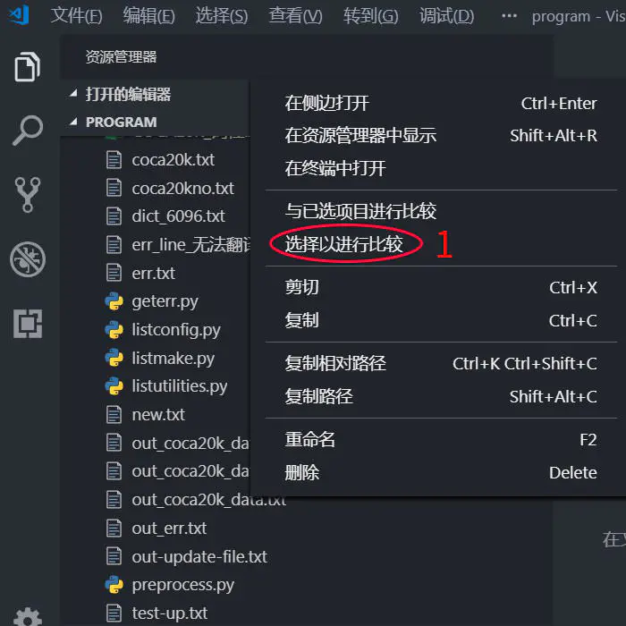
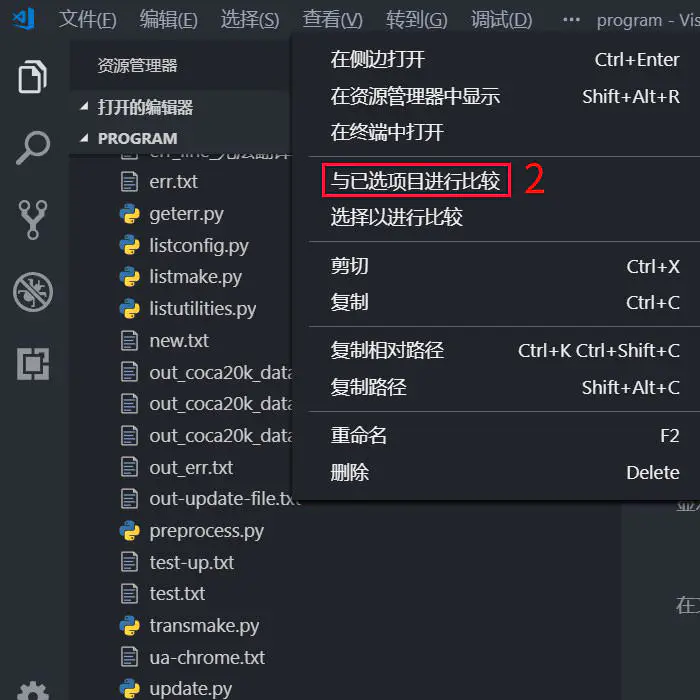
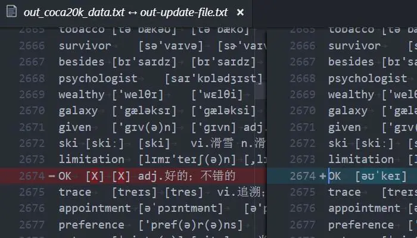
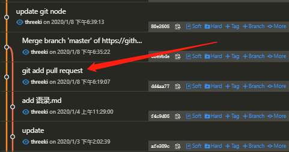
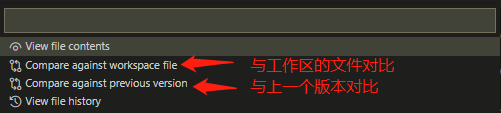
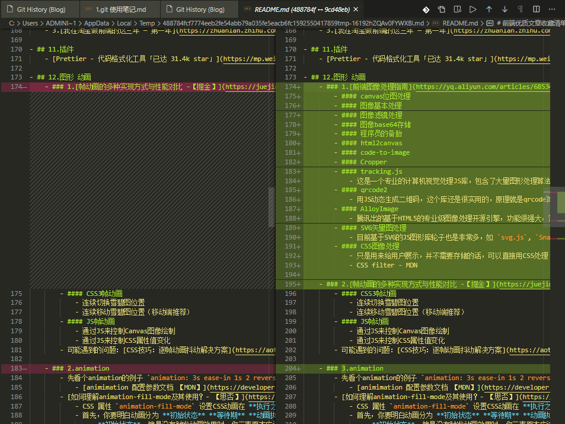
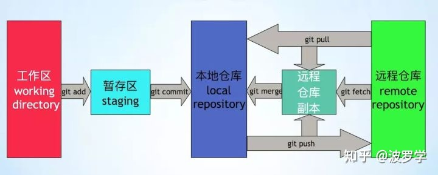

## [Git：从某个commit提交，创建为新的分支](https://blog.csdn.net/fly910905/article/details/89520193)
- 从某一个commit开始创建本地分支
```
1、git log 查看提交
2、通过checkout 跟上commitId 即可创建制定commit之前的本地分支
git checkout commitId -b 本地新branchName
```

## [使用git stash解决git pull时的冲突](https://www.cnblogs.com/zhangmingcheng/p/7472784.html)
- 1、先将本地修改存储起来
    ```
    $ git stash
    ```
- 2、pull内容

    暂存了本地修改之后，就可以pull了。
    ```
    $ git pull
    ```
- 3、还原暂存的内容
    ```shell
    $ git stash pop stash

    # 或
    $ git stash pop stash@{0}
    ```
    系统提示如下类似的信息：
    ```
    Auto-merging c/environ.c
    CONFLICT (content): Merge conflict in c/environ.c
    ```
    意思就是系统自动合并修改的内容，但是其中有冲突，需要解决其中的冲突。
- 4、解决文件中冲突的的部分

    打开冲突的文件，会看到类似如下的内容：
    ```
    <<<<<<< Updated upstream
        int 1, 3;
    =======
        int 1, z;
    >>>>>>> Stashed changes
    ```
- 5.解决完冲突后，就可以 `git push` 提交了

----

# vscode 比较两个文件的异同，支持同屏滚动
## 方法一： 文件右键，选择以进行比较
- 具体操作：
- 1.启动VS Code后，在资源管理器里，在要比较的第一个文件上，右击选择“选择以进行比较”。
    - 
- 2.再在第二个文件上，右击选择“与已选项目进行比较”。
    - 
- 3.此时就会同时出现两个文件。<br>
在任意一个文件窗口中滚动内容，另一文件会同步滚动。<br>
同时两文件不同之处会以不同颜色进行标示，非常方便。<br>
    - 

## 方法二： git版本同屏滚动对比, git history (git log) 使用方法
- 安装vscode 插件 `Git History`
- ## 使用方法
    - 1.在 vscode 打开你要查看 git history 的文件
    - 2.快捷键 `crtl + shift + P` 输入 `git history`, 选这个
        - 
    - 3.就会出现下面这个页面，可以查看 git commit 历史
        - 
    - 4.点击 红箭头 所指的一次 `commit`，就会跳出 `commit detail`, 里面显示了改动过的文件有哪些
        - 
    - 5.点击其中一个 改动过的文件，就会出现选择弹窗
        - 
    - 6.这样就能实现git history 同屏滚动对比了
        - 

- 参考视频地址 [開開心心學 Visual Studio Code -- GIT 【youtube】](https://www.youtube.com/watch?v=YXFdS3vKkzQ)
- 更新时间：2020-6-19 14:46:17

----
# 以下是git基础


# 0.初始化

## 0.1 基本信息配置
    git config --global user.name "youname"
    git config --global user.email youemail@qq.com
    git config user.name
    git config user.email
    git config --list	#查看当前已经配置了的项目信息

## 0.2 本地仓库初始化
    git init

    git status  #查看本地仓库状态(看有哪些没被提交的文件)

## 0.3 将本地仓库与远程仓库关联
    git remote add origin https://github.com/仓库地址	#将本地仓库与远程仓库关联
    #git remote add 远程名称 远程地址	#master是默认分支名称   origin是默认远程仓库名称
        git remote    	 #列出所有远程仓库
        git remote -v    #列出所有远程仓库的详细信息
    1. 修改命令
    git remote set-url origin <URL> 更换远程仓库地址。把<URL>更换为新的url地址。
    2.先删后加
    git remote rm origin 	
    git remote add origin git@github.com:Liutos/foobar.git 


# 1. 提交

    git add .
    git add fileName        #添加指定文件
    git commit -m"备注文字内容"		#添加到本地仓库

    #每次更新都要add，添加到本地缓冲区(staged)

    git commit -am "change 3 in dev"
    该命令相当于 git add . && git commit -m "change 3 in dev"
    但是该命令仅对于已经 add 过的文件有效


# 2.查看git信息
    git diff
    查看两个文件不同的地方

    git log --oneline --graph
    在一行上输出日志，并用图形的方式来表示

# 3.撤销修改
    1. 使用 git checkout 撤销本地修改
        git checkout .             # 撤销对所有已修改但未提交的文件的修改，但不包括新增的文件
        git checkout [filename]    # 撤销对指定文件的修改，[filename]为文件名

    2. 使用 git reset 回退项目版本
        git reset --hard [commit-hashcode]  
        # [commit-hashcode]是某个 commit 的哈希值，可以用 git log 查看

        # 回到当前 git log 历史中 最新的版本 (有点像 git checkout . 放弃当前修改的意思)
        git reset --hard HEAD

        # 回到HEAD的前一个版本
        git reset --soft HEAD~

        # 回到HEAD的前5个版本
        git reset --soft HEAD~5 

        # 利用id回到指定版本
        git reset --soft a06ef2f
    
- [git reset hard/soft/mixed区别](https://zhuanlan.zhihu.com/p/42929114)
    - git reset 命令主要有三个选项： --soft、--mixed 、--hard，默认参数为 --mixed。
    - `git commit --soft` 操作是软重置，只撤销了git commit操作，保留了 git add 操作。
        - 
    - `git commit --hard`
        - `git add` 和 `git commit` 上做的修改都“丢失”了，新的文件也被删除了。
        - 是具有破坏性，是很危险的操作，它很容易导致数据丢失，如果我们真的进行了该操作想要找回丢失的数据，那么此时可以使用 `git reflog` 回到未来，找到丢失的commit
        - 
    - `git reset --mixed` (默认)
        - 会保留提交的源码改动，只是将索引信息回退到了某一个版本，如果还需要继续提交，再次执行 git add 和 git commit
        - 

    - 图片来自 [博客链接](https://www.cnblogs.com/kidsitcn/p/4513297.html)

<br><br><br>

- [Git 误操作救命篇一： 如何将改动撤销？ 【知乎】](https://zhuanlan.zhihu.com/p/42929114)
    - 一、分支提交错误
        - 场景1：已经commit，但是未push到远端
            - `git commit --soft`
            - `git commit --hard`
            - `git reset --mixed`
        - 场景2：Commit之后已经 push 到了远端
            ```
            # 撤销最近的一次提交
            git revert HEAD --no-edit
            ```
        - 场景3：改动不仅已经 push 到远端，并且已经合到主仓库
            - 1. 当以pull request 的方式进行的合并
            - 2. 当用命令行执行合并时
        - 场景4：revert 错误，需要再次补救
    - 二、误删代码

<br><br><br>

# 4.git branch 分支操作

    git branch
    查看有多少个分支

    git branch dev
    创建新的分支 dev

    git branch -D dev
    删除分支，删除前请确认你切换在其他分支上

    git checkout -b dev
    新建 dev 分支的同时，切换到 dev 分支上

    git checkout master
    切换到master分支上

    git merge dev
    将dev分支合并到你现在的分支(master)

    git merge --no-ff -m "keep merge info" dev
    将dev分支合并到你现在的分支(master)，并且留下"keep merge info"的信息

# 5.git fetch
    git pull = git fetch + git merge
    
- 
- [git pull 和 git fetch的区别？【知乎】](https://www.zhihu.com/question/38305012/answer/625881308)
- [git fetch和git pull之间的区别 【重点在评论区】](https://blog.csdn.net/a19881029/article/details/42245955)
    - `git fetch` 作用为更新关联的远程版本ID说到点上了。实在是佩服，毕竟这个问题纠结了我好久！（简直痛苦万分） 

    - 我只知道每次使用 `git fetch` 后再使用 `git status` 就会提示落后几个版本，但本地代码什么都没有改变，常规的 `git diff/ git status` 都看不出变化，以及使用 `git log/git reflog` 都看不出任何变化，一度让我怀疑 git fetch 是搞笑的。

    - 如今看到楼主的证明方法，实在是牛掰！还有个让我痛苦万分的命令 `git revent` ，不知道楼主什么时候也能弄一个证明说来，实在是万分感谢。 

    - 题外话：这边内容，看了5遍，其中4遍是大致浏览，就是看不明白再讲什么，但是我看到了评论说这篇内容是多么多么的好，我就怀疑我的智商了。直到第5遍，我静下心来看 `commit id` 的变化，在加上自己之前的发现才能看懂，这篇绝对是好文。


<hr>
# 表严肃

## 配置
    git config --global user.name "<姓名>" 设置提交者姓名。
    git config --global user.email "<邮箱>" 设置提交者邮箱。

## 基础操作
    git init [目录名] 在指定目录创建仓库，如果没有指定目录名将在当前目录创建仓库。
    git clone <远程仓库地址> [目录名] 从指定地址克隆仓库，若不指定目录名将默认创建与远程同名目录。
    git add <目录名|文件名> 将文件或目录中已修改的代码添加追暂存区。
    git commit -m "<注释>" 提交暂存区内容。
    git status 查看仓库状态

## 比对 diff
    git diff 比对当前内容和暂存区内容。
    git diff HEAD 比对当前内容和最近一次提交。
    git diff HEAD^ 比对当前内容和倒数第二次提交。
    git diff HEAD^ HEAD 比对最近两次提交。

## 历史 log
    git log [--oneline] [--all] 查看提交历史。
    git log --oneline 打印为单行log。
    git log --all 打印所有记录（忽略HEAD的位置）。
    git log --graph 打印示意图（忽略HEAD的位置）。

## 分支 branch
    git branch [分支] 有分支：创建分支，无分支：列出所有分支。
    git checkout <分支> 切换至分支。
    git checkout -b <分支> 创建并切换至分支分支。
    git merge <分支> 将分支与当前分支合并。

## 远程
    git pull 拉取远程仓库。
    git push <远程仓库> <分支> 推送至远程仓库。
    git remote add origin https://xxx.git 新增远程仓库origin
    git remote set-url origin https://xxx.git 修改远程仓库origin


表严肃视频讲解 http://biaoyansu.com/27.9

----
## Pull Request
- [【Youtube 视频】Git和Github小白入门教程8,什么是PR----Pull Request，什么是Merge，为什么我们要做这个](https://www.youtube.com/watch?v=MBdLOl5tUKY)

- ### 什么是 Pull Request ？
    - #### 什么时候需要用到 Pull Request?
        - 当你不是 master branch 管理员时
        - 你在你的 branch 完成了一天的工作，下班时 你需要将当天 **`写完并测试正确`** 的代码，提交给主管 (master branch 管理员)
        - 由于你没有权限直接 merge 代码带 master branch，所以 这时候 你就需要新建一个 **`合并请求 (Pull Request)`**
        - 当你提交了这个 **`合并请求 (Pull Request)`**，你的 主管 看到了以后，他会查看 你合并请求的内容，如果他觉得没问题之后，他就会同意 你的这个 **`合并请求 (Pull Request)`**，将代码合并到 master branch
    - #### 怎么提交 Pull Request 请求？
        - 当你把最新代码 push 到你的分支以后，在 github.com 中找到你的分支
        - 1.并找到 **`new Pull Request`** 按钮
        - 2.Pull Request 内容
            - 标题：lastest code from Lin
            - 内容：this is PR from Lin. Please review
        - 3.在右侧 找到 **`Reviewrs`** ，添加需要他 确认的人的名单
        - 4.提交, 点击 **`Create Pull`** Request 按钮
    - #### 主管 (master branch 管理员) 如何通过 Pull Request ？
        - 在你的 github 项目顶部，有一个 **`Pull Request`**，如果有人提交 Pull Request 会显示数量
        - 1.点进去 **`Pull Request`**，会看到所有的 **`Pull Request 请求`**
        - 2.点击其中一条 **`Pull Request 请求`**
        - 3.点进来后，上面有一个 **`Commits`**, 点进去后 可以看到这个 **`Pull Request 请求`** 对代码的 **`改动部分`**
        - 4.**`Merge Pull Request`** 同意合并请求
            - 并回复同事信息 `good job Lin !`