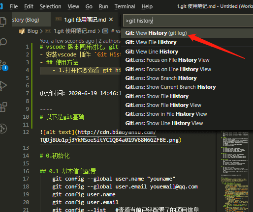
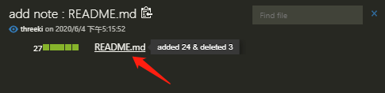

# vscode 版本同屏滚动对比, git history (git log) 使用方法
- 安装vscode 插件 `Git History`
- ## 使用方法
    - 1.在 vscode 打开你要查看 git history 的文件
    - 2.快捷键 `crtl + shift + P` 输入 `git history`, 选这个
        
    - 3.就会出现下面这个页面，可以查看 git commit 历史
        
    - 4.点击 红箭头 所指的一次 `commit`，就会跳出 `commit detail`, 里面显示了改动过的文件有哪些
        
    - 5.点击其中一个 改动过的文件，就会出现选择弹窗
        
    - 6.这样就能实现git history 同屏滚动对比了
        

- 参考视频地址 [開開心心學 Visual Studio Code -- GIT 【youtube】](https://www.youtube.com/watch?v=YXFdS3vKkzQ)
- 更新时间：2020-6-19 14:46:17

----
# 以下是git基础

# 0.初始化

## 0.1 基本信息配置
    git config --global user.name "youname"
    git config --global user.email youemail@qq.com
    git config user.name
    git config user.email
    git config --list	#查看当前已经配置了的项目信息

## 0.2 本地仓库初始化
    git init

    git status  #查看本地仓库状态(看有哪些没被提交的文件)

## 0.3 将本地仓库与远程仓库关联
    git remote add origin https://github.com/仓库地址	#将本地仓库与远程仓库关联
    #git remote add 远程名称 远程地址	#master是默认分支名称   origin是默认远程仓库名称
        git remote    	 #列出所有远程仓库
        git remote -v    #列出所有远程仓库的详细信息
    1. 修改命令
    git remote set-url origin <URL> 更换远程仓库地址。把<URL>更换为新的url地址。
    2.先删后加
    git remote rm origin 	
    git remote add origin git@github.com:Liutos/foobar.git 

# 1. 提交

    git add .
    git add fileName        #添加指定文件
    git commit -m"备注文字内容"		#添加到本地仓库

    #每次更新都要add，添加到本地缓冲区(staged)

    git commit -am "change 3 in dev"
    该命令相当于 git add . && git commit -m "change 3 in dev"
    但是该命令仅对于已经 add 过的文件有效

# 2.查看git信息
    git diff
    查看两个文件不同的地方

    git log --oneline --graph
    在一行上输出日志，并用图形的方式来表示

# 3.git branch 分支操作

    git branch
    查看有多少个分支

    git branch dev
    创建新的分支 dev

    git branch -D dev
    删除分支，删除前请确认你切换在其他分支上

    git checkout -b dev
    新建 dev 分支的同时，切换到 dev 分支上

    git checkout master
    切换到master分支上

    git merge dev
    将dev分支合并到你现在的分支(master)

    git merge --no-ff -m "keep merge info" dev
    将dev分支合并到你现在的分支(master)，并且留下"keep merge info"的信息

# 表严肃

## 配置
    git config --global user.name "<姓名>" 设置提交者姓名。
    git config --global user.email "<邮箱>" 设置提交者邮箱。

## 基础操作
    git init [目录名] 在指定目录创建仓库，如果没有指定目录名将在当前目录创建仓库。
    git clone <远程仓库地址> [目录名] 从指定地址克隆仓库，若不指定目录名将默认创建与远程同名目录。
    git add <目录名|文件名> 将文件或目录中已修改的代码添加追暂存区。
    git commit -m "<注释>" 提交暂存区内容。
    git status 查看仓库状态

## 比对 diff
    git diff 比对当前内容和暂存区内容。
    git diff HEAD 比对当前内容和最近一次提交。
    git diff HEAD^ 比对当前内容和倒数第二次提交。
    git diff HEAD^ HEAD 比对最近两次提交。

## 历史 log
    git log [--oneline] [--all] 查看提交历史。
    git log --oneline 打印为单行log。
    git log --all 打印所有记录（忽略HEAD的位置）。
    git log --graph 打印示意图（忽略HEAD的位置）。

## 分支 branch
    git branch [分支] 有分支：创建分支，无分支：列出所有分支。
    git checkout <分支> 切换至分支。
    git checkout -b <分支> 创建并切换至分支分支。
    git merge <分支> 将分支与当前分支合并。

## 远程
    git pull 拉取远程仓库。
    git push <远程仓库> <分支> 推送至远程仓库。
    git remote add origin https://xxx.git 新增远程仓库origin
    git remote set-url origin https://xxx.git 修改远程仓库origin

表严肃视频讲解 http://biaoyansu.com/27.9

----
## Pull Request
- [【Youtube 视频】Git和Github小白入门教程8,什么是PR----Pull Request，什么是Merge，为什么我们要做这个](https://www.youtube.com/watch?v=MBdLOl5tUKY)

- ### 什么是 Pull Request ？
    - #### 什么时候需要用到 Pull Request?
        - 当你不是 master branch 管理员时
        - 你在你的 branch 完成了一天的工作，下班时 你需要将当天 **`写完并测试正确`** 的代码，提交给主管 (master branch 管理员)
        - 由于你没有权限直接 merge 代码带 master branch，所以 这时候 你就需要新建一个 **`合并请求 (Pull Request)`**
        - 当你提交了这个 **`合并请求 (Pull Request)`**，你的 主管 看到了以后，他会查看 你合并请求的内容，如果他觉得没问题之后，他就会同意 你的这个 **`合并请求 (Pull Request)`**，将代码合并到 master branch
    - #### 怎么提交 Pull Request 请求？
        - 当你把最新代码 push 到你的分支以后，在 github.com 中找到你的分支
        - 1.并找到 **`new Pull Request`** 按钮
        - 2.Pull Request 内容
            - 标题：lastest code from Lin
            - 内容：this is PR from Lin. Please review
        - 3.在右侧 找到 **`Reviewrs`** ，添加需要他 确认的人的名单
        - 4.提交, 点击 **`Create Pull`** Request 按钮
    - #### 主管 (master branch 管理员) 如何通过 Pull Request ？
        - 在你的 github 项目顶部，有一个 **`Pull Request`**，如果有人提交 Pull Request 会显示数量
        - 1.点进去 **`Pull Request`**，会看到所有的 **`Pull Request 请求`**
        - 2.点击其中一条 **`Pull Request 请求`**
        - 3.点进来后，上面有一个 **`Commits`**, 点进去后 可以看到这个 **`Pull Request 请求`** 对代码的 **`改动部分`**
        - 4.**`Merge Pull Request`** 同意合并请求
            - 并回复同事信息 `good job Lin !`