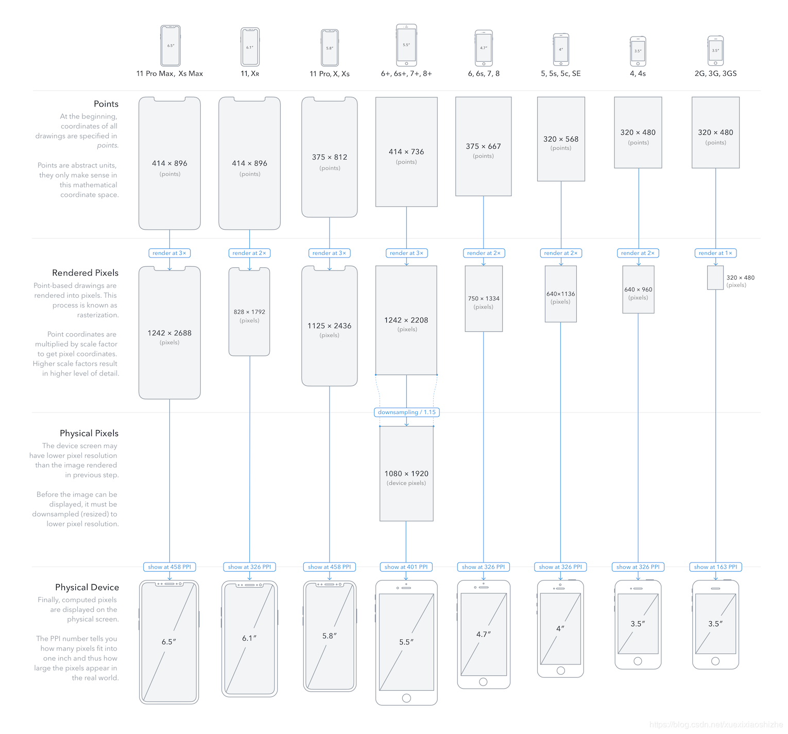
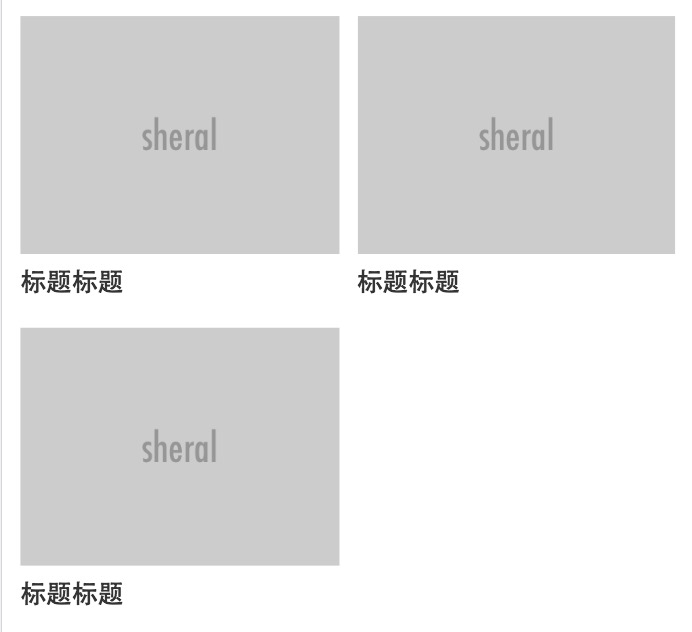
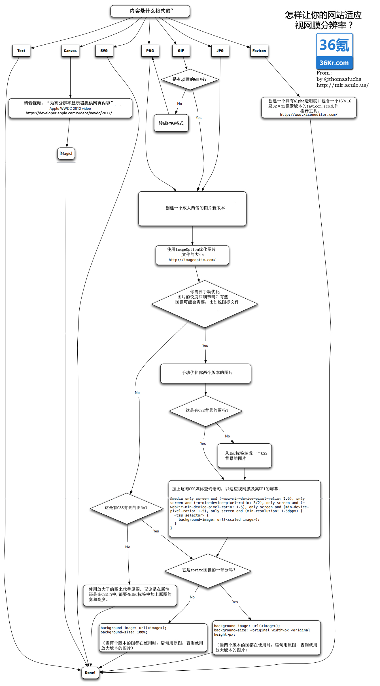

> 有很多朋友一聊起做移动端重构，第一个问题就是用什么单位合适。%，还是rem？<br>
> 然后我的回答是：根据情况而言，%，rem，px都用，而且px用得比较多。然后就是各种疑惑和解释了。<br>
> 那么多各种尺寸的视窗，到底用什么单位可以搞定呢？这里我借这篇文章，简单把一些遇到的问题总结下。

- 移动端适配，其实说来说去，本质上就是两个问题
    - ### 高度不一致
    - ### 宽度不一致

> 为了解决这个问题，我看了N多文章，收集了一些 比较好的文章 和 总结
----

- ## 基础知识点
    - [【tutorial | iPhone屏幕适配，历史及现状】iOS 的 APP 在系统中如何适应 iPhone 5s/6/6 Plus 三种屏幕的尺寸? - 【知乎】](https://www.zhihu.com/question/25421514/answer/31623909)
        - 在iOS开发中，44这个数字比较特殊。iOS界面指南写着，人类的手指有一定大小，点击区域低于44个点的时候，就难以点中。44的两倍就是88。
    - [iPhone & iPad 屏幕尺寸，归纳及分析 - 【知乎】](https://zhuanlan.zhihu.com/p/47466485)
    - [逻辑分辨率和物理分辨率到底是什么呀？ - 【知乎】](https://www.zhihu.com/question/40506180)
        > 我们以mac的发展史来说明什么是物理分辨率，以及为什么需要衍生出逻辑分辨率。
        > 
        > 我们的主人公是乔帮主和比尔盖茨。此时乔帮主面前有一台mac，屏幕的分辨率是1280*720，这就是物理分辨率。乔帮主对比尔盖茨说，给我的mac开发一个word软件吧。盖茨说OK，于是写了一个软件，这个软件显示的时候长度是1280像素，宽度是720像素，正好能够盖满整个mac屏幕。乔帮主看了之后很满意。
        > 
        > 有一天，乔帮主看自己的mac屏幕觉得很粗糙，一点都不清晰锐利。于是聪明的乔帮主想到，同样是15寸的屏幕，我把像素点翻倍，不就可以更清晰了吗？于是他把mac的物理分辨率改成了2560*1440的分辨率，相当于每个像素点的尺寸减少了4倍，这下再也看不出颗粒感了，乔帮主很满意。
        > 
        > 但是，当乔帮主打开盖茨给他写的word的时候，傻眼了，原本全屏的word现在只占屏幕的四分之一，而且文字非常的小。乔帮主打电话给盖茨说，你的软件怎么出问题了？盖茨回答说，我开发的时候你的mac分辨率就是1280*720，你自己改了硬件尺寸怪我咯，我很忙没空给你改软件代码，你就凑合着用吧。
        > 
        > 乔帮主稍作思考，马上想出了一个非常聪明的主意！他在软件和硬件之间的系统层加了一层逻辑分辨率。虽然屏幕横向有2560个像素点，但是告诉软件我只有1280个像素点！当word的宽度要占1280个像素的时候，实际上已经占了2560个像素。于是我们的word又占满屏幕了！
        > 
        > 于是乔帮主把这个机智的想法命名为逻辑分辨率，不管我显示器的硬件有多少个像素点，我只会告诉软件我的逻辑分辨率，这样软件的代码就不用修改也能在不同的屏幕上显示效果一致。
        > 
        > 在多年后，imac的物理分辨率已经达到了5120 x 2880，但是告诉软件的时候还是说我的分辨率是1280*720，相当在盖茨看来的一个逻辑像素点，背后实际上已经有16个物理像素点为其工作了！
    - [iPhone屏幕尺寸、逻辑分辨率、物理分辨率、像素密度 (2018)](https://blog.csdn.net/u011876968/article/details/82684002)
    
        | 设备 <br> iPhone | 宽(机身) <br> Width | 高(机身) <br> Height | 对角线 <br> Diagonal | 逻辑分辨率 <br> (point) | 缩放因子 <br> Scale Factor | 物理分辨率 <br> (pixel) | 像素密度 <br> PPI | 发布时间 |
        | ------ | ------ | ------ | ------ | ------ | ------ | ------ | ------ | ------ |
        | 3GS | 2.4 inches <br> (62.1 mm) | 4.5 inches <br> (115.5 mm) | 3.5-inch | 320x480 | @1x | 320x480 | 163 | 2009 |
        | 4/4s | 2.31 inches <br> (58.6 mm) | 4.5 inches <br> (115.2 mm) | 3.5-inch | 320x480 | @2x | 640x960 | 326 | 2010/2011|
        | 5/5s/se | 2.31 inches <br> (58.6 mm) | 4.87 inches <br> (123.8 mm) | 4-inch | 320x568 | @2x | 640x1136 | 326 | 2012/2013/2016|
        | 6/7/8 | 2.64 inches <br> (67.1 mm) | 5.44 inches <br> (138.3 mm) | 4.7-inch | 375x667 | @2x | 750x1334 | 326 | 6/7/8: 2014/2016/2017<br> 6s: 2015/|
        | 6P/7P/8P | 3.07 inches <br> (77.9 mm) | 6.23 inches <br> (158.2 mm) | 5.5-inch | 414x736 | @3x | (1242x2208) <br> 1080x1920 | 401 | 6P/7P/8P: 2014/2016/2017 <br> 6sp/7sp: 2015/2017|
        | X/Xs | 2.79inches <br> (70.9mm) | 5.65inches <br> (143.6mm) | 5.8-inch | 375x812 | @3x | 1125x2436 | 458 | X/Xs: 2017/2018|
        | XR | 2.98inches <br> (75.7mm) | 5.94inches <br> (150.9mm) | 6.1-inch | 414x896 | @2x | 828x1792 | 326 | 2018 |
        | Xs Max | 3.05inches <br> (77.4mm) | 6.20inches <br> (157.5mm) | 6.5-inch | 414x896 | @3x | 1242x2688 | 458 | 2018 |
        | ------ | ------ | ------ | ------ | ------ | ------ | ------ | ------ | ------ |
        | 11 | 2.98inches <br> (75.7mm) | 5.94inches <br> (150.9mm) | 6.1-inch | 414x896 | @2x | 828x1792 | 326 | 2019|
        | 11 Pro | 2.81inches <br> (71.4mm) | 5.67inches <br> (144.0mm) | 5.8-inch | 375x812 | @3x | 1125x2436 | 458 | 2019 |
        | 11 Pro Max| 3.06inches <br> (77.8mm) | 6.22inches <br> (158.0mm) | 6.5-inch | 414x896 | @3x | 1242x2688 | 458 | 2019 |


        - 2007年1月9日，乔布斯在旧金山马士孔尼会展中心的 Macworld 2007中发布第一代iPhone
        - 2008年7月11日，发布 iPhone3G
        - 2019年，发布 iPhone 11、iPhone 11 Pro、iPhone 11 Pro Max

        - 
        - 图片链接 [https://www.paintcodeapp.com/news/ultimate-guide-to-iphone-resolutions](https://www.paintcodeapp.com/news/ultimate-guide-to-iphone-resolutions)


参考文章
- ## [[转]移动端适配方案：基于flexible库的成熟方案和基于vw的新方案](https://mobilesite.github.io/2018/02/05/vm-mobile-layout/)
    - ### 5、字号不使用rem
        - 我们在iPhone3G和iPhone4的Retina屏下面，希望看到的文本字号是相同的。也就是说，我们不希望文本在Retina屏幕下变小，另外，我们希望在大屏手机上看到更多文本，以及，现在绝大多数的字体文件都自带一些点阵尺寸，通常是16px和24px，所以我们不希望出现13px和15px这样的奇葩尺寸。
        - 如此一来，就决定了在制作H5的页面中，rem并不适合用到段落文本上。所以在Flexible整个适配方案中，考虑文本还是使用px作为单位。只不过使用[data-dpr]属性来区分不同dpr下的文本字号大小。
        ```css
        div {
            width: 1rem;
            height: 0.4rem;
            font-size: 12px; // 默认写上dpr为1的fontSize
        }
        [data-dpr="2"] div {
            font-size: 24px;
        }
        [data-dpr="3"] div {
            font-size: 36px;
        }
        ```
        - 为了能更好的利于开发，在实际开发中，我们可以定制一个font-dpr()这样的LESS mixin：
        ```less
        @mixin font-dpr(@font-size){
            font-size: @font-size;

            [data-dpr="2"] & {
                font-size: @font-size * 2;
            }

            [data-dpr="3"] & {
                font-size: @font-size * 3;
            }
        }
        ```
        - #### 总结：
            - ##### **px单位，相当于绝对单位**
                - 不管什么屏幕下 (如果不考虑 retina屏 的放大倍率)，使用px作为单位，那么它们在物理世界的大小将完全一样 (可用尺子测量 不同屏幕下，相同px的大小)。
                - > 当然，在物理世界，px单位并不是真的绝对单位，只是可以这么去理解。<br>
                  > 因为不同的屏幕厂家，对于物理像素的间距规定不一样 (如 LED屏幕、电视、电脑、手机)。但是在手机上 基本一样

- ## PostCss 方案 - 【2019.08】
    - [PostCss移动端适配设置](https://www.jianshu.com/p/c200f392e5ca)
    - [移动端布局适配hotcss+postcss-pxtorem](https://juejin.im/post/5cd5214851882544327a2d79)
    - ## [移动端postcss-px2rem配置](https://juejin.im/post/5bf66282f265da61542d4338)
        - 在代码中使用
        ```css
        #box {
            height: 44px                //用postcss-px2rem插件配置后相当于0.44rem
            width: 100%
            font-size: 24px;/*no*/      //如果不想用插件转换可以用/*no*/标识符
        }
        ```
----
- ## 淘宝 Flexible 方案
    - [使用Flexible实现手淘H5页面的终端适配 - 【github】](https://github.com/amfe/article/issues/17)
        - 使用 Flexible 时，最好改一下 `doc.body.style.fontSize`
            - npm的 Flexible库 默认是 `doc.body.style.fontSize = 12 * dpr + 'px';`
            - 最好改为 16 ，这样后面不用频繁设置 字体大小
            ```js
            // flexible.js

            if (doc.readyState === 'complete') {
                doc.body.style.fontSize = 16 * dpr + 'px';
            } else {
                doc.addEventListener('DOMContentLoaded', function(e) {
                    doc.body.style.fontSize = 16 * dpr + 'px';
                }, false);
            }
            ```
- [rem不是神农草，治不了移动端百病 -【2016-05-25】](https://imweb.io/topic/5745adf5a94f742c1db63485)
    - ### 文字
        - 于是我们得出第一个结论：既然文字不需要适应各种视窗大小变化，所以单位设置px是完全没有问题的。
    - ### 图片
        - 图片而言，我们会面临两种：一种是百分比的，一种是固定大小的。
            - 1.对于百分比的，如滚动的banner图片，那肯定是要占全屏的；还有那些一行两个或三个产品，图片与文字按照竖直方面排列的，如淘宝的一些活动页，那也只能是百分比，假如一行两个，那么每个就是50%，如下图：
                - 
            - 2.对于固定大小的，最典型的莫过于微信朋友圈的头像了，就是固定大小。同样我们可以扩展到如下场景：
                - 
    - ### 总结：
        - 对于需要等比缩放的元素，CSS使用转换后的单位
        - 对于不需要缩放的元素，比如 文字、边框阴影，使用固定单位px

- ## flex 弹性盒子方案
    - [移动端适配的几种方案](https://zhuanlan.zhihu.com/p/80692165)
        - ### 适配ipad 或手机横屏
            - 以上的三种适配方案，都是等比缩放，放到 ipad 上时（设计稿以手机屏幕设计的），页面元素会很大很丑，有些场景下，并不需要页面整体缩放（viewport 自动处理的也很好了），所以有时只需要合理的布局即可。
            - ### 弹性盒适配（合理布局）display: flex
                - ```css
                    section {
                        display: flex;
                    }
                    ```
            - 为了适配手机横屏 或者 ipad，可以给元素 定一个最大宽度 `max-width`，这样的话 配合上 flex弹性盒子布局，页面元素就不会无脑放大，而变得非常丑陋了


----


- [mir.aculo.us](http://mir.aculo.us/2012/06/26/flowchart-how-to-retinafy-your-website/) June 26th, 2012 的一张信息图