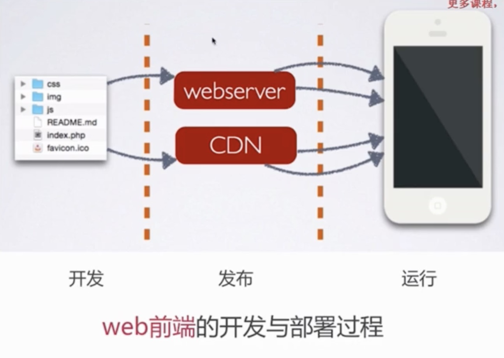

# [幕课]Web前端性能优化
- 让你页面速度飞起来 Web前端性能优化
- 从构建、浏览器渲染、缓存、PWA、Vue-SSR、服务端优化等多方面，梳理前端性能优化的技术点、综合分析技术的原理，根据不同的业务场景选择合适的性能优化点进行应用，最终为你的网站带来显著的速度提升和整体性能提升。
- [幕课视频地址](https://coding.imooc.com/class/130.html)

# 1.前端性能优化点
- 网络层面
- 构建层面
- 浏览器渲染层面
- 服务端层面

## 技术栈
- Vue.js
- Chrome
    - performance
    - layers
- 前端性能优化原理

# 2-1 资源合并与压缩-http 清求的过程及潜在的性能优化点
## 课程目标
 * ***减少http请求数量*** 和 ***减少请求资源大小*** 两个优化要点
 * 掌握压缩与合并的原理
 * 掌握通过 ***在线网站*** 和 ***fis3*** 两种实现压缩与合并的方法

## 产出量化对比
优化前的代码，优化后的代码 <br>
两者的性能到底能差多少，通过量化对比的方式，让大家更加直观的体会到前端性能优化 对于前端的意义

## 什么是前端？
在做前端优化前，要先搞清楚什么是前端。
web前端本质上是一种 ***GUI软件***，本可以借鉴其它 GUI系统架构 设计方法。

<center>

CS架构（Client/Server）：客户端----服务器结构
</center>

<center>

BS架构（Browser/Server）：浏览器----服务器结构
</center>

## 浏览器的一个请求，从发送到返回都经历了什么？
?????????

----
### [浏览器输入url回车后发生了什么](https://blog.csdn.net/u014099894/article/details/61637945)

浏览器回车后, 大概过程:
- 1.DNS域名解析，获取目标服务器IP地址
- 2.HTTP封装请求(应用层包)
- 3.调用系统API，使用Socket，通过三次握手建立连接(HTTP协议是使用TCP作为其传输层协议的)，
- 4.发送请求(TCP段)，请求在第三次“握手”时就发送出去了。(IP数据报)
- 5.(网络层)路由寻址<br>
    (忽略链路层和物理层)
- 6.服务器响应
- 7.客户端关闭连接，TCP四次挥手

----

### **httpstat**：可视化 HTTP 请求状态
- 可以看到 DNS查询、TCP 链接、TLS 握手环节、服务器处理、内容传输 等信息
```shell
>>> httpstat https://reorx.com


Connected to 172.104.82.25:443 from 192.168.10.177:64711

HTTP/1.1 200 OK
Server: nginx/1.10.2
Date: Wed, 24 Jun 2020 09:53:25 GMT
Content-Type: text/html; charset=UTF-8
Content-Length: 4117
Connection: keep-alive
Vary: Accept-Encoding
Etag: "77b3634a337edf43f502426b2b702ddcff1ce257"

Body stored in: /var/folders/0j/_jg9n62s7c9bgx9gp989rdv40000gn/T/tmpacg0po

  DNS Lookup   TCP Connection   TLS Handshake   Server Processing   Content Transfer
[   2533ms   |      111ms     |     251ms     |       116ms       |        0ms       ]
             |                |               |                   |                  |
    namelookup:2533ms         |               |                   |                  |
                        connect:2644ms        |                   |                  |
                                    pretransfer:2895ms            |                  |
                                                      starttransfer:3011ms           |
                                                                                 total:3011ms

```

## 请求过程中一些潜在的性能优化点
* dns 是否可以通过缓存减少 dns 查询时间？
* 网络请求的过程走最近的网络环境？
* 相同的静态资源是否可以缓存？
* 能否减少请求 http 请求大小？
* 减少 http 请求
* 服务端渲染
