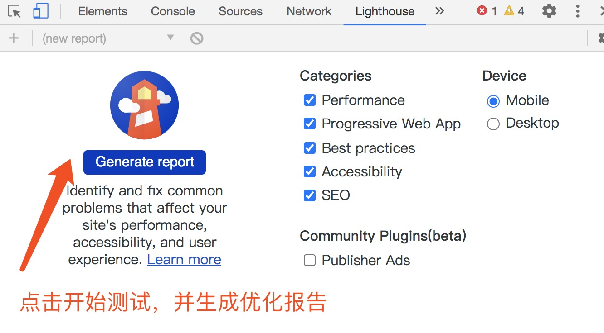
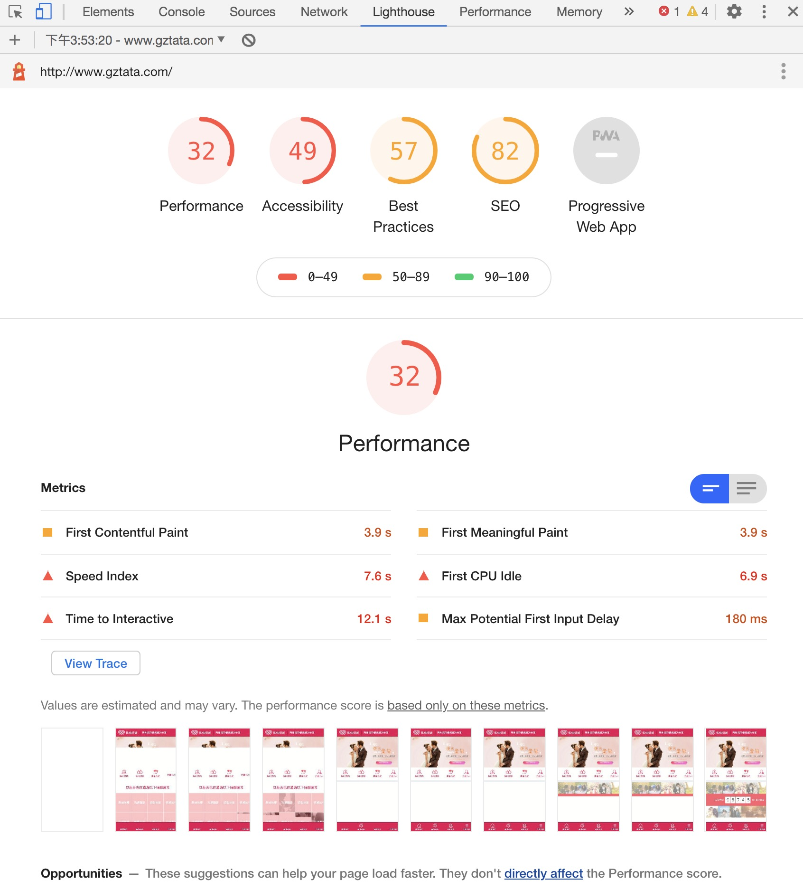
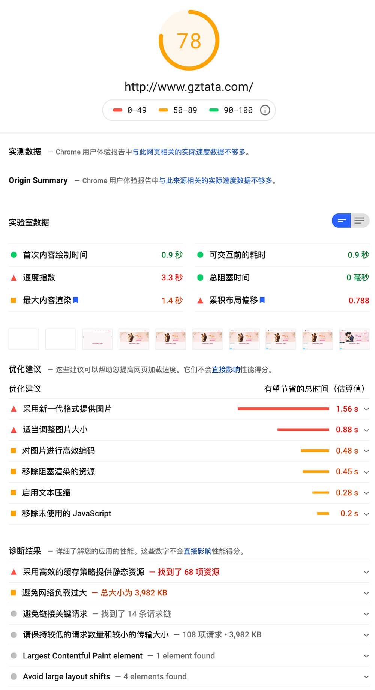
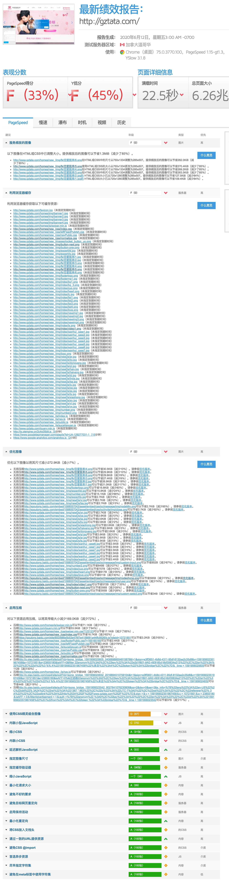
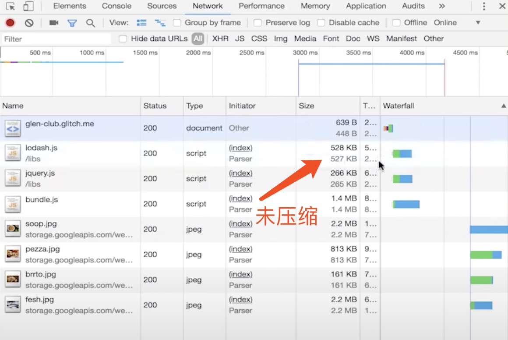
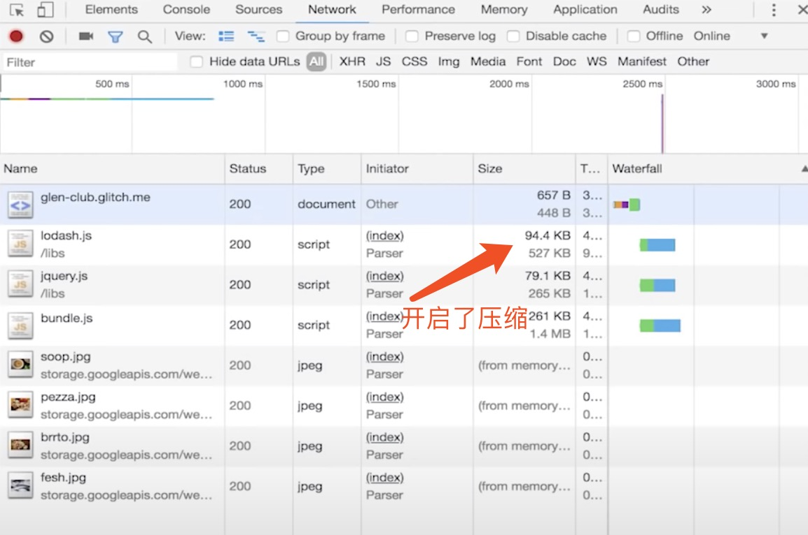

# 前端性能优化 - 方法总结

- 本文撰写于：
    - 时间: 2020年6月15日
    - 版本: Google Chrome	83.0.4103.61 (正式版本) （64 位）

----

- 怎么知道 我该优化哪里？这就用到下面等这个工具了
    - Lighthouse - Chrome官方分析工具
    - gtmetrix 你的网站还能如何优化？
- # Lighthouse - Chrome官方分析工具
    - Lighthouse 在旧版本的Chrome里叫 Audits, 现在改名叫 Lighthouse 了
    - 
    - 
- # [【pagespeed insights】 使您的网页在所有设备上都能快速加载](https://developers.google.com/speed/pagespeed/insights/)
    - Google 在线版 Lighthouse
    - 
- # [【gtmetrix】你的网站还能如何优化？](https://gtmetrix.com/)
    - 查看您网站的效果，揭示网站运行缓慢的原因，并发现优化机会
    - 下面看一下测试结果 和 优化建议
    

----

- 先看一下很重要的Google官方讲解视频
- [Improving Load Performance - Chrome DevTools 101 - 【Youtube】](https://www.youtube.com/watch?v=5fLW5Q5ODiE&t=182s)

- # 开启压缩 (Gzip)
    - 服务端配置启用压缩，让资源在网络传输对过程中 尽可能的小，等浏览器加载好资源后 再进行解压，还原文件
    - [前端性能优化之gzip](https://segmentfault.com/a/1190000012571492)
- 
- 

- # [Chrome的First Paint 【百度EUX】](http://eux.baidu.com/blog/fe/Chrome%E7%9A%84First%20Paint)
    - `First paint`:  直译过来的意思就是浏览器第一次渲染(paint)，在First paint之前是白屏，在这个时间点之后用户就能看到（部分）页面内容。
    - `第一脚本`：我们就把body中的第一个外链脚本叫做【第一脚本】
    > 结论：
    > 
    > 情况1：如果第一脚本前的JS和CSS加载完了，body中的脚本还未下载完成，那么浏览器就会利用构建好的局部CSSOM和DOM提前渲染第一脚本前的内容（触发FP）；
    > 
    > 情况2：如果第一脚本前的JS和CSS都还没下载完成，body中的脚本就已经下载完了，那么浏览器就会在所有JS脚本都执行完之后才触发FP。
    - ## 建议：
        - CSS放在head中，JS放在</body>前（如果在head必须放JS，也尽量减少他的大小，把大JS文件放</body>前）。
        - 减小head中CSS和JS大小（gzip[了解一下？](https://segmentfault.com/a/1190000012800222))，
        - 优化head中的JS和CSS外链的网络情况，减少Stalled、TTFB和Content Download的时间。
        - 在第一脚本前使用骨架图，可以减少用户的白屏感知时间（对于使用JS插入模板来渲染的框架，建议将骨架图的路由生成逻辑单独提出来）


- # 开启浏览器缓存

- # 预加载技术 prefetch
    - [一箩筐的预加载技术](https://www.open-open.com/lib/view/open1446298572679.html)
    - [一箩筐的预加载技术](http://www.alloyteam.com/2015/10/prefetching-preloading-prebrowsing/)
    - [HTML5 prefetch](https://www.jianshu.com/p/7f58ddfc1392)
        - ### DNS prefetch
            - 使用场景：只要其它资源跟 HTML 不在同一个域上, 就可以使用 dns-prefetch
            ```html
            <meta http-equiv='x-dns-prefetch-control' content='on'>
            <link rel='dns-prefetch' href='http://g-ecx.images-amazon.com'>
            <link rel='dns-prefetch' href='http://z-ecx.images-amazon.com'>
            <link rel='dns-prefetch' href='http://ecx.images-amazon.com'>
            <link rel='dns-prefetch' href='http://completion.amazon.com'>
            <link rel='dns-prefetch' href='http://fls-na.amazon.com'>
            ```
        - ### Resource prefetch 资源预加载
            ```html
            <link rel='subresource' href='critical.js'>
            <link rel='subresource' href='main.css'>

            <link rel='prefetch' href='secondary.js'>
            <link rel="prefetch" href="image.png">
            ```
            - 注意：只有可缓存的资源才进行预加载，否则浪费资源！
            - `rel='subresource' `表示当前页面必须加载的资源，应该放到页面最顶端先加载，有最高的优先级。
            - `rel='prefetch`' 表示当 subresource 所有资源都加载完后，开始预加载这里指定的资源，有最低的优先级
        - ### Preconnect
            - 和DNS prefetch类似，preconnect不光会解析DNS，还会建立TCP握手连接和TLS协议（如果需要）
        - ### Pre render 预渲染
            - 预渲染意味着我们提前加载好用户即将访问的下一个页面，否则进行预渲染这个页面将浪费资源，慎用！
            ```
            <link rel='prerender' href='http://www.pagetoprerender.com'>
            ```
            - rel='prerender' 表示浏览器会帮我们渲染但隐藏指定的页面，一旦我们访问这个页面，则秒开了！
            - 手动触发预渲染操作
                - 在 head 中强势插入 link[rel='prerender'] 即可：
                ```js
                var hint =document.createElement("link")
                hint.setAttribute(“rel”,”prerender”)
                hint.setAttribute(“href”,”next-page.html”)
                document.getElementsByTagName(“head”)[0].appendChild(hint)
                ```