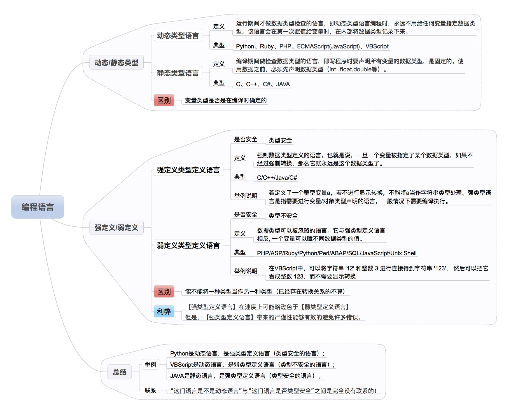

## Ryan Dahl 为什么认为 JavaScript 是比 Python 更好的 动态语言？
- Ryan Dahl 始终认为 JavaScript ***是最好的动态语言***，而动态语言用来做科学计算是合适不过了(这可能和 Ry 离开 Node 后加入 Google 的 Brain 团队，从事深度学习方面的研究的历程有关)。
- Nodejs 之父的 Ryan Dahl 发表了《10 Things I Regret About Node.js》演讲，并且发布了新项目 Deno 时候说的
  

- Question: 动态语言? 什么是 动态语言?

- 图片来源：[弱类型、强类型、动态类型、静态类型语言的区别是什么？【知乎】](https://www.zhihu.com/question/19918532)
- [什么是“脚本语言” ?](yinwang.org/blog-cn/2013/03/29/scripting-language)
    - 脚本语言，更有利于 **"开箱即用、快速得出结果"**
    - 非脚本语言，更有利于 **"构建大型应用、语法严谨不容易出错"**
    - 如 人工智能开发，这种需要 做大量的运算，并希望快速得到结果的，工具型 语言。
  

- [弱类型、强类型、动态类型、静态类型语言的区别是什么？【知乎】](https://www.zhihu.com/question/19918532/answer/21645395)
    - 强类型：偏向于不容忍隐式类型转换。譬如说haskell的int就不能变成double
    - 弱类型：偏向于容忍隐式类型转换。譬如说C语言的int可以变成double
    - 静态类型：编译的时候就知道每一个变量的类型，因为类型错误而不能做的事情是语法错误。
    - 动态类型：编译的时候不知道每一个变量的类型，因为类型错误而不能做的事情是运行时错误。譬如说你不能对一个数字a写a[10]当数组用。
    - ----
    - 强弱类型，看是否能 **"隐式转换"**
    - 动静态类型, 看 **"运行前"** 是否知道 **"变量类型"**
    - ### **动静看编写，强弱看运行**
    - ----
    - 总结于 [链接](https://zhuanlan.zhihu.com/p/62570358)

    
    - 图片来自于 [链接](https://www.jianshu.com/p/336f19772046)

- ## [Deno 入门 【阮一峰】](http://www.ruanyifeng.com/blog/2020/01/deno-intro.html)