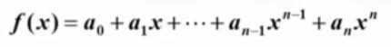
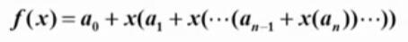

# 9.数据结构与算法 - 基础入门

- 课程视频地址:  [数据结构 - 【中国大学MOOC】](https://www.icourse163.org/course/ZJU-93001)
- 开课时间： 2020年06月06日 ~ 2020年09月05日
- 浙江大学: 陈越 教授、 何钦铭 教授

- ### 课程概述
    “数据结构”是计算机科学与技术专业、软件工程专业甚至于其它电气信息类专业的重要专业基础课程。它所讨论的知识内容和提倡的技术方法，无论对进一步学习计算机领域的其它课程，还是对从事大型信息工程的开发，都是重要而必备的基础。

    程序设计解决问题往往有多种方法，且不同方法之间的效率可能相差甚远。程序的时间和空间效率，不仅跟数据的组织方式有关，也跟处理流程的巧妙程度有关。本课程将介绍并探讨有关数据组织、算法设计、时间和空间效率的概念和通用分析方法，帮助学员学会数据的组织方法和一些典型算法的实现，能够针对问题的应用背景分析，选择合适的数据结构，从而培养高级程序设计技能。

    注意：本课程只涉及最基础的数据结构和与之关联的最基本的算法，更多更复杂的数据结构和经典的解决优化问题的算法，将在后续课程中介绍。

    本课程的特点是，对每一种重要的经典数据结构，我们都会从实际应用问题出发，导出其定义、实现（存储）方法以及操作实现，并以更丰富的综合应用案例和练习题帮助学员增强对理论的感性认识，从而明白这些数据结构为什么存在以及在什么情况下可以最好地解决什么样的问题。为了兼顾起点不同的学员，课程中特意设计了“小白专场”系列，手把手教授如何将解决问题的抽象算法用具体的代码实现，从而引导初学者更好地入门。

    坚持完成本课程学习、并按照要求完成所有练习的学员，应该具备了PAT（[Programming Ability Test](https://www.patest.cn/)）甲级需要的所有基础知识，辅以充分的英语阅读能力和熟练的编程能力，应可以取得优良成绩。


- ## 课程大纲
    - ### 第一讲 基本概念（1:15:26）[陈越]
        - 1.1 什么是数据结构（4节共32:43）
        - 1.2 什么是算法（3节共22:41）
        - 1.3 应用实例：最大子列和问题（3节共20:02）

    - ### 第二讲 线性结构（2:19:00）[何钦铭]
        - 2.1 线性表及其实现（6小节共45:04)
        - 2.2 堆栈（4小节共39:51)
        - 2.3 队列（2小节共15:45)
        - 2.4 应用实例：多项式加法运算 （1小节10:37)
        - 小白专场：多项式乘法与加法运算- C实现（3小节共27:43）

    - ### 第三讲 树（上） （1:50:08）[何钦铭]
        - 3.1 树与树的表示（5小节共38:54)
        - 3.2 二叉树及存储结构（2小节共16:43)
        - 3.3 二叉树的遍历（4小节共37:02)
        - 小白专场：树的同构 - C语言实现（2小节共17:29）

    - ### 第四讲 树（中）（1:06:31）[何钦铭]
        - 4.1 二叉搜索树（3小节共20:57)
        - 4.2 平衡二叉树（2小节共22:53)
        - 小白专场：是否同一棵二叉搜索树- C实现（3小节共22:41）
        - 线性结构之习题选讲[陈越]：Reversing Linked List（3小节共13:08）

    - ### 第五讲 树（下）（1:53:28）[何钦铭]
        - 5.1 堆（4小节共30:05）
        - 5.2 哈夫曼树与哈夫曼编码（3小节共19:52）
        - 5.3 集合及运算（2小节共12:57）
        - 小白专场：堆中的路径 - C语言实现（1小节共7:51）
        - 小白专场[陈越]：File Transfer - C语言实现（4小节共42:43）

    - ### 第六讲 图（上）（1:29:32）[陈越]
        - 6.1 什么是图（3小节共24:02）
        - 6.2 图的遍历（4小节共22:22）
        - 6.3 应用实例：拯救007（1小节共14:40）
        - 6.4 应用实例：六度空间（1小节共8:06）
        - 小白专场：如何建立图- C语言实现（6小节共20:22）

    - ### 第七讲 图（中）（2:11:35）[陈越]
        - 树之习题选讲-Tree Traversals Again（2小节共12:16）
        - 树之习题选讲-Complete Binary Search Tree（3小节共25:47）
        - 树之习题选讲- Huffman Codes（3小节共18:11）
        - 7.1 最短路径问题（6小节共56:38）
        - 小白专场：哈利•波特的考试- C语言实现（4小节共18:43）

    - ### 第八讲 图（下）（57:02）[陈越]
        - 8.1 最小生成树问题（2小节共20:16）
        - 8.2 拓扑排序（2小节共27:57）
        - 图之习题选讲-旅游规划（2小节共8:49）

    - ### 第九讲 排序（上）（1:11:44）[陈越]
        - 9.1 简单排序（冒泡、插入）（4小节共23:26）
        - 9.2 希尔排序（1小节共9:29）
        - 9.3 堆排序（2小节共10:27）
        - 9.4 归并排序（3小节共28:22）

    - ### 第十讲 排序（下）（54:20）[陈越]
        - 10.1 快速排序（4小节共25:25）
        - 10.2 表排序（2小节共12:41）
        - 10.3 基数排序（3小节共12:13）
        - 10.4 排序算法的比较（1小节共4:01）

    - ### 第十一讲 散列查找（1:43:39）[何钦铭]
        - 11.1 散列表（2小节共13:43)
        - 11.2 散列函数的构造方法（2小节共13:05)
        - 11.3 冲突处理方法（6小节共36:26)
        - 11.4 散列表的性能分析（1小节10:26)
        - 11.5 应用实例:词频统计（1小节6:01)
        - 小白专场[陈越]：电话聊天狂人- C语言实现（4小节共23:58）

    - ### 第十二讲 综合习题选讲（1:14:41） [陈越]
        - 习题选讲-Insert or Merge（2小节共11:51）
        - 习题选讲-Sort with Swap(0,*)（2小节共11:06）
        - 习题选讲-Hashing - Hard Version（1小节共7:15）
        - 串的模式匹配（KMP算法）（5小节共44:29）


|堆，列队优先,先进先出。|栈，先进后出(First-In/Last-Out)|
|----|----|
|堆(Heap)| 栈(Stack)|
|H 直的<br>像一个隧道一样直<br>车过隧道, 先进先出|S 弯的<br>S形的木桶切面<br>客栈里的 木桶放书，先进后出|


- # 第一讲 基本概念（1:15:26）[陈越]
    - ## 1.1 什么是数据结构（4节共32:43）
        - ### 1.1.1 关于数据组织 - 例：图书摆放
            > 解决问题方法的效率，<br>
            > 跟数据的组织方式有关

            - #### 什么是数据结构？
                > 数据结构是数据对象，以及存在于该对象的实例和<br>
                > 组成实例的数据元素之间的各种联系。这些联系可以<br>
                > 通过定义相关的函数来给出。”<br>
                > <br>
                > -- Sartaj Sahni, 《数据结构、算法与应用》

                > 数据结构是ADT ( 抽象数据类型 AbstractData Type ) 的物理实现。”<br>
                > <br>
                > -- Clifford A.Shaffer,《 数据结构与算法分析》
                
                > 数据结构 (data structure) 是计算机中存储、组织数据的方式。<br>
                > 通常情况下，精心选择的数据结构可以带来最优效率的算法。<br>
                > <br>
                > -- 中文维基百科
                - 官方没有统一的定义
                - 但是 “数据结构” “算法” 这两个词似乎总是相关的
            - #### 例1：如何在书架上摆放图书？
                - 其实这个问题是不科学的，因为这个问题并没有告诉你 书架到底是下面的哪一种
                
                
                - 所以
                    > 数据该如何组织？这是和数据的规模有关系的 <br>
                    > 不同规模的数据，处理起来的难度 是不一样的
                - 图书的摆放，是要使得2个相关操作方便的问题：
                    - 操作1：新书怎么插入？
                    - 操作2：怎么找到某本指定的书？
                - 方法1：随便放
                    - 操作1：新书怎么插入？
                        - 哪里有空放哪里，一步到位
                    - 这样操作 随便放，虽然是方便了，但是 当你要找某一本书的时候 (操作2)，就变得非常麻烦了
                - 方法2：按照书名的拼音字母顺序放
                    - 操作2：怎么找到某本指定的书？
                        - ***二分查找*** ！
                            - 每次从中间 取出一本书，与要找的书 比较，看要找的书的字母 , 是在取出的书的字母 的前面还是后面
                            - 不断从中间 取出一本与之 比较，不断的缩小范围，直到找到书为止
                    - 操作1：新书怎么插入？
                        - "按照书名的拼音字母顺序放" 这种方法，虽然是解决了 查找书的问题了
                        - 但是，如果要插入新书的时候，每一本书 都要往后移位 留出一本书的空位 给新书插入。这样就导致了 新书插入麻烦的问题。
                > 没有两全其美的解决办法，总有成本与代价
                - 方法3：先分类，再排序
                    - 把书架划分成几块区域，每块区域指定摆放某种类别的图书;在每种类别内，按照书名的拼音字母顺序排放
                    - 操作1:新书怎么插入?
                        - 先定类别， 二分查找确定位置，移出空位
                    - 操作2:怎么找到某本指定的书?
                        - 先定类别，再二分查找
                    > 问题:空间如何分配? 类别应该分多细?

            > 解决问题方法的效率，<br>
            > 跟数据的组织方式有关


            
        - ### 1.1.2 关于空间使用 - 例：PrintN函数实现
            > 解决问题方法的效率，<br>
            > 跟空间的利用效率有关

            - 例2: 写程序实现-一个函数PrintN， 使得传入一个正整数为N的参数后，能顺序打印从1到N的全部正整数
                - 下面有两种实现方法，用C语言实现的
                ```c
                void PrintN ( int N )
                {
                    int i;
                    for (i=1; i<=N; i++){
                        printf("%d\n", i);
                    }
                    return;
                }
                ```
                ```c
                void PrintN ( int N )
                {
                    if ( N ) {      // 如果N不为零
                        PrintN( N - 1 );
                        printf("%d\n", N);
                    }
                    return;
                }
                ```
                - 上面两种方法，一种是 循环实现，一种是 递归实现
            - 那么 这两个函数跑起来的结果会怎样呢？
                - 令 N = 100, 1000, 10000, 100000, ...
            - 经过 允许程序后发现
                - **循环实现** 的函数能正常工作，顺利打印出结果
                - 而 **递归实现** 的函数，遇到大数的时候 就直接罢工了，没有打印出结果
            - #### 到底发生了什么？
                - 由于 递归操作，每一次递归 系统需要保存 递归状态，然后 进行下一步 递归操作
                - 如果这时候 递归次数 过大，需要的 系统内存 超出了 计算机能够 处理的最大范围，就会导致系统奔溃 或卡死
                - 这就是 我们说的 超出了可使用的空间范围 (内存)

            > 解决问题方法的效率，<br>
            > 跟空间的利用效率有关


        - ### 1.1.3 关于算法效率 - 例：计算多项式值
            > 解决问题方法的效率，<br>
            > 跟算法的巧妙程度有关

            - 例3: 写程序计算给定多项式在给定点x处的值
            
            - 解法1：
                ```c
                double f ( int n, double a[], double x )
                {
                    int i;
                    double p = a[];
                    for ( i = 1; i <= n; i+= )
                        P += (a[i] * pow(x, i)); // a的第 i 项，乘以 x 的 i次方
                    return p;
                }
                ```
                - 这种方法 是直接翻译，直接把 算术转换成函数
                - 但是在正式的程序里面，如果你用这种方法来实现的话，是会被 专业程序员 鄙视的
            - 解法2：
                - 根据 秦九韶 的算法，上面的 算式可以转换为下面 等式，每次都往外面 提出 公因子 x
                - 
                ```c
                double f ( int i, double a[], double x )
                {
                    int i;
                    double p = a[];
                    for ( i = n; i > 0; i-- ) 
                        p = a[i - 1] + x*p;
                    return p;
                }
                ```
            - 那么，凭什么 第二个函数 就比第一个函数好呢？ 凭什么第一个函数 就被鄙视呢？
            - 因为 第一个函数 比第二个函数 **慢很多**
            
            > 解决问题方法的效率，<br>
            > 跟算法的巧妙程度有关


        - ### 1.1.4 抽象数据类型