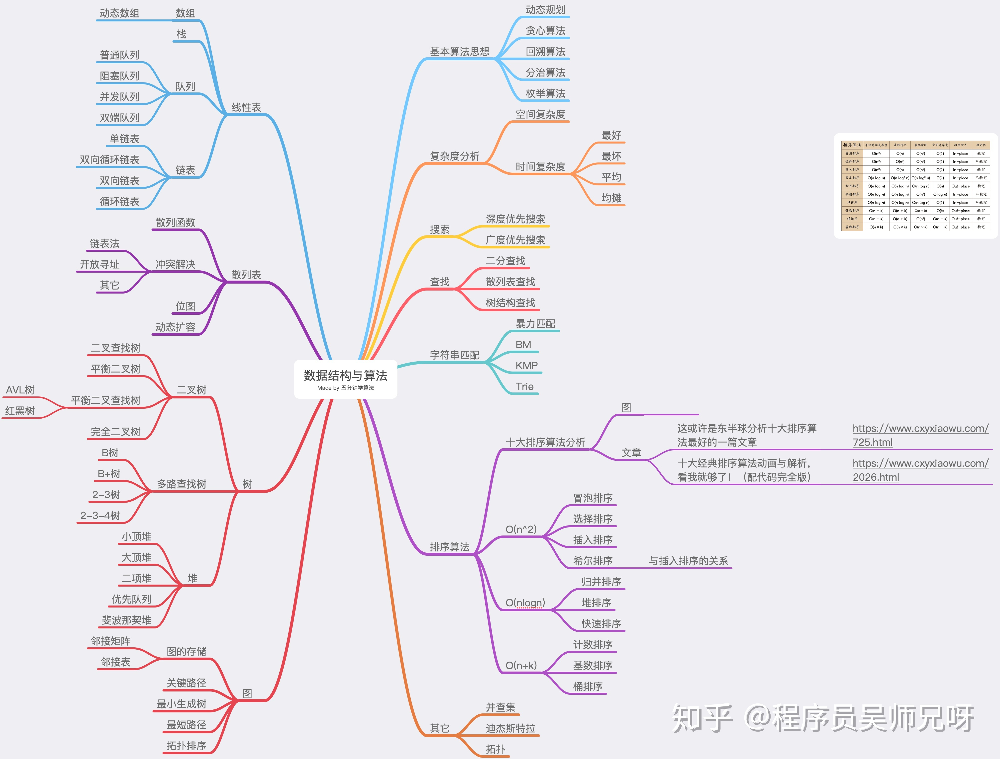

# 算法复杂度
> JS编码中 常见的算法复杂度可以分为：
> 常数级，线性级，平方级，对数级，线性对数级，5种等级的

|复杂度符号	| 中文等级	| 核心特征	| 性能排序（从优到差）
|---|---|---|---|
|O(1)	| 常数级	| 执行步骤固定，与 n 无关	| 1（最优）|
|O(log n)	| 对数级	| 每次操作砍掉一半数据	| 2|
|O(n)	| 线性级	| 执行步骤随 n 正比例增长	| 3|
|O(n log n)	| 线性对数级	| n × log n（拆分 + 遍历）	| 4|
|O(n²)	| 平方级	| 嵌套循环，步骤随 n² 增长	| 5（最差）|
|O(2ⁿ)|指数级|每增加 1 个 n，执行步骤翻倍（2 的 n 次方）；典型特征是 “递归拆分出 2 个分支”|6（性能极差）|
|O(n!)|阶乘级|执行步骤是 n 的阶乘（n×(n-1)×(n-2)×…×1）；典型特征是 “全排列 / 所有组合枚举”|7（性能极极差）|

日常开发要避开 平方级 和以上，遇到 O (2ⁿ) 优先优化。

# 数据结构与算法

- [用动画的形式呈现解LeetCode题目的思路 MisterBooo/LeetCodeAnimation 【github】](https://github.com/MisterBooo/LeetCodeAnimation)
    - [	十大经典排序算法动画与解析，看我就够了！（配代码完全版）](https://mp.weixin.qq.com/s/vn3KiV-ez79FmbZ36SX9lg)
    
    
    冒泡排序 bubble-sort

    
    希尔排序 Shell-sort

- # [如何系统地学习算法？](https://www.zhihu.com/question/20588261/answer/926157817)
程序员吴师兄

不 BB，直接上干货，非科班出生，毕业工作后才开始学算法，到目前学了 4 年 ！！！

为了让你对数据结构和算法能有个全面的认识，我画了一张图，里面几乎涵盖了所有数据结构和算法书籍中都会讲到的知识点。

这里面有10个数据结构：数组、链表、栈、队列、散列表、二叉树、堆、跳表、图、Trie 树；10个算法：递归、排序、二分查找、搜索、哈希算法、贪心算法、分治算法、回溯算法、动态规划、字符串匹配算法。

掌握了这些基础的数据结构和算法，再学更加复杂的数据结构和算法，就会非常容易、非常快。

