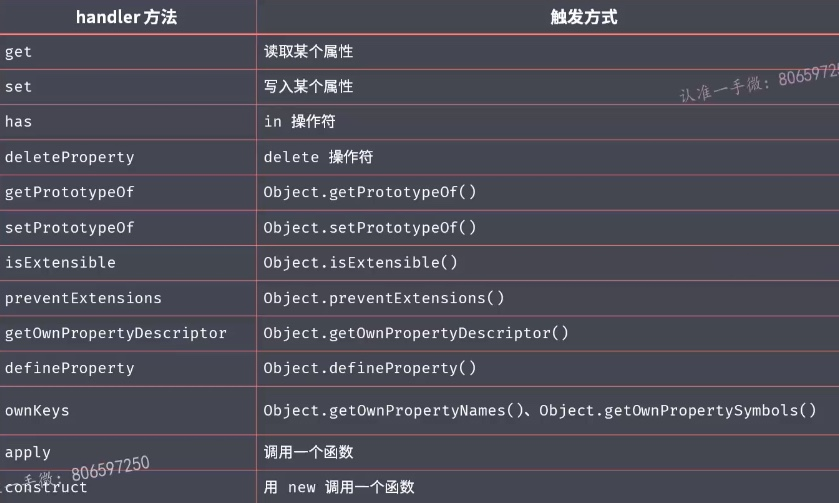
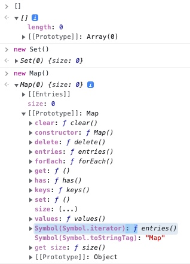
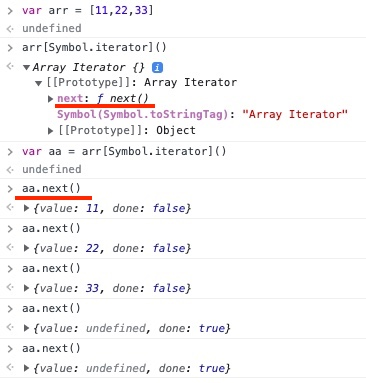
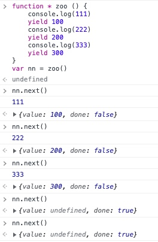
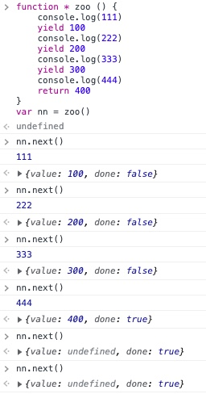
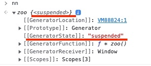
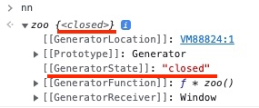

<!--
 * @Author: threeki 946629031@qq.com
 * @Date: 2022-11-29 15:29:56
 * @LastEditors: threeki 946629031@qq.com
 * @LastEditTime: 2022-12-07 16:08:03
 * @FilePath: /Blog/ES新特性 ES2015.md
 * @Description: 这是默认设置,请设置`customMade`, 打开koroFileHeader查看配置 进行设置: https://github.com/OBKoro1/koro1FileHeader/wiki/%E9%85%8D%E7%BD%AE
-->

# ES2015
> ECMAScript 5 也称为 ES5 和 ECMAScript 2009 <br>
> ECMAScript 6 也称为 ES6 和 ECMAScript 2015

- [学不动系列：从es2016-es2019](https://zhuanlan.zhihu.com/p/59096242)

----

- 目录
    - []()
    - [Object.assign](#Object.assign)
    - [Object.is](#Object.is)
    - [Proxy](#Proxy)
    - [Proxy 对比 Object.defineProperty](#Proxy-对比-Object.defineProperty)
    - [Reflect](#Reflect)
    - [Promise](#Promise)
    - [Class](#Class)
    - [静态方法](#静态方法)
    - [类的继承](#类的继承)
    - [Set 数据结构](#Set-数据结构)
    - [Map 数据结构](#Map-数据结构)
    - [Symbol](#Symbol)
    - []()
    - [for...of 循环](#for...of-循环)
    - [可迭代接口 Iterable](#可迭代接口-Iterable)
    - [ES2015 实现可迭代接口](#ES2015-实现可迭代接口)
    - [迭代器模式](#迭代器模式)
    - [生成器 Generator](#生成器-Generator)
    - [生成器的应用](#生成器的应用)
    - []()
    - []()
    - []()
    - []()
    - []()


- ## Object.assign
    - > **`Object.assign()`** 方法可以把任 意多个的源对象 自身的 可枚举属性 拷贝给目标对象，然后 **`返回目标对象`**
    - Object.assign 基本用法
        ```js
        const target = {
            a: 456,
            c: 456
        }

        const source = {
            a: 123,
            b: 123
        }

        const result = Object.assign(target, source)

        console.log(target) // { a: 123, c: 456, b: 123 }
        console.log(target === result) // true // 返回的是第一个 对象
        ```
    - Object.assign 是深拷贝 还是浅拷贝 的问题
        - 注意：当object只有一层的时候，是深拷贝
        ```js
        let obj = {
            username: 'kobe'
        };
        let obj2 = Object.assign({}, obj);
        obj2.username = '李世民';
        console.log(obj); //{username: "kobe"}
        ```
        - > **`第一级属性深拷贝，从第二级属性开始就是浅拷贝。`**
        ```js
        //示例1  一层深拷贝
        let obj = {
            a: 1
        }
        let newObj = Object.assign({}, obj);
        console.log(newObj); //{a: 1}
        newObj.a = 2;
        console.log(obj); //{a:1}
        console.log(newObj); //{a: 2}


        //示例2  二层浅拷贝
        let obj = {
            a: 1,
            b: {
                name: "zhangsan"
            }
        }
        let newObj = Object.assign({}, obj);
        console.log(newObj); //{a:1,b:{name:"zhangsan"}}
        
        newObj.b.name = "lisi";
        console.log(obj); //{a:1,b:{name:"lisi"}}
        console.log(newObj); //{a:1,b:{name:"lisi"}}
        ```


- ## Object.is
    - 在过去，我们判断是否相等 我们使用的是 `==` 或者 `===` 运算符
        ```js
        0 == false // true
        0 === false // false
        +0 === -0 // true     // 正负0 无法区分
        NaN === NaN // false
        ```
    - NaN
        - 在过去, Not a Number 非数字 意味着它有无限种可能, 所以不相等
        - 但是在今天看来，Not a Number 其实是一个 `特别的值`, 所以应该 `NaN === NaN` 应该返回 true 才对
    - 所以 ES2015 提出一种新的 同值比较的方法: `Object.is`
    ```js
    Object.is(+0, -0) // false   // 可以区分 正负0
    Object.is(NaN, NaN) // true
    ```
    - 但是，大多数情况 我们都不会用到 `Object.is` 这种方法
    - 还是尽量多用 `===` 严格相等运算符
    

- ## Proxy
    - Proxy 中文 代理对象
    - `Object.defineProperty`
        - 可以用来捕获 对象的读写过程
        - 在 Vue 3.0 以前的版本 就是使用 Object.defineProperty 来实现的 **`数据响应`**, 从而完成 **`双向数据绑定`**
    - ES2015 中全新设置了一个叫做 Proxy 的类型, 它是专门用来 **`为对象设置 访问代理器的`**
        - 如果你不理解什么叫做 `代理`, 你可以把它理解成 `门卫`
            - 不管你是进去 `拿东西`, 还是往里面 `放东西`
            - 都必须要经过 `门卫 (代理)`
        - 通过 Proxy 可以轻松监视 对象的读写过程
    - 相比 `Object.defineProperty` , Proxy 功能更为强大, 使用更为方便
    - Proxy 基本用法
        ```js
        const person = {
            name: 'zce',
            age: 20
        }

        // 第一个参数: 被代理的 目标对象
        // 第二个参数: 代理的 处理对象
        const personProxy = new Proxy(person, {
            get (target, property) { // 监视属性 访问
                // target: 我们代理的目标对象
                // property: 外部访问的 属性名

                // console.log(target, property) // { name: 'zce', age: 20 }
                // return 100

                // do something whatever you want
                return property in target ? target[property] : undefined
            },
            set (target, property, value) { // 监视属性 设置
                // value: 将要写入的 属性值

                // 可以先做一些数据校验
                if (property === 'age') {
                    if (!Number.isInteger(value)) {
                        throw new TypeError(`${value} is not an int`)
                    }
                }

                target[property] = value
            }
        })

        personProxy.name // zce
        personProxy.xxx // undefined

        personProxy.gender = true
        ```

- ## Proxy 对比 Object.defineProperty
    - Proxy 到底有哪些优势?
        - 首先 Proxy 更为强大一些
            - Object.defineProperty 只能监视属性的读写
            - Proxy 能够监视到 **`更多对象操作`**
                - 如 `delete 操作`, 或者 `对象方法调用` ...等
    ```js
    const person = {
        name: 'ace',
        age: 20
    }

    const personProxy = new Proxy(person, {
        deleteProperty (target, property) {
            console.log('delete', property)
            // do something whatever you want

            delete target[property]
        }
    })

    delete personProxy.age // delete age
    ```
    - ### Proxy 可监听操作
    
    - Proxy 更好的支持数组对象的监视
        - 以前，我们通过 Object.defineProprty 去监视 数组的操作
            - 最常见的方式 就是 重写数组的操作方法 (`这也是 Vue.js 所使用的方式`)
                - 大体的思路是 通过自定义的方法，覆盖掉 Array.property 上面的 push, pop, shift... 等方法
                - 以此来劫持 这个方法的 调用过程
    - 如何使用 Proxy 对象监视数组
        ```js
        var list = []

        var listProxy = new Proxy(list, {
            set(target, property, value) {
                console.log('set', property, value)
                target[property] = value
                return true
            }
        })

        listProxy.push(100)

        set 0 100 // 0 是下标 也是property
        set length 1
        ```
    - 这是 Proxy 对数组的监视，功能还是非常强大的
        - 但是如果 要用 Object.defineProperty 来实现，就会非常的麻烦
    - Proxy 的另一个优势:
        - > Proxy 是以 **`非侵入的方式`** 监管了对象的读写
            - 也就是说 一个已经定义好的对象，我们不需要对 对象本身 做任何的操作, 就可以监视到 它内部的所有成员的 读写
        - 而 Object.defineProperty 它就要求我们 必须通过特定的方式
            ```js
            const person = {}

            Object.defineProperty(person, 'name', {
                get() {
                    console.log('name 被访问')
                    return this._name
                },
                set (value) {
                    console.log('name 被设置')
                    this._name = value
                }
            })
            Object.defineProperty(person, 'age', {
                get() {
                    console.log('age 被访问')
                    return this._age
                },
                set (value) {
                    console.log('age 被设置')
                    this._age = value
                }
            })

            person.name = 'jack'
            ```
            - > 为什么 上面的 this._name 去掉下划线后，会报错 `Uncaught RangeError: Maximum call stack size exceeded` <br>
                - 参考 [Object.defineProperty: Uncaught RangeError: Maximum call stack size exceeded
 ](https://stackoverflow.com/questions/41803778/using-getter-and-setter-with-object-defineproperty)
                - [使用Object.definePropety报错 Maximum call stack size exceeded](https://blog.csdn.net/EcbJS/article/details/108797860)
                    - 最近在监听界面样式变化是，用到了 Object.definePropety 使用过程中，报错 Maximum call stack size exceeded 翻译为： 超出了最大调用堆栈大小 。

                    - 使用方法如下：
                    ```js
                    let demo = document.getElementById('demo').style;
                    Object.defineProperty(demo, 'display', {
                        get: function () {
                            return this.display;
                        },
                        set: function (value) {
                            this.display = value;
                        }
                    });
                    console.log('display', demo.display);
                    ```
                    - 上面方法看似没什么问题，但是执行后会报，超出了最大调用堆栈大小错误，这是因为，当打印 demo.display 的时候，触发了 `访问器属性 getter` ，而 get 里面会返回 `this.display` ，程序遇到这个 this.display 后，要去获取这个变量里面的值，就又一次的触发了 访问器属性 getter ，如此递归下去，没有终止条件，最后超出堆栈限制报错。

                    - 所以需要修改一下。具体修改方法是创建一个新的变量去存储。如下：
                    ```js
                    let demo = document.getElementById('demo').style;
                    Object.defineProperty(demo, 'display', {
                        get: function () {
                            return this._display || 'none';
                        },
                        set: function (value) {
                            this._display = value;
                        }
                    });
                    console.log('display', demo.display);
                    ```
                    - 上面方法中， display 和 _display 进行了绑定，也就是 `this.display === this._display` ，这样在访问器属性中获取或修改 _display 的时候，就不会触发 display 的方法了。


- ## Reflect
    - ES2015 新增的 全新内置对象, 目的是: **`统一的对象操作API`**
    - Reflect 是一个静态类,
        - 不能通过 ~~`new Reflect()`~~ 来构建一个实例对象
        - 只能调用 静态类的 静态方法, 如: `Reflect.get()`
            - 跟 `Math` 对象一样, 如: `Math.random(), Math.abs()`
    - Reflect 内部封装了一系列 对 `对象的底层操作`
        - 总共14个方法，废弃了一个，还剩下13个
        - 看 Reflect 的文档, 你会发现 这13个方法的方法名，与 Proxy对象的 处理对象 的方法成员 是完全一致的
            - > `Reflect 成员方法` 就是 `Proxy 处理对象的 默认实现`
            - 
    - 实验
        ```js
        const obj = {
            foo: 123,
            bar: 456
        }

        const proxy = new Proxy(obj, {

        })
        ```
        - 如果我 Proxy 的处理对象里面 什么都没写，那么它内部 这些成员方法 到底是如何执行的呢？
            - 其实 Proxy 内部默认实现的逻辑, 就是调用了 Reflect 对应的方法
            - 也就是说，如果我们没有定义 `get 方法`, 其实就等同于下面的 代码
                ```js
                const proxy = new Proxy(obj, {
                    get (target, property) {
                        return Reflect.get(target, property)
                    }
                })
                ```
    - 所以，当我们在 **`使用 Proxy 对象时，更标准的做法`** 是
        - 先实现 自己的监视逻辑
        - 然后 再调用 Reflect 对应的方法 (就像上面的代码一样)
    - Reflect 最大的价值在于
        - > 提供一套 统一的 用于操作对象的 API
        - 在过去，我们操作对象的时候
            - 有时候会使用 Object 上的一些方法, 如 `Object.keys()`
            - 有时候会使用 `delete, in` 等的一些操作符
                - 如 `delete obj.age`, `name in obj`
            - 这样的话，会显得比较混乱 没有规律，对于新手 非常不友好
        - 但是现在 Reflect 的出现，就是为了能够统一 一套操作方法
            ```js
            Reflect.has(obj, 'name') // 判断是否存在 某个属性
            Reflect.deleteProperty(obj, 'age') // 删除属性
            Reflect.ownKeys(obj) // 获取所有属性名
            ```
        - ECMAScript 期望: 经过一段时间后，慢慢的淘汰掉 以前的对象操作方式，取而代之的是 使用 Reflect 的对象操作方法

- ## Promise
    - ES2015 提供的 一个内置对象 
        - > **`一种更优的 异步编程解决方案`**
        - 通过链式调用的方式, 解决了 传统异步编程中 回调函数嵌套过深的问题
    - Promise 中有很多内容, 这里不做详细介绍了
        - 在 JavaScript 异步编程课程中详细分析

- ## Class
    - 在此之前，ECMAScript 都是通过 定义函数, 以及 原型对象 来实现 Class
        - 例如，我们要实现一个 Person 类型
            ```js
            function Person (name) { // 我们要先定义一个 Person 函数
                this.name = name // 通过 this 访问当前实例对象
            }

            Person.prototype.say = function () { // 通过 Prototype 去共享实例之间的 成员
                console.log(`hi, my name is ${this.name}`)
            }
            ```
    - 在 ES2015 开始, 我们可以通过 一个叫做 `Class` 的关键词, 来 `声明一个类型`
        - 这种 `Class` 声明类型的形式, 相比 ES2015 以前 通过 定义函数 的形式
            - 更容易理解，结构更加清晰
        ```js
        class Person {
            constructor (name) {
                this.name = name
            }

            say () {
                console.log(`hi, my name is ${this.name}`)
            }
        }

        const p = new Person('tom')
        p.say()
        ```

- ## 静态方法
    - `static` 静态成员
    - 在类型中的方法, 一般分为 `实例方法` vs `静态方法`
        - 实例方法
            - 要通过这个 类型 构造的实例对象 去调用
        - 静态方法
            - 直接通过 类型本身 去调用
    - ES5 的静态方法
        - 以前我们实现 静态方法, 我们是 直接在 构造函数对象上 去挂载方法 实现
            - 因为在 js 中, 函数也是对象, 他也可以添加一些 方法成员
            
        - [es5 es6静态方法、类、单例模式](https://www.jianshu.com/p/5ce2416058a0)
            - es5中的类和静态方法
                ```js
                function Person(name,age) {
                //构造函数里面的方法和属性
                    this.name=name;
                    this.age=age;
                    this.run=function(){
                        console.log(`${this.name}---${this.age}`)
                    }
                }
                //原型链上面的属性和方法可以被多个实例共享
                Person.prototype.sex='男';
                Person.prototype.work=function(){
                    console.log(`${this.name}---${this.age}---${this.sex}`);
                }
                //静态方法
                Person.setName=function(){ // 因为在 js 中, 函数也是对象, 他也可以添加一些 方法成员
                    console.log('静态方法');
                }
                var p=new Person('zhangsan','20');   /*实例方法是通过实例化来调用的，静态是通过类名直接调用*/
                p.run();
                p.work();

                Person.setName();  /*执行静态方法*/
                ```
    - ES2015
        - ES2015 中新添加静态成员的 static 关键词
            ```js
            class Person {
                constructor (name) {
                    this.name = name /*属性*/
                }

                say () { /*实例方法*/
                    console.log(`hi, my name is ${this.name}`)
                }

                static create (name) { /*静态方法*/
                    console.log(this)  // 由于静态方法 是挂载在类型上的, 所以它的 this 不会指向 任何一个 实例对象, 而是指向当前的 类型
                    return new Person(name)
                }
            }

            const tom = Person.create('tom')
            tom.say()
            ```

- ## 类的继承
    - 关键词: `extends`
        - ES2015 新增的关键词
    - 继承 是面向对象 一个非常重要的特性
        - 通过 继承这种特性, 我们就能 `抽象出来`, 相似类型之间 `重复的地方`
    - 在之前 ES5 中, 我们都是通过 Prototype 原型的方式 来实现继承
    - ES2015 类的继承
        - > `extends` 的继承方式, 相比于 ES5 的原型继承, 更方便, 更清晰
        ```js
        class Person {
            constructor (name) {
                this.name = name
            }

            say () {
                console.log(`hi, my name is ${this.name}`)
            }
        }

        class Student extends Person {
            constructor (name, number) {
                super(name) // super 调用它 就是调用了 父类的构造函数
                this.number = number
            }

            hello () {
                super.say() // 使用 super 去访问父类的成员
                console.log(`my school number is ${this.number}`, super)
            }
        }

        const s = new Student('jack', 100)
        s.hello()
        ```


- ## Set 数据结构
    - ES2015 中提供了一个叫做 `Set` 的全新`数据结构`
        - 你可以把它理解为 `集合`
        - 他与传统的 `数组 Array` 非常类似
        - 但是 `Set 内部的成员 是不允许重复的`
            - 每一个值 在同一个 Set 中，都是唯一的
    - 基本用法
        ```js
        const s = new Set()

        s.add(1).add(2).add(3).add(4).add(2) // 由于 add() 方法可以返回 对象本身，所以可以链式调用

        // 如果添加了重复的值，那么添加的重复值 将被忽略掉

        console.log(s) // Set { 1, 2, 3, 4 }


        // 遍历 Set 集合对象

        s.forEach(item => console.log(item))

        for (const item of s) {
            
        }
        ```
    - Set 其它 api
        - [MDN Set 文档](https://developer.mozilla.org/zh-CN/docs/Web/JavaScript/Reference/Global_Objects/Set)
        ```js
        Set.prototype.size // 求 length
        Set.prototype.add()
        Set.prototype.clear() // 清楚所有值
        Set.prototype.delete() // 删除指定 值，return true/false
        Set.prototype.entries()
        Set.prototype.forEach()
        Set.prototype.has() // 是否包含 某个值
        Set.prototype.keys()
        Set.prototype.values()
        ```
    - Set 最常见的应用场景: 为数组去重
        ```js
        const arr = [1, 2, 1, 3, 4, 1]

        const result = new Set(arr)

        console.log(result) // Set { 1, 2, 3, 4 }

        // 把 Set对象 转化为 Array数组
        
        const res1 = Array.from(new Set(arr)) // 方式一
        
        const res2 = [ ...new Set(arr) ] // 方式二
        ```

- ## Map 数据结构
    - ES2015 还新增了一种数据结构: Map
        - Map 数据结构，与 对象Object 的数据结构非常类似

    - 那么为什么要新增 Map 对象? 原来的 Object 数据结构 有什么问题吗？
        - Object 存放一些复杂结构的数据时，会有一些问题
        ```js
        const obj = {}
        obj[true] = 'value'
        obj[123] = 'value'
        obj[{ a: 1 }] = 'value'

        console.log( Object.keys(obj) ) // [ '123', 'true', '[object Object]' ]
        ```
        - 通过上面的实验 我们发现
            - 如果 key 值传入的 不是 string 类型，那么他会默认进行 `把传入值.toString()` 的结果作为 key 的值
            - 所以上面, `true, 123, { a: 1}` 都变成了 `'123', 'true', '[object Object]'`
        - 那么，如果是这样
            - 如果我们把 `学生对象` 作为 `键`, 来存储 学生成绩
                - 这样的话 会没法区分
            ```js
            const obj = {}
            obj[{ name: 'studentA' }] = '123'
            obj[{ name: 'studentB' }] = '100'

            console.log( Object.keys(obj) ) // ['[object Object]']
            console.log( obj ) // {[object Object]: '100'}  // 虽然希望往数组里面存两组值，但是最终的结果 是只存了最后一组，因为前面的都被覆盖掉了

            console.log( obj['[object Object]'] ) // 100  // 如果这样取值，取出的值 不一定是预期的值
            ```
    - 那么 ES2015 的 Map 结构，就是用来解决这种问题的
        - Map 才能算是 真正意义上 `键值对集合`, 用来`映射两个 任意类型数据 之间的关系`
        - > Map 能够用任意类型数据 作为键, 而 Object 只能用字符串 作为键
        ```js
        const m = new Map()

        const tom = { name: 'tom' }

        m.set(tom, 90)

        console.log(m) // Map { { name: 'tom' } => 90 }

        m.get(tom) // 90  // 获取属性的值
        ```
    - 常用api
        - [MDN Map](https://developer.mozilla.org/zh-CN/docs/Web/JavaScript/Reference/Global_Objects/Map)
        ```js
        Map.prototype.size
        Map.prototype.clear()
        Map.prototype.delete()
        Map.prototype.entries()
        Map.prototype.forEach()
        Map.prototype.get()
        Map.prototype.has()
        Map.prototype.keys()
        Map.prototype.set()
        Map.prototype.values()
        ```

- ## Symbol
    - ES2015 新增的 `一种全新的原始数据类型`
    - 在 ES2015 之前
        - 对象的属性名, 都是 **`字符串`**
        - 而 `字符串` 是 **`有可能重复的`**
        - 如果 重复的话, `就会产生冲突`
        - 例如
            ```js
            // shared.js  #################
            const cache = {} // 我们约定这里有一个 缓存对象, 而且 这个缓存对象 是全局共享的


            // a.js  #################
            cache['foo'] = Math.random()

            // b.js  #################
            // 假设我在 b.js 中, 我不知道 已经存在了 foo 的键, 我又去写入了 foo 的数据
            // 就会导致 a.js 中, 已经写入的数据 被覆盖了
            // 产生了冲突
            cache['foo'] = 123
            ```
        - 这种情况 在我们的开发中，是很常见的
            - > 现如今 我们大量使用 第三方模块 <br>
            很多时候 我们需要去 扩展第三方模块中的 对象 <br>
            此时, 你是不知道 第三方模块中 是否已经存在 某一个指定的 键 <br>
            如果说, 此时你贸然去 扩展, 就很容易导致 `键名` 冲突的问题
        - 在以前, 解决这种问题 最好的方式 就是 —— **`约定`**
            - 例如, 我们约定
                - 在 a.js 中，往缓存放入的数据 键名 都是以 `a_` 开头, 如 `cache['a_foo'] = Math.random()`
                - 在 b.js 中，往缓存放入的数据 键名 都是以 `b_` 开头, 如 `cache['b_foo'] = 123`
            - 这样就能 **`规避`** 掉这种 `键名冲突` 的问题
                - > 但是, 规避问题 并不是解决问题 <br>
                问题依然存在 <br>
                `如果 有人不遵守约定`, 随便命名 还是会产生 `键名冲突` 的问题
    - ES2015 为了解决这种问题
        - 它新增了一种全新的 原始数据类型: `Symbol`, 中文翻译: 符号
        - Symbol 的作用: 它能生成一个 `独一无二的值`
        - > 每一次 `Symbol()` 创建的值都是 **`独一无二的, 永远不会重复`**
            ```js
            const s = Symbol()

            console.log(s)          // Symbol()
            console.log(typeof s)   // symbol

            Symbol() === Symbol()   // false  // 永远不会重复
            ```
        - 考虑到 开发过程中的 调试, 它允许我们传入一个字符串 来作为 `描述文本`
            - 在多次使用 Symbol 的情况, 我们在控制台中 就能 区分出来 到底是哪一个 Symbol
            ```js
            Symbol('foo') // Symbol(foo)
            Symbol('bar') // Symbol(bar)
            Symbol('ace') // Symbol(ace)
            ```
        - > 从 ES2015 开始, Object 可以使用 Symbol 的值 作为属性名了
            - 也就是说, 现在 Object 的属性名 可以是两种类型
                - String
                - Symbol
            ```js
            const obj = {
                [Symbol('ace')]: 'hello' // 计算属性名的方式去给 属性名赋值
            }

            obj[Symbol()] = '123'
            obj[Symbol()] = '456'

            console.log(obj) // {Symbol(ace): 'hello', Symbol(): '123', Symbol(): '456'}
            ```
            - 因为 每个 Symbol 生成的值 都是独一无二的，所以在 对象中 就不用担心 属性名冲突的问题了
    - Symbol 实现 私有成员
        - Symbol 除了可以 用来避免 对象属性名 冲突的问题外
        - 还可以利用它 独一无二的 特点, 来模拟实现 `对象的私有成员`
        - 在过去, 我们定义私有成员 都是靠 **`约定`**
            - 例如我们 约定 以 `_` 开头的都是私有成员
            - 约定 外界不允许访问 以 `_` 开头的私有成员
        - 现在 我们利用 Symbol 实现 私有成员
            ```js
            // a.js ####################
            const name = Symbol()

            const person = {
                [name]: 'ace',
                say () {
                    console.log(this[name]) // 在这个文件内部 我们可以通过变量, 拿到 同一个 Symbol 的值
                }
            }


            // b.js ####################
            // 而在外部其它文件, 由于我们无法创建 一个一摸一样的 Symbol值
            
            person[Symbol()] // 所以无法读取 该属性
            person.say()     // 只能调用 这个对象的 普通成员
            ```
            - 这样的话, 就实现了 私有成员
    - > Symbol 最主要的作用 就是为 对象添加独一无二的 属性名
    - > 截止到 ES2019 <br>
    6种基本数据类型, 1种 Object 类型, 共7种数据类型 <br>
    将来还会新增 `BigInt` 原始类型, 用来存放 更长的数字 (只不过 目前 这个类型还处在 stage-4 阶段, 下一个版本 就能被标准化) <br>
    标准化过后 就是 8种数据类型了


    
- ## for...of 循环
    - 在 ECMAScript 中，遍历数据有很多种方法
        - `for`循环，比较适合遍历 普通数组
        - `for...in`循环, 比较适合遍历 键值对
        - 一些函数式的遍历方法
            - Array.forEach
            - Array.map
            - ...等
    - 但是，这些遍历方式 都有一定的局限性
    - > ES2015 提供的新语法 for...of 循环
    - 所以 ES2015 它借鉴了很多其它的语言, `引入了全新的 for...of 循环`, 计划在以后的 ES 标准中 **`for...of 循环 将作为所有数据结构的统一方式`**
        - 换句话说，只要你明白 for...of 内部的工作原理，你就能使用它 去遍历任何数据
    - for...of 的基本使用
        ```js
        const arr = [111, 222, 333, 444]

        for (const item of arr) { // for...of 循环 拿到的是 item 本身，而不是 index
            console.log(item)
        }

        // 111
        // 222
        // 333
        // 444
        ```
        - for...of 循环能够使用 `break` 终止循环, 而 `Array.forEach` 是不能终止循环的
            - 以前我们为了能终止循环，会去使用
                - `Array.some()` 返回 true 可终止循环
                - `Array.every()` 返回 false 可终止循环
    - 遍历 Map 对象
        ```js
        const m = new Map()
        m.set('foo', '123')
        m.set('bar', '345')

        for ( const item of m ) { // 遍历 Map对象时，item 返回的是 键值对
            console.log(item)
        }

        // [ 'foo', '123' ]
        // [ 'bar', '345' ]
        ```
        - 使用数组的解构语法
        ```js
        const m = new Map()
        m.set('foo', '123')
        m.set('bar', '345')

        for ( const [key, value] of m ) { // 使用数组的解构语法
            console.log(key, value)
        }

        // 'foo' '123'
        // 'bar' '345'
        ```
    - 尝试遍历 普通对象
        ```js
        const obj = { foo: 123, bar: 456 }

        for ( const item of obj ) {
            console.log(item)
        }

        // Uncaught TypeError: obj is not iterable
        ```
        - 这时候会发现 代码自己报错了 `Uncaught TypeError: obj is not iterable`
        - 意思是说 obj 是不可被迭代的
    - 而我们开始 说的是 `for...of 是可以遍历所有数据结构的`
        - 但是这里实验发现，它连最基本的普通对象 `object` 都不能遍历
        - 那这究竟是为什么呢？
        - 这要看下一节: 可迭代接口
            - > `只要实现了 可迭代接口 的对象，都能被 for...of 遍历`


- ## 可迭代接口 Iterable
    - ES 中能够表示有结构的数据类型越来越多
        - 从最早的 Array, Object
        - 到现在的 Set, Map
        - 开发者还可以通过 组合使用 这些类型，来定制符合自己业务需求的 数据结构
    - **`为了给各种各样的 数据结构提供统一遍历方式, ES2015 提供了 Iterable 接口`**
        - 意思是可迭代的
        - 如果你不理解编程中 `接口` 的概念，你可以将其理解为一种 `规格标准`
            - 例如 我们在 ECMAScript 中，任意一种数据类型都有 `toString()` 方法，这是因为它们都实现了 `统一的规格标准`
                - 而在编程中，更专业的说法是，`它们都实现了 统一的接口`
    - **`实现 Iterable 可迭代接口，就是可以被 for...of 遍历的前提`**
    - 观察实验
        - 已知 `[], new Set(), new Map()` 都能被 `for...of` 循环遍历
        - 我们打开 Chrome 开发者工具, 分别输入 `[], new Set(), new Map()`, 然后 观察它们都有什么共同点
        - 
        - 在它们的 Prototype 原型上
        - 我们发现 都有一个 `Symbol(Symbol.iterator): ƒ values()`
            - 它的值 是一个函数
        -  **观察可得，`Iterable接口中，约定的是 对象中需要去 挂载 iterator() 方法`**
    - 那么这个 `iterator()` 方法有什么作用呢？ 下面我们再来实验一下
        - 
        - 在这个 迭代器对象 内部，应该是维护了一个 `数据指针`
        - 我们每调用一次 `next()`, 指针 就会往后移动一位
        - 然后返回 `迭代结果 iterationResult`: `{value: 11, done: false}`
            - `value` 是当前迭代结果值
            - `done` 表示是否迭代结束
        - 其实 这就是 `for...of` 循环的工作原理
    - 另外, `while 循环` 也能实现 `for...of` 相同的遍历

- ## ES2015 实现可迭代接口
    - ### 结论:
        ```js
        const obj = {                        // Iterable
            store: ['foo', 'bar', 'baz'],

            [Symbol.iterator]: function () { // Iterator: Symbol.iterator 是一个常量，所以要放在 计算属性名 的方式
                let index = 0
                const self = this
                
                return {                     // 返回一个 实现迭代器接口 的对象
                    next: function () {      // next方法 用于实现 向后迭代的逻辑
                        return {             // IterationResult: 返回 迭代结果对象
                            value: self.store[index],    // value 表示当前被迭代到的 数据
                            done: index++ >= self.store.length       // done 表示迭代是否 完成
                        }
                    }
                }
            }
        }
        ```
    - ### 推理过程:
        ```js
        const obj = {                        // Iterable
            [Symbol.iterator]: function () { // Iterator: Symbol.iterator 是一个常量，所以要放在 计算属性名 的方式
                return {                     // 返回一个 实现迭代器接口 的对象
                    next: function () {      // next方法 用于实现 向后迭代的逻辑
                        return {             // IterationResult: 返回 迭代结果对象
                            value: 'zce',    // value 表示当前被迭代到的 数据
                            done: true       // done 表示迭代是否 完成
                        }
                    }
                }
            }
        }
        ```

        - obj 是 `Iterable`, 内部要有一个 返回 `迭代器` 的 `iterator 方法`

        - `iterator 方法` (`[Symbol.iterator]: function () {}`) 返回的是 `Iterator` 
            - `Iterator` 内部要有一个 用于迭代的 `next 方法`

        - `next 方法` 返回到对象 叫做 `迭代结果 IterationResult`
            ```js
            { // 返回 迭代结果对象
                value: 'zce',
                done: true 
            }
            ```

        - ### 使用 for of 方法尝试遍历 obj
            ```js
            for (const item of obj) {
                console.log('循环体', item)
            }
            ```
            - 这里执行代码后发现，循环体 内的代码并没有被执行。原因是 `done 写死为了 true`


        - ### 实现
            ```js
            const obj = {
                store: ['foo', 'bar', 'baz'],

                [Symbol.iterator]: function () {
                    let index = 0
                    const self = this
                    
                    return {                     // 返回一个 实现迭代器接口 的对象
                        next: function () {      // next方法 用于实现 向后迭代的逻辑
                            return {             // IterationResult: 返回 迭代结果对象
                                value: self.store[index],    // value 表示当前被迭代到的 数据
                                done: index++ >= self.store.length       // done 表示迭代是否 完成
                            }
                        }
                    }
                }
            }


            for (const item of obj) {
                console.log('循环体', item)
            }

            // 循环体 foo
            // 循环体 bar
            // 循环体 baz
            ```

- ## 迭代器模式
    - 迭代器模式是什么？
        - 答：对外提供统一遍历接口。让外部不用关心 数据内部的结构。
    - 迭代器 有什么好处？
    - 场景重现：
        - 假如 我们现在要去协同开发一个 '任务清单' 应用,
        - A 的任务是 设计一个 用于存放 所有任务数据的对象
        - B 的任务是 要把所有数据 循环出来，并罗列到界面上
        ```js
        // A的代码 ###################################
        const todos = {
            life: ['吃饭', '睡觉', '学习'],
            learn: ['语文', '数学', '外语']
        }


        // B的代码 ###################################
        for (const item of todo.life) {
            console.log(item)
        }
        for (const item of todo.learn) {
            console.log(item)
        }
        ```
        - #### 存在的缺陷：
            - 上面这种写法，A和B的代码 是`高度耦合的`
            - 如果 A的数据结构发生了变化（增加了一个类别）
            - B的代码 也要跟着变化, 这样会导致事情变得 非常麻烦
            ```js
            // A的代码 ###################################
            const todos = [
                life: ['吃饭', '睡觉', '学习'],
                learn: ['语文', '数学', '外语'],
                work: ['喝茶'] // 增加一个 类别
            ]


            // B的代码 ###################################
            for (const item of todo.life) {
                console.log(item)
            }
            for (const item of todo.learn) {
                console.log(item)
            }
            for (const item of todo.work) { // 需要额外修改 代码
                console.log(item)
            }
            ```
        - #### 优化方法：对外暴露一个统一的遍历接口
            - 那么对于 调用者而言，就不再需要关心 内部的数据结构是怎样的了，只要调用 遍历接口即可。
            - 更不用担心 内部的数据结构改变后，会产生什么影响

            ```js
            // A的代码 ###################################
            const todos = {
                life: ['吃饭', '睡觉', '学习'],
                learn: ['语文', '数学', '外语'],
                work: ['喝茶'],

                each: function (callback) {
                    const all = [].concat(this.life, this.learn, this.work)
                    for (const item of all ) {
                        callback(item)
                    }
                }
            }


            // B的代码 ###################################
            // for (const item of todo.life) {
            //     console.log(item)
            // }
            // for (const item of todo.learn) {
            //     console.log(item)
            // }
            // for (const item of todo.work) {
            //     console.log(item)
            // }

            // 对于B来说 只要调用 遍历接口即可
            todos.each(function (item) {
                console.log(item)
            })
            ```
        - #### 使用迭代器 的方式来实现这个 遍历接口
            ```js
            // A的代码 ###################################
            const todos = {
                life: ['吃饭', '睡觉', '学习'],
                learn: ['语文', '数学', '外语'],
                work: ['喝茶'],

                each: function (callback) {
                    const all = [].concat(this.life, this.learn, this.work)
                    for (const item of all ) {
                        callback(item)
                    }
                },

                [Symbol.iterator]: function () {
                    const all = [...this.life, ...this.learn, ...this.work]
                    let index = 0

                    return {
                        next: function () {
                            return {
                                value: all[index],
                                done: index++ >= all.length
                            }
                        }
                    }
                }
            }


            // B的代码 ###################################
            // for (const item of todo.life) {
            //     console.log(item)
            // }
            // for (const item of todo.learn) {
            //     console.log(item)
            // }
            // for (const item of todo.work) {
            //     console.log(item)
            // }

            // 对于B来说 只要调用 遍历接口即可
            todos.each(function (item) {
                console.log(item)
            })

            for (const item of todos) { // 调用迭代器方法
                console.log(item)
            }
            ```
        - 总结
            - 上面的 each 方法，只适用于 当前这个对象结构
            - 而 `ES2015 中的迭代器，它是 语言层面实现的` 迭代器模式。所以它可以适用于 任何数据结构，只需要你通过代码去实现 Iterator 方法


- ## 生成器 Generator
    - 生成器 Generator 有什么作用？
        - > 避免异步编程过程中 回调嵌套过深 <br> 提供更好的 异步编程解决方案
    ```js
    function * foo () {
        console.log('zce')
        return 100
    }

    const res = foo()
    console.log(result.next())
    ```
    - 

    - 执行 `res.next()`
        - 执行了 函数体代码
        - 然后 函数的返回值 放在了 value 的值中 `{value: 100, done: true}`
    - `生成器对象` 也实现了 `Iterator 接口`
    - 但是，到这里 如果只是这样去使用的话，根本看不出 生成器函数的作用
        - 因为生成器函数 在使用的时候，一定会配合一个关键字 `yield` 去使用
        - `yield` 关键词 和 `return` 非常类似 又有很大的不同
            -  `yield` 关键词
                - 
            - `return` 关键词
                - 
    - ### 执行了 生成器函数后，返回的是 `生成器对象 Generator`
        - 生成器对象 有两个状态
        - 暂停态 suspended
            - 
        - 结束态 closed
            - 

- ## 生成器的应用
    - 案例1: 发号器 / 生成 ID 且永远不重复
        ```js
        function * createIdMaker () {
            let id = 1
            while (true) {
                yield id++
            }
        }

        const idMaker = createIdMaker()

        console.log( idMaker.next().value ) // 1
        console.log( idMaker.next().value ) // 2
        console.log( idMaker.next().value ) // 3
        console.log( idMaker.next().value ) // 4
        ```
    - 案例2: 使用 Generator 函数实现 iterator 方法
        - 使用生成器 实现对象的 iterator方法
        ```js
        const todos = {
            life: ['吃饭', '睡觉', '打豆豆'],
            learn: ['语文', '数学', '外语'],
            work: ['喝茶'],
            [Symbol.iterator]: function * () {
                const all = [ ...this.life, ...this.learn, ...this.work ]
                for (const item of all) {
                    yield item
                }
            }
        }

        for (const item of todos) {
            console.log(item)
        }
        ```

