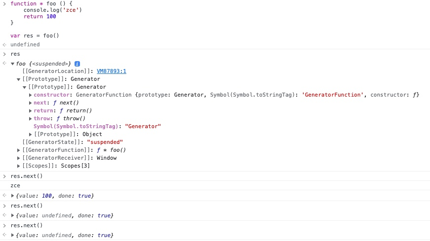

<!--
 * @Author: threeki 946629031@qq.com
 * @Date: 2022-11-29 15:29:56
 * @LastEditors: threeki 946629031@qq.com
 * @LastEditTime: 2022-12-03 15:06:46
 * @FilePath: /Blog/ES新特性 ES2015.md
 * @Description: 这是默认设置,请设置`customMade`, 打开koroFileHeader查看配置 进行设置: https://github.com/OBKoro1/koro1FileHeader/wiki/%E9%85%8D%E7%BD%AE
-->

- 目录
    - []()
    - [Set 数据结构](#Set-数据结构)
    - [Map 数据结构](#Map-数据结构)
    - [for...of 循环](#for...of-循环)
    - [可迭代接口 Iterable](#可迭代接口-Iterable)
    - [ES2015 实现可迭代接口](#ES2015-实现可迭代接口)
    - [迭代器模式](#迭代器模式)
    - [生成器 Generator](#生成器-Generator)
    - [生成器的应用](#生成器的应用)
    - []()
    - []()
    - []()
    - []()
    - []()


- ## Set 数据结构
    - ES2015 中提供了一个叫做 `Set` 的全新`数据结构`
        - 你可以把它理解为 `集合`
        - 他与传统的 `数组 Array` 非常类似
        - 但是 `Set 内部的成员 是不允许重复的`
            - 每一个值 在同一个 Set 中，都是唯一的
    - 基本用法
        ```js
        const s = new Set()

        s.add(1).add(2).add(3).add(4).add(2) // 由于 add() 方法可以返回 对象本身，所以可以链式调用

        // 如果添加了重复的值，那么添加的重复值 将被忽略掉

        console.log(s) // Set { 1, 2, 3, 4 }


        // 遍历 Set 集合对象

        s.forEach(item => console.log(item))

        for (const item of s) {
            
        }
        ```
    - Set 其它 api
        - [MDN Set 文档](https://developer.mozilla.org/zh-CN/docs/Web/JavaScript/Reference/Global_Objects/Set)
        ```js
        Set.prototype.size // 求 length
        Set.prototype.add()
        Set.prototype.clear() // 清楚所有值
        Set.prototype.delete() // 删除指定 值，return true/false
        Set.prototype.entries()
        Set.prototype.forEach()
        Set.prototype.has() // 是否包含 某个值
        Set.prototype.keys()
        Set.prototype.values()
        ```
    - Set 最常见的应用场景: 为数组去重
        ```js
        const arr = [1, 2, 1, 3, 4, 1]

        const result = new Set(arr)

        console.log(result) // Set { 1, 2, 3, 4 }

        // 把 Set对象 转化为 Array数组
        
        const res1 = Array.from(new Set(arr)) // 方式一
        
        const res2 = [ ...new Set(arr) ] // 方式二
        ```

- ## Map 数据结构
    - ES2015 还新增了一种数据结构: Map
        - Map 数据结构，与 对象Object 的数据结构非常类似

    - 那么为什么要新增 Map 对象? 原来的 Object 数据结构 有什么问题吗？
        - Object 存放一些复杂结构的数据时，会有一些问题
        ```js
        const obj = {}
        obj[true] = 'value'
        obj[123] = 'value'
        obj[{ a: 1 }] = 'value'

        console.log( Object.keys(obj) ) // [ '123', 'true', '[object Object]' ]
        ```
        - 通过上面的实验 我们发现
            - 如果 key 值传入的 不是 string 类型，那么他会默认进行 `把传入值.toString()` 的结果作为 key 的值
            - 所以上面, `true, 123, { a: 1}` 都变成了 `'123', 'true', '[object Object]'`
        - 那么，如果是这样
            - 如果我们把 `学生对象` 作为 `键`, 来存储 学生成绩
                - 这样的话 会没法区分
            ```js
            const obj = {}
            obj[{ name: 'studentA' }] = '123'
            obj[{ name: 'studentB' }] = '100'

            console.log( Object.keys(obj) ) // ['[object Object]']
            console.log( obj ) // {[object Object]: '100'}  // 虽然希望往数组里面存两组值，但是最终的结果 是只存了最后一组，因为前面的都被覆盖掉了

            console.log( obj['[object Object]'] ) // 100  // 如果这样取值，取出的值 不一定是预期的值
            ```
    - 那么 ES2015 的 Map 结构，就是用来解决这种问题的
        - Map 才能算是 真正意义上 `键值对集合`, 用来`映射两个 任意类型数据 之间的关系`
        - > Map 能够用任意类型数据 作为键, 而 Object 只能用字符串 作为键
        ```js
        const m = new Map()

        const tom = { name: 'tom' }

        m.set(tom, 90)

        console.log(m) // Map { { name: 'tom' } => 90 }

        m.get(tom) // 90  // 获取属性的值
        ```
    - 常用api
        - [MDN Map](https://developer.mozilla.org/zh-CN/docs/Web/JavaScript/Reference/Global_Objects/Map)
        ```js
        Map.prototype.size
        Map.prototype.clear()
        Map.prototype.delete()
        Map.prototype.entries()
        Map.prototype.forEach()
        Map.prototype.get()
        Map.prototype.has()
        Map.prototype.keys()
        Map.prototype.set()
        Map.prototype.values()
        ```
- ## for...of 循环
    - 在 ECMAScript 中，遍历数据有很多种方法
        - `for`循环，比较适合遍历 普通数组
        - `for...in`循环, 比较适合遍历 键值对
        - 一些函数式的遍历方法
            - Array.forEach
            - Array.map
            - ...等
    - 但是，这些遍历方式 都有一定的局限性
    - > ES2015 提供的新语法 for...of 循环
    - 所以 ES2015 它借鉴了很多其它的语言, `引入了全新的 for...of 循环`, 计划在以后的 ES 标准中 **`for...of 循环 将作为所有数据结构的统一方式`**
        - 换句话说，只要你明白 for...of 内部的工作原理，你就能使用它 去遍历任何数据
    - for...of 的基本使用
        ```js
        const arr = [111, 222, 333, 444]

        for (const item of arr) { // for...of 循环 拿到的是 item 本身，而不是 index
            console.log(item)
        }

        // 111
        // 222
        // 333
        // 444
        ```
        - for...of 循环能够使用 `break` 终止循环, 而 `Array.forEach` 是不能终止循环的
            - 以前我们为了能终止循环，会去使用
                - `Array.some()` 返回 true 可终止循环
                - `Array.every()` 返回 false 可终止循环
    - 遍历 Map 对象
        ```js
        const m = new Map()
        m.set('foo', '123')
        m.set('bar', '345')

        for ( const item of m ) { // 遍历 Map对象时，item 返回的是 键值对
            console.log(item)
        }

        // [ 'foo', '123' ]
        // [ 'bar', '345' ]
        ```
        - 使用数组的解构语法
        ```js
        const m = new Map()
        m.set('foo', '123')
        m.set('bar', '345')

        for ( const [key, value] of m ) { // 使用数组的解构语法
            console.log(key, value)
        }

        // 'foo' '123'
        // 'bar' '345'
        ```
    - 尝试遍历 普通对象
        ```js
        const obj = { foo: 123, bar: 456 }

        for ( const item of obj ) {
            console.log(item)
        }

        // Uncaught TypeError: obj is not iterable
        ```
        - 这时候会发现 代码自己报错了 `Uncaught TypeError: obj is not iterable`
        - 意思是说 obj 是不可被迭代的
    - 而我们开始 说的是 `for...of 是可以遍历所有数据结构的`
        - 但是这里实验发现，它连最基本的普通对象 `object` 都不能遍历
        - 那这究竟是为什么呢？
        - 这要看下一节: 可迭代接口
            - > `只要实现了 可迭代接口 的对象，都能被 for...of 遍历`


- ## 可迭代接口 Iterable
    - ES 中能够表示有结构的数据类型越来越多
        - 从最早的 Array, Object
        - 到现在的 Set, Map
        - 开发者还可以通过 组合使用 这些类型，来定制符合自己业务需求的 数据结构
    - **`为了给各种各样的 数据结构提供统一遍历方式, ES2015 提供了 Iterable 接口`**
        - 意思是可迭代的
        - 如果你不理解编程中 `接口` 的概念，你可以将其理解为一种 `规格标准`
            - 例如 我们在 ECMAScript 中，任意一种数据类型都有 `toString()` 方法，这是因为它们都实现了 `统一的规格标准`
                - 而在编程中，更专业的说法是，`它们都实现了 统一的接口`
    - **`实现 Iterable 可迭代接口，就是可以被 for...of 遍历的前提`**
    - 观察实验
        - 已知 `[], new Set(), new Map()` 都能被 `for...of` 循环遍历
        - 我们打开 Chrome 开发者工具, 分别输入 `[], new Set(), new Map()`, 然后 观察它们都有什么共同点
        - 
        - 在它们的 Prototype 原型上
        - 我们发现 都有一个 `Symbol(Symbol.iterator): ƒ values()`
            - 它的值 是一个函数
        -  **观察可得，`Iterable接口中，约定的是 对象中需要去 挂载 iterator() 方法`**
    - 那么这个 `iterator()` 方法有什么作用呢？ 下面我们再来实验一下
        - 
        - 在这个 迭代器对象 内部，应该是维护了一个 `数据指针`
        - 我们每调用一次 `next()`, 指针 就会往后移动一位
        - 然后返回 `迭代结果 iterationResult`: `{value: 11, done: false}`
            - `value` 是当前迭代结果值
            - `done` 表示是否迭代结束
        - 其实 这就是 `for...of` 循环的工作原理
    - 另外, `while 循环` 也能实现 `for...of` 相同的遍历

- ## ES2015 实现可迭代接口
    - ### 结论:
        ```js
        const obj = {                        // Iterable
            store: ['foo', 'bar', 'baz'],

            [Symbol.iterator]: function () { // Iterator: Symbol.iterator 是一个常量，所以要放在 计算属性名 的方式
                let index = 0
                const self = this
                
                return {                     // 返回一个 实现迭代器接口 的对象
                    next: function () {      // next方法 用于实现 向后迭代的逻辑
                        return {             // IterationResult: 返回 迭代结果对象
                            value: self.store[index],    // value 表示当前被迭代到的 数据
                            done: index++ >= self.store.length       // done 表示迭代是否 完成
                        }
                    }
                }
            }
        }
        ```
    - ### 推理过程:
        ```js
        const obj = {                        // Iterable
            [Symbol.iterator]: function () { // Iterator: Symbol.iterator 是一个常量，所以要放在 计算属性名 的方式
                return {                     // 返回一个 实现迭代器接口 的对象
                    next: function () {      // next方法 用于实现 向后迭代的逻辑
                        return {             // IterationResult: 返回 迭代结果对象
                            value: 'zce',    // value 表示当前被迭代到的 数据
                            done: true       // done 表示迭代是否 完成
                        }
                    }
                }
            }
        }
        ```

        - obj 是 `Iterable`, 内部要有一个 返回 `迭代器` 的 `iterator 方法`

        - `iterator 方法` (`[Symbol.iterator]: function () {}`) 返回的是 `Iterator` 
            - `Iterator` 内部要有一个 用于迭代的 `next 方法`

        - `next 方法` 返回到对象 叫做 `迭代结果 IterationResult`
            ```js
            { // 返回 迭代结果对象
                value: 'zce',
                done: true 
            }
            ```

        - ### 使用 for of 方法尝试遍历 obj
            ```js
            for (const item of obj) {
                console.log('循环体', item)
            }
            ```
            - 这里执行代码后发现，循环体 内的代码并没有被执行。原因是 `done 写死为了 true`


        - ### 实现
            ```js
            const obj = {
                store: ['foo', 'bar', 'baz'],

                [Symbol.iterator]: function () {
                    let index = 0
                    const self = this
                    
                    return {                     // 返回一个 实现迭代器接口 的对象
                        next: function () {      // next方法 用于实现 向后迭代的逻辑
                            return {             // IterationResult: 返回 迭代结果对象
                                value: self.store[index],    // value 表示当前被迭代到的 数据
                                done: index++ >= self.store.length       // done 表示迭代是否 完成
                            }
                        }
                    }
                }
            }


            for (const item of obj) {
                console.log('循环体', item)
            }

            // 循环体 foo
            // 循环体 bar
            // 循环体 baz
            ```

- ## 迭代器模式
    - 迭代器模式是什么？
        - 答：对外提供统一遍历接口。让外部不用关心 数据内部的结构。
    - 迭代器 有什么好处？
    - 场景重现：
        - 假如 我们现在要去协同开发一个 '任务清单' 应用,
        - A 的任务是 设计一个 用于存放 所有任务数据的对象
        - B 的任务是 要把所有数据 循环出来，并罗列到界面上
        ```js
        // A的代码 ###################################
        const todos = {
            life: ['吃饭', '睡觉', '学习'],
            learn: ['语文', '数学', '外语']
        }


        // B的代码 ###################################
        for (const item of todo.life) {
            console.log(item)
        }
        for (const item of todo.learn) {
            console.log(item)
        }
        ```
        - #### 存在的缺陷：
            - 上面这种写法，A和B的代码 是`高度耦合的`
            - 如果 A的数据结构发生了变化（增加了一个类别）
            - B的代码 也要跟着变化, 这样会导致事情变得 非常麻烦
            ```js
            // A的代码 ###################################
            const todos = [
                life: ['吃饭', '睡觉', '学习'],
                learn: ['语文', '数学', '外语'],
                work: ['喝茶'] // 增加一个 类别
            ]


            // B的代码 ###################################
            for (const item of todo.life) {
                console.log(item)
            }
            for (const item of todo.learn) {
                console.log(item)
            }
            for (const item of todo.work) { // 需要额外修改 代码
                console.log(item)
            }
            ```
        - #### 优化方法：对外暴露一个统一的遍历接口
            - 那么对于 调用者而言，就不再需要关心 内部的数据结构是怎样的了，只要调用 遍历接口即可。
            - 更不用担心 内部的数据结构改变后，会产生什么影响

            ```js
            // A的代码 ###################################
            const todos = {
                life: ['吃饭', '睡觉', '学习'],
                learn: ['语文', '数学', '外语'],
                work: ['喝茶'],

                each: function (callback) {
                    const all = [].concat(this.life, this.learn, this.work)
                    for (const item of all ) {
                        callback(item)
                    }
                }
            }


            // B的代码 ###################################
            // for (const item of todo.life) {
            //     console.log(item)
            // }
            // for (const item of todo.learn) {
            //     console.log(item)
            // }
            // for (const item of todo.work) {
            //     console.log(item)
            // }

            // 对于B来说 只要调用 遍历接口即可
            todos.each(function (item) {
                console.log(item)
            })
            ```
        - #### 使用迭代器 的方式来实现这个 遍历接口
            ```js
            // A的代码 ###################################
            const todos = {
                life: ['吃饭', '睡觉', '学习'],
                learn: ['语文', '数学', '外语'],
                work: ['喝茶'],

                each: function (callback) {
                    const all = [].concat(this.life, this.learn, this.work)
                    for (const item of all ) {
                        callback(item)
                    }
                },

                [Symbol.iterator]: function () {
                    const all = [...this.life, ...this.learn, ...this.work]
                    let index = 0

                    return {
                        next: function () {
                            return {
                                value: all[index],
                                done: index++ >= all.length
                            }
                        }
                    }
                }
            }


            // B的代码 ###################################
            // for (const item of todo.life) {
            //     console.log(item)
            // }
            // for (const item of todo.learn) {
            //     console.log(item)
            // }
            // for (const item of todo.work) {
            //     console.log(item)
            // }

            // 对于B来说 只要调用 遍历接口即可
            todos.each(function (item) {
                console.log(item)
            })

            for (const item of todos) { // 调用迭代器方法
                console.log(item)
            }
            ```
        - 总结
            - 上面的 each 方法，只适用于 当前这个对象结构
            - 而 `ES2015 中的迭代器，它是 语言层面实现的` 迭代器模式。所以它可以适用于 任何数据结构，只需要你通过代码去实现 Iterator 方法


- ## 生成器 Generator
    - 生成器 Generator 有什么作用？
        - > 避免异步编程过程中 回调嵌套过深 <br> 提供更好的 异步编程解决方案
    ```js
    function * foo () {
        console.log('zce')
        return 100
    }

    const res = foo()
    console.log(result.next())
    ```
    - 

    - 执行 `res.next()`
        - 执行了 函数体代码
        - 然后 函数的返回值 放在了 value 的值中 `{value: 100, done: true}`
    - `生成器对象` 也实现了 `Iterator 接口`
    - 但是，到这里 如果只是这样去使用的话，根本看不出 生成器函数的作用
        - 因为生成器函数 在使用的时候，一定会配合一个关键字 `yield` 去使用
        - `yield` 关键词 和 `return` 非常类似 又有很大的不同
            -  `yield` 关键词
                - 
            - `return` 关键词
                - 
    - ### 执行了 生成器函数后，返回的是 `生成器对象 Generator`
        - 生成器对象 有两个状态
        - 暂停态 suspended
            - 
        - 结束态 closed
            - 

- ## 生成器的应用
    - 案例1: 发号器 / 生成 ID 且永远不重复
        ```js
        function * createIdMaker () {
            let id = 1
            while (true) {
                yield id++
            }
        }

        const idMaker = createIdMaker()

        console.log( idMaker.next().value ) // 1
        console.log( idMaker.next().value ) // 2
        console.log( idMaker.next().value ) // 3
        console.log( idMaker.next().value ) // 4
        ```
    - 案例2: 使用 Generator 函数实现 iterator 方法
        - 使用生成器 实现对象的 iterator方法
        ```js
        const todos = {
            life: ['吃饭', '睡觉', '打豆豆'],
            learn: ['语文', '数学', '外语'],
            work: ['喝茶'],
            [Symbol.iterator]: function * () {
                const all = [ ...this.life, ...this.learn, ...this.work ]
                for (const item of all) {
                    yield item
                }
            }
        }

        for (const item of todos) {
            console.log(item)
        }
        ```


- [学不动系列：从es2016-es2019](https://zhuanlan.zhihu.com/p/59096242)