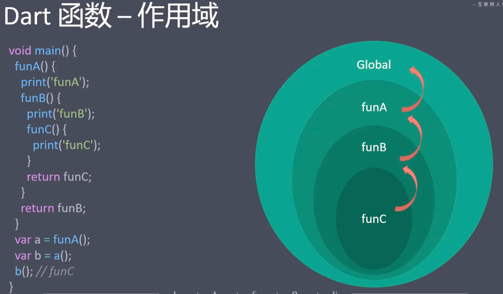

# Flutter

目录
- [1-1 Flutter简介](#1-1-flutter简介)
- [1-2 搭建 Mac下的iOS环境](#1-2-搭建-mac下的ios环境)
- [2-2](#2-2-dart-语法基础)
    - [语法基础](#语法基础)
    - [代码注释](#代码注释)
    - [运行代码](#运行代码)
    - [数据类型]()
        - [数据类型 - Number](#数据类型---number)
        - [数据类型 - List](#数据类型---list)
        - [数据类型 - Set](#数据类型---set)
        - [数据类型-Map](#数据类型-map)
        - [数据类型-其他: Runes , Symbol , Dynamic](#数据类型-其他-runes--symbol--dynamic)
        - []()
        - []()
        - []()
        - []()
        - []()
        - []()
        - []()
- []()
- []()
- []()
- []()
- []()
- []()


----


- # 1-1 Flutter简介
    - Flutter 是谷歌开发的一款开源、免费的,基于 `Dart 语言`的 UI框架,可以快速在 iOS 和 Android上构建高质量的原生应用。 它最大的特点就是`跨平台`和`高性能`。

    - Dart 是由谷歌,在2011年开发的计算机编程语言,它可以被用于 Web、服务器、移动应用和物联网等多个领域。`号称要取 代 JavaScript`。

    - 跨平台(适用多个终端)
        - 移动端
            - Android
            - iOS
        - Web端(各种浏览器)
        - 桌面(Windows、Mac)
        - 嵌入式平台(Linux、Fuchsia)

    - 高性能
        - Flutter 应用的性能,接近原生App.
        - Flutter 采用GPU (图形显示)渲染技术。
        - Flutter 应用的刷新频率可达120 fps (120帧每秒)
        - 可以用 Flutter 来开发游戏
        - React Native 应用的刷新频率只能达到60fps (60帧每秒)

    - 发展历程
        - 2015,Flutter(当时叫 Sky)在Dart 开发者峰会上亮相
        - 2018-6,Flutter 发布了首个预览版本
        - 2018-12,Flutter 1.0 发布
        - 2019-9, Flutter 1.9 发布,添加 Web 端支持
        - 2020-9, Flutter 1.22 发布,带来了对iOS 14 和 Android 11 的支持
        - 当前版本: Flutter 1.22.5

        > 跨平台的直接好处是减少开发成本 \
        > Flutter 的野望,是一统天下

        > 2010年 Google推出两种编程语言
        > - Dart语言 推出的初衷是想 统一`前端`编程语言
        > - Go语言 &nbsp;&nbsp; 推出的初衷是想 统一`后端`编程语言


    - ## 移动App 的开发模式

        | | | |
        |---|---|---|
        原生开发 | 原生 App | Android、 iOS、 Windows
        混合开发 | 混合 App | React Native、 Weex、 Flutter
        H5 | Web App | HTML、CSS、JavaScript


    - ## 跨平台框架的比较

        框架 | React Native | Weex | Flutter
        | --- | --- | --- | --- |
        所属公司 | Facebook | Alibaba | Google
        编程语言 | JavaScript (React) | JavaScript (Vue) | Dart
        引擎 | JSCore | V8 | Flutter engine 
        支持系统 | Android, iOS | Android、iOS、Web | Android、iOS、Fuchsia 
        性能 | 一般 | 较快 | 较快
        适用场景 | 整体 App | 单页面 | 整体 App
        学习成本 | 难 | 易 | 一般


    - ## 移动App的开发模式

        开发模式 | 原生开发 | 混合开发 | Web 开发
        | --- | --- | --- | --- |
        运行环境 | Android, iOS | Android, iOS | 浏览器、WebView
        编程语言 | Java、Objective-C | JavaScript、Dart | HTML、CSS、Javascript
        可移植性 | 差 | 一般 | 好
        开发速度 | 快 | 一般 | 好
        性能 | 快 | 较慢 | 慢
        学习成本 | 高 | 一般 | 低


    - ## Flutter资源网站
        - 官网
            - https://flutter.dev/
        - Github
            - https://github.com/flutter/flutter
        - 中文网
            - https://flutterchina.club/
            - https://flutter.cn/


- # 1-2 搭建 Mac下的iOS环境
    - 在 macOS 上安装和配置 Flutter 开发环境, 官网: https://flutter.cn/docs/get-started/install/macos

    - JDK | Android Studio
    - Xcode
        - IOS模拟器
    - IOS 环境依赖
        - `brew install ideviceinstaller ios-deploy cocoapods`
    - Flutter SDK
        - 直接下载
        - 通过Git下载

    - ## 常用命令
        - ```flutter doctor```
            - 通过运行以下命令来查看当前环境是否需要安装其他的依赖（如果想查看更详细的输出，增加一个 -v 参数即可）
        - `flutter emulators`
        -  `open -a simulator`

- # 1-3 初始化项目

    - 通过命令行
        - `flutter create myproject`
        - `cd myproject`
        - `flutter run`
        - `flutter emulators --launch 模拟器id` 启动模拟器
    - 通过 Android Studio
        - 必须安装 Flutter 插件
    - 通过 VS Code
        - 必须安装 Flutter 插件


    - 修改国内镜像源
        - 修改镜像源只需要改一次,再次启动时,无需再改
            > 国内特有的问题,防止启动应用时,访问不到 google 等国外资源

        - 在运行 flutter 项目之前,需要先修改运行项目必须的资源路径。需要改两个文件
            - flutter项目/android/build.gradle
            - Flutter SDK 包下的 flutter.gradle 文件 

        - 接下来,我们依次介绍。

        - 修改文件 flutter项目 `/android/build.gradle`, 把 `google()` 和 `jcenter()` 这两行去掉。改为阿里的链接。

        - 阿里云镜像详情: https://maven.aliyun.com/mvn/guide

            ```
            // google()
            // jcenter()
            maven { url 'https://maven.aliyun.com/repository/google' }
            maven { url 'https://maven.aliyun.com/repository/jcenter' }
            maven { url 'https://maven.aliyun.com/repository/public' }
            ```

- # 2-1 Dart 简介
    - Dart 资源网站
        - ·官网
            - 英文 https://dart.dev/
            - 中文 https://dart.cn/
        - 在线运行代码
            - https://dartpad.dartlang.org/
            - https://dartpad.cn/
        - 生态
            - https://pub.dev/

        - Dart 官网介绍: https://dart.cn/get-dart


    - Dart 是谷歌开发的, `类型安全的, 面向对象`的编程语言,被应用于 `Web、服务器、移动应用和物联网`等领域。
    - Dart 诞生于2011年10月10日
    - Dart简单易学(类似TypeScript, 是强类型的语言)
    - 运行方式
        - 原生虚拟机(Dart 代码可以运行在 Windows, Mac、Linux 上)
        - JavaScript 引擎(Dart 代码可以转成JS代码,然后运行在浏览器上)


    Dart | JavaScript
    |---|--|
    Dart | JavaScript
    Flutter | React
    https://pub.dev | https://npmjs.com
    pub | npm


    - Dart 环境搭建
        - 从 Flutter 1.21 版本开始, Flutter SDK 会同时包含完整的 Dart SDK。
        - 如果你已经安装了 Flutter,就无需再下载 Dart SDK了
            - program (D:) > flutter > bin
                - cache
                - internal
                - dart
                - `dart.bat  // Dart 命令行`
                - flutter
                - flutter.bat


    - Dart 环境搭建-绑定环境变量
        - 先确定 Flutter SDK 的安装路径
            - 例如:我的 Flutter SDK 安装路径是 D:\flutter
        - D:\flutter\bin
            - Flutter 和 Dart 的相关的执行命令
        - D:\flutter\bin\cache\dart-sdk\bin 
            - Dart SDK 的相关命令的执行路径
        - D:\flutter\.pub-cache\bin
            - Pub 下载的公共模块的执行路径


        ```
        program (D:) » flutter > bin > cache > dart-sdk > bin
            + resources
            + snapshots
            + utils

            - dart.exe
            - dart2js.bat
            - dart2native.bat
            - dartanalyzer.bat
            - dartaotruntime.exe
            - dartdevc.bat
            - dartdoc.bat
            - dartfmt.bat
            - pub.bat
        ```


- # 2-2 Dart 语法基础
    ```dart
    // 声明函数
    void printInteger(int aNumber) {
        print('The number is $aNumber.'); // 打印到控制台
    }

    // 入口文件-应用从这里开始执行。
    void main() {
        var number = 42; // 声明并初始化一个变量。 
        printInteger(number); // 调用函数
    }
    ```
    - ## 语法基础
        > 从以上 代码中可以看出
        - 注释语法与JS 一致
        - 声明函数不需要关键字 (JS 中通过 function 关键字来声明函数)
        - 函数和参数前面都有类型声明, void表示没有返回值, int 是整型数字
        - 打印使用 print (JS 使用 console.log())
        - 每行代码结束时, 必须写结束分号(;)
        - 字符串通过引号包起来, 支持模板字符串
        - main 是入口函数, Dart 应用程序总是从 main 函数开始执行
        - 用 var 声明的变量,其数据类型是动态的
            - var 声明变量, 意思是 变量类型 是动态类型，即 变量类型可以改变


    - ## 代码注释
        - 单行注释
            ```dart
            //我是单行注释
            ```
        - 多行注释
            ```dart
            /* 我是多行注释 */
            ```
        - 文档注释
            ```dart
            /// 我是文档注释
            ```
            可以通过dartdoc 将注释转成文档 (文档注释支持 markdown 语法)


    - ## 运行代码
        - 在命令行中运行
        ```dart
        dart hello.dart
        ```
        - Dart 执行文件中的 main 函数
        ```dart
        void main() {
            print('Hello, World');
        }
        ```
        - 输出 Hello, World


    - ## 变量
        - 变量是一个引用,Dart 万物皆对象,变量存储的是对象的引用
        - 声明変量
            - 明确指定类型: `int age = 18;`
            - 不明确类型: `var age=18;或dynamic age = 18;`

        - 变量名大小写敏感(age 与Age 是两个不同的变量)
        - 变量默认值是 null (`JS中变量默认值是undefined`)
        - Dart 变量的值不会进行隐式转换(null 不会自动转成 false)


    - ## 常量
        - 常量就是值不可变的变量(一旦声明,其值不能更改)
        - 声明常量
            - `const age = 18;`
            - `final age = 18;`
        - const 与 final 的区别
            - `const time = DateTime.now();` // **`报错`**-无法将运行时的值分配给 const 变量
            - `final time = DateTime.now();` // **`成功`**-可以将运行时的值分配给 final 变量


    - ## 数据类型
        - ### 数据类型 - Number

        - ### 数据类型 - List
            - Dart 中的数组,由 List 对象表示。 List 有两种声明方式
                - 字面量方式
                    ```
                    List list = []; //不限定元素的数据类型
                    List list = <int>[]; //限定元素的数据类型是 int   // <泛型>
                    ```
                - 构造函数方式
                    ```
                    List list = new List.empty(growable: true);//不限制长度的空列表
                    List list = new List.filled(3, 0); //声明指定长度的填充列表
                    ```
            - 扩展操作符(..)
                ```
                var list = [1, 2, 3];
                var list2 = [0, ...list]; // [0,1,2,3]
                ```
            - 常用 API
                - https://api.dart.cn/stable/dart-core/List-class.html


                ```dart
                // List 常用 API

                void main() {
                    // 声明List - 字面量
                    List l1 = ['a', 'b', 'c', 1, 2, 3];
                    print(l1);

                    List l2 = <int>[1, 2, 3]; // 限定元素类型的声明方式
                    print(l2);

                    // 通过构造函数的声明方式
                    var l3 = new List.empty(growable: true);
                    l3.add(1);
                    print(l3);


                    var l4 = new List.filled(3, 6);
                    print(l4);


                    // 扩展操作符
                    var l5 = [0, ...14];
                    print(l5);

                    var l6;
                    var l7 = [7, ...?l6];
                    print(l7);


                    // 返回列表的长度
                    print(l1.length);

                    // 列表的反转
                    print(l1.reversed.toList());

                    // 添加元素
                    l3.addAll([4,5,6]);
                    print(l3);

                    // 删除元素 
                    l3.remove(6);
                    print(l3);

                    // 根据下标删除元素
                    // l3.removeAt(index)
                    l3.removeAt(1);
                    print(l3);

                    // 在指定的位置添加元素
                    l3.insert(1, 9);
                    print(l3);

                    // 清空
                    l3.clear();

                    print(l3.length); // 0
                    print(l3.isEmpty); // true

                    // 合并元素
                    List words = ['Hello', 'World'];
                    print(words.join('-')); // Hello-World
                }


                6
                [3, 2, 1, c, b, a]
                [1, 4, 5, 6]
                [1, 4, 5]
                1
                [1, 5]
                [1, 9, 5]
                ```

        - ### 12.数据类型_List（下）.mp4


        - ### 数据类型 - Set
            - > Set 是一个 **`无序的, 元素唯一的集合`**
            - Set 有字面量和构造函数两种声明方式 (`字面量中用大括号`)
            - 无法通过下标取值
            - 具有集合特有的操作
                - 例如:求交集,并集、差集等
            - 常用 API
                - https://api.dart.cn/stable/dart-core/Set-class.html


            ```dart
            // Set 

            void main() {
                // 字面量
                var nums = <int>{1, 2, 3};
                print(nums); // {1, 2, 3}

                // 构造函数
                var fruits = new Set();
                fruits.add('香蕉');
                fruits.add('苹果');
                fruits.add('橘子');
                print(fruits);          // {香蕉, 苹果, 橘子}
                print(fruits.toList()); // [香蕉, 苹果, 橘子]
                
                List myNums = [1, 2, 3, 3, 4];
                print(myNums.toSet()); // 可将重复的元素过滤掉
                // [1, 2, 3, 4]


                // 集合特有的操作
                var caocao = new Set();
                caocao.addAll(['张辽', '司马懿', '关羽']);

                var liubei = new Set();
                liubei.addAll(['关羽', '张飞', '诸葛亮']);

                // 求交集
                print(caocao.intersection(liubei)); // {关羽}
                // 求并集
                print(caocao.union(liubei)); // {张辽, 司马懿, 关羽 张飞, 诸葛亮}
                // 求差集
                print(caocao.difference(liubei)); // {张辽, 司马懿}


                // 返回第一个元素
                print(caocao.first); // 张辽
                // 返回最后一个
                print(caocao.last); // 关羽

                // 集合不能通过下标取值
                // print(caocao[1]);
            }
            ```


        - ### 数据类型-Map
            - Map 是一个无序的 **`键值对(key-value) 映射`**。通常被称作 **`哈希`** 或 **`字典`**。
            - 声明方式
                - `var map = {key1: value1, key2: value2};`
                - `var map = new Map();`
                - `map['key'] = value;`
            - 常用API
                - https://api.dart.cn/stable/dart-core/Map-class.html


            ```dart
            void main() {
                // 字面量
                var person = {
                    'name': '张三',
                    'age': 20
                };
                print(person); // { 'name': '张三', 'age': 20 }

                // 构造函数
                var p = Map();
                p['name'] = '李四';
                p['age'] = 22;
                print(p); // { 'name': '李四', 'age': 22 }


                // 访问属性
                print(p['name']); // 李四


                // 判断 Map 中的 key 是否存在
                print(p.containsKey('name')); // true
                print(p.containsKey('aaa')); // false

                // 赋值
                // putIfAbsent, 如果 key 不存在,我们才赋值(如果key已经存在,则不赋值)
                p.putIfAbsent('gender', () => '男');
                print(p);
                p.putIfAbsent('gender', () => '女');
                print(p);


                // 获取 Map 中所有的 key
                print(p.keys);
                // 获取 Map 中所有的 value
                print(p.values);

                // 根据条件进行删除
                p.removeWhere((key, value) => key == 'gender')
                print(p); // { 'name': '李四', 'age': 22 }
            }
            ```


        - ### 数据类型-其他: Runes , Symbol , Dynamic
            - ### Runes (符文)
                - Runes 对象是一个32位字符对象。它可以把文字转换成符号表情或特定的文字
                - print('\u{1f44d}') => 👍
                ```dart
                Runes unicodeCharacters = new Runes('\u2665 \u{1f680} \u{1f30d}');
                ```
                - https://copychar.cc/
            - ### Symbol
                - 在 Dart 中符号用#开头来表示的标识符
                ```dart
                Symbol mySymbol = #exampleSymbol;
                ```
            - ### Dynamic
                - 动态数据类型
                - dynamic 不属于基本数据类型

                ```dart
                dynamic dynamicVar = 42; // 可以存储整数
                print(dynamicVar); // 输出: 42

                dynamicVar = "Hello, Dart!"; // 可以存储字符串
                print(dynamicVar); // 输出: Hello, Dart!

                dynamicVar = true; // 也可以存储布尔值
                print(dynamicVar); // 输出: true
                ```

            ```dart
            void main() {
                var str = '😀';
                print(str);
                print(str.length); // UTF-16            // 2
                print(str.runes.length); // UTF-32      // 1

                // Runes 可以将 UTF-32 字符集表示的内容转成符号 
                Runes input = new Runes('\u{1f680}');
                print(new String.fromCharCodes(input)); // 😀

                // Symbol
                var a = #abc; 
                print(a);   // Symbol("abc")
                var b = new Symbol('abc');
                print(b);   // Symbol("abc")

                print(#abc == new Symbol('abc');  // true
            }
            ```

            - 字符集和字符编码
                - 最基本的字符集: ASCII码 -> UTF-8 -> UTF-16 -> -> UTF-32, 它们是不断呢扩充的关系

                - dart 中的字符集 就是 UTF16


                - UTF32 编码有一个规则: 
                    - 如果长度不超过4位，可以直接写，如: `'\u{1f680}'`
                    - 如果长度超过4位，则要写大括号，如: `'\u{1f680}'`


                - [字符集和字符编码](https://www.itbirds.top/show/ad469c97f802ced547c6f36087760c36.html)
                    - Unicode 是国际标准字符集
                    - 字符集是很多个字符的集合，例如 GB2312 是简体中文的字符集，它收录了六千多个常用的简体汉字及一些符号，数字，拼音等字符

                    - 字符编码是 字符集的一种实现方式，把字符集中的字符映射为特定的字节或字节序列，它是一种规则

                    > Unicode **`只是字符集`** <br>
                    > UTF-8、UTF-16、UTF-32 **`才是真正的字符编码规则`**

    - ## Dart 运算符
        - 地板除(~/)
        - 类型判断运算符 (is | is!)
        - 避空运算符(?? | ??=)
        - 条件属性访问(?)
        - 级联运算符(..)
            ```dart
            myObject.myMethod(); //返回 myMethod 的返回值
            myObject.myMethod();//返回 myObject 对象的引用
            ```

        ```dart
        void main() {
            // 地板除
            print(7 ~/ 4); // 1

            // 类型判断运算符
            List list = [];
            if (list is List)
                print('list is List');
            }else {
                print('list is not List');
            }

            if (list is! List) {
                print('不是列表');
            } else {
                print('是列表');
            }


            // 避空运算符
            print(1 ?? 3); // 返回 1
            print(null ?? 12); // 返回 12

            var foo;
            // foo = 6;
            print(foo ?? 0); // 如果 foo 是 null, 则返回 0


            var a;
            // if (a == null) {
            //   a = 3;
            // }
            a ??= 3;
            print(a); // 3
            a ??= 6; // 如果a不是null,则赋值失败
            print(a); // 3


            // 条件属性运算符(保护可能为空的属性)
            var m = new Map();
            print(m.length);
            var obj;
            // print(obj.length); // The getter 'length' was called on null.
            print(obj?.length); // null


            // 级联运算符
            // Set s = new Set();
            // s.add(1);
            // s.add(2);
            // s.add(3); //s.remove(2);
            // print(s); // {1, 3}

            Set s = new Set();
            s..add('a')
             ..add('b')
             ..add('c')
             ..remove('b');
            print(s); // {a, c}
        }
        ```

    - ## Dart函数-声明函数

        - 直接声明
            - Dart 中声明函数不需要 function 关键字
        - 箭头函数
            - Dart 中的箭头函数中, **`函数体只能写一行且不能带有结束的分号`**
            - 箭头函数 函数体内 只能写一行
            - Dart 中的箭头函数, 只是函数的一种简写形式
            - 箭头函数 又叫 Lambda 函数 (JAVA中)
        - 匿名函数
        - 立即执行函数

        ```dart
        // Dart 中声明函数,不需要 function 关键字
        void printInfo() {
            print('Hello, World');
        }

        // 返回值,与函数声明的类型要一致
        int getNum() {
            // return 'Hello'; // 不能返回字符串类型
            return 1;
        }


        void main() {
            // 调用函数
            printInfo();

            print(getNum());

            // 匿名函数
            var myPrint = (value) { // 等号后面是 匿名函数
                print(value);
            };
            List fruits = ['苹果','香蕉','猕猴桃'];
            // fruits.forEach((element) { }) // 匿名函数
            fruits.forEach(myPrint);


            // 箭头函数
            // fruits.forEach((element) => { });
            fruits.forEach((element) => {
                print(element) // 箭头函数中,不能写结束的分号(;) // 箭头函数 函数体内 只能写一行
            });
            fruits.forEach((element) => print(element));


            // 立即执行函数
            ((int n){ 
                print(n);
            }) (17);
        }
        ```


    - ## 函数参数
    - ## 作用域和闭包
        - dart 的闭包 和 JS的闭包 一摸一样
        - 作用域链
            - 内层函数 能访问 外层函数的变量
            - 一层一层往外 链接起来，这就称之为 作用域链
            ```dart
            void main () {
                funA () {
                    print('funA');

                    funB () {
                        print('funB');

                        funC () {
                            print('funC');
                        }
                        return funC;
                    }
                    return funB;
                }

                var a = funA();
                var b = a();
                b(); // funC
            }
            ```
            - 

        - 闭包出现的原因
            - 全局变量：我们可以在 任何地方 访问全局变量。但是 因此全局变量也 很容易被污染
            - 局部变量：只能在 函数内部 访问，有安全边界 可以减少被污染的几率
            > 介于 全局变量 和 局部变量 之间的优缺点，我们我们有一个折中的方案，就是 **`闭包`** <br><br>
            > 闭包使用时机: 既能 **`重用变量，又不想 变量被污染`** <br><br>
            > **`闭包实现原理`**: 外层函数被调用后，外层函数的作用域对象 (AO) 被内层函数引用着，导致外层函数的作用域对象 无法释放，从而形成闭包 <br><br>
            > 闭包使用场景: 函数作为返回值，函数作为参数传递 <br><br>

            - 闭包：函数和变量 共同构成一个 闭包

        ```dart
        void main () {
            var globalNum = 100;

            printInfo () {
                // 局部变量
                var localNum = 10;
                localNum --;
                print('localNum: $localNum');
                print('globalNum: $globalNum'); // 我们可以在 函数内部 作用域中，访问 全局变量
            };

            printInfo();
            // print(localNum); // 不能在全局作用域中，访问 局部变量


            printInfo(); // 9 // 100
            printInfo(); // 9 // 100
            printInfo(); // 9 // 100
            // 每次 执行函数，都是重新 声明变量，所以多次调用 同一函数 结果都一样


            // 闭包
            parent () {
                var money = 1000;
                return () {
                    money -= 100;
                    print('parent: $money');
                };
            }

            var p = parent();
            p(); // 900
            p(); // 800
            p(); // 700

            // 内层函数执行完，只会释放内层 函数的作用域
            // 但是不会释放 外层函数的作用域，所以 变量 money 会被一直保留
        }
        ```


    
    - ## Dart 函数-异步函数
        - JavaScript 中,异步调用通过 Promise 来实现
            - async 函数返回一个 Promise, await 用于等待 Promise
        - Dart 中,异步调用通过 Future 来实现
            - async 函数返回一个 Future, await 用于等待 Future
        - Future 详情
            - https://api.dart.dev/stable/dart-async/Future-class.html


        ```dart
        import 'package:http/http.dart' as http;
        import 'dart:convert';

        Future getIPAddress() async {
            final url = 'https://httpbin.org/ip'; // 访问这个地址 可以返回 当前机器的IP
            final response = await http.get(url);
            String ip = json Decode(response.body)['origin'];
            return ip;
        }


        void main () async {
            try {
                final ip = await getIPAddress();
                print(ip);
            } catch (e) {
                print(e);
            }
        }
        ```

        - https://pub.dev/packages/http/install
            - `pubspec.yaml` 相当于 `package.json`

            ```
            // pubspec.yaml

            dependencies:
                http: ^1.1.2
            ```