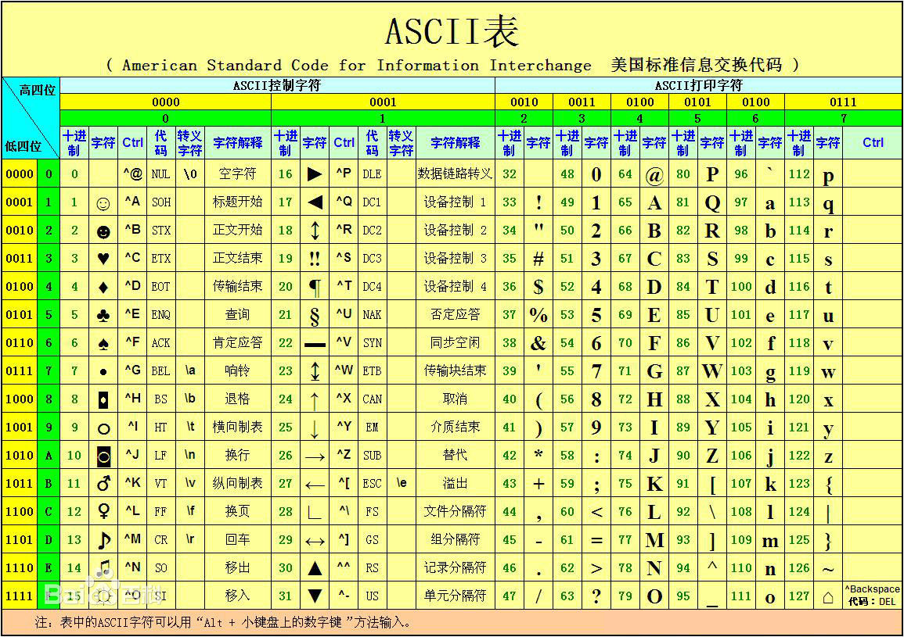
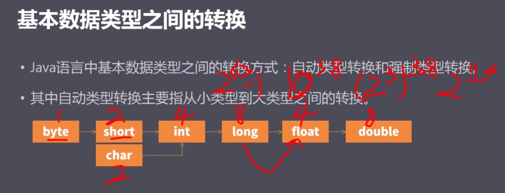

<!--
 * @Author: your name
 * @Date: 2022-02-09 15:14:55
 * @LastEditTime: 2022-02-23 10:49:12
 * @LastEditors: Please set LastEditors
 * @Description: 打开koroFileHeader查看配置 进行设置: https://github.com/OBKoro1/koro1FileHeader/wiki/%E9%85%8D%E7%BD%AE
 * @FilePath: /Blog/JAVA入门.md
-->

# Java语言基础
## 第8讲Java语言的主要版本

- ### Java语言的发展历史
    - 1995年Java问世
    - 1996年Java 1.0
    - 1999年Java 1.2发布( JAVA SE、JAVA EE、JAVA ME )
    - 2004年Tiger 发布(JAVA5.0)，Java登录火星
    - 2011年7月由Oracle正式发布Java7.0
    - 2014年3月19日, Oracle公司发布Java8.0的正式版
    - 2017年9月21日, Java9.0正式发布
    - 2018年9月25日, Oracle官方宣布Java11正式发布 (Java11 是 LTS 长期支持版)

    ```
    本课程 主要讲解的是 Java11 版本
    ```


    ### 桌面应用 Java SE
    - Java SE ( Java Platform, Standard Edition) 称之为"Java平台标准版”，是Java平台的基础。
    - SE 是JAVA 基础语法知识 (类似于 小学语文的 学字、认字)
    - Java SE包含了运行Java应用所需要的基础环境和核心类库。
    - Java SE还定义了基于桌面应用的基础类库,通过使用这些类库，我们可以编写出类似于像Office那样的丰富多彩的桌面应用。


    ### 企业应用 Java EE
    - Java EE ( Java Platform，Enterprise Edition) 称之为"Java平台企业版”。
    - Java EE构建在 **`Java SE基础之上`** , 用于构建企业级应用。所谓企业级应用是指那些为商业组织、大型企业而创建的应用系统,例如: 电信的“计费系统”、银行的"网银系统”、企业中的“客户关系管理系统"等等。


    ### 移动应用 Java ME
    - Java ME ( Java Platform , Micro Edition) 称之为Java平台微型版。
    - 为机顶盒、移动电话和PDA等嵌入式消费电子设备提供的Java解决方案。
    随着3G移动智能平台时代的到来,特别是以Java为核心编程语言的 `Android智能平台` 的迅速普及, Java ME已经 **`走向每汰`**


## 第9讲开发工具的下载和安装
任务一:初识计算机和Java语言

- ### 搭建开发环境
    - 开发工具的下载和安装
        - 下载方式
            - 方式一:通过官网下载
                - www.sun.com
                - www.oracle.com

            - 方式二:通过搜索下载
                - www.baidu.com
                - www.sogou.com
        - 找到 `JDK Download`, 点击下载

        - 安装
            - 若下载的是安装版,则一路点击下一步安装即可;
            - 若下载的是绿色版,则直接解压即可;
            - 无论是安装版还是绿色版,切记安装的 **`路径中不要有中文!`**
    
    - java常用命令
        ```
        java           查看是否安装了 java
        java -version  查看版本
        /usr/libexec/java_home -V  查看java安装位置
        ```

    - #### JDK
        - JAVA开发工具包的 简称


## 第10讲相关的概念
- ### JDK 的目录结构
    > 打开 Java11 JDK 安装目录

    - `bin` ==> binary 二进制
    - `conf` ==> config 配置文件
    - `include` ==> 里面放的是 .h 结尾的 头文件
    - `jmods` ==> 模块信息
    - `legal` ==> 授权文件
    - `lib` ==> library 库
        - `src.zip`
            - lib 里面有一个重要的文件 src.zip, 解压后得到 `src目录`
        - `src/java.base/java/lang` 目录下
            - Float.java
            - Integer.java
            - Math.java
            - Number.java
            - Object.java
            - String.java
            - ...


    ```
    - bin目录 - 该目录下主要存放JDK的各种工具命令
    - conf目录 - 该目录下主要存放jdk的相关配置文件
    - include目录 - 该目录下主要存放了一些平台的头文件
    - jmods目录 - 该目录下主要存放了JDK的各种模块
    - legal目录 - 该目录下主要存放了JDK各模块的授权文档
    - lib目录 - 该目录下主要存放了JDK工具的一-些补充jar包和源代码
    ```

    > Java 11 和 Java 8 的目录结构是不一样的 <br>
    > Java 11 的 JDK 目录下 没有 JRE, 和 Java 8 不一样

- ### JDK
    - 称为Java开发工具包 (Java Development Kit)。
    - Java开发人士需要下载和安装JDK ,目前的主流版本为JDK11。

- ### JRE
    - 称之为Java SE **`运行时环境`** (Java SE Runtime Environment)
    - 提供了运行Java应用程序所必须的软件环境等。无论是开发还是运行Java应用都必须安装。


    > 开发过程 可以只用 JDK <br>
    > 运行时 必须有 JRE <br>
    > 开发好的 Java 程序, 在客户端上运行 可以只有 JRE 就行 <br>

- ### JVM
    - Java 虚拟机, Java Virtual Machine
- ### javac.exe
    - 编译器, 主要用于 将高级Java源代码 翻译成字节码文件
- ### java.exe
    - 解释器, 主要用于 启动JVM 对字节码文件 进行解释并执行

- JDK, JRE, JVM 之间的关系
- 


## 编写Java程序的流程
- ### Java开发的常用工具
    - 文本编辑器( TE , Text Editor )
        - 记事本、Notepad++、 Edit Plus、UltraEdit、
    - 集成开发环境( IDE , Integrated Development Environment )
        - Eclipse(免费)、 MyEclipse(收费)、 IDEA(收费)、Jbuilder、NetBeans、 ...

- ### 编写流程
    - 新建文本文档，将文件扩展名由 HelloWorld.txt 修改为 HelloWorld.java 
    - 使用 记事本/Notepad++ 的方式打开文件, 编写Java代码后进行保存
    - 启动 命令行窗口, 并切换到java文件所在的路径中
    - 使用 `javac HelloWorld.java` 进行编译, 生成 `HelloWorld.class` 的字节码文件
    - 使用 `java HelloWorld` 进行解释执行，打印最终结果 (执行 HelloWorld.class 文件)

- java注释
    ```java
    /*
     * 注释内容
     */
    ```
- HelloWorld.java
    ```java
    /*
     * 项目名称：第一个Java程序
     * 项目功能：打印一句话
     * 作   者：张三
     * 版   本：v1.0
     * 所有者：拉勾教育
     * 备   注：请大家集中注意力哦！
     */

    /*
     HelloWorld 是类名
     类名要跟文件名保持一致

     {} 花括号内的部分 叫做 类体 (类的身体)
     */
    public class HelloWorld {
        
    }
    ```

    ```
    <<< javac HelloWorld.java 编译

    <<< java HelloWorld       执行 HelloWorld.class 文件
    >>> Error: Main method not found in class HelloWorld, please define the main method as:
        public static void main(String[] args)
        or a JavaFX application class must extend javafx.application.Application
    ```
    类中必须包含 main 方法 (程序入口)

    ```java
    /*
     * 项目名称：第一个Java程序
     * 项目功能：打印一句话
     * 作   者：张三
     * 版   本：v1.0
     * 所有者：拉勾教育
     * 备   注：请大家集中注意力哦！
     */

    public class HelloWorld/*类名*/ { /*类体*/
    
    /*一般上面有花括号，花括号下面 空一行*/
        public static void main/*主方法名，程序的入口*/(String[] args) { /*主方法体*/

            System.out.println("我就不打印 Hello World");
        }
    }
    ```
    > 只要代码改了，我们就需要重新编译，然后再执行

    执行代码
    ```
    <<< javac HelloWorld.java
    
    <<< java HelloWorld
    >>> 我就不打印 Hello World
    ```

## 常见的错误 和 简化的编译运行
- ### 常见的错误
    - `错误:需要class, interface或enum` => 通常都是class关键字拼写错误
    - `错误:找不到符号` => 通常因为单词拼写错误 或 该变量不存在 或 Java中不支持这样的单词
    - `错误:需要';'` =>通常都是因为少写分号，加上英文版分号即可
    - `错误:非法字符: "\uff1b'` =>通常是因为出现了中文标点符号,修改为英文版即可
    - `错误:在类 PrintTest 中找不到 main方法`, 请将 main 方法定义为: => main 写成了 mian

- ### 编译运行
    - 

- ### Java11新特性之 `简化的编译运行`
    - 新建文本文档，将文件扩展名由xxx.txt修改为xxx.java ;
    - 使用记事本/Notepad+ +的方式打开文件,编写Java代码后进行保存;
    - 启动dos窗口，并切换到java文件所在的路径中;
    - 使用 `java xxx.java` 进行编译运行，打印最终结果 **`(慎用)`**
        - 如果当前目录下 已经存在 已被编译的 `HelloWorld.class`, 会报下面的错
            - > `error: class found on application class path: HelloWorld`
            - 这时候 将已被编译的 `HelloWorld.class` 删除即可

## 第14讲 常用的快捷键和注释
- 注释用于进行代码说明,是给程序员看的文字描述,编译器会忽略注释。
- 基本分类
    - `//` 单行注释, 从 `//` 开始, 到本行结束, 都是注释。
    - `/* */` 多行注释,从 `/*` 开始, 到 `*/` 结束, 中间所有都是注释。
    - `/** */`多行/文档注释,从 `/**` 开始, 到 `*/` 结束，是一种支持提取的注释。
- **`多行注释不允许嵌套使用!`**
    - 但是，多行注释 可以套 单行注释
    - 单行注释里 可以套多行注释
    - 唯独 多行注释 里不能套 多行注释

## 第15讲 环境变量的配置
- 基本概念
    - 通常情况下可执行文件 只能在该文件 所在的路径中使用, 为了使得 该可执行文件 可以在 **`任意路径中使用`** , 则需要将 该文件所在的路径信息 配置到环境变量Path中。

- 环境变量的配置
    - 配置方式
        - window
            - 计算机=>右击，选择属性=>高级系统设置=>高级=>环境变量=> 系统变量=>找到Path ,点击编辑=>将 javac.exe 所在的路径信息配置到 Path变量值的最前面,加上英文版的分号=>一路点击确定即可
    - 注意事项
        - 切记 Path变量 原来的变量值不要删除，配置完毕后记得 **`重启dos窗口`**!

## 第16讲 跨平台原理
- 字节码文件 ==> 通过 JavaVM ==> 在不同平台上运行
- Java字节码 可以通过 `JVM` 翻译为 具体平台能够执行的机器指令。由于Sun定义了JVM规范,而且不同的操作系统大多提供了 **`JVM实现`**, 才使得相同的一个字节码文件可以在不同的系统上运行,从而使Java赢得了 **`”一次编译，到处使用”`** 的美名。
- 

## 总计
- 1.计算机的体系结构(常识)
    - 计算机的概念、硬件、软件、结构图
- 2.Java语言的概述(常识)
    - 计算机语言的发展、Java语言的发展、主要版本
- 3开发环境的搭建和使用(重点)
    - **`jdk、 jre、 javac.exe、 java.exe`** 编写Java程序的流程、 快捷键和注释、环境变量的配置、**`跨平台原理`**


# 变量和数据类型
## 第1讲 变量的基本概念
- 当需要在程序中记录单个数据内容时，则声明一个变量即可，而声明变量的本质就是在 **`内存`** 中申请一个 **`存储单元`**, 由于该存储单元中的数据内容可以发生改变,因此得名为"变量"。
    - 类似于 去超市买东西时，申请一个柜子，用来放随身物品、行李
- 由于存放的数据内容大小不一样, 导致所需存储单元的大小不一-样, 在Java语言中使用数据类型加以描述，**`为了便于下次访问`** 还需要给该变量 **`指定一个名字`** （**`变量名`**），用于记录该变量对应的存储单元。

## 第2讲 变量的声明方式
- 语法
    ```
    数据类型 变量名 = 初始值;
    ```
    - 其中 **= 初始值** 可以省略。 (但是不写时 某些情况可能出现问题，所以能写时 尽量写上)
    - 但 **`;`** 不可以省略
- 变量的特点 (变量的注意事项)
    - Java是强类型语言，变量在使用前必须声明来指明其数据类型。
    - 变量在使用之前必须初始化。
    - 变量不能重复声明
```java
public class VarTest {

    public static void main (String[] args) {
        
        // 1.声明一个变量并初始化   数据类型 变量名 = 初始化;
        int age = 18;

        System.out.println("年龄 =" + age);
    }
}
```

- 注意事项
    - 如果我打印一个 不存在的变量 name
        ```java
        public class VarTest {

            public static void main (String[] args) {
                
                // 1.声明一个变量并初始化   数据类型 变量名 = 初始化;
                int age = 18;

                System.out.println("年龄 =" + age);
                System.out.println("年龄 =" + name);
            }
        }
        ```
        - 则会报如下的错 (error: 找不到符号)
            ```
            <<< javac VarTest.java
            >>> VarTest.java:17: error: cannot find symbol
                    System.out.println("年龄 =" + name);
                                                ^
            symbol:   variable name
            location: class VarTest
            1 error
            ```
    - 如果我打印一个 未初始化的变量
        ```java
        public class VarTest {

            public static void main (String[] args) {
                
                // 1.声明一个变量并初始化   数据类型 变量名 = 初始化;
                int age = 18;

                System.out.println("年龄 =" + age);

                String name;
                System.out.println("年龄 =" + name);
            }
        }
        ```
        - 则会报如下的错 (error: 可能尚未初始化变量name)
        ```
        <<< javac VarTest.java
        >>> VarTest.java:19: error: variable name might not have been initialized
        System.out.println("年龄 =" + name);
                                    ^
        1 error
        ```


## 第3讲 标识符的命名法则
> 标识符: 变量名、类名、属性名、方法名、包名?
- 标识符的命名法则(笔试) (**`变量名`** 的取名规则)
    - 由字母、数字、下划线以及$等组成,其中数字不能开头(后面讲到)。
    - 不能使用Java语言的关键字, 所谓关键字就是Java语言用于表示特殊含义的单词。
    - 区分大小写，长度没有限制 但不宜过长。
    - 尽量做到见名知意，支持中文但不推荐使用。
- Java 语言中的关键字 (50个)
    ```java
    abstract
    boolean
    break
    byte
    case
    catch
    char
    class
    const
    continue
    default
    do
    double
    else
    extends
    final
    finally
    float
    for
    goto
    if
    implements
    import
    instanceof
    int
    interface
    long
    native
    new
    package
    private
    protected
    public
    return
    short
    static
    strictfp
    super
    switch
    synchronized
    this
    throw
    throws
    transient
    try
    void
    volatile
    while
    assert
    enum
    ```

## 第4讲 变量输入输出的案例实现
- 案例题目
    - 提示用户从键盘输入自己的姓名和年龄信息并打印出来。
    ```java
    /*
       编程实现 变量的输入输出
    */

    // 导入java目录中的 util目录的 Scanner类
    import java.util.Scanner;    // java安装目录/jdk-11.0.14.jdk/lib/src/java.base/java/util/Scanner.java

    public class VarTest {

        public static void main (String[] args) {

            // 1.声明两个变量用于记录姓名和年龄信息
            String name;
            int age;

            // 2.提示用户从键盘输入 姓名和年龄信息 并放入到变量中
            System.out.println("请输入您的姓名和年龄信息");
            // 创建一个扫描器 来扫描键盘输入的内容  System.in代表键盘输入
            Scanner sc = new Scanner(System.in);
            // 通过扫描器读取一个字符串数据 放入变量name中
            name = sc.next();
            // 通过扫描器读取一个整数数据 放入变量age中
            age = sc.nextInt();

            // 3.打印变量的数值
            System.out.println("name = " + name);
            System.out.println("age = " + age);
        }
    }
    ```
    - 执行代码
        ```
        javac VarTest.java
        java VarTest
        ```
    - 输入时有两种方式
        - 1.名字和年龄一起输入, 中间空格隔开，然后敲回车
            ```
            youName 18
            ```
        - 2.每输完一个 敲回车
    ```
    <<< java VarTest
    >>> 请输入您的姓名和年龄信息
    <<< mimi 19
    >>> name = mimi
    >>> age = 19
    ```

## 第5讲 变量输入输出案例的优化和手册介绍
- 由于之前代码的写法 存在一定的优化空间
    - 主要的问题是，变量 先声明 后才使用
    > 占着茅坑，不拉屎
    
    - 用到变量的时候 再声明
        - 不再提前声明，因为提前声明有一定的 性能浪费
    - 开发编码规范
        > 变量 随使用 随声明

```java
/*
    编程实现 变量的输入输出
*/

// 导入java目录中的 util目录的 Scanner类
import java.util.Scanner;    // java安装目录/jdk-11.0.14.jdk/lib/src/java.base/java/util/Scanner.java

public class VarTest {

    public static void main (String[] args) {

        // String name;
        // int age;

        System.out.println("请输入您的姓名和年龄信息");
        Scanner sc = new Scanner(System.in);

        String name = sc.next(); // 用到时 再声明
        int age = sc.nextInt();

        System.out.println("name = " + name);
        System.out.println("age = " + age);
    }
}
```

- ### 官方库的使用
    - JDK中带有大量的API类，是有Java系统带来的工具库，这些工具数以万计! 是Java官方程序员的技术积累。
    - 使用这些类可以大大简化编程，提高开发效率。
    - 具体的API类功能，可以参阅Java的参考手册


## 第6讲 数据类型的分类
- 在Java语言中数据类型主要分为两大类:
- (1) 8个 基本数据类型 (记住)
    ```
    byte、short、 int、 long、 float、 double、 boolean、 char
    ```
- (2)引用数据类型(了解)
    ```
    数组、类、接口、枚举、标注
    ```

> **`String 类型`** 属于 **`引用数据类型`**, 中的 "类" 类型


## 第7讲 常用的进制
- 在日常生活中采用十进制进行数据的描述,逢十进一
    - 十进制权重是: `10^0、 10^1、 10^2、...`
- 在计算机的底层采用0和1组成的二进制序列进行数据的描述，逢二进一
    - 二进制的权重是: `2^0、2^1、2^2、`
- 二进制中的最高位(最左边) 用于代表符号位
    - 若该位是0 则表示 非负数
    - 若该位是1 则表示负数
- 八进制 和 十六进制 其实都是 `二进制的简写`。
    - 让 二进制 看起来跟直观, 否则二进制的大数 会特别特别的长, 难以阅读

## 第8讲 进制之间的转换
- > 正十进制转换为二进制的方式
    - ### 除2取余法
        - 方法一：**`除2取余法`**, 使用十进制整数 不断地除以2 取出余数, 直到商为0时 将余数逆序排序。
            - 想转换成 几进制, 就 除以几
        - 
        - 最终得到结果: `111 1011`
        > 进制转换 在线工具 https://www.sojson.com/hexconvert.html
    - 进制的表示方法
        - 像上面 `111 1011` 这样一个数，如果单纯的放在这里
            - 我们也可以将其 理解为 十进制
            - 也可以理解为 二进制
            > 这就导致了 新的问题，当我们看到一个数时，我们没法确定 它到底是 多少进制？
        - 解决方案
            - Java 7 提出一个新特性
                - 表示 二进制, 我们可以在其前面 添加一个 **`0b`**, 如 `0b111 1011`
                    - 其中 `b` 代表 `binary` 二进制的意思
                    - 或者 大写的 `B` 也可以, `0B111 1011`
                - 八进制, `0` 开头就是 八进制
                - 十六进制, `0x` 开头就是 十六进制
    - 微软计算器 转换进制
        - windows 系统 -> 打开计算器 -> 左上角菜单-查看 -> 切换到程序员版
        - 输入 十进制 `45`，然后转换成 二进制, 得到 `10 1101`
        - 
        - > 在 64位 系统中, 真正的 二进制 前面是带很多 0 的，总共 64位数
        - 
        - 在 真正的 64位 二进制的数据中, 最左边那位
            - 二进制中的最高位(最左边) 用于代表符号位
                - 若该位是0 则表示 非负数
                - 若该位是1 则表示负数

    - ### 拆分法
        - 方法二：**`拆分法`**, 将 十进制整数 拆分为 若干个二进制 **`权重`** 的和，**`有该权重下面写1，否则写0`**
            - 
            - 二进制的权重是: `2^0、2^1、2^2、2^3、2^4、2^5、...`
                - 转换成十进制就是: `1、2、4、8、16、32、64、128、...`
            - 下面以 十进制 `45` 转换为二进制 为例子：
                - 先找到 二进制权重中 刚好比 `45` 小的数：为 `32`
                - 然后再依次 找到 二进制权重中 更小一点的数：`8、4、1`
                - 所以 十进制 `45` 可以拆分为 `32 + 8 + 4 + 1` 的和
                - 规则：有该权重下面写1，否则写0.
                    - 则得到 二进制: `0010 1101`


- > 正二进制转换为十进制的方式
    - ### 加权法
        - 方法一：**`加权法`**, 使用二进制中的 每个数字 乘以当前位 的权重，再累加起来
            - 加权法 刚好与 拆分法 互逆
            - 
            - 二进制 `0010 1101` 转换为 十进制 的结果是：
                - 从右往左数，二进制的权重依次是 `0 1 2 3 4 5 6 7`
                - **`有该权重下面写1，否则写0`**
                - `0*2^7 + 0*2^6 + 1*2^5 + 0*2^4 + 1*2^3 + 1*2^2 + 0*2^1 + 1*2^0`
                - 转换成十进制 为: `0 + 0 + 32 + 0 + 8 + 4 + 0 + 1`
                - 累加起来为 `45`


- > 负十进制转换为二进制的方式
    - 方法：先将十进制的绝对值转换为二进制, 然后进行 **`按位取反`** 再加1。
    - <b style='color:red'>负数的需要补码: 按位取反，再加1</b>
    > 扩展阅读 [二进制的原码、反码、补码](https://zhuanlan.zhihu.com/p/99082236)
    - 例子
        - 十进制 `-45` 转换为二进制的结果是
            - 十进制 的绝对值 `45` 转换为 二进制: `0010 1101`
            - **`按位取反`**: 得到 `1101 0010`
            - 再加 `1`: 得到 `1101 0011`
                - 加 `1` 操作 应该由 哪个位置 加1 ?
                    - 跟十进制一样，加1 应该跟末尾 加1，也就是最右边的 个位数加1
            - 
        - 验算结果
            - 
            - 在8位 二进制中，最多只存在 8位的二进制数，如果超出8位，则 **`高位丢弃`**


- > 负二进制转换为十进制的方式
    - 方法：先减1 再 **`按位取反`**, 合并为 十进制整数 后添加 **`负号`**
        - `负二进制转换为十进制` 和 `负十进制转换为二进制` 真好 互为逆运算，所以转换方法 正好相反
    - 


## 第9讲 单个字节所能表示的整数范围 (<b style='color:red'>重中之重</b>)
- 在计算机中 单个字节 表示 **`八位二进制位`**, 其中最高位(最左边)代表符号位, 使用 0代表 非负数，使用 1代表 负数, 具体表示的整数范围如下:
    - 非负数表示范围: `0000 0000 ~ 0111 1111` => `0~ 127` => `0 ~ 2^7-1`
    - 负数表示范围: `1000 0000 ~ 1111 1111` => `-128 ~ -1` => `-2^7 ~ -2^0`
    - 单个字节表示的整数范围是: `-2^7 ~ 2^7-1` ,也就是 `-128 ~ 127`
- 推算过程
    - 


## 第10讲 整数类型的概念
- Java 语言中描述 **`整数`** 数据的类型有: `byte, short, int, long`, 推荐 `int 类型`
    - 这4种数据类型 都可以表示 `整数`
    - 如果没有特殊的要求，这4种数据类型 推荐使用 `int 类型`
    - `long` 类型 虽然比 `int` 类型 所能表示的范围更大, 但是 `long` 也比 `int` 要多消耗 **`4个字节`** 的内存空间
- ### <b style='color:red'>byte 类型</b> 在内存空间中占 **`1个字节`**, 表示范围是: `-2^7 ~ -2^7-1`, 即 `-128 ~ 127`
    - 如果我们 **`非常确定`** 描述的数据在 **`-128 ~ 127`** 这个范围内的，才可以使用 **`byte 类型`**
        - 如果确定不了，则不能使用 `byte` 类型。 否则,  如果数据超过了 **`-128 ~ 127`** 这个范围, 则会导致数据的丢失 （**`高位溢出`**）

- ### <b style='color:red'>short 类型</b> 在内存空间中占 **`2个字节`**, 表示范围是: `-2^15 ~ 2^15-1`, 即 `-32768 ~ 32767`, 正负 3万以内
    - 为什么是 2 的 15次方? `2^15` 
        - 推导方法:
            - 1个字节, 等于 8位二进制, 其中最高位 表示正负数, 所以其能表示的最大数 为 2的7次方 `2^7`
            - 2个字节, 等于 16位二进制, 其中最高位 表示正负数, 所以其能表示的最大数 为 2的15次方 `2^15`
            - 4个字节, 等于 16位二进制, 其中最高位 表示正负数, 所以其能表示的最大数 为 2的15次方 `2^31`
            - 以此类推 ...
    - 如果我们 **`非常确定`** 描述的数据在 **``-32768 ~ 32767``** 这个范围内的，才可以使用 **`short 类型`**
- ### <b style='color:red'>int 类型 </b>在内存空间中占 **`4个字节`**, 表示范围是: `-2^31 ~ 2^31-1`, 即 `-2,147,483,648 ~ 2,147,483,647`, 正负 二十亿 之间
- ### <b style='color:red'>long 类型</b> 在内存空间中占 **`8个字节`**, 表示范围是: `-2^63 ~ 2^63-1`, 即 `-9,223,372,036,854,775,808 ~ 9,223,372,036,854,775,807`
- ### 在Java程序中 直接写出的整数数据叫做 `直接量/字面值/常量`, `默认为int类型`。若希望表达更大的直接量, 则在直接量的后面加上 `l` 或者 `L`，推荐 `L`
- ### `比long类型还大` 的数据 则用 `java.math.BigInteger 类型`
## 第11讲 整数类型的编程使用
```java

/**
 * 编程实现 整数类型 的使用
 */

public class IntTest {

    public static void main (String[] args) {

        // 1.声明一个 byte类型 的变量并初始化
        byte b1 = 25;
        // byte b1 = 250;    // 错误：不兼容的类型：从 int 转换 byte 可能会有损转换
        System.out.println("b1 = " + b1);


        short s1 = 250;
        // short s1 = 250250;    // 错误：不兼容的类型：从 int 转换 short 可能会有损转换
        System.out.println("s1 = " + s1);


        int i1 = 250250;
        System.out.println("i1 = " + i1);
    }
}
```
- 假如 赋值了一个 超过范围的数
    ```java
    /**
     * 编程实现 整数类型 的使用
     */

    public class IntTest {

        public static void main (String[] args) {

            // 1.声明一个 byte类型 的变量并初始化
            byte b1 = 250; // 超过范围的值
            System.out.println("b1 = " + b1);
        }
    }
    ```
    - 编译时
        - 错误：不兼容的类型：从 int 转换 byte 可能会有损转换
    ```
    <<< javac IntTest.java
    >>> IntTest.java:24: error: incompatible types: possible lossy conversion from int to byte
            byte b1 = 250;
                    ^
    1 error
    ```
    > 在 Java 中，像上面 250 这样直接写出来的 整数 数据，也被叫做 `直接量 / 常量 / 字面值`, 且 `默认为 int 类型`

    ```java

    public class IntTest {

        public static void main (String[] args) {

            // 1.声明一个 byte类型 的变量并初始化
            // byte b1 = 25;
            byte b1 = 250;    // 错误：不兼容的类型：从 int 转换 byte 可能会有损失
            System.out.println("b1 = " + b1);


            // short s1 = 250;
            short s1 = 250250;    // 错误：不兼容的类型：从 int 转换 short 可能会有损失
            System.out.println("s1 = " + s1);


            // int i1 = 250250;
            int i1 = 2502505000;     // error: integer number too large 整数太大
            // 字面量 数据 默认是 int 类型, 但是
            // 2502505000 字面量, 这个数据 自身已经出错 (已经超过 int类型的 上限)
            System.out.println("i1 = " + i1);

        }
    }
    ```
- 如果定义变量时 改成 long 类型 是否有用？
    ```java
    long i1 = 2502505000; // 是否有用?
    ```
    - 答: 不行
        - 因为 字面量数据 默认是 int 类型, 但是
            - `2502505000` 字面量, 这个数据 自身已经出错 (**`已经超过 int类型的 上限`**)
        - 在初始化 这个字面量时 就已经出错了，
        - 还没到 赋值给 变量 `i1` 之前，就已经出错了
    - 那么怎么办?
        > 在Java程序中 直接写出的整数数据叫做 `直接量/字面值/常量`, `默认为int类型`。若希望表达更大的直接量, 则在直接量的后面加上 `l` 或者 `L`，推荐 `L`。
        - 如: `2502505000L` 表示 `long类型` 的 `字面量`
    ```java
    // int i1 = 250250;
    // int i1 = 2502505000;     // error: integer number too large 整数太大
    int i1 = 2502505000L;     // error: incompatible types: possible lossy conversion from long to int
    long g1 = 2502505000L;
    System.out.println("i1 = " + i1);
    ```

## 第12讲 整数类型的笔试考点
- 1.为什么变量命名 不能使用 数字开头?
    - 举个反例: `2502505000L` 它表示 `long类型` 的 `字面量`
    - 有人说，我可以命名一个 数字开头，以 `M` 结尾的 变量名 (这种方式 虽然可以)
    > Java 是一个 安全的语言, 当它无法确定 100%安全 时, 就会报错, 让程序员 来处理可能存在的错误 <br>
    > 与其 寄希望于 一个程序员的 经验和水平 来保证项目代码的 正确运行, 不如 Java官方 直接规定死，避免掉那些 可能存在漏洞的错误 <br>
    > -所以 Java官方直接规定不允许 数字开头 <br><br><br>
    > 标识符的命名法则(笔试) (**`变量名`** 的取名规则) <br>
    > 由字母、数字、下划线以及$等组成, **`其中数字不能开头`**
- 2.请问下面的代码是否有错误? 若有请指出 并说明原因
    ```java
    byte b1 = 25;
    
    int i2 = 25;
    byte b2 = i2;
    System.out.println("b2 = " + b2);
    ```
    - 为什么上面 `byte b1 = 25;` 没错, 下面 `byte b2 = i2;` 却出错了?
        - `byte b1 = 25;`中
            - `25` 是一个 **`字面量`**, 在编译的过程中 **`字面量`** 可以直接判断出 当前 **`字面量`** 是否超过了 `byte` 的范围
        - 而在 `byte b2 = i2;` 中, `i2` 是一个变量, 在编译的过程中 无法判断 **`变量`** 是否在 `byte` 范围内
            - 而且 `i2` 是一个 `变量`, 身为 `变量` 意味着 它自身随时会改变, 编译过程中 无法确定它的值 是否在 `byte` 范围内
        - 当 Java 遇到这种 无法确定的情况时，就会直接报错
    - 答案:
        - `error: incompatible types: possible lossy conversion from int to byte`


## 第13讲 浮点类型
- Java语言中用于描述 **`小数`** 数据的类型: **`float`** 和 **`double`**, **`推荐 double类型`**
- ### <b style='color:red'>float类型</b> 在内存空间 `占4个字节`, 叫做 `单精度浮点数`, 可以表示 **`7位有效数字`**, 范围: `-3.403E38~3.403E38`
    - int类型 也是 `占4个字节`
        - 但是 int类型 表示范围 只有: `-2^31 ~ 2^31-1`
    - 如果想表示 float类型，需要在数字末尾加 `F` 或者 `f`，例如 3.14f, 3.14F
    - `3.403E38` 什么意思?
        - `10^38`, 10 的 38 次方 叫做 `E38`
    - 为什么同样是 `占4个字节`, float类型 比 int类型 能表示的范围更大?
        - 实际上 是跟它底层 二进制 结构有关系
        - int类型: 都是一个 符号位, 剩下的都是 整数
        - float类型: 除了一个 符号位, 还有一个 专门表示 `次方` 的 (指数部分的)，剩下的才是 表示小数部分的位数
        - 因为 float类型 有表示 `次方` 的部分, 所以 float类型 能表示的范围更大
- ### <b style='color:red'>double类型</b> 在内存空间 `占8个字节`, 叫做 `双精度浮点数`, 可以表示 **`15位有效数字`**, 范围: `-1.798E308~ 1.798E308`
    - long类型 也是 `占8个字节`
    - 为什么更推荐 `double类型` ?
        - 因为它可以表示到 **`15位有效数字`**，能够更加准确的 表示数据
        - 但是也更多消耗 4个字节 内存空间
- Java程序中直接写出的小数数据叫做 `直接量`, 默认为 double类型, 若希
望表达float类型的直接量，则需要在直接量的后面加上f或者F.
> [Java 浮点类型 float 和 double 的主要区别](https://www.runoob.com/w3cnote/java-the-different-float-double.html)


- ### 浮点类型的使用
    ```java
    public class DoubleTest {

        public static void main (String[] args) {

            // 1.声明一个 float类型 的变量并初始化
            float f1 = 3.1415926;   // error: incompatible types: possible lossy conversion from double to float
            // 2.打印变量的数值
            System.out.println("f1 = " + f1);
        }
    }
    ```
    - 在Java中, 小数直接量(字面量) **`默认为 double类型`**
    - 上面报错: `错误：不兼容的类型: 从double 转换到 float 可能会有损失`
        - 因为默认为 double类型, 而 double类型 占8个字符, float类型 占4个字符
        - 不论容量大小、位数上的考虑、精度上的考虑, double类型 转到 float类型 都会有可能溢出。因为不确定，所以干脆就直接报错了
    ```java
    public class DoubleTest {

        public static void main (String[] args) {

            // 1.声明一个 float类型 的变量并初始化
            // float f1 = 3.1415926;   // error: incompatible types: possible lossy conversion from double to float
            float f1 = 3.1415926F;
            // 2.打印变量的数值
            System.out.println("f1 = " + f1);
        }
    }
    ```
    ```
    <<< java DoubleTest
    >>> f1 = 3.1415925
    ```
    - 这里出现了 另一个问题:
        - 我明明赋值的是  `3.1415926F`
        - 为啥打印出来的是 `3.1415925` ?
        - 为什么会这样?
            - 因为 float类型 默认只能保证 **`7位有效数字`**
            - 在上面的例子中 7位有效数字 只到 `3.141592`，剩下的就不能保证 有效了
            - 一般是7位数有效，这里是跟 `编译器` 有关系
    ```java
    public class DoubleTest {

        public static void main (String[] args) {

            // 1.声明一个 float类型 的变量并初始化
            // float f1 = 3.1415926;   // error: incompatible types: possible lossy conversion from double to float
            float f1 = 3.1415926F;
            // 2.打印变量的数值
            System.out.println("f1 = " + f1); // d1 = 3.1415925

            double d1 = 3.1415926;
            System.out.println("d1 = " + d1); // d1 = 3.1415926
        }
    }
    ```
    - double类型 一般可以表示 **`15位有效数字`**
    > 由上面的例子可以看出, `double类型` 比 `float类型` 所表示的 `有效位数` 更多 <br> <br>
    > 还有为什么 Java 默认 小数数据的 数据类型是 `double类型` 了吧？

- ### 浮点类型的 误差
    ```java
    public class DoubleTest {

        public static void main (String[] args) {

            System.out.println(0.1 + 0.2); // 0.30000000000000004
        }
    }
    ```
    - `double类型` 和 `float类型` 在运算时 都可能`存在误差`
        - 所以以后在 商业开发时，涉及到金钱、货币的开发时，都不使用 `double类型` 和 `float类型`
        - > 若希望实现 **`精确运算`** 则借助 `java.math.BigDecimal` 类型


## 第14讲 布尔类型
- Java语言中用于描述真假信息类型有: `boolean`, 数值只有: `true` 和 `false`
    - 数值只有: `true` 和 `false`，没有 `1` 或 `0`
- 布尔类型在内存空间中所占大小 Java官方没有明确的规定，可以认为是 1个字节
```java
public class BooleanTest {

    public static void main (String[] args) {

       // 1.声明一个boolean类型的变量并初始化
        boolean b1 = true;

        // 2.打印变量的数值
        System. out .println("b1 = " + b1); // b1 = true

        // 3.修改变量b1的数值 = 赋值运算符，用于将=右边的数据赋值给=左边的变量，覆盖变量中原来的数值
        b1 = false;
        System. out .println("b1 = " + b1); // b1 = false

        bl = 1; // 错误: 不兼容的类型: int 无法转换为 boolean
    }
}
```
## 第14讲 字符类型
- Java语言中用于描述 `单个字符` 的数据类型: **`char类型`**。如: `'a'、'中'` 等。
- 其中char类型在内存空间中占 `2个字节` 并且没有符号位, 表示的范围是: `0 ~ 65535`
    - 由于现实生活中很少有数据能够被单个字符描述, 因此以后的开发中更多的使用由多个字符串起来组成的 字符串, 使用 `String类型` 加以描述, 如: `"hello"、"奇点”` 等。
- **`char类型`** 使用 `单引号` 引起来, 如: `'a'、'中'`
- **`String类型`** 使用 `双引号` 引起来, 如: `"hello"、"奇点”`

- 计算机的底层只识别 `0`和`1` 组成的二进制序列, 对于字符 'a' 这样的图案来说不满足该规则, 因此该数据无法直接在计算机中存储, 但现实生活中存在这样的 `图案数据` 需要计算机存储, 为了使得该数据能够存储起来就可以给该数据指定一个 `编号`, 然后 `将编号存储起来即可`, 该编号就叫做 `ASCII` 。
    - 计算机底层 在存储 字符类型 时，对应存的是 `ASCII` 的整数编号. 
        - 如 在存储 'a' 这个字符时，对应存储的是 `97` 这个整数编号

```java
/**
 * 编程实现字符类型的使用
 */
public class CharTest {

    public static void main (String[] args) {

        // 1.声明一个char类型的变量 并初始化
        char c1 = 'a'; // char类型 使用 单引号 引起来

        // 2.打印变量的数值
        System.out.println("c1 = " + c1);   // c1 = a  // 打印图案类型 (字符类型)
        System.out.println("对应的编号是:" + (int)c1 );  // 表示将 char类型 的c1 强制转换为 inta类型 并打印   97


        // 1.声明一个char类型的变量 并初始化
        char c2 = 98;       // 给char类型 赋值一个 ASCII 整数

        // 2.打印变量的数值
        System.out.println("c2 = " + c2);   // c2 = b
        System.out.println("对应的编号是:" + (int)c2 );  // 98
    }
}
```
- ASCII码表
    - 
    - 要求掌握的ASCII有: 
        - 'A' - 65
        - 'a' - 97
        - '0' - 48
        - 空格 - 32
        - 换行符 - 10

- ## Unicode字符集
- 从上一节 ASCII码表 我们可以看到，ASCII码表 里面只有 英文字母, 没有其它语言的 任何文字
    - 因此 ASCII码表 也称之为 `美国标准信息交换代码`, 它只能满足 美国人的使用需求
    - 那么 其它语言 怎么办呢？
- **`Unicode`** 是 世界通用的定长字符集，所有的字符都是 **`16位`**
    - Unicode 为什么是 世界通用 的字符集?
        - 因为它把 全世界所有主要语言 都指定了编号
        - Unicode 包含 ASCII码
    - Java字符类型 采用 Unicode字符集编码
- 在网上搜索 中文 与 Unicode 互相转换的工具
    - 例如, [站长工具 unicode](https://tool.chinaz.com/tools/unicode.aspx)
    - 转换案例:
        - `'奇点'` 转换成unicode得到 `\u5947\u70b9`
            - 其中 `\u` 开头表示是 unicode 编码
```java
public class CharTest {

    public static void main (String[] args) {

        char c3 = '\u5947';     // 给 char类型 赋值 unicode编码
        char c4 = '\u70b9';
        System.out.println("最终的结果是: " + c3 + c4);   // 奇点
    }
}
```
- 由上面的代码 可以验证到: `Java字符类型 采用 Unicode字符集编码` 的


- ## 转义字符的概念和使用
    > `转义`: 就是转换原有的含义, 在特殊字符前加 **`\`** 斜杠实现
    - 双引号本身 在Java中的含义
        - 1.字符串的开头和结尾标准
        - 2.双引号自身
    ```java
    System.out.println("我想过过"过过过过的生活！"); // 当不加 转义字符时，代码会报错
    ```
    ```java
    System.out.println("我想过过\"过过过过的生活！");
    System.out.println("我想过过\'过过过过的生活！");
    System.out.println("我想过过\\过过过过的生活！");
    System.out.println("我想过过\t过过过过的生活！");   // \t 是制表符, 相当于按一下 tab 键盘
    System.out.println("我想过过\n过过过过的生活！");   // \n 是换行符
    ```
- ## 基本数据类型之间的转换
    - Java语言中 基本数据类型之间的转换方式: **`自动类型转换`** 和 **`强制类型转换`**
    - ### **`自动类型转换`** 主要指从 **`小类型`** 到 **`大类型`** 之间的转换
        - 
        - 
    ```java
    /**
    * 编程实现 基本数据类型之间转换 的使用
    */
    public class DoubleTest {

        public static void main (String[] args) {

            // 1.声明两个变量 并初始化
            byte b1 = 10;
            short s1 = 20;

            // 2.打印变量的数值
            System.out.println("b1 = " + b1); // b1 = 10
            System.out.println("s1 = " + s1); // s1 = 20

            // 3.实现自动类型转换的使用
            s1 = b1;    // 表示将 变量b1 的数值赋值给 变量s1, 并覆盖 变量s1 中原来的数值, 相当于 从byte类型 到 short类型 的转换, 小到大 自动转换
            System.out.println("b1 = " + b1); // b1 = 10
            System.out.println("s1 = " + s1); // s1 = 10
        }
    }
    ```
    - ### **`强制类型转换`** 主要指 **`大类型`** 到 **`小类型`** 之间的转换, 语法格式如下:
        ```
        目标类型 变量名 = (目标类型)源类型变量名;

        byte b1 = (byte)s1;
        ```
        ```java
        /**
        * 编程实现 基本数据类型之间转换 的使用
        */
        public class DoubleTest {

            public static void main (String[] args) {

                // 1.声明两个变量 并初始化
                byte b1 = 10;
                short s1 = 20;

                // 4.实现强制类型转换的使用

                // 表示将变量s1的数值 赋值给 变量b1, 并覆盖 变量b1 中原来的数值, 相当于从 short类型 到 byte类型 的转换, 大到小 强制转换
                b1 = s1;    // 错误: 不兼容的类型: 从 short 转换到 byte 可能会有损失

                s1 = 128;   // 故意加该行代码   128: 0000 0000 1000 0000 => 1000 0000 => 0111 1111 => 1000 0000 => 128 => -128
                b1 = (byte)s1;  // 强制类型转换
                System.out.println("b1 = " + b1); // b1 = 10    -128  // 强行 大转小 损失太大, 直接变成 负128了
                System.out.println("s1 = " + s1); // s1 = 10    128
            }
        }
        ```
        - short类型 `128` 强转 byte类型
            -  short类型 在内存空间 占2个字节, 2*8 = 16位 二进制 => `0000 0000 1000 0000 `
            - 强行转换成 byte类型, byte类型 占1个字节, 8位 二进制, 且Java中 默认取 `低8位`=> `1000 0000`
            - byte类型 中 最高位是 `符号位`, `1` 代表负数, 所以 `1000 0000` 是个负数
            - 而上面的代码中, `System.out.println` 是要打印 10进制 数据, 所以这里出现了一个 `负数二进制 转 十进制` 的问题
                - `负二进制 转 十进制` 要先减1 => `0111 1111`
                - `按位取反` => `1000 0000`
                - `转换成十进制整数` => `128`
                - `添加负号` => `-128`

        - **`强制类型转换`** 主要指 **`大类型`** 到 **`小类型`** 之间的转换, 有两种情况
            - 1.放得下 的情况: 不会损失
                ```java
                byte b1 = 10;
                short s1 = 10;

                b1 = (byte)s1;  // 强制类型转换
                System.out.println("b1 = " + b1);   // b1 = 10
                System.out.println("s1 = " + s1);   // s1 = 10
                ```
            - 2.放不下 的情况: 会有损失
                ```java
                byte b1 = 10;
                short s1 = 128;

                b1 = (byte)s1;  // 强制类型转换
                System.out.println("b1 = " + b1); // b1 = 10    -128  // 强行 大转小 损失太大, 直接变成 负128了
                System.out.println("s1 = " + s1); // s1 = 10    128
                ```