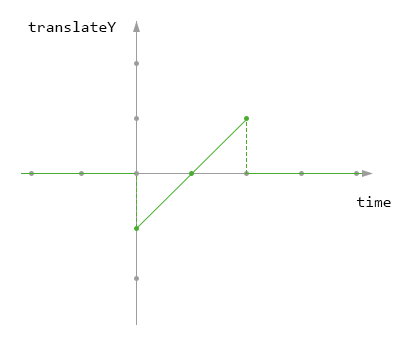
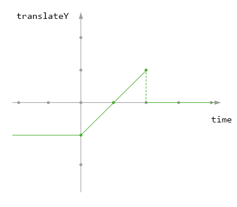
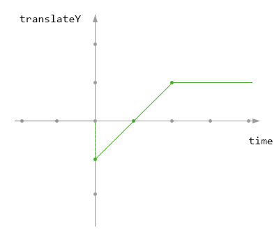
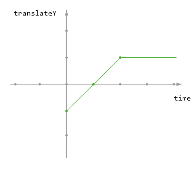
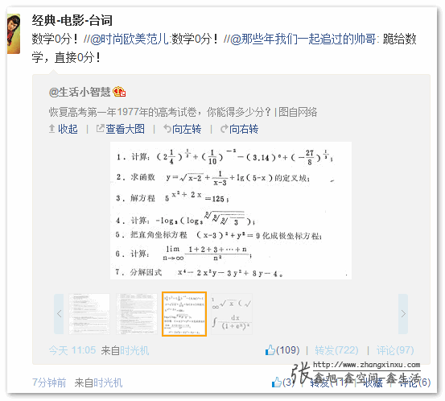
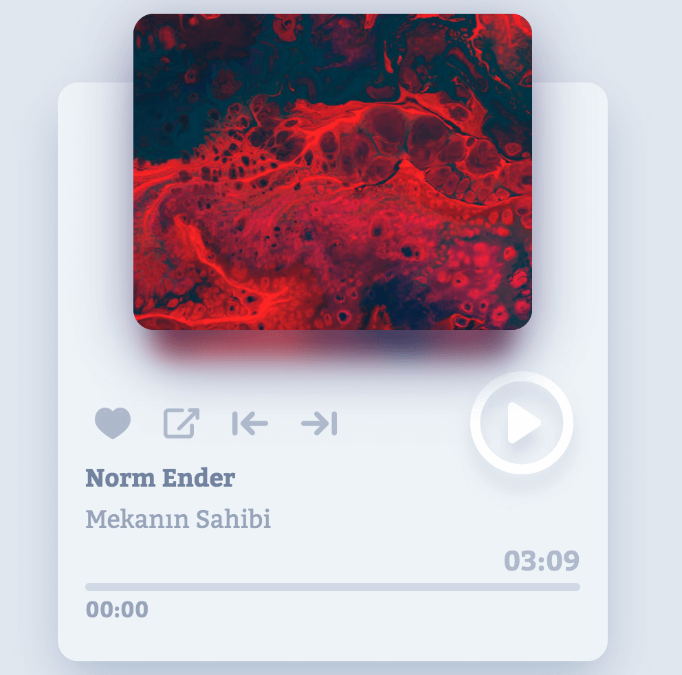
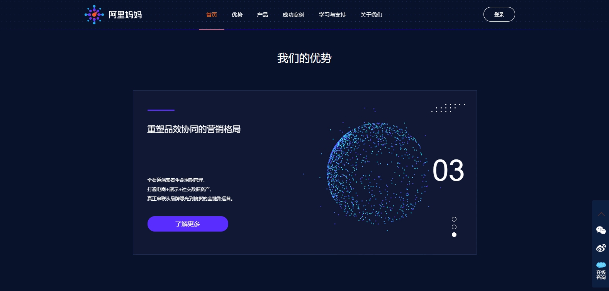

# 前端优质文章收藏清单

- 为什么我要写这个清单？
    - 为了以后必要时，能快速找到需要的资料。
    - 俗话说的好，好记性不如烂笔头。人脑的硬盘储存能力是没那么好的，所以我选择把大脑的硬盘外置。

----

- [移动端终极适配方案](./4.移动端终极适配方案.md)

- [Vue.js 不支持 IE8 你们是怎么做的？](https://www.zhihu.com/question/51468145/answer/125984111)
    ```
    if(document.all)alert('你的浏览器太旧了，恕不奉陪')
    ```
    - 实际情况：
        - 1.首先统计你用户有多少人在用 IE 8，淘宝某些网站 IE 8 用户已经不到 10% 了。
        - 2.如何可能的话，统计一下这些用户对公司有没有贡献（钱），没有贡献直接让他们升级。
        - 3.当 IE 8 用户低于5%，直接提示不支持。
        - 4.如果非要兼容，请一定告诉某些傻逼产品经理：IE 8 上的体验没必要做到跟 Chrome 一样。具体表现： Chrome 上有阴影有圆角有渐变，IE 8 上直接去掉。Chrome 上用原生 API，IE 8 上用 PolyfillChrome 上运行流畅，IE 8 上必须卡，没卡你也要把 IE 8弄卡！这样用户才会知道『IE 8 垃圾』以上，就是一个生命有限的前端工程师对 IE 8 应有的态度。

----
**正文开始：**

- ## 1.优质前端博主站点
    - 博主
        - 1.[浪里行舟github文章](https://github.com/ljianshu/Blog)，掘金和sf活跃用户
        - 2.[米白小站](http://jiaoguoliang.com/#/index/content_index)

    - 文章
        - [2019 前端工程师自检清单与思考](https://mp.weixin.qq.com/s/nmMbTpSWmoTcX36WfMV8ig)
        - [一名【合格】前端工程师的自检清单](https://mp.weixin.qq.com/s/SJVKl-cTpqIz1vcUgNy_Cw)
        - [如何优雅处理前端的异常？](https://mp.weixin.qq.com/s/cGv0cVOlDrLxp5PIOOTwTg)
        - [JavaScript的数据类型及其检测](https://mp.weixin.qq.com/s/GPB9tij72N_jbsTIE0acrg)
        - [「HTML5 Canvas 完整教程」 - Canvas: Draw on the web](https://www.yuque.com/airing/canvas)
        - [设计师都能懂的 Redux 指南](https://mp.weixin.qq.com/s/2tp_tmsOza81bWFuOOpf0A)
        - [让前端监控数据采集更高效](https://mp.weixin.qq.com/s/NHDJnQd6wL-TwpPdqtbbBQ)
        - [前端工程化：实践可视化搭建系统](https://juejin.im/post/5d8774bff265da03ae78b2a1)
            - 随公司业务不断发展，营销活动、广告、页面改版等需求日益倍增，靠纯人工撸代码已经无法跟上需求增长速度。这时候就需要一个提效工具帮助我们生成代码，推荐一篇介绍可视化界面搭建系统的文章

- ## 2.基础知识点
    - [video.js H5播放器]()
    - [Dplayer H5播放器 插件](https://dplayer.js.org/#/zh-Hans/)
    - [HTML 5 视频直播一站式扫盲](https://juejin.im/entry/5779fa798ac24700534921b5)
        - 1.H5 到底能不能做视频直播？
        - 2.到底什么是 HLS 协议？
        - 3.HLS 直播延时
        - 4.视频直播的整个流程是什么？
        - 5.怎样进行音视频采集？
        - 6.前面提到的 ffmpeg 是什么？
        - 7.什么是 RTMP？
        - 8.推流
        - 9.推流服务器搭建
        - 10.在 html5 页面进行播放直播视频？
    - [JS 异步编程六种方案(原创)](https://mp.weixin.qq.com/s/AP1OQAMowQNa75uwdsI79w)
    - [九种跨域方式实现原理（完整版）](https://mp.weixin.qq.com/s/dfM7BdU813FkHpZMbMKbfw)
    - [9102了，你还不会移动端真机调试？](https://mp.weixin.qq.com/s/Amz_z56Tj62W-sAdN0-_Hg)
        - [【it work !】如何使用远程调试在Chrome for iOS中调试问题](https://jonsadka.com/blog/how-to-debug-a-chrome-specific-bug-on-ios-using-remote-debugging)
        - [Safari和Chrome浏览器真机调试iphone中h5页面踩坑之路](https://juejin.im/post/5db198c651882564823fc9c6)
    - [前端｜本地调试H5页面方案总结](https://www.jianshu.com/p/a43417b28280)

- ## 3.进阶
    - [js中的错误处理（try...catch...finally,异步错误）](https://juejin.im/post/5bfe85786fb9a049c43d5f5f)
    - []()
    - [「Three.js」看完这篇，你也可以实现一个360度全景插件](https://mp.weixin.qq.com/s/fB4rjG2u9KfYuMxZ4d4Lhg)
    - [彻底理解JavaScript中的require、import和export](https://mp.weixin.qq.com/s/Xihq32H5-x2fTMcLHvjxTQ)
    - [「html2canvas」弹指间，网页灰飞烟灭——Google灭霸彩蛋实现](https://mp.weixin.qq.com/s/eOOEAlVBwO-XAvKF_tlbVQ)
    - [提高幸福感的 9 个 CSS 技巧](https://mp.weixin.qq.com/s/MNQaQ0-77vS-S6wZHZZ6Gg)
    - [5分钟贯彻Promise，用最少的代码手工实现一个Promise 「前端社」](https://mp.weixin.qq.com/s/s86R_5ktHwwARsdPpEXokg)
    - [「中高级前端」窥探数据结构的世界- ES6版](https://juejin.im/post/5cd1ab3df265da03587c142a)
    - [中国第五届CSS大会分享：CSS TIME](https://mp.weixin.qq.com/s/MQAIA80nscHHsdyPJrKBQA)
    - [深入理解 DOM 事件机制](https://mp.weixin.qq.com/s/kMCPPnTUbq5AwKIfT2OP7Q)
    - [深入理解JavaScript作用域和作用域链](https://mp.weixin.qq.com/s/j0UW9lHn32Tz-rowkWDhiQ)
    - [图解原型链及其继承](https://mp.weixin.qq.com/s/1D8RZvxmXuq_r6V_o2jiFw)
    - [TypeScript安利指南](https://juejin.im/post/5d8efeace51d45782b0c1bd6)
    - [TS in JS 实践指北](https://juejin.im/post/5e0176b4f265da33a159d9e0)

- ## 4.框架
    - [从头开始学习Vuex](https://mp.weixin.qq.com/s/c2bV5fs_u93V9s11weox9g)
    - 1.[【React深入】React事件机制](https://mp.weixin.qq.com/s/pffJQXw-x09t-46Ek-KYqg)
    - [vue系列之面试总结](https://mp.weixin.qq.com/s/6J6nUMRAmUD_hsKue2oltg)
    - [「Vue进阶」5分钟撸一个Vue CLI 插件](https://juejin.im/post/5cb59c4bf265da03a743e979)
    - [React Today and Tomorrow and 90% Cleaner React With Hooks](https://www.yuque.com/alipay2088702560595591/kb/gb75rn)

- ## 5.底层原理
    - [设计模式 - 米白小站](http://jiaoguoliang.com/?from=groupmessage&isappinstalled=0#/index/thought_DesignPattern)
    - [深入理解https工作原理](https://mp.weixin.qq.com/s/2DqMuTYYvacH6W0339-cUA)
    - [为什么HTTPS比HTTP更安全?](https://mp.weixin.qq.com/s/_ozg0qPtBHSQW8414dpapw)
    - [深入理解https工作原理](https://mp.weixin.qq.com/s?__biz=MzUyNDYxNDAyMg==&mid=2247484269&idx=1&sn=18f5863a6b20ac85150350295c87301d&chksm=fa2be384cd5c6a9213174ad487e3c03e8588e2dc77d64462b085d883e9fb6a4fd51ec76f6ae6&mpshare=1&scene=1&srcid=&key=96e38258b65ecb9bfbba363b14a5146559325b94f09152e6e52e549204c5b1e598c76e8f5d3870db5701b7a539a7bdc9f728e7877c89902c6eb7ffda299115fc9f5b2ca2d484a5f0ead41375cd4bffd7&ascene=1&uin=MjU3MDk2NjU4MA%3D%3D&devicetype=Windows+10&version=6206081a&lang=zh_CN&pass_ticket=ZzoXx0vsS%2BEX5Dj0yCBK9fwOkT4FoSzMg2ySjFXXB1oYxWR7PYdVtTpxP9X9IJ92)
        - 那么我们需要学习哪些知识呢？以下是我列的一些清单，内容包括：
            - TCP / UDP
            - HTTP / HTTPS / HTTP 2.0
            - DNS
    - [重学 TCP/IP 协议](https://mp.weixin.qq.com/s/07_AZ2T3ahzRSHeFqLNb8Q)
    - [「真®全栈之路」Web前端开发的后端指南](https://juejin.im/post/5cc02aacf265da039e1ff3fa)
        - Web / Application Servers
        - 负载均衡器: Load Balancer
        - 域名解析系统，DNS
        - HTTPS / SSL证书
        - 数据库，Database
        - Blob / 文件存储
        - 内容分发网络（CDN）
        - 缓存服务：Caching Service
        - 消息队列：Message queue
    - [【第65期】详谈层合成（composite）](https://mp.weixin.qq.com/s/QLvCcYHN8fssM-A4uL5z_A)
    - [Javascript 中的爆栈](https://mp.weixin.qq.com/s/NDlGAodE3m2mU81JpKpiGg)
    - [[布局概念] 关于CSS-BFC深入理解](https://juejin.im/post/5909db2fda2f60005d2093db)

- ## 6.性能优化
    - [前端性能指标统计 - 【掘金】](https://juejin.im/post/5b5ed5046fb9a04fd343a8c7#heading-7)
    - [前端资源加载优先级[译] - 【掘金】](https://juejin.im/post/5b3c66705188251b22101f87)
    - [JavaScript判断图片是否加载完成的三种方式](https://www.cnblogs.com/snandy/p/3704938.html)
    - []()
    - []()
    - [【第63期】前端性能优化之雅虎35条军规](https://mp.weixin.qq.com/s/RJbVoKoxeDRgyINdZ8-pmQ)
    - [Chrome运行时性能瓶颈分析](https://mp.weixin.qq.com/s/zHcCF9QV3vbkiC7CieXUKg)
    - [记一次前端性能优化](https://mp.weixin.qq.com/s/CdmhdNy6rhlebEeBvL5ROA)

- ## 7.编程规范

    - 1.[【第60期】JavaScript代码简洁之道 -  前端求生之路](https://mp.weixin.qq.com/s/ptvGuxL3DPrxhXVOjk-faA)

    - 2.[JavaScript 编程规范(一) - 前端桃园](https://mp.weixin.qq.com/s/iZ77VLOM94ZuEAxReyq1xA)

    - 3.[JavaScript 编程规范(二) - 前端桃园](https://mp.weixin.qq.com/s/AEYqExcDdFteHymXK82SMg)

    - 4.[这些让人抓狂的烂代码，你碰到几种？](https://mp.weixin.qq.com/s/gdIZidCiZU0q8yeaYDEOHg)

    - 5.[别乱提交代码了，看下大厂 Git 提交规范是怎么做的！](https://mp.weixin.qq.com/s/IbgsOaJ3xHF-OU1GZYoanw)

- ## 8.面试相关
    - [前端面试高频知识点](https://mp.weixin.qq.com/s/u_rqkG4cHbAKg6h7LwCh-A)
    - [为什么现在面试总是面试造火箭？- 前端桃园](https://mp.weixin.qq.com/s/4RXN6DSzULH-tEIFUZXp4Q)
    - [如何做出HR最想看到的简历](https://mp.weixin.qq.com/s/JbdVILPkzmGWQS2W7ti-KA)
    - [【第67期】写给初级前端的面试经验](https://mp.weixin.qq.com/s/ni8jdRYWtfM0FvrjpPNpoA)
    - [Git代码管理工具的使用和面试必问题](https://www.jianshu.com/p/82eddd88bc1c?from=groupmessage&isappinstalled=0)
    - [【第61期】高频网红面试题['1','2','3'].map(parseInt) 原理解析](https://mp.weixin.qq.com/s/UFH1Gtq1ychfNuxiUOFfpw)
    - [一个函数让你看懂 'Why 0.1+0.2!=0.3'](https://mp.weixin.qq.com/s/d-SQzVKgLCkRHzKGWrCUIg)
    - [【前端词典】继承 - 面试官问的你都会吗？](https://mp.weixin.qq.com/s/tQ0lO6eZ-CrmMPZPBQ117g)
    - [「中高级前端面试」JavaScript手写代码无敌秘籍](https://mp.weixin.qq.com/s/v3Jb_dDBdX1-Y090v-xxwg)
    - [「各个大厂面试内容」2019金三银四魔都两年半前端面经](https://mp.weixin.qq.com/s/Dh5TYJBet0DTB_gd19ybOA)
    - [细节决定成败，不容忽视的10道Node面试题](https://mp.weixin.qq.com/s/tg1BpCPyP49d9Eq9SjRREg)

- ## 9.其他工具
    - 1.[仿站小工具](https://smalltool.github.io/)
        - 通过网址下载静态网页的工具。从输入的网址下载html代码，提取出JS、Css、Image、Picture、Flash等静态文件网址，再从下载完好的Css代码中提取出Image静态文件网址，通过网址下载静态文件，根据软件设置好的保存规则，自动修正html和css代码链接路径，最终这些静态文件被按分类保存到电脑文件夹。

    - 2.[Logo生成](https://www.logosc.cn/)
        - 输入logo名称，即可自动生成设计

    - 3.[微信群的机器人](http://promotion.weiyoux02.cn/weiyoubot/promotion/index.html?hmsr=promotion&hmpl=url&pid=1527517113765556)

    - [Python实现微信防撤回 - 前端求生之路](https://mp.weixin.qq.com/s/lSbbqltsfdAXHCFGaH-_gg)

    - [moviemasher.js, 用于实时，基于浏览器的视频和音频编辑的JavaScript库](https://www.helplib.com/GitHub/article_120215)
    
    - [怎么处理各个浏览器适配问题的呢？ ——《是时候升级你的浏览器了》](https://support.dmeng.net/upgrade-your-browser.html?referrer=)
        - 基本不处理，出问题让换浏览器
        - 你是网站技术人员吗？请加入旧版 Internet Explorer 淘汰行动。


- ## 10.经验之谈
    - 1.[我们应该如何给需求排序？](https://mp.weixin.qq.com/s/fahMRC_vXg09Toah5TjvLw)
        - **结论**: 需求管理是一门艺术，需要考虑和权衡的东西很多，暂时给大家一个简单的优先级排序，仅供参考：
            - 用户反馈的 BUG
            - 自己发现的 BUG
            - 用户反馈的需求
            - 自己想出的需求
    - 2.[【第72期】4 年前端狗 2 年 CTO](https://mp.weixin.qq.com/s/9Ek4NQtKN1uTikE0R4SO0g)
    - 3.[我在淘宝做前端的这三年 — 第一年](https://zhuanlan.zhihu.com/p/55272391)

- ## 11.插件
    - [Prettier - 代码格式化工具「已达 31.4k star」](https://mp.weixin.qq.com/s/WRkm0UpxP0m9Oxdfn8qO0Q)

- ## 12.图形 动画
    - ### 1.[前端图像处理指南](https://yq.aliyun.com/articles/68534)
        - #### canvas位图处理
        - #### 图像基本处理
        - #### 图像滤镜处理
        - #### 图像base64存储
        - #### 程序员的备胎
        - #### html2canvas
        - #### code-to-image
        - #### Cropper
        - #### tracking.js
            - 这是一个专业的计算机视觉处理JS库，包含了大量图形处理算法，可用来做人脸识别，色彩追踪等酷炫功能。
        - #### qrcode2
            - 用JS动态生成二维码，这个库还是很实用的，原理就是qrcode算法+canvas绘图，不支持canvas的用table兼容。
        - #### AlloyImage
            - 腾讯出的基于HTML5的专业级图像处理开源引擎，功能很强大，简直就是Web版的PS
        - #### SVG矢量图处理
            - 目前基于SVG的JS图形库轮子也是非常多，如 `svg.js`, `Snap.svg`, `Velocity.js`, `D3.js` 等等
        - #### CSS图像处理
            - 只是用来给用户展示，并不需要存储的话，可以直接用CSS处理
            - CSS filter - MDN

    - ### 2.[帧动画的多种实现方式与性能对比 -【掘金】](https://juejin.im/post/5c7bd2646fb9a049cb197921)
        - #### CSS3帧动画
            - 连续切换雪碧图位置
            - 连续移动雪碧图位置（移动端推荐）
        - #### JS帧动画
            - 通过JS来控制Canvas图像绘制
            - 通过JS来控制CSS属性值变化
        - 可能遇到的问题：[CSS技巧：逐帧动画抖动解决方案](https://aotu.io/notes/2017/08/14/fix-sprite-anim/index.html)
        
    - ### 3.animation
        - 先看个animation的例子 `animation: 3s ease-in 1s 2 reverse both paused slidein;`
            - [animimation 配置参数文档 【MDN】](https://developer.mozilla.org/zh-CN/docs/Web/CSS/animation)
        - [如何理解animation-fill-mode及其使用？- 【思否】](https://segmentfault.com/q/1010000003867335)
            - CSS 属性 `animation-fill-mode` 设置CSS动画在 **执行之前和之后** 如何将样式应用于其目标。
            - 首先，你要明白动画分为 **初始状态** **等待期** **动画执行期** **完成期** 四个阶段。
                - **初始状态**, 就是没有触发动画效果时，你元素原本应该有的状态。
                - **等待期**, 就是 animation-delay 设置的延迟期间。
                - **动画执行期**, 指的是 delay 结束瞬间开始执行动画，一直持续到最后一帧。
                - **完成状态**, 执行完最后一帧时，元素处于的状态
            - animation-fill-mode: none
            
            - animation-fill-mode: backwards
            
            - animation-fill-mode: forwards
            
            - animation-fill-mode: both
            
            
    - ### 4.[深度掌握SVG路径path的贝塞尔曲线指令 -【张鑫旭-鑫空间-鑫生活】](https://www.zhangxinxu.com/wordpress/2014/06/deep-understand-svg-path-bezier-curves-command/)
        - 效果很赞，同行们都赞不绝口！[「QQ浏览器mac版」](https://browser.qq.com/mac/)
            - 哈，小道消息，此页面是**从界面设计到效果实现完全是一个人完成的**，一个懂CSS3的设计师做出来的产品。
        - 我经常会问求职者，你觉得你脱颖而出的地方是哪里？如果简历中只有显示做了很多网站，我觉得这远远不够！由于没有很多人都讨厌的，被高考拍死的数学逻辑，HTML/CSS的入门实际是很简单（但这种简单的意义非常深远，以后再聊），门槛很低，效果又是所见即所得，容易培养兴趣，所以茫茫中国，会写页面的人何其多。要想脱颖而出，要么有 **万人之上的深度，要么万人玩不来的技能**。

        - **万人之上的深度**：勤奋刻苦会让你有所成，但是，想要登峰造极那必须是要有天赋的。所以，单纯想通过HTML/CSS走上人生巅峰，如果没有足够的天赋，以及超幸运的环境支持（公司写代码的全男的，就我一个女的，还美女），那么你会很快撞到人生的天花板。
        - **万人不会的技能**：在web领域，我觉得此技能为两块：一是扎实的设计功力，二是数学功底与逻辑思维能力。二者其一即可（兼得的跟我们不是一个档次的，不予讨论）。小时候的熏陶、绘画基本功练习，设计理论的学习，这些是很难被一般人超越的。所以，普通人想去转行做设计，除了一些罕见的具有天赋的人，往往会拿激情当才能，最后苦逼命！第二个，就是数学功底与逻辑思维能力。恰好，今天微博上看到了一张图：
        - 
        - 虽然有玩笑成分，但不可厚非，工作之后的数学功力是个很明显的技能优势。恰好，动画，web矢量绘制需要用到大量的数学知识。于是，大家是不是看到了一个可以跟其他芸芸区分的方向？至于逻辑思维，更多涉及JavaScript以及后台开发等相关知识，即计算机背景优势，阿里的前端基本上都是这么一出。

        - 于是，我提炼了下可以脱颖而出的技能组合：

            | 技能 | 程度 | 境况 |
            |------|------|------|
            | 设计 <br> HTML/CSS | deep <br> good+|  |
            | HTML/CSS | good |  |
            | HTML/CSS | deep |  |
            | HTML/CSS/JS <br> 数学、动画、图形 | deep <br> good+ |  |
            | HTML/CSS/JS <br> 后台语言、服务器 | deep <br> good+ |  |
            | 设计 <br> HTML/CSS/JS <br> 数学、动画、图形 <br> 后台语言、服务器 | good+ <br> deep <br> good+ <br> good+ |  |

        - 所以，要想前端有所成，有两条路，
            - 一是往前，webGL, canvas, SVG领域，这需要对图形敏感，有设计感，有动画素养，有相当的数学知识，以及最重要的JavaScript控制能力；
            - 一是往后，走开发路线，工具，富应用，运维（数据统计、前端安全、前端部署）领域，这需要懂后台、计算机网络、逻辑思考能力，以及最重要的JavaScript开发功力。

- ## 13.优秀案例
    - ### 1.音乐播放器
        - [muhammederdem/mini-player - 【github】](https://github.com/muhammederdem/mini-player)
        - [在线示例 CodePen](https://codepen.io/JavaScriptJunkie/pen/qBWrRyg)
        
        
        - 阴影效果
            ```html
            <div
                class="player-cover__item"
                style="background-image: url('https://raw.githubusercontent.com/muhammederdem/mini-player/master/img/1.jpg');"
            ></div>

            <style>
                .player-cover__item {
                    background-repeat: no-repeat;
                    background-position: center;
                    background-size: cover;
                    width: 200px;
                    height: 200px;
                    border-radius: 15px;
                    position: absolute;
                    left: 0;
                    top: 0;
                }
                .player-cover__item:before {
                    content: "";
                    background: inherit;        /* 重点: 继承背景图，使得阴影颜色丰富, 跟主图相融 */
                    width: 100%;
                    height: 100%;
                    box-shadow: 0px 10px 40px 0px rgba(76, 70, 124, 0.5);
                    display: block;
                    z-index: 1;
                    position: absolute;
                    top: 30px;
                    transform: scale(0.9);
                    filter: blur(10px);         /* 重点: 滤镜-高斯模糊 */
                    opacity: 0.9;
                    border-radius: 15px;
                }
                .player-cover__item:after {
                    content: "";
                    background: inherit;
                    width: 100%;
                    height: 100%;
                    box-shadow: 0px 10px 40px 0px rgba(76, 70, 124, 0.5);
                    display: block;
                    z-index: 2;
                    position: absolute;
                    border-radius: 15px;
                }
            </style>
            ```
            - [CSS3 filter(滤镜) 属性 - 【runoob 菜鸟教程】](https://www.runoob.com/cssref/css3-pr-filter.html)
    - ### 2.`UI` 都夸好的卡片验证库：`vue-interactive-paycard`
        
        - [github 项目地址](https://github.com/muhammederdem/vue-interactive-paycard/issues)
    - ### 3.锤子手机官网 3D hover 效果
        - 锤子官网的 banner 的 3D 悬浮效果 确实让不少人眼前一亮，作为一个前端的你当然想知道其实现原理，今天我们就来实现一下这个效果。
            
            - 源码 在线示例 http://js.jirengu.com/negor/4/edit?html,output
        ```html
        <div id="test">
            <div id="banner" >banner</div>
        </div>
        <script src="https://code.jquery.com/jquery-3.1.0.js"></script>
        <script>
        $('#test').on('mousemove', function(e){

          var offset = $('#test').offset()
          
          var x = e.pageX - offset.left
          var y = e.pageY - offset.top
          
          
          var centerX = $('#test').outerWidth() /2
          var centerY = $('#test').outerHeight() /2 
          
          var deltaX = x - centerX
          var deltaY = y - centerY
          
          var percentX = deltaX / centerX
          var percentY = deltaY / centerY
          
          var deg = 10
          
          
          
          $('#banner').css({
            transform: 'rotateX('+deg*-percentY + 'deg)'+
            ' rotateY('+deg*percentX+'deg)'
          })
        })

        $('#test').on('mouseleave', function(){
          $('#banner').css({
            transform: ''
          })
        })
        </script>
        <style>
        *{box-sizing: border-box;}
        div#test{
          width: 100%;
          height: 500px;
          background: white;
          padding: 100px 0; 
          margin: 100px auto;
          border: 1px solid #ddd;
          perspective: 1000px;
        }

        #banner{
          height: 300px;
          width: 400px;
          margin: 0 auto;
          background:  #37D7B2;
          transition: transform 0.1s;
          box-shadow: 0 0 15px rgba(0,0,0,0.25);
          text-align: center;
          line-height: 300px;
          font-size: 50px;
          color: #fff;
        }

        body{
          background: white;
          padding: 20px;
        }
        </style>
        ```
    - ### 4.[阿里妈妈](https://www.alimama.com/index.htm)
        
        
        