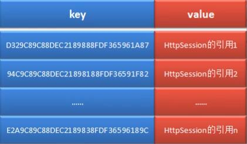
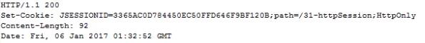
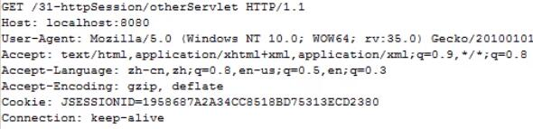

# 大前端
- 目录
    - [怎么让刷新后 数据不变？本地持久化, Cookie, Session, LocalStorage](#怎么让刷新后-数据不变本地持久化-cookie-session-localstorage)
    - []()
    - []()
    - []()

# 怎么让刷新后 数据不变？本地持久化, Cookie, Session, LocalStorage
- 小节目录
    - [1.Cookie](#1.Cookie)
    - [2.Session](#2.Session)
    - [3.LocalStorage 和 SessionStorage](#3.LocalStorage-和-SessionStorage)
    - [Cookie, LocalStorage, SessionStorage 和 Session 的区别 异同点 优缺点](#cookie-localstorage-sessionstorage-和-session-的区别-异同点-优缺点)
    - [4.token](#4.token)
    - [5.MD5加密](#5.MD5加密)
- ### vuex
    > **vuex** 是各个组件间的数据共享机制<br>
    > 如果数据不大，可以存本地；<br>
    > 如果数据比较大, 可以存 token 或 Data ID, 在刷新页面的时候 一并取回


- ## Cookie, LocalStorage, SessionStorage 和 Session 的区别 异同点 优缺点
<table>
    <tr>
        <td></td>
        <th>Cookie</th>
        <th>LocalStorage</th>
        <th>SessionStorage</th>
        <th>Session</th>
    </tr>
    <tr>
        <th>共同点</th>
        <td colspan="4" align='center'>key-value 方式存储、同域名可用</td>
    </tr>
    <tr>
        <th>储存位置</th>
        <td colspan="3" align='center'>客户端</td>
        <td>服务端</td>
    </tr>
    <tr>
        <th>特点</th>
        <td>随请求头每次提交<br>（弊端：如果使用cookie保存过多数据会带来性能问题）</td>
        <td>不随请求头提交<br>可长时保存</td>
        <td>不随请求头提交<br>页面关闭即失效</td>
        <td>安全</td>
    </tr>
    <tr>
        <th>跨标签页<br>(作用域)</th>
        <td colspan="2" align='center'>可跨标签页<br>不可跨域</td>
        <td>不可跨标签页<br>不可跨域</td>
        <td>可跨标签页<br>不可跨域</td>
    </tr>
    <tr>
        <th>生命周期</th>
        <td>一般又服务器生成，可设置失效时间。<br>如果在浏览器端生成Cookie，默认是关闭浏览器后失效</td>
        <td>除非被清除，否则永久保存</td>
        <td>仅在当前会话下有效，刷新页面同样存在，但关闭浏览器或者关闭页面之后会数据清除</td>
        <td></td>
    </tr>
    <tr>
        <th>存放数据大小</th>
        <td>4kb</td>
        <td>5Mb</td>
        <td>5Mb</td>
        <td></td>
    </tr>
    <tr>
        <th>安全性</th>
        <td>Cookie中 最好不要放置任何明文的东西</td>
        <td colspan="2" align='center'>两个Storage的数据提交后，在服务器端一定要校验<br>（其实任何 payload 和 qs 里的参数都要校验）</td>
        <td></td>
    </tr>
</table>


- ## 1.Cookie
    - 如果数据比较大的话，在 Cookie里 可以存一个 Session ID, 在刷新的时候把 Session ID 的内容一起取回来
    - #### 为什么有 Cookie ?
        - 一个会话 是由一组请求与响应组成的，是围绕一件事情 所进行的 多次请求与响应。所以这些请求与响应之间 一定是需要有数据传递的，即是需要进行会话状态跟踪的。
            - (就跟 打电话 很类似，多次来回交流，关于一件事的具体细节)
        - > 然而 **HTTP协议 是一种无状态协议，在不同的请求间 是无法进行数据传递的。**
        - 此时就需要一种可以进行 请求间数据传递的 会话跟踪技术，而 Cookie 就是一种这样的技术
    - #### 什么是 Cookie ?
        - Cookie 是由服务器生成的，保存在客户端的一种信息载体
        - 这个载体 存放着用户访问该站点的会话状态信息
        - 只要 Cookie 没有被清空，或 Cookie 没有失效，那么，保存在其中的会话状态就有效
    - #### 使用思路
        - 用户提交第一次请求后，有服务器生成 Cookie，并将其封装到 ***响应头*** 中，以响应的形式发送给客户端
        - 客户端接收到 这个响应后，将 Cookie 保存到客户端
        - 当客户端再次发送 ***同类请求*** 后，在请求中会携带保存在客户端的 Cookie 数据，发送到服务器端，由服务器 ***对会话进行跟踪处理***
            - 什么是 **同类请求** ?
                - 如：`www.google.com/public/common/data/jack`
                - 其中 `www.google.com/public/common/data/` 被称为 ***资源路径***
                - `jack` 被称为 ***资源名称***
                - > 只要 **资源路径** 相同的，都称为 **同类请求**
    - Cookie 是由若干键值对构成，Name & Value,  ***键值对都是 字符串***
    - #### Cookie 存放在哪？
        - ***存放在浏览器缓存里 (内存)***，如果关闭浏览器(会话结束), 则缓存被删除，**Cookie也被删除**。再次打开页面 也找不到之前都 Cookie 了
    - #### Cookie 的有效期
        ```java
        // 设置Cookie的有效期。这个值为一个整型值，单位为秒
        // 该值大于0，表示将Cookie存放到客户端的 硬盘
        // 该值小于0，于不设置效果相同，会将Cookie存放到 浏览器到缓存。会话结束时，或关闭浏览器时，就失效
        // 该值等于0，表示Cookie一生成，马上失效

        cookie.setMaxAge(60 * 60);  // 设置cookie的有效期为1小时
        cookie.setMaxAge(60 * 60 * 24 * 10) // 设置cookie的有效值为10天

        // java cookie写法
        ```
    - #### 获取 Cookie
        ```
        request.getCookies()
        ```
    - #### 禁用 Cookie
        - 如何禁用 Cookie: 打开浏览器设置，禁用 Cookie
        - 虽然客户端禁用 Cookie，但是服务器还是可以 生成并传递 cookie。但是 当客户端接收到响应的时候，**不处理 Cookie 而已**
        - 注意：很多网站 如果禁用 Cookie 会直接导致很多功能不能用，如 126 Email 直接不让登陆了。
- ## 2.Session
    - #### 什么是 Session ?
        - Session 就是 会话，是 web 开发中的一种会话状态跟踪技术。
        - 当然，前面所讲的 Cookie 也是一种会话跟踪技术。
        - 不同的是 Cookie 是将会话状态保存在 客户端，而 Session 则是将会话状态保存在 服务端
    - #### 什么是会话？
        - 当用户打开浏览器，从发出第一次请求开始，一直到最终关闭浏览器，就表示一次会话的完成
    - #### Session 的访问?
        ```java
        // java 创建 Session

        getSession()    // 有 session 就获取 session, 没有就创建
        ```
    - #### Session 的工作原理
        - 在服务器系统会为每个会话 维护一个 Session。不同的会话，对于不同的 Session
        - 问题：那么，系统是如何识别各个 Session 对象的？即是如何做到在同一会话过程中，一直使用的是 同一个 Session 对象呢？
        - ##### Session 现象
            ```
            浏览器A
            访问 http://localhost/temp/someServlet
            获得 Session A : 1878aab4

            
            浏览器A
            访问另一个 http://localhost/temp/otherServlet
            获得的 Session 还是    Session A : 1878aab4
            ```
            ```
            浏览器B
            访问 http://localhost/temp/someServlet
            获得 Session B : 78dded51

            
            浏览器B
            访问另一个 http://localhost/temp/otherServlet
            获得的 Session 还是    Session B : 78dded51
            ```
            > 注意：在测试 Session 到时候，每次测试前 都要关闭浏览器，重新打开。这样才能完整的经历一次 "会话" 的生命周期
        - 那么问题来了，同一台电脑，不同的浏览器访问同一个页面，**服务器 为什么不会把 两个Session 弄串 弄混乱了？**
        - ##### (1) 写入 Session 列表
            - 服务器对当前应用中的 Session 是以 Map 的形式进行管理的，这个 Map 成为 Session 列表。
                - 该 Map 的 key 为一个 32 位长度是随机串，这个随机串称为 JSessionID
                - value 则为 Session 对象的引用
            - 当用户第一次提交请求时，服务端 Servlet 中执行到 request.getSession() 方法后, 会自动生成一个 Map.Entry 对象
                - key 为一个根据某种算法新生成的 JSessionID
                - value 则为新创建的 HttpSession 对象，Session 对象里 可以有 各种信息和值
            - 
        - ##### (2) 服务器生成并发送 Cookie
            - 在将 Session 信息写入 Session 列表后
            - 系统还会将 JSessionID 作为 Name
            - 这个 32 位长度的随机串作为 value
            - 以 Cookie 的形式存放到 ***响应报头***中，并随着响应，将该 Cookie 发送到客户端
            - 
        - ##### (3) 客户端接收并发送 Cookie
            - 客户端接收到这个 Cookie 后，会将其存放到 浏览器到缓存中
                - ( 即，只要客户端浏览器不关闭，浏览器缓存中到 Cookie 就不会消失 )
            - 当用户提交第二次请求时，会将缓存中的这个 Cookie，伴随着 ***请求头*** 一并发送到服务端
            - 
            > 所以 Session 是依赖于 Cookie 到，只不过她到生命周期是在一次会话中<br>
            > Session 也是基于 Cookie ？？
        - ##### (4) 从 Session 列表中查找
            - 服务端 从请求中读取到客户端发送来到 Cookie
            - 并根据 Cookie 到 JSessionID 到值，从 Map 中查找相应到 key 所对应到 value，即 Session 对象
            - 然后，对该 Session 对象的域属性 进行读写操作
    - #### Session 的失效 (超时)        
        - 从你最后一次 访问Session 开始计时，超过30分钟后，Session 自动失效。默认 Session 有效时长为 30分钟
        - 在一次强调，Session 的生命周期 不是从创建Session时开始计算，而是最后一次被访问 开始计时，在规定的失效时长内 如果一直未被再次访问 该Session 就会失效
        - ***手动失效：*** Session 也可以通过调用api 的方法来手动触发 session失效
    - #### Session 禁用
        - 由于 Session 依赖于 cookie，所以当浏览器 禁用 Cookie 当时候，session 也没法正常工作
        - 但是可以通过别的方法来变通。如 可以通过 ***URL传参*** 当方式，如 `www.google.com/data/1;sessionid=xxx`
    > 如果不使用数据库，session是保存在内存中的。在服务端通常会使用redis等方案来使session持久化。
    - #### Session 如何使用？
        - Session 存信息的方法
        ```js
        session.user_name === 'zhangsan'

        session.views = ++n
        ```
        
        - 下面是 Session 的简单使用：
        ```js
        const Koa = require('koa')
        const app = new Koa()
        const session = require('koa-session')
        app.keys = ['secret']   // session加密字段
        app.use(session({
            key: 'koa:sess', //cookie key (default is koa:sess)
            maxAge: 86400000, // cookie的过期时间 maxAge in ms (default is 1 days)
            overwrite: true, //是否可以overwrite    (默认default true)
            httpOnly: true, //cookie是否只有服务器端可以访问 httpOnly or not (default true)
            signed: true, //签名默认true
            rolling: false, //在每次请求时强行设置cookie，这将重置cookie过期时间（默认：false）
            renew: false, //(boolean) renew session when session is nearly expired,
        }, app))
        app.use(ctx => {
            // ignore favicon
            if (ctx.path === '/favicon.ico') return
            console.log(ctx.session)
            let n = ctx.session.views || 0
            ctx.session.views = ++n
            ctx.body = n + ' views'
        });
        app.listen(8000)
        ```
        - 下面我们来模拟一个简单的登陆：
            [koa2学习笔记（六）学会使用session](https://juejin.im/post/5cd5052451882535d06e5a3d)
        ```js
        const Koa = require('koa')
        const app = new Koa()
        const session = require('koa-session')
        app.keys = ['secret']   // session加密字段
        app.use(session({}, app))

        app.use(async (ctx, next) => {
            if (ctx.url === '/login') {
                ctx.session.user_name = 'zhangsan'
                ctx.body = {
                    msg: '登录成功'
                }
            }
            await next()
        })

        app.use(async (ctx, next) => {
            if (ctx.url === '/logout') {
                ctx.session = null
                ctx.body = {
                    msg: '退出成功'
                }
            }
            await next()
        })

        app.use(async ctx => {
            console.log(ctx.session)
            if (ctx.url === '/index') {
                if (ctx.session.user_name === 'zhangsan') {
                    ctx.body = {
                        msg: '成功匹配到用户zhangsan'
                    }
                } else {
                    ctx.body = {
                        msg: '登陆验证失败'
                    }
                }
            }
        })
        app.listen(8000)
        ```
    - #### 基于Session的方案存在的问题
        - 服务端需要存储Session
        - 由于Session需要经常进行快速查找,因此我们一般存储在内存中或者内- 存服务器中,当用户数量大的时候,需要占用大量的服务器资源
        - 当你需要扩展时候,创建Session服务器不一定是验证Session的服务器,因此你需要把所有Session单独存储并共享
        - 由于客户端使用 Cookie 存储 SessionID，在跨域场景下需要进行兼容性处理，同时这种方式也难以防范 CSRF 攻击。

- ## 3.LocalStorage 和 SessionStorage
    - `localStorage` 和 `sessionStorage`
        - HTML5 专门为存储而设计，最大可存5M
        - API 更简单易用 `setItem()` `getItem`
        - 不会随着 http 请求被发送出去

    - `localStorage` 和 `sessionStorage` 的区别
        - localStorage 数据会永久储存，除非代码或手动删除
        - sessionStorage 数据只存在于当前会话，浏览器关闭则清空
        - 一般用 localStorage 会更多一些

    - API
        ```js
        localStorage.setItem('mycat', 'tom')
        localStorage.getItem('mycat')
        localStorage.removeItem('mycat')
        localStorage.clear() // 清除所有 (本域名下)
        ```
        ```js
        sessionStorage.setItem('key', 'value')
        sessionStorage.getItem('key')
        sessionStorage.removeItem('key')
        sessionStorage.clear()
        ```
    - 描述 `cookie` `localStorage` `sessionStorage` 的区别
        - 容量
        - api 易用性
            - `cookie` 没有官方统一 api，都是靠 自定义方法 来实现增删查改的
            - `Storage` 有官方统一 API
        - 是否跟随 http 请求发送出去
            - `cookie` 每次都会被浏览器 **`自动放在`** http 请求中发送出去
            - `Storage` 则不会

    - ### sessionStorage生命周期
        - sessionStorage的清除时机是在会话结束，会话结束是在用户关闭标签页或者关闭窗口的时候；手动新开一个标签或窗口时，会新开会话，即使链接一样，也不会共享sessionStorage

        - 只有在下面情况1的时候，新开页面才能'共享'sessionStorage

            - 场景1: 如果用户在A页面下存储了test，通过js或者a标签跳转到同源的B页面时，A页面下的sessionStorage会被拷贝到B页面下，AB页面的sessionStorage虽然相同，但二者相互独立;

            - 场景2: 如果用户在A页面打开的情况下，手动打开了一个新标签页，访问A页面，此时会重开一个新回话，二者sessionStorage是不共享的。


- ## 4.token

- ## 5.MD5加密
    - [加密算法 入门 从零到一](https://github.com/946629031/Blog/blob/master/7.%E5%8A%A0%E5%AF%86%E7%AE%97%E6%B3%95.md)

    > MD5 和 SHA-1 加密算法 已经被密码学家 王小云 于2004-2005年 破解
    - ### 什么是 MD5加密？
        - MD5加密是 ***一种 基于Hash函数 的函数型加密算法***。就是 对于同一段文字，每次加密的结果一定相同，没有随机位。
        - 特点：
            - **不管加密的文字，多长多短，永远都是 16位 或者 32位 英语字母、数字混合**
            - **哪怕只改一个字，密文都会大变**
            - **MD5 没有反函数破解的可能。**
                - 网上的破解工具，都是通过字典模式，通过大量列出 `明文 - 密文` 对应的字典，找到明码。
                - 两次加密网上也有对应的字典，所以我们不要直接用一层 md5，这样对黑客来说和明码是一样的
                    - 为了加强密码，可以套娃 `md5(md5(md5( password )))`, 对加密后的密文，多次加密
                    - 也可以把加密后的密文，颠倒顺序，如：把后16位字符 调转到前面
        > 永远不要用明码写密码！！<br>
        > CSDN 2018年 泄漏用户密码，并且泄漏的是明码。<br>
        > 黑客拿到用户的密码的加密信息，所以也没用，因为他无法翻译成明码。

        - [md5加密 【youtube】](https://www.youtube.com/watch?v=Dot8r-K-8KY)

    - ### 如何实现 MD5加密?
        - 加密过程使用了 node.js 原生库 crypto
        ```js
        // MD5加密 核心算法

        const crypto = require('crypto')

        function md5 (password) {
            let md5 = crypto.createHash('md5')         // 使用 md5算法 生成对应 Hash
            return md5.update(password).digest('hex')  // 将使用了 md5加密的密码返回，把输出变成16进制的格式
        }
        ```
        - 参数说明
            - 1.创建hash实例
                - 通过 `crypto.createHash()` 函数, 创建一个hash实例，但是需要调用 `md5，sha1，sha256，sha512` 算法来实现实例的创建。
            - 2.加密数据
                - `.update()` 告诉md5加密需要对哪个字符串进行加密
            - 3.获取hash对象
                - `.digest()` 可接受的参数：hex(16进制)、base64(base64格式)等
                - 直接运行 `.digest()` 出现了乱码，因为它默认返回的是2进制的数据
                - `md5.digest()` 这个方法被调用了，hash 对象就被清空了是不能被重用的

    - ### 使用实例1: [Node.js密码加密 【掘金】](https://juejin.im/post/5d40e51e5188255d46595a63)
        ```js
        // cryp.js

        const crypto = require('crypto')

        // 加盐/密匙
        const SECRET_KEY = 'WJiol_8776#' // 加盐/密匙是自定的，但需要保存好

        // md5 加密
        function md5(content) {
            let md5 = crypto.createHash('md5')
            return md5.update(content).digest('hex') // 把输出编程16进制的格式
        }

        // 加密函数
        function genPassword(password) {
            const str = `password=${password}&key=${SECRET_KEY}` // 拼接方式是自定的，只要包含 加盐/密匙 即可
            return md5(str)
        }

        module.exports = {
            genPassword
        }
        ```
        ```js
        // 使用加密方法

        const { genPassword } = require('../utils/cryp')

        // 生成加密密码
        password = genPassword(password)
        ```
        

    - ### 使用实例2: [学习后端鉴权系列: 基于Cookie, Session认证 【掘金】](https://juejin.im/post/5d98272be51d4578176b4b6e)
        ```js
        // 创建用户
        
        // 先对密码md5
        const md5PassWord = md5(String(password)).toString();
        // 生成随机salt
        const salt = String(Math.random()).substring(2, 10);
        // 加盐再md5
        const saltMD5PassWord = md5(`${md5PassWord}:${salt}`).toString();


        const user = new User({
            name: username,
            password: saltMD5PassWord,
            salt,
            isAdmin,
            age
        });
        const result = await user.save();  // mongodb 保存用户信息
        ```
        ```js
        // 验证用户登陆密码
        const searchUser = await User.findOne({ name: username });  // mongodb 搜索用户信息

        const md5PassWord = md5(String(password)).toString();
        const saltMD5PassWord = md5(
        `${md5PassWord}:${searchUser.salt}`
        ).toString();

        if (saltMD5PassWord === searchUser.password) {
        const store = new Store();
        const sid = await store.set(
            {
            id: searchUser._id
            },
            {
            maxAge: 1000 * 60 * 2 // 设定只有120s的有效时间
            }
        );
        ctx.cookies.set("jssessionId", sid);
        ctx.body = {
            success: true,
            msg: "登陆成功"
        };
        }
        ```
