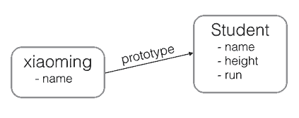

# js面向对象编程

目录
- [第一节 在ES6之前，是如何实现面向对象的编程的](#第一节-在ES6之前，是如何实现面向对象的编程的)
- [第二节 ES6 是如何实现面向对象的](#第二节-ES6-是如何实现面向对象的)
- []()
- []()

----

参考文章
- [什么是对象，为什么要面向对象，怎么才能面向对象？](https://github.com/946629031/Blog/blob/master/What%20is%20OOP%EF%BC%9F%E4%BB%80%E4%B9%88%E6%98%AF%E5%AF%B9%E8%B1%A1%EF%BC%8C%E4%B8%BA%E4%BB%80%E4%B9%88%E8%A6%81%E9%9D%A2%E5%90%91%E5%AF%B9%E8%B1%A1%EF%BC%8C%E6%80%8E%E4%B9%88%E6%89%8D%E8%83%BD%E9%9D%A2%E5%90%91%E5%AF%B9%E8%B1%A1%EF%BC%9F.md)
- []()
- [ES6时代的JavaScript面向对象编程](https://www.jianshu.com/p/c9fcbb41ecb0)
- [《适合初学者的JavaScript面向对象》 - MDN](https://developer.mozilla.org/zh-CN/docs/Learn/JavaScript/Objects/Object-oriented_JS)
- [《js面向对象编程》 - 廖雪峰](https://www.liaoxuefeng.com/wiki/1022910821149312/1023022126220448)
- [《JavaScript函数式编程之深入理解纯函数》](https://juejin.im/post/5b1a251e6fb9a01e83146ddf)
- [JavaScript函数式编程之为什么要函数式编程（非严谨技术层面的扯淡）](https://github.com/zhuanyongxigua/blog/issues/20)
- [zhuanyongxigua/blog](https://github.com/zhuanyongxigua/blog)
- [《Class 的基本语法 - ECMAScript 6 入门》 - 阮一峰](http://es6.ruanyifeng.com/#docs/class)
- [《如何用一句话说明什么是面向对象思想？》 - 知乎](https://www.zhihu.com/question/19854505)
- [《什么是对象，为什么要面向对象，怎么才能面向对象？》 - 赵学智](https://www.cnblogs.com/seesea125/archive/2012/04/03/2431176.html)
- []()

----

面向对象程序设计（英语：Object-oriented programming，缩写：OOP）


- ## 第一节 在ES6之前，是如何实现面向对象的编程的
    - 参考文章：[《js面向对象编程》 - 廖雪峰](https://www.liaoxuefeng.com/wiki/1022910821149312/1023022126220448)

    - 存在的问题：
        - 在ES6之前，js是没有 `类` 和 `实例` 这个概念的
        - JavaScript的面向对象编程和大多数其他语言如Java、C#的面向对象编程都不太一样。
        - `类` 和 `实例` 是大多数面向对象编程语言的基本概念。
        - 不过，在JavaScript中，这个概念需要改一改。JavaScript不区分类和实例的概念，而是通过原型（prototype）来实现面向对象编程。
    - 在ES6之前，我们是如何实现 `类` 和 `实例` 的
        ```js
        var Student = {
            name: 'Robot',
            height: 1.2,
            run: function () {
                console.log(this.name + ' is running...');
            }
        };

        var xiaoming = {
            name: '小明'
        };

        xiaoming.__proto__ = Student;
        ```
        - 注意最后一行代码把 `xiaoming` 的原型指向了对象 `Student`，看上去 `xiaoming` 仿佛是从Student继承下来的：
        ```js
        xiaoming.name; // '小明'
        xiaoming.run(); // 小明 is running...
        ```
        - `xiaoming` 有自己的 `name` 属性，但并没有定义 `run()` 方法。不过，由于小明是从 `Student` 继承而来，只要 `Student` 有 `run()` 方法，`xiaoming` 也可以调用：
        - 
        - JavaScript的原型链 和Java的Class区别就在，它没有“Class”的概念，所有对象都是实例，所谓继承关系不过是把一个对象的原型指向另一个对象而已。
        - 如果你把xiaoming的原型指向其他对象：
        ```js
        var Bird = {
            fly: function () {
                console.log(this.name + ' is flying...');
            }
        };

        xiaoming.__proto__ = Bird;
        ```
        - 现在 `xiaoming` 已经无法 `run()` 了，他已经变成了一只鸟：
        ```js
        xiaoming.fly(); // 小明 is flying...
        ```
        - 在JavaScrip代码运行时期，你可以把 `xiaoming` 从 `Student` 变成 `Bird`，或者变成任何对象。
        - 请注意，上述代码仅用于演示目的。在编写JavaScript代码时，不要直接用 `obj.__proto__` 去改变一个对象的原型，并且，低版本的IE也无法使用 `__proto__`。 `Object.create()` 方法可以传入一个原型对象，并创建一个基于该原型的新对象，但是新对象什么属性都没有，因此，我们可以编写一个函数来创建 `xiaoming`：
        ```js
        // 原型对象:
        var Student = {
            name: 'Robot',
            height: 1.2,
            run: function () {
                console.log(this.name + ' is running...');
            }
        };

        function createStudent(name) {
            // 基于Student原型创建一个新对象:
            var s = Object.create(Student);
            // 初始化新对象:
            s.name = name;
            return s;
        }

        var xiaoming = createStudent('小明');
        xiaoming.run(); // 小明 is running...
        xiaoming.__proto__ === Student; // true
        ```

- ## 第二节 ES6 是如何实现面向对象的
    - ES6 提供了更接近传统语言的写法，引入了 Class（类）这个概念，作为对象的模板。通过class关键字，可以定义类。
    - [《Class 的基本语法 - ECMAScript 6 入门》 - 阮一峰](http://es6.ruanyifeng.com/#docs/class)
    - ES6 之前的写法
        ```js
        function Point(x, y) {
            this.x = x;
            this.y = y;
        }

        Point.prototype.toString = function () {
            return '(' + this.x + ', ' + this.y + ')';
        };

        var p = new Point(1, 2);
        ```
    - ES6 的写法
        ```js
        class Point {
            constructor(x, y) {
                this.x = x;
                this.y = y;
            }

            toString() {
                return '(' + this.x + ', ' + this.y + ')';
            }
        }
        ```
        - 上面代码定义了一个“类”，可以看到里面有一个 `constructor` 方法，这就是构造方法，而 `this` 关键字则代表实例对象。也就是说，ES5 的构造函数 `Point`，对应 ES6 的 `Point` 类的构造方法。
        - `Point`类 除了构造方法，还定义了一个 `toString` 方法。注意，定义 “类” 的方法的时候，前面不需要加上 `function这` 个关键字，直接把函数定义放进去了就可以了。另外，方法之间不需要逗号分隔，加了会报错。