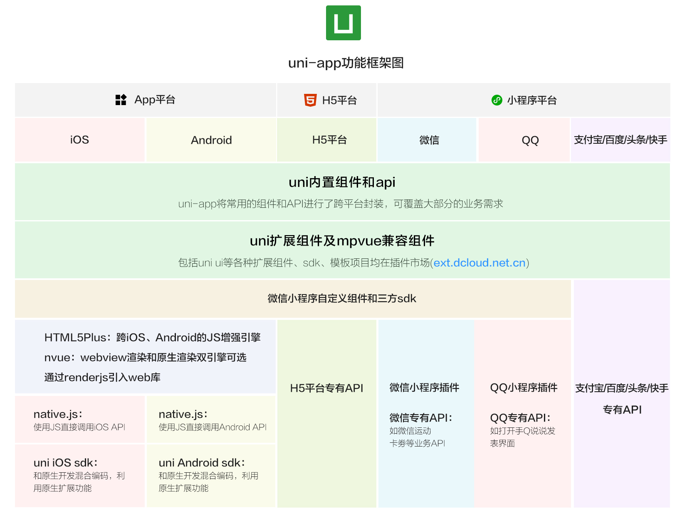

# 基于 UniAPP从入门到社区项目实战
课程背景:

> 咱们作为前端开发人员,单纯的Web端开发已经慢慢无法满足我们的业务需求了,微信小程序、安卓APP、IOS APP,甚至是 Windows 桌面端开发都成了我们需要掌握的技能。所以呢,市面上各种「跨平台」开发解决方案 层出不穷,比较有代表性的就是:UniAPP、Flutter、 React Native、Taro、Weex等等。
>
> UniAPP 是基于「Vue+微信小程序」语言体系,开发人员上手快学习成本低,同时随着如今UniAPP生态也逐 步趋于成熟。所以,基于UniAPP开发多端项目,已经是很多中小型企业常用的技术解决方案。
>
> 那么,今天呢,我们就从 UniAPP基础开始,对照企业级实践标准,从零到一,一步一步打造一个 多端(微信 小程序 + H5 + 安卓APP+IOS APP)的社区论坛类项目。


> 学前须知:
> 1. 掌握 HTML、CSS、JS基础,能够构建静态页面
> 2. 掌握 Vue 基础,能够使用脚手架构建应用
> 3. 掌握微信小程序基础,对微信小程序组件、API服务有一定的了解


- 课程简介:

- 快速入门学习
    - 第1节:UniAPP 介绍:
    - 第2节:UniAPP 初始化相关配置
    - 第3节:UniAPP 生命周期
    - 第4节:UniAPP 路由配置及页面跳转
    - 第5节:UniAPP 常用组件简介 - 知心姐姐布局实现
    - 第6节:UniAPP 常用API简介 - 知心姐姐聊天功能
    - 第7节:UniAPP自定义组件与通信
    - 第8节:UniAPP Vuex 状态管理 - 用户登录状态管理
    - 第9节:UniAPP 运行环境判断与跨端兼容

- 社区项目实战
    - 第1节:项目准备
    - 第2节:首页功能实现
    - 第3节:资讯动态页面功能实现
    - 第4节:用户注册、登陆业务功能实现
    - 第5节:登陆态下业务功能实现
    - 第6节:多端打包发布


UniAPP 快速入门学习
- ## 一、UniAPP 介绍
    - (1)什么是UniAPP?
        > uni-app 是一个使用 Vue.js 开发所有前端应用的框架,开发者编写一套代码,可发布到iOS、Android、H5,以及 各种小程序(微信/支付宝/百度/头条/QQ/钉钉)等多个平台,方便开发者快速交付,不需要转换开发思维,不 需要更改开发习惯。

    - (2)为什么要选择 UniAPP?
        - 1.开发者/案例数量更多
            > 几十万应用、uni 统计月活12亿、70+微信/QQ群
        - 2.平台能力不受限
            > 在跨端的同时,通过条件编译+平台特有API调用,可以优雅的为某平台写个性化代码,调用专有能力而不影 响其他平台
        - 3.性能体验优秀
            > 加载新页面速度更快、自动 diff 更新数据,App 端支持原生渲染支撑更流畅的用户体验,小程序端的性能优于市 场其他框架
        - 4.周边生态丰富
            > 插件市场 数千款插件,支持 NPM、支持小程序组件和SDK,微信生态的各种 sdk 可直接用于跨平台 APP
        - 5.学习成本低
            > 基于通用的前端技术栈，采用 vue 语法 +微信小程序api， 无额外学习成本

    - (3) uniApp 功能框架
        


    - (4)UniAPP 开发环境搭建
        - 1.下载开发工具 HBuilderX
            > HBuilderX 是通用的前端开发工具,但为 uni-app 做了特别强化。
            >
            > 下载 App 开发版,可开箱即用;如下载标准版,在运行或发行 uni-app时,会提示安装 uni-app 插件,插件 下载完成后方可使用
        - 2.建 uni-app 项目
            > 选择 uni-app 类型,输入工程名,选择模板,点击创建,即可成功创建。
            > uni-app自带的模板有 Hello uni-app,是官方的组件和API示例。
            > 还有一个重要模板是uni ui项目模板,日常开发推荐使用该模板,已内置大量常用组件。
        - 3.运行 uni-app
            > 主要包括:浏览器运行、真机运行、小程序运行等
        - 4.发布 uni-app
            > 主要包括:云端原生APP、离线原生APP、H5、各种小程序


- ## 二、UniAPP 初始化相关配置
    - ### (1)工程目录结构
        ```
        ├-components          uni-app组件目录
            ├-comp-a.vue      可复用的a组件
        ├-hybrid              存放本地网页的目录(自建)
        ├-platforms           存放各平台专用页面的目录(自建)
        ├-pages               业务页面文件存放的目录
            ├index
                ├index.vue    index页面
            ├-list
                ├Llist.vue    list页面
        ├-static              存放应用引用静态资源(如图片、视频等)的目录, 注意:静态资源只能存放于此
        ├-wxcomponents        存放小程序组件的目录(自建)
        ├-common              公共资源(自建)
        ├-api                 请求封装(自建)
        ├-store               状态管理(自建)
        ├-main.js             Vue初始化入口文件
        ├-App.vue             应用配置,用来配置App全局样式以及监听 应用生命周期
        ├manifest.json        配置应用名称、appid、logo、版本等打包信息
        L-pages.json          配置页面路由、导航条、选项卡等页面类信息
        ```

        > 提示
        > - static 下目录的 js文件不会被 webpack 编译,里面如果有 es6 的代码,不经过转换直接运行,在手机设 备上会报错。
        > - 所以 less、scss 等资源同样不要放在 static 目录下,建议这些公共的资源放在 common 目录下

    - ### (2)应用配置 manifest.json
        > manifest.json 文件是应用的配置文件,用于指定应用的名称、图标、权限等,我们也可以在这里为 Vue 为 H5 设置跨域拦截处理器


    - ### (3)编译配置 yue.config.js
        > vue.config.js 是一个可选的配置文件,如果项目的根目录中存在这个文件,那么它会被自动加载,一般用 于配置 webpack 等编译选项。官方文档
    - ### (4)全局配置 page.json
        > pages.json 文件用来对 uni-app 进行全局配置,决定页面文件的路径、窗口样式、原生的导航栏、底部的原 生tabbar 等。它类似微信小程序中 app.json的页面管理部分。

        属性|类型|必填|描述
        |---|---|---|---|
        globalStyle|Object|否|设置默认页面的窗口表现
        pages|Object Array|是|设置页面路径及窗口表现
        easycom|Object|否|组件自动引入规则
        tabBar|Object|否|设置底部 tab 的表现
        condition|Object|否|启动模式配置
        subPackages|Object Array|否|分包加载配置
        preloadRule|Object|否|分包预下载规则


    - ### (5)全局样式 uni.scss
        > uni.scss 文件的用途是为了方便整体控制应用的风格。比如按钮颜色、边框风格, uni.scss 文件里预置了 一批scss变量预置。官方文档
        > 
        > uni-app 官方扩展插件(uni ui)及插件市场上很多三方插件均使用了这些样式变量,如果你是插件开发 者,建议你使用 scss 预处理,并在插件代码中直接使用这些变量(无需 import 这个文件),方便用户通过搭积 木的方式开发整体风格一致的App。
        > 
        > uni.scss 是一个特殊文件,在代码中无需 import 这个文件即可在scss代码中使用这里的样式变量。uni-app的 编译器在webpack配置中特殊处理了这个 uni.scss,使得每个 scss 文件都被注入这个uni.scss,达到全局可用的 效果。如果开发者想要less、stylus的全局使用,需要在vue.config.js中自行配置webpack策略。
    - ### (6)主组件 App.vue
        > App.vue 是uni-app的主组件,所有页面都是在App.vue 下进行切换的,是页面入口文件。但 App.vue 本身 不是页面,这里不能编写视图元素。
        >
        > 这个文件的作用包括:调用应用生命周期函数、配置全局样式、配置全局的存储globalData
        >
        > 应用生命周期仅可在 App.vue中监听,在页面监听无效。

    - ## (7)入口文件 main.js
        > main.js 是uni-app的入口文件,主要作用是初始化 vue 实例、定义全局组件、使用需要的插件如vuex。
        官方文档
    - ## (8) UniAPP开发规范及资源路径
        - 1.开发规范约定
            - 页面文件向导 Vue单文件组件(SFC)规范
            - 组件标签靠近小程序规范,详见 uni-app 组件规范
            - 互连能力(JS API) 靠近微信小程序规范,但需要将替換替换wx为uni,详见uni-app接口规范
            - 数据绑定及事件处理同 Vue.js 规范,同时补充了App和页面的生命周期
            - 为兼容多端运行,建议使用 flex 布局进行开发

        - 2.资源路径说明
            - html
                > template 内约会静态资源,如 image,video 等标签的 src属性时,可以使用相对路径或绝对路径,形式如下:
                ```html
                <!--绝对路径,/static指根目录下的static目录,在cli项目中/static指src目录下的static目录-->
                <image class="logo" src="/static/logo.png"></image>
                <image class="logo" src="@/static/logo.png"></image>
                <!-- 相对路径 -->
                <image class="logo" src="../../static/logo.png"></image>
                ```
                > -注意
                >
                > @初始的绝对路径以及相对路径会通过 base64 转换规则校验
                > • 约会的静态资源在非 h5平台,均不转为 base64
                > • HS平台,小于4kb的资源会被转换成base64,其余不转
            - js
                > js 文件或 script 标签内,可以使用相对路径和绝对路径,形式如下:
                ```js
                // 绝对路径,指向项目根目录,在cli项目中@指向src目录
                import add from 'e/common/add.js'
                // 相对路径
                import add from '../../common/add.js'
                ```
            - css
                > css 文件或 style 标签内,可以使用相对路径和绝对路径,形式如下:
                ```css
                /* 绝对路径 */
                @import url('/common/uni.css');
                @import url('e/common/uni.css');
                /* 相对路径 */
                @import url('../../common/uni.css');
                ```
                > css 文件或 style 标签内引用的图片路径,可以使用相对路径也可以使用绝对路径,形式如下:
                ```css
                /* 绝对路径 */
                background-image: url(/static/logo.png);
                background-image: url(e/static/logo.png);
                /* 相对路径 */
                I
                background-image: url( ../../static/logo.png);
                ```


- ## 三、UniAPP生命周期
    > 学习一个工具的目的核心是什么?是为了解决核心业务逻辑问题,业务逻辑很多时候简单的解释一句话:“在合 适的时机干合适的事情”,OK!什么是合适的时机呢?简单的说,页面运行过程中,各个阶段的回调函数就是页 面中的时机,我们也叫这个为“生命周期钩子函数”,当然,业务中我们也会写到很多「回调」的逻辑,这些回 调其实也是咱们自定义的时机,UniAPP 的生命周期钩子函数回调函数有哪些呢?我们来理解一下!
    > 
    > uni-app 完整支持 Vue 实例的生命周期,同时还新增 应用生命周期 及 页面生命周期。

    - ### (1)应用生命周期
        函数名|说明
        |----|----|
        onLaunch|当 uni-app 初始化完成时触发(全局只触发一次)
        onShow|当 uni-app 启动,或从后台进入前台显示
        onHide|当 uni-app 从前台进入后台
        onError|当 uni-app 报错时触发
        onUniNViewMessage|对nvue 页面发送的数据进行监听,可參考 nvue 向 vue 通讯
        onUnhandledRejection|对未处理的 Promise 拒绝事件监听函数(2.8.1+)
        onPageNotFound|页面不存在监听函数
        onThemeChange| 监听系统主题变化

    - ### (2)页面生命周期
        函数名|说明
        |----|----|
        onLoad|监听页面加载,其参数为上个页面传递的数据,参数类型为Object(用 于页面传参), 參考示例
        onShow|监听页面显示。页面每次出现在屏幕上都触发,包括从下级页面点返回露 出当前页面
        onReady|监听页面初次渲染完成。注意如果渲染速度快,会在页面进入动画完成前 触发
        onHide|监听页面隐藏
        onUnload|监听页面卸载
        onResize|监听窗口尺寸变化
        onPullDownRefresh|监听用户下拉动作,一般用于下拉刷新,参考示例
        onReachBottom|页面滚动到底部的事件(不是scroll-view滾到底),常用于下拉下一 页数据。具体见下方注意事项
        onTabItemTap|点击 tab 时触发,参数为Object,具体见下方注意事项
        onShareAppMessage|用户点击右上角分享
        onPageScroll|监听页面滚动,参数为Object
        onNavigationBarButtonTap|监听原生标题栏按钮点击事件,参数为Object
        onBackPress|监听页面返回
        onNavigationBarSearchInputChanged|监听原生标题栏搜索输入框输入内容变化事件
        onNavigationBarSearchInputConfirmed|监听原生标题栏搜索输入框搜索事件,用户点击软键盘上的“搜索”按钮 时触发。
        onNavigationBarSearchInputClicked|监听原生标题栏搜索输入框点击事件
        onShareTimeline|监听用户点击右上角转发到朋友圈
        onAddToFavorites|监听用户点击右上角收藏


- ## 四、UniAPP路由配置及页面跳转
    - ### (1)路由配置
        > uni-app 页面路由全部交给框架统一管理,开发者需要在pages.json 里配置每个路由页面的路径及页面样式(类 似小程序在 app.json 中配置页面路由)。

        ```json
        "pages":[
            {
                "path":"pages/index",
                "style": {
                    "navigationBarTitleText":"路由配置",
                    "navigationBarBackgroundColor": "#FFFFFF",
                    "navigationBarTextStyle":"black",
                    "backgroundColor": "#FFFFFF",
                    "enablePullDownRefresh": true
                }
            },
            {
                "path":"pages/user",
                "style": {
                    "navigationBarTitleText":"路由配置",
                    "navigationBarBackgroundColor": "#FFFFFF",
                    "navigationBarTextStyle":"black",
                    "backgroundColor": "#FFFFFF",
                    "enablePullDownRefresh": true
                }
            }
        }
        ```
    - ### (2)路由跳转
        > uni-app 有两种页面路由跳转方式:使用 navigator 组件跳转(标签式导航)、调用API跳转(编程式导航)
        > 框架以栈的形式管理当前所有页面,当发生路由切换的时候,页面栈的表现如下:

        路由方式|页面栈表现|触发时机
        |----|----|----|
        初始化| 新页面入栈| uni-app 打开的第一个页面
        打开新页面| 新页面入栈 | 调用 API uni.navigateTo 、<br /> 使用组件 `<navigator open-type="navigate" />`
        页面重定向| 当前页面出栈、新页面入栈| 调用 API `uni.redirectTo` 、<br /> 使用组件
        页面返回| 页面不断出栈,直到目标返回页| 调用 API `uni.navigateBack` 、 <br /> 使用组件、<br /> 用户按左上角返回按钮、安卓用户点击物理back按键
        Tab 切换| 页面全部出栈,只留下新的 Tab 页面| 调用 API `uni.switchTab` 、<br /> 使用组件、<br /> 用户切换 Tab
        重加载| 页面全部出栈,只留下新的页面| 调用 API `uni.reLaunch` 、<br /> 使用组件


